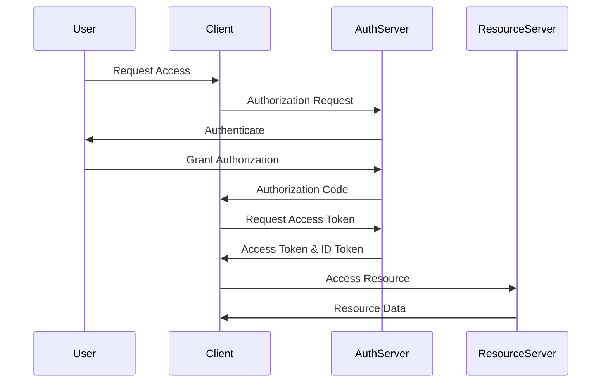

## 17.13 OAuth and OpenID Connect

In the modern web development landscape, secure authentication and authorization are paramount. OAuth 2.0 and OpenID Connect are two widely adopted protocols that facilitate these processes by allowing applications to securely access resources on behalf of a user. This section will guide you through understanding these protocols, their implementation, and best practices for integrating them into your JavaScript applications.

### Understanding OAuth 2.0

OAuth 2.0 is an open standard for access delegation, commonly used to grant websites or applications limited access to user information without exposing passwords. It is a framework that provides various flows to accommodate different use cases.

#### Key Concepts of OAuth 2.0

- **Resource Owner**: The user who authorizes an application to access their account.
- **Client**: The application requesting access to the user's account.
- **Resource Server**: The server hosting the protected resources.
- **Authorization Server**: The server issuing access tokens to the client after successfully authenticating the resource owner.

#### OAuth 2.0 Flows

OAuth 2.0 defines several flows, each suited for different scenarios:

1. **Authorization Code Flow**: This is the most secure flow and is recommended for server-side applications. It involves exchanging an authorization code for an access token.

2. **Implicit Flow**: Designed for client-side applications (e.g., single-page applications), this flow directly issues an access token without an intermediate authorization code.

3. **Client Credentials Flow**: Used for machine-to-machine communication, where the client application accesses resources on its own behalf.

4. **Resource Owner Password Credentials Flow**: This flow is used when the user trusts the client application with their credentials. It is less secure and should be avoided if possible.

#### Implementing OAuth 2.0

To implement OAuth 2.0 in a JavaScript application, you can use libraries such as [Passport.js](http://www.passportjs.org/), which provides a wide range of strategies for different OAuth providers.

```javascript
const express = require('express');
const passport = require('passport');
const GoogleStrategy = require('passport-google-oauth20').Strategy;

passport.use(new GoogleStrategy({
    clientID: 'YOUR_GOOGLE_CLIENT_ID',
    clientSecret: 'YOUR_GOOGLE_CLIENT_SECRET',
    callbackURL: 'http://localhost:3000/auth/google/callback'
  },
  (accessToken, refreshToken, profile, done) => {
    // Save user profile or perform actions with the access token
    return done(null, profile);
  }
));

const app = express();

app.get('/auth/google',
  passport.authenticate('google', { scope: ['profile', 'email'] })
);

app.get('/auth/google/callback', 
  passport.authenticate('google', { failureRedirect: '/' }),
  (req, res) => {
    // Successful authentication, redirect home.
    res.redirect('/');
  }
);

app.listen(3000, () => {
  console.log('Server started on http://localhost:3000');
});
```

### Introducing OpenID Connect

OpenID Connect (OIDC) is an identity layer built on top of OAuth 2.0. It allows clients to verify the identity of the end-user based on the authentication performed by an authorization server, as well as to obtain basic profile information about the user.

#### Key Features of OpenID Connect

- **ID Tokens**: JWT (JSON Web Tokens) that contain user identity information.
- **UserInfo Endpoint**: An endpoint to retrieve additional user profile information.
- **Discovery and Dynamic Registration**: Mechanisms to simplify client configuration.

#### Implementing OpenID Connect

To integrate OpenID Connect, you can extend the OAuth 2.0 implementation with additional scopes and endpoints. Here's an example using Passport.js with Google as the provider:

```javascript
passport.use(new GoogleStrategy({
    clientID: 'YOUR_GOOGLE_CLIENT_ID',
    clientSecret: 'YOUR_GOOGLE_CLIENT_SECRET',
    callbackURL: 'http://localhost:3000/auth/google/callback',
    scope: ['openid', 'profile', 'email']
  },
  (accessToken, refreshToken, profile, done) => {
    // Handle user profile and ID token
    return done(null, profile);
  }
));
```

### Integrating with Identity Providers

OAuth 2.0 and OpenID Connect can be used to integrate with various identity providers like Google, Facebook, and GitHub. Each provider has its own set of APIs and configuration requirements.

#### Example: Integrating with GitHub

To authenticate users with GitHub, you can use the `passport-github` strategy:

```javascript
const GitHubStrategy = require('passport-github').Strategy;

passport.use(new GitHubStrategy({
    clientID: 'YOUR_GITHUB_CLIENT_ID',
    clientSecret: 'YOUR_GITHUB_CLIENT_SECRET',
    callbackURL: 'http://localhost:3000/auth/github/callback'
  },
  (accessToken, refreshToken, profile, done) => {
    // Save user profile or perform actions with the access token
    return done(null, profile);
  }
));

app.get('/auth/github',
  passport.authenticate('github')
);

app.get('/auth/github/callback', 
  passport.authenticate('github', { failureRedirect: '/' }),
  (req, res) => {
    // Successful authentication, redirect home.
    res.redirect('/');
  }
);
```

### Best Practices for Securing Tokens

1. **Use HTTPS**: Always use HTTPS to protect tokens from being intercepted.
2. **Store Tokens Securely**: Use secure storage mechanisms like HTTP-only cookies or secure storage APIs.
3. **Implement Token Expiry and Refresh**: Ensure tokens have a limited lifespan and implement refresh tokens for obtaining new access tokens.
4. **Validate Tokens**: Always validate tokens on the server side to ensure they are not tampered with.

### Managing User Sessions

Managing user sessions is crucial for maintaining security and user experience. Here are some considerations:

- **Session Management**: Use session management libraries to handle user sessions securely.
- **Single Sign-On (SSO)**: Implement SSO to allow users to authenticate once and gain access to multiple applications.

### Considerations for Single Sign-On (SSO)

Single Sign-On (SSO) allows users to authenticate once and access multiple applications without re-entering credentials. When implementing SSO with OAuth 2.0 and OpenID Connect, consider the following:

- **Centralized Authentication**: Use a centralized authentication server to manage user identities.
- **Token Sharing**: Ensure tokens are securely shared between applications.
- **Logout Mechanism**: Implement a global logout mechanism to invalidate sessions across all applications.

### Visualizing OAuth 2.0 and OpenID Connect Flow

Below is a sequence diagram illustrating the OAuth 2.0 Authorization Code Flow with OpenID Connect:



### Conclusion

OAuth 2.0 and OpenID Connect are powerful protocols for securing authentication and authorization in web applications. By understanding their flows and best practices, you can integrate them effectively into your JavaScript applications, providing secure and seamless user experiences.

### Further Reading

- [OAuth 2.0 RFC](https://tools.ietf.org/html/rfc6749)
- [OpenID Connect Specification](https://openid.net/specs/openid-connect-core-1_0.html)
- [Passport.js Documentation](http://www.passportjs.org/docs/)

### Knowledge Check

## Test Your Understanding of OAuth and OpenID Connect



### What is the primary purpose of OAuth 2.0?

- [x] To delegate access to user resources without sharing passwords
- [ ] To encrypt user data
- [ ] To provide a user interface for authentication
- [ ] To manage user sessions

> **Explanation:** OAuth 2.0 is designed to allow applications to access user resources without exposing user passwords.

### Which OAuth 2.0 flow is recommended for server-side applications?

- [x] Authorization Code Flow
- [ ] Implicit Flow
- [ ] Client Credentials Flow
- [ ] Resource Owner Password Credentials Flow

> **Explanation:** The Authorization Code Flow is the most secure and is recommended for server-side applications.

### What does OpenID Connect add to OAuth 2.0?

- [x] An identity layer
- [ ] A new encryption method
- [ ] A session management protocol
- [ ] A data storage mechanism

> **Explanation:** OpenID Connect adds an identity layer on top of OAuth 2.0, allowing for user authentication.

### Which library can be used to implement OAuth strategies in Node.js?

- [x] Passport.js
- [ ] Express.js
- [ ] Axios
- [ ] Lodash

> **Explanation:** Passport.js is a popular library for implementing OAuth strategies in Node.js applications.

### What is a best practice for storing access tokens?

- [x] Use HTTP-only cookies
- [ ] Store them in local storage
- [ ] Store them in session storage
- [ ] Store them in plain text files

> **Explanation:** Using HTTP-only cookies is a secure way to store access tokens, as they are not accessible via JavaScript.

### What is the purpose of the ID token in OpenID Connect?

- [x] To provide user identity information
- [ ] To encrypt user data
- [ ] To manage user sessions
- [ ] To store user preferences

> **Explanation:** The ID token contains user identity information and is used to verify the user's identity.

### Which OAuth 2.0 flow is suitable for machine-to-machine communication?

- [x] Client Credentials Flow
- [ ] Authorization Code Flow
- [ ] Implicit Flow
- [ ] Resource Owner Password Credentials Flow

> **Explanation:** The Client Credentials Flow is used for machine-to-machine communication, where the client accesses resources on its own behalf.

### What is a key consideration when implementing Single Sign-On (SSO)?

- [x] Centralized Authentication
- [ ] Decentralized Authentication
- [ ] Multiple Passwords
- [ ] Local Storage of Tokens

> **Explanation:** Centralized Authentication is crucial for managing user identities across multiple applications in SSO.

### What is the role of the Authorization Server in OAuth 2.0?

- [x] To issue access tokens
- [ ] To store user data
- [ ] To manage user sessions
- [ ] To encrypt user data

> **Explanation:** The Authorization Server is responsible for issuing access tokens after successful authentication.

### True or False: OpenID Connect can be used without OAuth 2.0.

- [ ] True
- [x] False

> **Explanation:** OpenID Connect is built on top of OAuth 2.0 and cannot be used independently.



Remember, mastering OAuth 2.0 and OpenID Connect is just the beginning. As you progress, you'll be able to build more secure and user-friendly applications. Keep experimenting, stay curious, and enjoy the journey!
