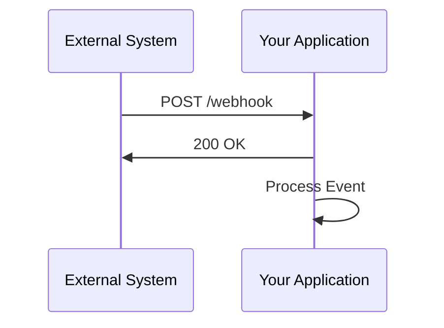

## 17.14 Webhooks and Event-Driven Integration

In the world of modern web development, integrating with external systems is a common requirement. Webhooks provide a powerful mechanism for receiving real-time notifications from these systems, enabling event-driven architectures that can react to changes as they happen. In this section, we will explore what webhooks are, how they differ from traditional polling methods, and how to effectively implement them in JavaScript using Node.js. We will also discuss best practices for securing and processing webhook payloads, handling common challenges, and ensuring reliable integration.

### What Are Webhooks?

Webhooks are user-defined HTTP callbacks that are triggered by specific events in an external system. When such an event occurs, the external system sends an HTTP request to a pre-configured URL, known as the webhook endpoint, with a payload containing details about the event. This allows your application to react to events in real-time without the need for continuous polling.

#### Webhooks vs. Polling

Polling involves repeatedly sending requests to an external system to check for new data or changes. This approach can be inefficient and resource-intensive, especially when changes are infrequent. Webhooks, on the other hand, push data to your application only when an event occurs, reducing unnecessary network traffic and latency.

### Setting Up Webhook Endpoints in Node.js

To receive webhook notifications, you need to set up a webhook endpoint in your application. This endpoint is a URL that listens for incoming HTTP requests from the external system. Let's walk through the process of setting up a basic webhook endpoint using Node.js and Express.

#### Step-by-Step Guide

1. **Initialize a Node.js Project**

   Start by creating a new Node.js project and installing Express:

   ```bash
   mkdir webhook-example
   cd webhook-example
   npm init -y
   npm install express
   ```

2. **Create the Webhook Endpoint**

   Create a file named `server.js` and set up an Express server with a webhook endpoint:

   ```javascript
   const express = require('express');
   const app = express();
   const PORT = process.env.PORT || 3000;

   // Middleware to parse JSON payloads
   app.use(express.json());

   // Webhook endpoint
   app.post('/webhook', (req, res) => {
     const event = req.body;

     // Log the received event
     console.log('Received event:', event);

     // Respond with a 200 status to acknowledge receipt
     res.status(200).send('Event received');
   });

   app.listen(PORT, () => {
     console.log(`Server is running on port ${PORT}`);
   });
   ```

3. **Test the Webhook Endpoint**

   You can test the webhook endpoint using tools like Postman or by sending a request with `curl`:

   ```bash
   curl -X POST http://localhost:3000/webhook -H "Content-Type: application/json" -d '{"type": "example_event", "data": "sample data"}'
   ```

   This should log the received event in your console.

### Validating and Securing Webhook Payloads

Security is a critical aspect of handling webhooks. Since webhooks are publicly accessible endpoints, they can be targeted by malicious actors. Here are some best practices for validating and securing webhook payloads:

#### Use Secret Tokens

Many external systems allow you to configure a secret token that is included in the webhook request headers. You can use this token to verify the authenticity of the request.

```javascript
const crypto = require('crypto');

app.post('/webhook', (req, res) => {
  const secret = 'your_secret_token';
  const signature = req.headers['x-webhook-signature'];

  const hash = crypto.createHmac('sha256', secret)
                     .update(JSON.stringify(req.body))
                     .digest('hex');

  if (signature !== hash) {
    return res.status(403).send('Invalid signature');
  }

  // Process the event
  const event = req.body;
  console.log('Received event:', event);

  res.status(200).send('Event received');
});
```

#### Validate Payload Structure

Ensure that the payload structure matches the expected format. This can be done using JSON schema validation libraries like `ajv`.

### Use Cases for Webhooks

Webhooks are widely used in various scenarios where real-time notifications are essential. Here are some common use cases:

- **Payment Notifications**: Receive notifications from payment gateways when a transaction is completed.
- **Repository Events**: Get updates from version control systems like GitHub when a new commit is pushed.
- **Chat Messages**: Integrate with chat platforms to receive messages or notifications.

### Challenges in Webhook Integration

While webhooks offer many benefits, they also come with challenges that need to be addressed:

#### Handling Retries

External systems may retry sending webhook requests if they do not receive a successful response. Ensure your endpoint is idempotent, meaning it can safely handle repeated requests without causing unintended side effects.

#### Idempotency

To achieve idempotency, you can use unique identifiers for each event and store them in a database. Before processing an event, check if it has already been handled.

```javascript
const processedEvents = new Set();

app.post('/webhook', (req, res) => {
  const eventId = req.body.id;

  if (processedEvents.has(eventId)) {
    return res.status(200).send('Event already processed');
  }

  // Process the event
  processedEvents.add(eventId);
  console.log('Processing event:', req.body);

  res.status(200).send('Event received');
});
```

### Best Practices for Processing Webhook Events

1. **Acknowledge Quickly**: Respond to webhook requests as quickly as possible to avoid timeouts. Perform any long-running tasks asynchronously.

2. **Log Events**: Maintain logs of received events for auditing and troubleshooting purposes.

3. **Secure Your Endpoint**: Use HTTPS to encrypt data in transit and validate incoming requests as discussed earlier.

4. **Handle Errors Gracefully**: Implement error handling to manage unexpected issues and provide meaningful responses.

### Try It Yourself

Experiment with the provided code examples by modifying the payload structure or adding additional security measures. Consider integrating with an external service that supports webhooks to see how real-time notifications can enhance your application.

### Visualizing Webhook Integration

Below is a sequence diagram illustrating the interaction between an external system and your application via webhooks:



### References and Links

- [MDN Web Docs: Webhooks](https://developer.mozilla.org/en-US/docs/Web/API/Webhooks)
- [Express.js Documentation](https://expressjs.com/)
- [Node.js Crypto Module](https://nodejs.org/api/crypto.html)

### Knowledge Check

- What are the key differences between webhooks and polling?
- How can you ensure the security of a webhook endpoint?
- What is idempotency, and why is it important in webhook processing?

### Embrace the Journey

Remember, integrating webhooks into your application is just the beginning. As you continue to explore event-driven architectures, you'll unlock new possibilities for building responsive and scalable systems. Keep experimenting, stay curious, and enjoy the journey!

## Quiz: Mastering Webhooks and Event-Driven Integration



### What is a webhook?

- [x] A user-defined HTTP callback triggered by specific events.
- [ ] A method for continuously polling an external system.
- [ ] A type of database query.
- [ ] A JavaScript library for handling events.

> **Explanation:** A webhook is a user-defined HTTP callback that is triggered by specific events in an external system.

### How do webhooks differ from polling?

- [x] Webhooks push data to your application only when an event occurs.
- [ ] Webhooks require continuous requests to check for new data.
- [ ] Polling is more efficient than webhooks.
- [ ] Webhooks are used for database queries.

> **Explanation:** Webhooks push data to your application only when an event occurs, unlike polling, which requires continuous requests.

### What is the purpose of using a secret token in webhook requests?

- [x] To verify the authenticity of the request.
- [ ] To encrypt the payload data.
- [ ] To log the request details.
- [ ] To compress the request payload.

> **Explanation:** A secret token is used to verify the authenticity of the request, ensuring it comes from a trusted source.

### Why is idempotency important in webhook processing?

- [x] To safely handle repeated requests without causing unintended side effects.
- [ ] To encrypt the payload data.
- [ ] To log the request details.
- [ ] To compress the request payload.

> **Explanation:** Idempotency ensures that repeated requests can be handled safely without causing unintended side effects.

### Which of the following is a common use case for webhooks?

- [x] Payment notifications
- [x] Repository events
- [ ] Database queries
- [ ] CSS styling

> **Explanation:** Webhooks are commonly used for payment notifications and repository events, among other real-time notifications.

### What is a best practice for processing webhook events?

- [x] Acknowledge requests quickly to avoid timeouts.
- [ ] Perform all processing synchronously.
- [ ] Ignore security measures for faster processing.
- [ ] Use HTTP instead of HTTPS.

> **Explanation:** Acknowledging requests quickly helps avoid timeouts, and processing can be done asynchronously.

### How can you test a webhook endpoint?

- [x] Using tools like Postman or curl to send requests.
- [ ] By writing CSS styles.
- [ ] By querying a database.
- [ ] By using a text editor.

> **Explanation:** Tools like Postman or curl can be used to send requests to test a webhook endpoint.

### What is the role of the `crypto` module in securing webhooks?

- [x] To create HMAC signatures for verifying request authenticity.
- [ ] To log request details.
- [ ] To compress request payloads.
- [ ] To format JSON data.

> **Explanation:** The `crypto` module is used to create HMAC signatures for verifying the authenticity of webhook requests.

### Which HTTP method is typically used for webhook requests?

- [x] POST
- [ ] GET
- [ ] PUT
- [ ] DELETE

> **Explanation:** Webhook requests typically use the POST method to send event data to the endpoint.

### True or False: Webhooks are a type of polling mechanism.

- [ ] True
- [x] False

> **Explanation:** False. Webhooks are not a polling mechanism; they push data to your application only when an event occurs.


