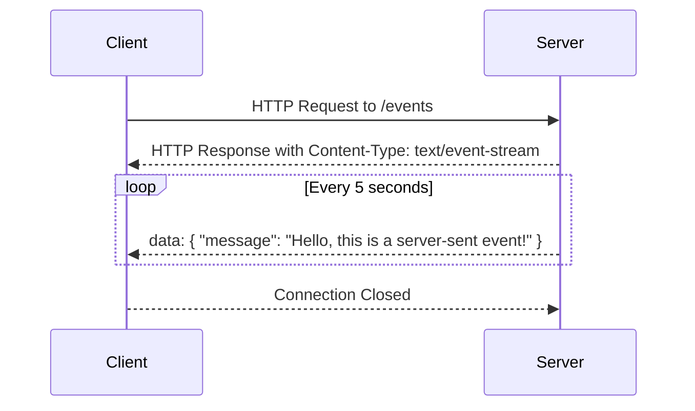

## 17.17 Server-Sent Events and Real-Time Data Streaming

In the ever-evolving landscape of web development, the ability to deliver real-time updates to users has become a critical feature for many applications. Whether it's live sports scores, stock market updates, or social media notifications, real-time data streaming enhances user engagement and experience. One of the technologies that facilitate this is Server-Sent Events (SSE). In this section, we will delve into what SSE is, how it works, and how you can implement it in your JavaScript applications.

### What Are Server-Sent Events?

Server-Sent Events (SSE) is a technology that allows a server to push updates to a client over a single HTTP connection. Unlike traditional HTTP requests, where the client requests data from the server, SSE enables the server to send data to the client whenever new information is available. This makes SSE particularly useful for applications that require real-time updates.

#### Key Characteristics of SSE

- **Unidirectional Communication**: SSE is designed for one-way communication from the server to the client. This is in contrast to WebSockets, which support bidirectional communication.
- **Text-Based Protocol**: SSE uses a simple text-based protocol over HTTP, making it easy to implement and debug.
- **Automatic Reconnection**: The browser automatically attempts to reconnect if the connection is lost, ensuring a persistent stream of data.
- **Event-Driven**: SSE allows the server to send named events, which the client can listen for and handle appropriately.

### How SSE Differs from WebSockets

While both SSE and WebSockets are used for real-time communication, they have distinct differences:

- **Communication Direction**: SSE is unidirectional (server to client), whereas WebSockets are bidirectional (server to client and client to server).
- **Protocol**: SSE uses HTTP, while WebSockets use a separate protocol that requires an initial HTTP handshake.
- **Complexity**: SSE is simpler to implement, as it builds on existing HTTP infrastructure. WebSockets require more setup and are better suited for applications needing two-way communication.

### Implementing Server-Sent Events in Node.js

Let's explore how to implement SSE in a Node.js server and consume these events on the client side.

#### Setting Up a Node.js Server with SSE

First, we'll create a simple Node.js server that sends real-time updates to connected clients.

```javascript
const http = require('http');

const server = http.createServer((req, res) => {
  if (req.url === '/events') {
    res.writeHead(200, {
      'Content-Type': 'text/event-stream',
      'Cache-Control': 'no-cache',
      'Connection': 'keep-alive'
    });

    const sendEvent = (data) => {
      res.write(`data: ${JSON.stringify(data)}\n\n`);
    };

    // Simulate sending data every 5 seconds
    const interval = setInterval(() => {
      const data = { message: 'Hello, this is a server-sent event!' };
      sendEvent(data);
    }, 5000);

    // Clean up when the connection is closed
    req.on('close', () => {
      clearInterval(interval);
    });
  } else {
    res.writeHead(404);
    res.end();
  }
});

server.listen(3000, () => {
  console.log('Server running at http://localhost:3000/');
});
```

In this example, the server listens for requests to the `/events` endpoint. When a client connects, it sends a new message every 5 seconds. The `Content-Type` header is set to `text/event-stream`, which is essential for SSE.

#### Consuming SSE on the Client Side

Now, let's see how to consume these events in a web browser using JavaScript.

```html
<!DOCTYPE html>
<html lang="en">
<head>
  <meta charset="UTF-8">
  <title>SSE Client</title>
</head>
<body>
  <h1>Server-Sent Events</h1>
  <div id="messages"></div>

  <script>
    const eventSource = new EventSource('http://localhost:3000/events');

    eventSource.onmessage = (event) => {
      const data = JSON.parse(event.data);
      const messagesDiv = document.getElementById('messages');
      const newMessage = document.createElement('div');
      newMessage.textContent = data.message;
      messagesDiv.appendChild(newMessage);
    };

    eventSource.onerror = (error) => {
      console.error('EventSource failed:', error);
    };
  </script>
</body>
</html>
```

The `EventSource` object is used to establish a connection to the server. The `onmessage` event handler processes incoming messages, which are displayed in the browser.

### Use Cases for Server-Sent Events

SSE is ideal for applications that require real-time updates without the overhead of full-duplex communication. Here are some common use cases:

- **Live Updates**: News feeds, sports scores, and weather updates can be efficiently delivered using SSE.
- **Stock Tickers**: Financial applications can use SSE to push real-time stock prices to clients.
- **Notifications**: Social media platforms and messaging apps can utilize SSE for delivering notifications.

### Limitations and Considerations

While SSE is a powerful tool for real-time data streaming, it has some limitations:

- **Unidirectional**: SSE only supports server-to-client communication. If your application requires client-to-server communication, consider using WebSockets.
- **Browser Support**: SSE is supported by most modern browsers, but it's important to check compatibility for your target audience.
- **Connection Limits**: Some browsers limit the number of concurrent SSE connections, which can be a consideration for applications with many open connections.

### Best Practices for Managing Connections

To ensure a robust SSE implementation, consider the following best practices:

- **Connection Management**: Monitor and manage the number of open connections to prevent server overload.
- **Reconnection Logic**: Implement logic to handle reconnections gracefully, especially in environments with unstable network conditions.
- **Data Throttling**: If sending large amounts of data, consider throttling updates to reduce bandwidth usage and improve performance.

### Visualizing SSE Workflow

To better understand how SSE works, let's visualize the workflow using a sequence diagram.



This diagram illustrates the interaction between the client and server, highlighting the continuous stream of data from the server to the client.

### Conclusion

Server-Sent Events provide a simple yet effective way to deliver real-time updates from the server to the client. By leveraging existing HTTP infrastructure, SSE offers a straightforward solution for applications that require unidirectional data streaming. As you explore SSE, remember to consider its limitations and best practices to ensure a seamless user experience.

### Knowledge Check

To reinforce your understanding of Server-Sent Events, try answering the following questions:

1. What is the primary difference between SSE and WebSockets?
2. How does the `EventSource` object work in the browser?
3. What are some common use cases for SSE?
4. What are the limitations of using SSE?
5. How can you manage connections effectively in an SSE implementation?

### Embrace the Journey

Remember, this is just the beginning. As you progress, you'll build more complex and interactive web applications. Keep experimenting, stay curious, and enjoy the journey!

## Quiz: Mastering Server-Sent Events and Real-Time Data Streaming



### What is the primary characteristic of Server-Sent Events (SSE)?

- [x] Unidirectional communication from server to client
- [ ] Bidirectional communication between server and client
- [ ] Communication initiated by the client
- [ ] Communication initiated by the server

> **Explanation:** SSE is designed for unidirectional communication, where the server sends updates to the client.

### Which protocol does SSE use for communication?

- [x] HTTP
- [ ] WebSocket
- [ ] FTP
- [ ] TCP

> **Explanation:** SSE uses the HTTP protocol for communication, making it easy to implement and debug.

### What is a common use case for SSE?

- [x] Live updates like news feeds
- [ ] Two-way chat applications
- [ ] File uploads
- [ ] Database transactions

> **Explanation:** SSE is ideal for live updates, such as news feeds, where the server pushes updates to the client.

### How does the browser handle a lost SSE connection?

- [x] Automatically attempts to reconnect
- [ ] Closes the connection permanently
- [ ] Sends an error message to the server
- [ ] Switches to WebSocket

> **Explanation:** The browser automatically attempts to reconnect if the SSE connection is lost.

### What is a limitation of SSE?

- [x] Only supports server-to-client communication
- [ ] Requires a separate protocol from HTTP
- [ ] Cannot handle large data streams
- [ ] Does not support automatic reconnection

> **Explanation:** SSE only supports server-to-client communication, unlike WebSockets, which are bidirectional.

### What is the purpose of the `EventSource` object in JavaScript?

- [x] To establish a connection to the server for receiving SSE
- [ ] To send data to the server
- [ ] To manage WebSocket connections
- [ ] To handle HTTP requests

> **Explanation:** The `EventSource` object is used to establish a connection to the server for receiving SSE.

### How can you manage multiple SSE connections effectively?

- [x] Monitor and manage the number of open connections
- [ ] Use WebSockets instead
- [ ] Limit the data sent to clients
- [ ] Use a different server for each client

> **Explanation:** Monitoring and managing the number of open connections helps prevent server overload.

### What is a best practice for handling reconnections in SSE?

- [x] Implement logic to handle reconnections gracefully
- [ ] Close the connection after each message
- [ ] Use a different protocol for reconnections
- [ ] Avoid reconnections altogether

> **Explanation:** Implementing logic to handle reconnections gracefully ensures a robust SSE implementation.

### What is the `Content-Type` header value for SSE?

- [x] text/event-stream
- [ ] application/json
- [ ] text/html
- [ ] application/xml

> **Explanation:** The `Content-Type` header for SSE is `text/event-stream`, which is essential for the connection.

### True or False: SSE can be used for bidirectional communication.

- [ ] True
- [x] False

> **Explanation:** SSE is designed for unidirectional communication, from server to client only.


