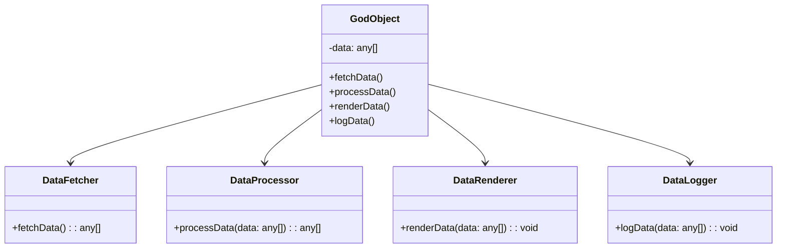

---

linkTitle: "17.2.1 God Object"
title: "God Object Anti-Pattern in JavaScript and TypeScript: Understanding and Refactoring"
description: "Learn about the God Object anti-pattern in JavaScript and TypeScript, its implications, and strategies for refactoring using SOLID principles and modern frameworks."
categories:
- Software Design
- Object-Oriented Programming
- Anti-Patterns
tags:
- God Object
- JavaScript
- TypeScript
- Refactoring
- SOLID Principles
date: 2024-10-25
type: docs
nav_weight: 1721000
canonical: "https://softwarepatternslexicon.com/patterns-js/17/2/1"
license: "© 2024 Tokenizer Inc. CC BY-NC-SA 4.0"
---

## 17.2.1 God Object

### Introduction

In the realm of object-oriented programming, the "God Object" anti-pattern is a common pitfall that developers encounter. A God Object is an object or class that knows too much or does too much, handling too many responsibilities. This can lead to code that is difficult to maintain, understand, and extend. In this article, we will explore the God Object anti-pattern, its implications, and strategies for refactoring it using modern JavaScript and TypeScript practices.

### Understanding the Problem

A God Object typically arises when a single class or object accumulates too many responsibilities. This violates the Single Responsibility Principle (SRP), one of the SOLID principles, which states that a class should have only one reason to change. When a class handles multiple responsibilities, it becomes a maintenance nightmare, as changes in one part of the class can inadvertently affect other unrelated parts.

#### Characteristics of a God Object

- **High Complexity:** The class has a large number of methods and properties.
- **Low Cohesion:** The class handles unrelated functionalities.
- **High Coupling:** The class interacts with many other classes, leading to tight coupling.
- **Difficult to Test:** The class is challenging to unit test due to its size and complexity.

### Solution

To address the God Object anti-pattern, we need to refactor the code by applying the Single Responsibility Principle and encapsulating behaviors into smaller, cohesive classes.

#### Apply Single Responsibility Principle

The first step in refactoring a God Object is to identify distinct responsibilities within the class and separate them into smaller classes. Each new class should have a clear, single responsibility.

#### Encapsulate Behaviors

Move related functionalities into appropriate classes or modules. This not only reduces the size of the God Object but also improves code readability and maintainability.

### Practice: Refactoring a God Object

Let's consider an example of a God Object in a JavaScript/TypeScript application. We'll refactor it into smaller, more manageable classes.

#### Initial God Object Example

```typescript
class GodObject {
    private data: any[];

    constructor() {
        this.data = [];
    }

    fetchData() {
        // Fetch data from an API
    }

    processData() {
        // Process the fetched data
    }

    renderData() {
        // Render data to the UI
    }

    logData() {
        // Log data for debugging
    }
}
```

In this example, the `GodObject` class handles fetching, processing, rendering, and logging data. This violates the SRP as it has multiple responsibilities.

#### Refactored Code

```typescript
class DataFetcher {
    fetchData(): any[] {
        // Fetch data from an API
        return [];
    }
}

class DataProcessor {
    processData(data: any[]): any[] {
        // Process the fetched data
        return data;
    }
}

class DataRenderer {
    renderData(data: any[]): void {
        // Render data to the UI
    }
}

class DataLogger {
    logData(data: any[]): void {
        // Log data for debugging
    }
}

// Usage
const fetcher = new DataFetcher();
const processor = new DataProcessor();
const renderer = new DataRenderer();
const logger = new DataLogger();

const data = fetcher.fetchData();
const processedData = processor.processData(data);
renderer.renderData(processedData);
logger.logData(processedData);
```

In the refactored code, we have created four separate classes, each with a single responsibility. This makes the code more modular, easier to test, and maintain.

### Visual Aids

To better understand the refactoring process, let's visualize the transformation using a class diagram.



### Advantages and Disadvantages

#### Advantages

- **Improved Maintainability:** Smaller classes with single responsibilities are easier to maintain and extend.
- **Enhanced Testability:** Each class can be unit tested independently.
- **Reduced Complexity:** Breaking down a God Object reduces overall system complexity.

#### Disadvantages

- **Initial Overhead:** Refactoring a God Object requires an initial investment of time and effort.
- **Potential Over-Engineering:** Over-separating responsibilities can lead to unnecessary complexity if not done judiciously.

### Best Practices

- **Regular Code Reviews:** Conduct regular code reviews to identify and address God Objects early.
- **Adopt SOLID Principles:** Follow SOLID principles to guide the design and structure of your code.
- **Continuous Refactoring:** Make refactoring a continuous part of the development process to prevent the accumulation of God Objects.

### Comparisons

The God Object anti-pattern is often compared to other anti-patterns like the Blob and the Swiss Army Knife. While all these patterns involve classes with excessive responsibilities, the God Object is particularly notorious for its centralization of control and knowledge.

### Conclusion

The God Object anti-pattern is a common challenge in object-oriented programming, but with careful refactoring and adherence to SOLID principles, it can be effectively managed. By breaking down large classes into smaller, cohesive units, developers can create more maintainable, testable, and scalable applications.

## Quiz Time!



### What is a God Object?

- [x] An object that knows too much or does too much
- [ ] An object with a single responsibility
- [ ] An object that is immutable
- [ ] An object that is only used for logging

> **Explanation:** A God Object is an object or class that handles too many responsibilities, violating the Single Responsibility Principle.

### Which principle does a God Object violate?

- [x] Single Responsibility Principle
- [ ] Open/Closed Principle
- [ ] Liskov Substitution Principle
- [ ] Dependency Inversion Principle

> **Explanation:** A God Object violates the Single Responsibility Principle by having multiple responsibilities.

### What is the first step in refactoring a God Object?

- [x] Identify distinct responsibilities within the class
- [ ] Add more methods to the class
- [ ] Increase the class's responsibilities
- [ ] Remove all methods from the class

> **Explanation:** The first step is to identify distinct responsibilities and separate them into smaller classes.

### What is a disadvantage of having a God Object?

- [x] Difficult to maintain and test
- [ ] Easy to understand
- [ ] Low complexity
- [ ] High cohesion

> **Explanation:** A God Object is difficult to maintain and test due to its complexity and multiple responsibilities.

### How can you improve the maintainability of a God Object?

- [x] Refactor it into smaller classes with single responsibilities
- [ ] Add more methods to the God Object
- [ ] Increase the number of properties in the God Object
- [ ] Use the God Object in more places

> **Explanation:** Refactoring into smaller classes with single responsibilities improves maintainability.

### Which of the following is NOT a characteristic of a God Object?

- [x] High cohesion
- [ ] High complexity
- [ ] Low cohesion
- [ ] High coupling

> **Explanation:** A God Object typically has low cohesion, not high cohesion.

### What is the benefit of encapsulating behaviors in separate classes?

- [x] Improved code readability and maintainability
- [ ] Increased complexity
- [ ] More responsibilities in a single class
- [ ] Less modular code

> **Explanation:** Encapsulating behaviors improves code readability and maintainability by making the code more modular.

### What is a potential disadvantage of refactoring a God Object?

- [x] Initial overhead of time and effort
- [ ] Reduced code readability
- [ ] Increased complexity
- [ ] Decreased testability

> **Explanation:** Refactoring a God Object requires an initial investment of time and effort.

### Which of the following is a best practice to prevent God Objects?

- [x] Conduct regular code reviews
- [ ] Avoid using classes
- [ ] Increase the number of methods in a class
- [ ] Use global variables extensively

> **Explanation:** Regular code reviews help identify and address God Objects early.

### True or False: A God Object is beneficial for code maintainability.

- [ ] True
- [x] False

> **Explanation:** A God Object is detrimental to code maintainability due to its complexity and multiple responsibilities.




