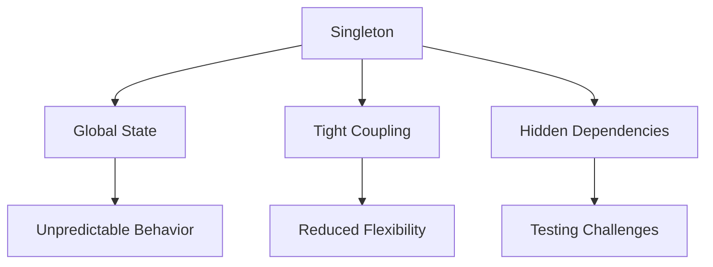

## 17.2.3 Misuse of Singleton

The Singleton pattern is a well-known design pattern that restricts the instantiation of a class to a single object. While it can be useful in certain scenarios, its misuse can lead to significant issues in software design, particularly in JavaScript and TypeScript applications. This article delves into the common pitfalls associated with the misuse of the Singleton pattern and offers solutions to mitigate these issues.

### Understand the Problem

The Singleton pattern is often overused, leading to several problems:

- **Global State:** Singletons can inadvertently create global state, making it difficult to manage and track changes across an application.
- **Tight Coupling:** Over-reliance on Singletons can result in tightly coupled code, reducing flexibility and making it harder to test and maintain.
- **Hidden Dependencies:** Singletons can obscure dependencies, making it challenging to understand the flow of data and control within an application.

### Solution

To address these issues, consider the following solutions:

#### Limit Singleton Usage

Use Singletons only when a single instance is truly necessary. Evaluate whether the Singleton pattern is the best choice for your specific use case. Often, alternative patterns or designs can provide better flexibility and maintainability.

#### Use Dependency Injection

Dependency Injection (DI) is a design pattern that promotes loose coupling by injecting dependencies into a class rather than having the class create them. This approach enhances testability and reduces the reliance on global state.

### Practice

Refactor Singletons by removing global state and passing instances explicitly. This practice encourages better design principles and enhances code maintainability.

### Detailed Explanation

#### The Singleton Pattern

The Singleton pattern ensures that a class has only one instance and provides a global point of access to it. This is typically achieved by:

1. **Private Constructor:** Prevents direct instantiation of the class.
2. **Static Method:** Provides a way to access the single instance.

Here's a basic implementation of the Singleton pattern in TypeScript:

```typescript
class Singleton {
    private static instance: Singleton;

    private constructor() {
        // Private constructor to prevent instantiation
    }

    public static getInstance(): Singleton {
        if (!Singleton.instance) {
            Singleton.instance = new Singleton();
        }
        return Singleton.instance;
    }

    public someMethod(): void {
        console.log("Singleton method called.");
    }
}

// Usage
const singleton = Singleton.getInstance();
singleton.someMethod();
```

#### Problems with Singleton Misuse

1. **Global State:**
   - Singletons can act as global variables, leading to unpredictable behavior and making it difficult to manage state changes.

2. **Tight Coupling:**
   - Classes that depend on Singletons are tightly coupled to them, making it challenging to modify or replace the Singleton without affecting the dependent classes.

3. **Testing Challenges:**
   - Singletons can hinder unit testing because they introduce hidden dependencies that are hard to mock or replace.

#### Refactoring Singletons

To mitigate these issues, consider refactoring your Singletons:

1. **Remove Global State:**
   - Avoid storing state within the Singleton. Instead, pass state explicitly to methods that require it.

2. **Use Dependency Injection:**
   - Inject the Singleton instance where needed, rather than accessing it globally. This approach enhances testability and reduces coupling.

3. **Consider Alternatives:**
   - Evaluate other design patterns, such as Factory or Prototype, which may better suit your needs without the drawbacks of Singletons.

### Visual Aids

#### Conceptual Diagram of Singleton Misuse



### Code Examples

#### Refactored Singleton with Dependency Injection

```typescript
class Logger {
    log(message: string): void {
        console.log(message);
    }
}

class Application {
    private logger: Logger;

    constructor(logger: Logger) {
        this.logger = logger;
    }

    public run(): void {
        this.logger.log("Application is running.");
    }
}

// Usage with Dependency Injection
const logger = new Logger();
const app = new Application(logger);
app.run();
```

### Use Cases

- **Configuration Management:** Use Singletons for managing configuration settings that need to be consistent across the application.
- **Resource Management:** Manage shared resources like database connections or thread pools with Singletons.

### Advantages and Disadvantages

#### Advantages

- **Controlled Access:** Ensures a single point of access to a resource.
- **Consistency:** Guarantees that only one instance of a class exists.

#### Disadvantages

- **Global State:** Can lead to global state issues.
- **Testing Difficulties:** Makes unit testing challenging due to hidden dependencies.
- **Tight Coupling:** Reduces flexibility and increases coupling between components.

### Best Practices

- **Limit Usage:** Use Singletons sparingly and only when necessary.
- **Inject Dependencies:** Prefer dependency injection to reduce coupling and enhance testability.
- **Avoid State:** Do not store mutable state within Singletons.

### Comparisons

- **Singleton vs. Factory:** Factories create instances without enforcing a single instance, offering more flexibility.
- **Singleton vs. Prototype:** Prototypes allow for cloning objects, providing an alternative to single-instance enforcement.

### Conclusion

The Singleton pattern, while useful, can lead to significant design issues if misused. By understanding the problems associated with Singleton misuse and applying best practices such as dependency injection and limiting usage, developers can create more maintainable and testable codebases.

## Quiz Time!



### What is a common problem associated with the misuse of the Singleton pattern?

- [x] Global state
- [ ] Increased performance
- [ ] Enhanced security
- [ ] Simplified testing

> **Explanation:** Misuse of the Singleton pattern often leads to global state, which can cause unpredictable behavior and make state management difficult.

### How can dependency injection help mitigate Singleton misuse?

- [x] By reducing coupling and enhancing testability
- [ ] By increasing the number of instances
- [ ] By making the Singleton pattern obsolete
- [ ] By enforcing stricter access controls

> **Explanation:** Dependency injection reduces coupling by injecting dependencies where needed, which enhances testability and reduces reliance on global state.

### What is a key characteristic of the Singleton pattern?

- [x] It restricts a class to a single instance.
- [ ] It allows multiple instances of a class.
- [ ] It is used for creating complex objects.
- [ ] It is primarily used for data storage.

> **Explanation:** The Singleton pattern ensures that a class has only one instance and provides a global point of access to it.

### Which design pattern can be considered as an alternative to Singleton for creating instances?

- [x] Factory
- [ ] Observer
- [ ] Decorator
- [ ] Strategy

> **Explanation:** The Factory pattern can be used to create instances without enforcing a single instance, offering more flexibility compared to Singleton.

### What is a disadvantage of using Singletons?

- [x] Testing difficulties
- [ ] Improved performance
- [ ] Simplified code structure
- [ ] Enhanced security

> **Explanation:** Singletons can make unit testing challenging due to hidden dependencies and global state, which complicates test setup and execution.

### Which of the following is a best practice when using Singletons?

- [x] Limit usage to necessary cases
- [ ] Use Singletons for all classes
- [ ] Store mutable state within Singletons
- [ ] Avoid dependency injection

> **Explanation:** Limiting Singleton usage to necessary cases helps prevent issues like global state and tight coupling, promoting better design practices.

### What is a potential issue with storing state within a Singleton?

- [x] It can lead to unpredictable behavior.
- [ ] It simplifies state management.
- [ ] It enhances security.
- [ ] It improves performance.

> **Explanation:** Storing state within a Singleton can lead to unpredictable behavior due to the global nature of the state, making it difficult to manage and track changes.

### How does the Prototype pattern differ from Singleton?

- [x] Prototype allows cloning of objects.
- [ ] Prototype enforces a single instance.
- [ ] Prototype is used for creating complex objects.
- [ ] Prototype is primarily used for data storage.

> **Explanation:** The Prototype pattern allows for cloning objects, providing an alternative to single-instance enforcement, unlike the Singleton pattern.

### What is the primary purpose of the Singleton pattern?

- [x] To ensure a class has only one instance
- [ ] To create multiple instances of a class
- [ ] To enhance data storage capabilities
- [ ] To simplify object creation

> **Explanation:** The primary purpose of the Singleton pattern is to ensure that a class has only one instance and provides a global point of access to it.

### True or False: Singletons are always the best choice for managing shared resources.

- [ ] True
- [x] False

> **Explanation:** Singletons are not always the best choice for managing shared resources. While they can be useful, they can also lead to issues like global state and tight coupling, so alternative patterns should be considered.


