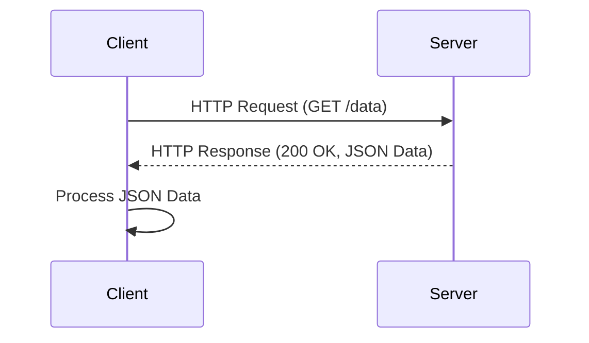

## 17.2 Using RESTful Services and HTTP Clients

In today's interconnected world, integrating with external services is a cornerstone of modern web development. RESTful services, which stand for Representational State Transfer, are a popular architectural style for designing networked applications. They allow different systems to communicate over HTTP, making them a fundamental part of web development.

### Understanding RESTful Services

RESTful services are based on a set of principles that define how web standards, such as HTTP and URIs, should be used to create scalable web services. Here are some key concepts:

- **Statelessness**: Each request from a client contains all the information needed to process it. The server does not store any state about the client session.
- **Resource Representation**: Resources are identified by URIs and can be represented in various formats, such as JSON or XML.
- **HTTP Methods**: RESTful services use standard HTTP methods like GET, POST, PUT, DELETE, etc., to perform operations on resources.
- **Layered System**: The architecture is composed of layers, each with a specific responsibility, enhancing scalability and flexibility.

### Using HTTP Clients in JavaScript

JavaScript provides several ways to interact with RESTful services, both on the client-side (front-end) and server-side (back-end). Let's explore how to use HTTP clients in both contexts.

#### Front-End HTTP Clients

On the front-end, HTTP clients are used to make requests to RESTful services from web browsers. Two popular choices are the Fetch API and Axios.

##### Fetch API

The Fetch API is a modern interface that allows you to make network requests similar to XMLHttpRequest (XHR). It is built into modern browsers and provides a more powerful and flexible feature set.

```javascript
// Example of using the Fetch API to make a GET request
fetch('https://api.example.com/data')
  .then(response => {
    if (!response.ok) {
      throw new Error('Network response was not ok');
    }
    return response.json();
  })
  .then(data => {
    console.log(data);
  })
  .catch(error => {
    console.error('There was a problem with your fetch operation:', error);
  });
```

**Key Points**:
- The `fetch` function returns a Promise that resolves to the Response object representing the complete HTTP response.
- You can chain `.then()` methods to handle the response and parse it as JSON.
- Error handling is done using `.catch()` to catch any network errors.

##### Axios

Axios is a promise-based HTTP client for the browser and Node.js. It provides a simple API for making HTTP requests and supports features like request and response interception, automatic JSON transformation, and more.

```javascript
// Example of using Axios to make a GET request
axios.get('https://api.example.com/data')
  .then(response => {
    console.log(response.data);
  })
  .catch(error => {
    console.error('Error fetching data:', error);
  });
```

**Key Points**:
- Axios automatically transforms JSON data, making it easier to work with.
- It provides a more concise syntax compared to the Fetch API.
- Axios supports request and response interceptors, allowing you to modify requests or responses globally.

#### Back-End HTTP Clients

On the server-side, Node.js provides several modules to make HTTP requests. Axios can also be used in Node.js, providing a consistent API across both client and server.

##### Using Axios in Node.js

```javascript
const axios = require('axios');

// Example of using Axios in Node.js to make a GET request
axios.get('https://api.example.com/data')
  .then(response => {
    console.log(response.data);
  })
  .catch(error => {
    console.error('Error fetching data:', error);
  });
```

**Key Points**:
- The syntax is identical to the front-end usage, making it easy to switch between environments.
- Axios in Node.js can be used to interact with RESTful services, APIs, and other HTTP endpoints.

### Handling Asynchronous Requests and Responses

Asynchronous programming is essential when dealing with HTTP requests, as it allows your application to remain responsive while waiting for network operations to complete.

#### Promises and Async/Await

Both the Fetch API and Axios use Promises to handle asynchronous operations. JavaScript also provides the `async` and `await` keywords to work with Promises in a more synchronous-like manner.

```javascript
// Example of using async/await with the Fetch API
async function fetchData() {
  try {
    const response = await fetch('https://api.example.com/data');
    if (!response.ok) {
      throw new Error('Network response was not ok');
    }
    const data = await response.json();
    console.log(data);
  } catch (error) {
    console.error('There was a problem with your fetch operation:', error);
  }
}

fetchData();
```

**Key Points**:
- The `async` keyword is used to declare an asynchronous function.
- The `await` keyword pauses the execution of the function until the Promise is resolved.
- Error handling is done using `try...catch` blocks.

### Best Practices for Managing API Endpoints and Configurations

When working with RESTful services, it's important to manage API endpoints and configurations effectively. Here are some best practices:

- **Environment Variables**: Use environment variables to store API keys and endpoints. This keeps sensitive information out of your codebase.
- **Configuration Files**: Store API configurations in separate files and import them into your application. This makes it easier to manage and update configurations.
- **Error Handling**: Implement robust error handling to manage network errors, invalid responses, and other issues.
- **Rate Limiting**: Be aware of API rate limits and implement strategies to handle them, such as exponential backoff or request queuing.

### Dealing with Rate Limiting and API Quotas

Many APIs impose rate limits to prevent abuse and ensure fair usage. Here are some strategies to handle rate limiting:

- **Exponential Backoff**: If a request fails due to rate limiting, wait for a period before retrying. Increase the wait time exponentially with each subsequent failure.
- **Caching**: Cache responses to reduce the number of requests made to the API. This can be done using in-memory caches or persistent storage.
- **Batch Requests**: Combine multiple requests into a single batch request if the API supports it. This reduces the number of individual requests made.

### Visualizing RESTful Interactions

To better understand how RESTful services interact with HTTP clients, let's visualize the process using a sequence diagram.



**Diagram Description**: This sequence diagram illustrates a simple interaction between a client and a server. The client sends an HTTP GET request to the server, which responds with JSON data. The client then processes the received data.

### Try It Yourself

To deepen your understanding, try modifying the code examples provided:

- Change the API endpoint to another public API and observe the response.
- Implement error handling for specific HTTP status codes, such as 404 or 500.
- Experiment with both the Fetch API and Axios to see the differences in handling requests.

### Knowledge Check

Before we wrap up, let's reinforce what we've learned with a few questions:

1. What are the key principles of RESTful services?
2. How does the Fetch API differ from Axios in terms of syntax and features?
3. What is the purpose of using `async` and `await` in JavaScript?
4. Why is it important to manage API endpoints and configurations effectively?
5. What strategies can be used to handle API rate limiting?

### Summary

In this section, we've explored how to use RESTful services and HTTP clients in JavaScript. We've covered the basics of RESTful services, how to make HTTP requests using the Fetch API and Axios, and best practices for managing API interactions. By understanding these concepts, you can build robust integrations with external services and enhance your web applications.

Remember, this is just the beginning. As you progress, you'll build more complex and interactive web applications. Keep experimenting, stay curious, and enjoy the journey!

## Quiz: Mastering RESTful Services and HTTP Clients



### What is a key principle of RESTful services?

- [x] Statelessness
- [ ] Stateful sessions
- [ ] Complex transactions
- [ ] Synchronous communication

> **Explanation:** RESTful services are stateless, meaning each request contains all the information needed to process it.

### Which HTTP client is built into modern browsers?

- [x] Fetch API
- [ ] Axios
- [ ] XMLHttpRequest
- [ ] jQuery AJAX

> **Explanation:** The Fetch API is a modern interface built into browsers for making network requests.

### How does Axios differ from the Fetch API?

- [x] Axios automatically transforms JSON data
- [ ] Axios is synchronous
- [ ] Fetch API supports interceptors
- [ ] Fetch API is promise-based

> **Explanation:** Axios automatically transforms JSON data, making it easier to work with compared to the Fetch API.

### What is the purpose of `async` and `await` in JavaScript?

- [x] To handle asynchronous operations in a synchronous-like manner
- [ ] To make code run faster
- [ ] To handle synchronous operations
- [ ] To create promises

> **Explanation:** `async` and `await` are used to handle asynchronous operations in a more readable and synchronous-like manner.

### Why should API endpoints be managed effectively?

- [x] To keep sensitive information out of the codebase
- [ ] To increase the number of requests
- [ ] To make code run faster
- [ ] To reduce the number of endpoints

> **Explanation:** Managing API endpoints effectively helps keep sensitive information out of the codebase and makes it easier to update configurations.

### What is a strategy for handling API rate limiting?

- [x] Exponential backoff
- [ ] Sending more requests
- [ ] Ignoring rate limits
- [ ] Using synchronous requests

> **Explanation:** Exponential backoff is a strategy where you wait for a period before retrying a request, increasing the wait time with each failure.

### What is a benefit of using Axios in Node.js?

- [x] Consistent API across client and server
- [ ] It is faster than Fetch API
- [ ] It only works in Node.js
- [ ] It does not support promises

> **Explanation:** Axios provides a consistent API across both client and server environments, making it easy to switch between them.

### What does the Fetch API return?

- [x] A Promise
- [ ] A callback
- [ ] A synchronous response
- [ ] An XMLHttpRequest object

> **Explanation:** The Fetch API returns a Promise that resolves to the Response object.

### What is a common use case for caching API responses?

- [x] To reduce the number of requests made to the API
- [ ] To increase server load
- [ ] To make requests synchronous
- [ ] To ignore rate limits

> **Explanation:** Caching API responses reduces the number of requests made to the API, which can help manage rate limits.

### True or False: The Fetch API supports request and response interceptors.

- [ ] True
- [x] False

> **Explanation:** The Fetch API does not support interceptors; this is a feature of Axios.


