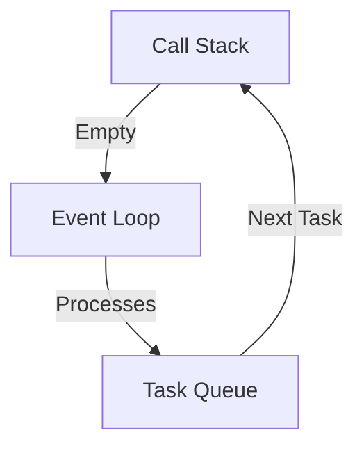

---

linkTitle: "17.3.1 Blocking the Event Loop"
title: "Blocking the Event Loop: Understanding and Avoiding Asynchronous Anti-Patterns"
description: "Learn how to prevent blocking the event loop in JavaScript and TypeScript by using asynchronous patterns and offloading tasks to worker threads."
categories:
- JavaScript
- TypeScript
- Anti-Patterns
tags:
- Event Loop
- Asynchronous Programming
- Node.js
- Performance Optimization
- Worker Threads
date: 2024-10-25
type: docs
nav_weight: 1731000
canonical: "https://softwarepatternslexicon.com/patterns-js/17/3/1"
license: "© 2024 Tokenizer Inc. CC BY-NC-SA 4.0"
---

## 17.3.1 Blocking the Event Loop

### Introduction

In JavaScript and TypeScript, the event loop is a fundamental concept that enables non-blocking I/O operations, allowing applications to handle multiple tasks efficiently. However, when long-running synchronous operations are performed, they can block the event loop, leading to application unresponsiveness and degraded user experience. This article explores the problem of blocking the event loop, offers solutions to avoid it, and provides best practices for maintaining responsive applications.

### Understanding the Problem

The event loop is the backbone of JavaScript's concurrency model. It allows the execution of asynchronous operations, such as I/O tasks, without blocking the main thread. However, when synchronous code that takes a long time to execute is introduced, it can block the event loop. This blockage prevents the processing of other tasks, causing delays and unresponsiveness in applications.

#### How the Event Loop Works

The event loop continuously checks the call stack and the task queue. If the call stack is empty, it processes the next task from the queue. Here's a simplified diagram of the event loop:



### Solution

To prevent blocking the event loop, developers should adopt the following strategies:

#### Avoid Synchronous Code in Async Environment

1. **Use Asynchronous APIs:**
   - Replace synchronous operations with their asynchronous counterparts. For example, use `fs.readFile` instead of `fs.readFileSync` in Node.js.

2. **Leverage Promises and Async/Await:**
   - Utilize Promises and the async/await syntax to handle asynchronous operations cleanly and efficiently.

#### Offload to Worker Threads or Processes

1. **Worker Threads:**
   - In Node.js, use the `worker_threads` module to offload CPU-intensive tasks to separate threads, preventing them from blocking the main thread.

2. **Child Processes:**
   - Use the `child_process` module to spawn new processes for tasks that require significant computation, ensuring the main process remains responsive.

### Practice: Identifying and Refactoring Blocking Code

#### Example of Blocking Code

Consider the following example of blocking code in a Node.js application:

```javascript
const fs = require('fs');

function readFileSync() {
    const data = fs.readFileSync('/path/to/large/file.txt', 'utf8');
    console.log(data);
}

readFileSync();
console.log('This will be logged after the file is read.');
```

In this example, the `fs.readFileSync` method blocks the event loop until the file is completely read, delaying subsequent operations.

#### Refactoring to Non-Blocking Code

Refactor the blocking code using asynchronous methods:

```javascript
const fs = require('fs');

function readFileAsync() {
    fs.readFile('/path/to/large/file.txt', 'utf8', (err, data) => {
        if (err) throw err;
        console.log(data);
    });
}

readFileAsync();
console.log('This will be logged immediately.');
```

### Best Practices

1. **Identify Blocking Operations:**
   - Regularly review code for synchronous operations that may block the event loop.

2. **Use Profiling Tools:**
   - Employ tools like Node.js's built-in profiler or third-party tools to identify performance bottlenecks.

3. **Adopt Non-Blocking Patterns:**
   - Embrace event-driven and non-blocking patterns to enhance application responsiveness.

### Advanced Topics

#### Worker Threads in Node.js

Worker threads provide a way to run JavaScript in parallel on multiple threads. Here's a basic example:

```javascript
const { Worker } = require('worker_threads');

function runWorker() {
    const worker = new Worker('./worker.js');
    worker.on('message', (message) => {
        console.log('Received from worker:', message);
    });
    worker.postMessage('Start');
}

runWorker();
```

In `worker.js`:

```javascript
const { parentPort } = require('worker_threads');

parentPort.on('message', (message) => {
    // Perform CPU-intensive task
    let result = 0;
    for (let i = 0; i < 1e9; i++) {
        result += i;
    }
    parentPort.postMessage(result);
});
```

### Conclusion

Blocking the event loop is a common anti-pattern that can severely impact the performance and responsiveness of JavaScript and TypeScript applications. By understanding the event loop, using asynchronous APIs, and offloading heavy tasks to worker threads or processes, developers can ensure their applications remain responsive and efficient.

## Quiz Time!



### What is the primary function of the event loop in JavaScript?

- [x] To handle asynchronous operations without blocking the main thread
- [ ] To execute synchronous code faster
- [ ] To manage memory allocation
- [ ] To compile JavaScript code

> **Explanation:** The event loop allows JavaScript to perform non-blocking I/O operations by handling asynchronous operations efficiently.

### Which Node.js module can be used to offload CPU-intensive tasks to separate threads?

- [x] worker_threads
- [ ] fs
- [ ] http
- [ ] events

> **Explanation:** The `worker_threads` module in Node.js is used to run JavaScript in parallel on multiple threads, offloading CPU-intensive tasks.

### What is a common consequence of blocking the event loop?

- [x] Application unresponsiveness
- [ ] Faster execution of tasks
- [ ] Increased memory usage
- [ ] Improved security

> **Explanation:** Blocking the event loop can cause application unresponsiveness as it prevents other tasks from being processed.

### How can you refactor synchronous file reading to be non-blocking in Node.js?

- [x] Use fs.readFile instead of fs.readFileSync
- [ ] Use fs.writeFile instead of fs.writeFileSync
- [ ] Use fs.appendFile instead of fs.appendFileSync
- [ ] Use fs.unlink instead of fs.unlinkSync

> **Explanation:** `fs.readFile` is the asynchronous version of `fs.readFileSync`, allowing non-blocking file reading.

### What syntax in JavaScript helps handle asynchronous operations more cleanly?

- [x] Async/Await
- [ ] Callbacks
- [ ] Loops
- [ ] Classes

> **Explanation:** Async/Await syntax provides a cleaner way to handle asynchronous operations compared to traditional callbacks.

### Which of the following is NOT a recommended practice to avoid blocking the event loop?

- [ ] Use asynchronous APIs
- [ ] Offload tasks to worker threads
- [x] Use synchronous APIs
- [ ] Profile code for performance bottlenecks

> **Explanation:** Using synchronous APIs can block the event loop, which is not recommended for maintaining responsiveness.

### What is the role of the task queue in the event loop?

- [x] To hold tasks that are ready to be processed by the event loop
- [ ] To execute tasks immediately
- [ ] To manage memory allocation
- [ ] To compile JavaScript code

> **Explanation:** The task queue holds tasks that are ready to be processed by the event loop when the call stack is empty.

### Which method is used to spawn new processes for heavy computation in Node.js?

- [x] child_process
- [ ] fs
- [ ] http
- [ ] events

> **Explanation:** The `child_process` module is used to spawn new processes for tasks requiring significant computation.

### True or False: Blocking the event loop can lead to improved performance.

- [ ] True
- [x] False

> **Explanation:** Blocking the event loop leads to application unresponsiveness and degraded performance, not improvement.

### What tool can be used to identify performance bottlenecks in a Node.js application?

- [x] Node.js profiler
- [ ] fs module
- [ ] http module
- [ ] events module

> **Explanation:** The Node.js profiler is a tool that helps identify performance bottlenecks in applications.


