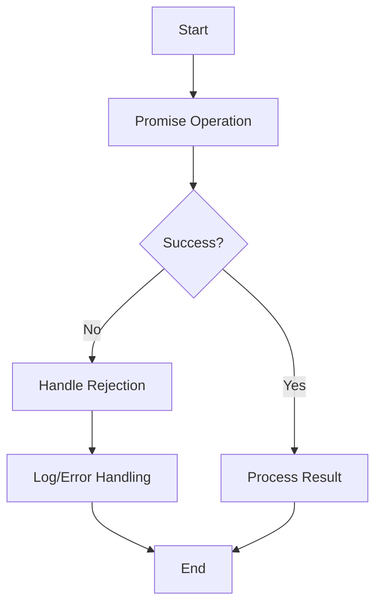

## 17.3.2 Ignoring Promise Rejections

### Introduction

In the world of asynchronous programming, promises are a powerful tool that allow developers to handle operations that may complete at some future point in time. However, ignoring promise rejections is a common anti-pattern that can lead to silent failures and bugs that are difficult to trace. This section will explore the importance of handling promise rejections, provide strategies for effective error handling, and demonstrate best practices in JavaScript and TypeScript.

### Understanding the Problem

Ignoring promise rejections can result in unhandled errors that may not immediately surface, leading to unpredictable application behavior. When a promise is rejected and the rejection is not handled, it can cause silent failures, making debugging a challenging task. This issue is particularly prevalent in large codebases where unhandled rejections can propagate unnoticed.

### Solution

#### Always Handle Rejections

To prevent unhandled promise rejections, it's crucial to always handle potential errors. This can be achieved by using the `.catch()` method for promises or employing `try/catch` blocks when using `async/await`.

**Example with `.catch()`:**

```javascript
fetchData()
  .then(response => processData(response))
  .catch(error => console.error('Error processing data:', error));
```

**Example with `async/await`:**

```typescript
async function fetchDataAndProcess() {
  try {
    const response = await fetchData();
    processData(response);
  } catch (error) {
    console.error('Error processing data:', error);
  }
}
```

#### Implement Global Rejection Handlers

In Node.js environments, you can listen for `unhandledRejection` events to catch any promise rejections that are not explicitly handled. This allows you to log or handle these errors globally, providing a safety net for unexpected rejections.

**Node.js Global Rejection Handler:**

```javascript
process.on('unhandledRejection', (reason, promise) => {
  console.error('Unhandled Rejection at:', promise, 'reason:', reason);
  // Application-specific logging, throwing an error, or other logic here
});
```

### Practice

To ensure robust error handling, regularly audit your codebase for promises without rejection handling. Add appropriate error handling mechanisms to prevent silent failures and improve code reliability.

### Visual Aids

#### Workflow Diagram

Below is a conceptual diagram illustrating the flow of handling promise rejections:



### Code Examples

#### Handling Rejections in JavaScript

```javascript
function fetchData(url) {
  return new Promise((resolve, reject) => {
    // Simulate an asynchronous operation
    setTimeout(() => {
      if (url) {
        resolve(`Data from ${url}`);
      } else {
        reject('Invalid URL');
      }
    }, 1000);
  });
}

fetchData('https://api.example.com/data')
  .then(data => console.log(data))
  .catch(error => console.error('Error fetching data:', error));
```

#### Handling Rejections in TypeScript

```typescript
async function fetchData(url: string): Promise<string> {
  return new Promise((resolve, reject) => {
    setTimeout(() => {
      if (url) {
        resolve(`Data from ${url}`);
      } else {
        reject('Invalid URL');
      }
    }, 1000);
  });
}

async function processData() {
  try {
    const data = await fetchData('https://api.example.com/data');
    console.log(data);
  } catch (error) {
    console.error('Error fetching data:', error);
  }
}

processData();
```

### Use Cases

- **API Requests:** Handling network errors when fetching data from an API.
- **File Operations:** Managing errors during file read/write operations.
- **Database Queries:** Handling query failures in database operations.

### Advantages and Disadvantages

**Advantages:**

- **Improved Reliability:** Ensures that all potential errors are accounted for, leading to more stable applications.
- **Easier Debugging:** By handling rejections, developers can quickly identify and fix issues.
- **Better User Experience:** Users are less likely to encounter unexpected application behavior.

**Disadvantages:**

- **Increased Complexity:** Adding error handling can make code more complex.
- **Performance Overhead:** Handling errors may introduce slight performance overhead.

### Best Practices

- **Consistent Error Handling:** Use a consistent approach to handle errors across your codebase.
- **Centralized Logging:** Implement centralized logging for easier monitoring and debugging.
- **Graceful Degradation:** Ensure that your application can degrade gracefully in the event of an error.

### Comparisons

Ignoring promise rejections can be compared to ignoring exceptions in synchronous code. Both scenarios can lead to silent failures and should be avoided by implementing robust error handling mechanisms.

### Conclusion

Handling promise rejections is a critical aspect of writing reliable and maintainable asynchronous code in JavaScript and TypeScript. By consistently handling rejections and implementing global handlers, developers can prevent silent failures and improve the overall quality of their applications.

## Quiz Time!



### What is a common consequence of ignoring promise rejections?

- [x] Silent failures
- [ ] Improved performance
- [ ] Increased code readability
- [ ] Enhanced security

> **Explanation:** Ignoring promise rejections can lead to silent failures, making bugs difficult to trace.

### Which method is used to handle promise rejections?

- [x] .catch()
- [ ] .then()
- [ ] .finally()
- [ ] .resolve()

> **Explanation:** The `.catch()` method is used to handle promise rejections.

### How can you handle promise rejections globally in Node.js?

- [x] Listen for `unhandledRejection` events
- [ ] Use `process.exit()`
- [ ] Implement a `try/catch` block
- [ ] Use `console.log()`

> **Explanation:** In Node.js, you can listen for `unhandledRejection` events to handle promise rejections globally.

### What is the purpose of using `try/catch` with `async/await`?

- [x] To handle errors in asynchronous code
- [ ] To improve code performance
- [ ] To increase code complexity
- [ ] To simplify synchronous code

> **Explanation:** `try/catch` blocks are used with `async/await` to handle errors in asynchronous code.

### Which of the following is a best practice for handling promise rejections?

- [x] Consistent error handling
- [ ] Ignoring minor errors
- [ ] Using `console.log()` for all errors
- [ ] Avoiding error handling for performance

> **Explanation:** Consistent error handling is a best practice to ensure all potential errors are accounted for.

### What can unhandled promise rejections lead to?

- [x] Difficult-to-trace bugs
- [ ] Faster execution
- [ ] Improved user experience
- [ ] Reduced code complexity

> **Explanation:** Unhandled promise rejections can lead to difficult-to-trace bugs.

### What is a disadvantage of handling promise rejections?

- [x] Increased complexity
- [ ] Improved reliability
- [ ] Easier debugging
- [ ] Better user experience

> **Explanation:** Handling promise rejections can increase code complexity.

### What is the result of using `.catch()` on a promise?

- [x] It handles any rejection that occurs
- [ ] It resolves the promise
- [ ] It cancels the promise
- [ ] It logs the promise result

> **Explanation:** Using `.catch()` handles any rejection that occurs in the promise.

### Why is it important to audit code for unhandled promise rejections?

- [x] To prevent silent failures
- [ ] To improve code readability
- [ ] To increase execution speed
- [ ] To reduce code size

> **Explanation:** Auditing code for unhandled promise rejections helps prevent silent failures.

### True or False: Ignoring promise rejections is a recommended practice in JavaScript.

- [ ] True
- [x] False

> **Explanation:** Ignoring promise rejections is not recommended as it can lead to silent failures and bugs.


