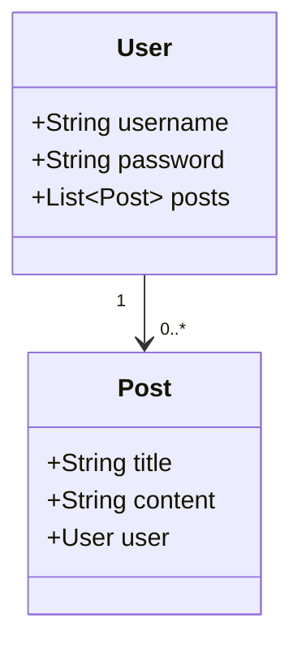

## 17.3 Working with Databases and ORMs

In modern web development, databases are the backbone of data storage and retrieval. JavaScript developers often interact with databases using Object-Relational Mapping (ORM) tools, which provide a higher-level abstraction over raw database queries. This section will guide you through the essentials of working with databases in JavaScript, focusing on popular ORMs like Sequelize, TypeORM, and Mongoose.

### Understanding ORMs

**Object-Relational Mapping (ORM)** is a technique that allows developers to interact with a database using an object-oriented paradigm. ORMs map database tables to classes, rows to instances, and columns to attributes, making database interactions more intuitive and less error-prone.

#### Benefits of Using ORMs

- **Abstraction**: ORMs abstract the complexities of SQL queries, allowing developers to focus on business logic.
- **Productivity**: By using ORMs, developers can write less code and achieve more, speeding up development.
- **Maintainability**: Code written with ORMs is often more readable and easier to maintain.
- **Cross-Database Compatibility**: Many ORMs support multiple database systems, allowing for easier migration and integration.
- **Security**: ORMs help prevent SQL injection attacks by using parameterized queries.

### Popular JavaScript ORMs

Let's explore some of the most popular ORMs used in JavaScript development:

#### Sequelize

[Sequelize](https://sequelize.org/) is a promise-based Node.js ORM for SQL databases such as PostgreSQL, MySQL, MariaDB, SQLite, and Microsoft SQL Server. It provides a robust set of features for managing database interactions.

#### TypeORM

[TypeORM](https://typeorm.io/) is an ORM that supports both SQL and NoSQL databases. It is written in TypeScript and provides excellent support for TypeScript features, making it a great choice for developers using TypeScript.

#### Mongoose

[Mongoose](https://mongoosejs.com/) is an ODM (Object Data Modeling) library for MongoDB and Node.js. It provides a straightforward, schema-based solution to model application data.

### Defining Models and Relationships

ORMs allow you to define models that represent your database tables. Let's see how to define models using Sequelize, TypeORM, and Mongoose.

#### Sequelize Model Definition

```javascript
const { Sequelize, DataTypes } = require('sequelize');
const sequelize = new Sequelize('database', 'username', 'password', {
  host: 'localhost',
  dialect: 'postgres'
});

const User = sequelize.define('User', {
  username: {
    type: DataTypes.STRING,
    allowNull: false
  },
  password: {
    type: DataTypes.STRING,
    allowNull: false
  }
});

(async () => {
  await sequelize.sync({ force: true });
  console.log("The table for the User model was just (re)created!");
})();
```

**Explanation**: In Sequelize, models are defined using the `define` method, where you specify the model name and its attributes. The `sync` method is used to create the table in the database.

#### TypeORM Model Definition

```typescript
import { Entity, PrimaryGeneratedColumn, Column, createConnection } from 'typeorm';

@Entity()
export class User {
  @PrimaryGeneratedColumn()
  id: number;

  @Column()
  username: string;

  @Column()
  password: string;
}

createConnection().then(async connection => {
  const userRepository = connection.getRepository(User);
  const user = new User();
  user.username = "JohnDoe";
  user.password = "securePassword";
  await userRepository.save(user);
  console.log("User has been saved.");
}).catch(error => console.log(error));
```

**Explanation**: TypeORM uses decorators to define entities and their columns. The `createConnection` function establishes a connection to the database, and the `getRepository` method is used to interact with the database.

#### Mongoose Model Definition

```javascript
const mongoose = require('mongoose');

const userSchema = new mongoose.Schema({
  username: {
    type: String,
    required: true
  },
  password: {
    type: String,
    required: true
  }
});

const User = mongoose.model('User', userSchema);

mongoose.connect('mongodb://localhost:27017/myapp', { useNewUrlParser: true, useUnifiedTopology: true })
  .then(() => {
    console.log("Connected to MongoDB");
    const user = new User({ username: 'JohnDoe', password: 'securePassword' });
    return user.save();
  })
  .then(() => console.log("User has been saved."))
  .catch(err => console.error(err));
```

**Explanation**: Mongoose uses schemas to define the structure of documents within a collection. The `model` method creates a model from the schema, which is then used to interact with the database.

### Managing Relationships

ORMs also provide mechanisms to define relationships between models, such as one-to-one, one-to-many, and many-to-many.

#### Sequelize Relationships

```javascript
const Post = sequelize.define('Post', {
  title: DataTypes.STRING,
  content: DataTypes.TEXT
});

User.hasMany(Post);
Post.belongsTo(User);

(async () => {
  await sequelize.sync({ force: true });
  console.log("Tables have been created.");
})();
```

**Explanation**: Sequelize uses methods like `hasMany` and `belongsTo` to define relationships between models.

#### TypeORM Relationships

```typescript
import { OneToMany, ManyToOne } from 'typeorm';

@Entity()
export class Post {
  @PrimaryGeneratedColumn()
  id: number;

  @Column()
  title: string;

  @Column()
  content: string;

  @ManyToOne(() => User, user => user.posts)
  user: User;
}

@Entity()
export class User {
  @PrimaryGeneratedColumn()
  id: number;

  @Column()
  username: string;

  @Column()
  password: string;

  @OneToMany(() => Post, post => post.user)
  posts: Post[];
}
```

**Explanation**: TypeORM uses decorators like `OneToMany` and `ManyToOne` to define relationships between entities.

#### Mongoose Relationships

```javascript
const postSchema = new mongoose.Schema({
  title: String,
  content: String,
  user: { type: mongoose.Schema.Types.ObjectId, ref: 'User' }
});

const Post = mongoose.model('Post', postSchema);

User.findOne({ username: 'JohnDoe' }).then(user => {
  const post = new Post({ title: 'My First Post', content: 'Hello World!', user: user._id });
  return post.save();
}).then(() => console.log("Post has been saved."))
.catch(err => console.error(err));
```

**Explanation**: Mongoose uses references to other documents to define relationships. The `ref` option in the schema indicates the related model.

### Queries and Data Manipulation

ORMs provide a high-level API for querying and manipulating data.

#### Sequelize Queries

```javascript
User.findAll({
  where: {
    username: 'JohnDoe'
  },
  include: [Post]
}).then(users => {
  console.log(users);
});
```

**Explanation**: Sequelize's `findAll` method is used to retrieve data, with options to filter and include related models.

#### TypeORM Queries

```typescript
const userRepository = connection.getRepository(User);
userRepository.find({ where: { username: 'JohnDoe' }, relations: ["posts"] })
  .then(users => {
    console.log(users);
  });
```

**Explanation**: TypeORM's `find` method allows for querying with conditions and including related entities.

#### Mongoose Queries

```javascript
User.findOne({ username: 'JohnDoe' }).populate('posts').exec((err, user) => {
  if (err) return console.error(err);
  console.log(user);
});
```

**Explanation**: Mongoose's `findOne` method is used to query documents, with `populate` to include related documents.

### Migrations and Schema Synchronization

Managing database schema changes is crucial in application development. ORMs provide tools for handling migrations and schema synchronization.

#### Sequelize Migrations

Sequelize CLI can be used to create and run migrations.

```bash
npx sequelize-cli migration:generate --name create-users-table
npx sequelize-cli db:migrate
```

**Explanation**: The `sequelize-cli` is used to generate migration files and apply them to the database.

#### TypeORM Migrations

TypeORM CLI provides commands for generating and running migrations.

```bash
typeorm migration:create -n CreateUsersTable
typeorm migration:run
```

**Explanation**: TypeORM's CLI is used to create migration files and execute them.

#### Mongoose Schema Synchronization

Mongoose does not have built-in migration tools, but you can use libraries like `migrate-mongoose` to manage schema changes.

### Best Practices for Database Access and Security

- **Use Parameterized Queries**: Always use parameterized queries to prevent SQL injection attacks.
- **Limit Data Exposure**: Only expose necessary data to the client to minimize security risks.
- **Use Transactions**: For operations that require multiple steps, use transactions to ensure data integrity.
- **Regular Backups**: Regularly back up your database to prevent data loss.
- **Monitor Performance**: Use database monitoring tools to identify and resolve performance bottlenecks.

### Try It Yourself

Experiment with the code examples provided in this section. Try modifying the models, adding new fields, or creating additional relationships. Use the ORM documentation to explore advanced features and customize the examples to fit your needs.

### Visualizing ORM Interactions



**Diagram Description**: This class diagram represents the relationship between `User` and `Post` models, where a user can have multiple posts.

### Knowledge Check

- What are the benefits of using ORMs in JavaScript development?
- How do you define a one-to-many relationship in Sequelize?
- What is the purpose of migrations in database management?
- How can you prevent SQL injection attacks when using ORMs?

### Summary

In this section, we explored the integration of databases with JavaScript using ORMs. We covered the basics of defining models, managing relationships, executing queries, and handling migrations. By following best practices, you can ensure efficient and secure database interactions in your applications.

Remember, mastering ORMs is a journey. Keep experimenting, stay curious, and enjoy the process of building robust and scalable applications!

## Quiz: Mastering Database Integration with JavaScript ORMs



### What is an ORM?

- [x] A tool that maps database tables to objects in code
- [ ] A database management system
- [ ] A type of database query language
- [ ] A method for encrypting data

> **Explanation:** An ORM (Object-Relational Mapping) tool maps database tables to objects in code, allowing developers to interact with the database using an object-oriented approach.

### Which ORM is specifically designed for MongoDB?

- [ ] Sequelize
- [ ] TypeORM
- [x] Mongoose
- [ ] Hibernate

> **Explanation:** Mongoose is an ODM (Object Data Modeling) library specifically designed for MongoDB and Node.js.

### How do you define a model in Sequelize?

- [x] Using the `define` method
- [ ] Using decorators
- [ ] Using XML configuration
- [ ] Using JSON files

> **Explanation:** In Sequelize, models are defined using the `define` method, where you specify the model name and its attributes.

### What is the purpose of migrations in ORM?

- [x] To manage database schema changes
- [ ] To encrypt database data
- [ ] To backup database data
- [ ] To optimize database queries

> **Explanation:** Migrations are used to manage database schema changes, allowing developers to apply changes to the database structure over time.

### Which method is used in Mongoose to populate related documents?

- [ ] `findAll`
- [ ] `getRepository`
- [x] `populate`
- [ ] `sync`

> **Explanation:** In Mongoose, the `populate` method is used to include related documents in a query result.

### What is a key benefit of using ORMs?

- [x] They abstract SQL queries, making database interactions easier
- [ ] They increase database storage capacity
- [ ] They provide encryption for database data
- [ ] They automatically backup database data

> **Explanation:** ORMs abstract the complexities of SQL queries, allowing developers to focus on business logic and making database interactions easier.

### Which ORM supports both SQL and NoSQL databases?

- [ ] Sequelize
- [x] TypeORM
- [ ] Mongoose
- [ ] Hibernate

> **Explanation:** TypeORM supports both SQL and NoSQL databases, providing flexibility for developers working with different types of databases.

### How can you prevent SQL injection attacks when using ORMs?

- [x] Use parameterized queries
- [ ] Use plain SQL queries
- [ ] Disable database logging
- [ ] Encrypt all database data

> **Explanation:** Using parameterized queries helps prevent SQL injection attacks by ensuring that user input is treated as data, not executable code.

### What is the `sync` method used for in Sequelize?

- [x] To create tables in the database
- [ ] To encrypt database data
- [ ] To backup database data
- [ ] To optimize database queries

> **Explanation:** The `sync` method in Sequelize is used to create tables in the database based on the defined models.

### True or False: Mongoose provides built-in migration tools.

- [ ] True
- [x] False

> **Explanation:** Mongoose does not have built-in migration tools, but you can use external libraries like `migrate-mongoose` to manage schema changes.


