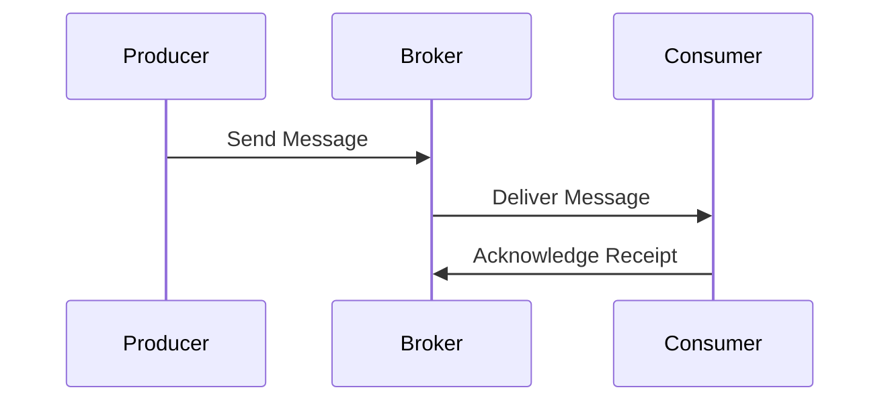

## 17.4 Message Brokers and Queues (RabbitMQ, Kafka)

In modern web development, integrating message brokers and queues is essential for building scalable, reliable, and efficient applications. This section delves into the role of message brokers like RabbitMQ and Apache Kafka, demonstrating how to connect them with JavaScript applications. We will explore use cases for queues, such as background jobs and task scheduling, and discuss how to ensure message delivery reliability and ordering.

### Understanding Message Brokers and Queues

Message brokers are systems that enable communication between different parts of an application or between different applications. They facilitate the exchange of information by sending messages between producers and consumers, often using a queue to manage the flow of messages.

#### Key Concepts

- **Producer**: An application or service that sends messages to the broker.
- **Consumer**: An application or service that receives messages from the broker.
- **Queue**: A data structure used to store messages temporarily until they are processed by consumers.
- **Topic**: In systems like Kafka, a topic is a category or feed name to which messages are published.

### RabbitMQ: A Reliable Message Broker

RabbitMQ is a widely-used open-source message broker that implements the Advanced Message Queuing Protocol (AMQP). It is known for its reliability, flexibility, and ease of use.

#### Connecting to RabbitMQ with JavaScript

To connect to RabbitMQ from a JavaScript application, we can use the `amqplib` library. This library provides a simple API for interacting with RabbitMQ.

```javascript
// Import the amqplib library
const amqp = require('amqplib');

// Connect to RabbitMQ
async function connectRabbitMQ() {
  try {
    const connection = await amqp.connect('amqp://localhost');
    const channel = await connection.createChannel();

    // Declare a queue
    const queue = 'task_queue';
    await channel.assertQueue(queue, {
      durable: true
    });

    console.log(`Connected to RabbitMQ and queue ${queue} is ready.`);
  } catch (error) {
    console.error('Error connecting to RabbitMQ:', error);
  }
}

connectRabbitMQ();
```

#### Use Cases for RabbitMQ

- **Background Jobs**: Offload time-consuming tasks to be processed asynchronously.
- **Task Scheduling**: Schedule tasks to be executed at specific times or intervals.
- **Load Balancing**: Distribute tasks across multiple consumers to balance the load.

### Apache Kafka: A Distributed Streaming Platform

Apache Kafka is a distributed event streaming platform capable of handling trillions of events a day. It is designed for high-throughput, fault-tolerant, and scalable messaging.

#### Connecting to Kafka with JavaScript

To connect to Kafka from a JavaScript application, we can use the `kafkajs` library. This library provides a modern, lightweight client for Kafka.

```javascript
// Import the kafkajs library
const { Kafka } = require('kafkajs');

// Connect to Kafka
async function connectKafka() {
  const kafka = new Kafka({
    clientId: 'my-app',
    brokers: ['localhost:9092']
  });

  const producer = kafka.producer();
  await producer.connect();

  console.log('Connected to Kafka.');
}

connectKafka();
```

#### Use Cases for Kafka

- **Real-Time Data Processing**: Process streams of data in real-time for analytics or monitoring.
- **Event Sourcing**: Capture changes in the state of an application as a sequence of events.
- **Log Aggregation**: Collect and aggregate logs from different sources for analysis.

### Ensuring Message Delivery Reliability and Ordering

Both RabbitMQ and Kafka provide mechanisms to ensure message delivery reliability and ordering.

#### RabbitMQ

- **Acknowledgments**: Consumers can acknowledge messages to confirm receipt, ensuring messages are not lost.
- **Durability**: Queues and messages can be marked as durable to survive broker restarts.

#### Kafka

- **Replication**: Kafka replicates messages across multiple brokers to ensure durability.
- **Ordering**: Messages within a partition are ordered, and consumers can process them in sequence.

### Libraries for JavaScript Integration

- **amqplib**: A library for connecting to RabbitMQ, providing a simple API for sending and receiving messages.
- **kafkajs**: A modern client for Kafka, offering a lightweight and efficient way to interact with Kafka clusters.

### Visualizing Message Flow

Below is a diagram illustrating the flow of messages between producers, brokers, and consumers.



**Diagram Description**: This sequence diagram shows the interaction between a producer, a broker, and a consumer. The producer sends a message to the broker, which then delivers it to the consumer. The consumer acknowledges receipt back to the broker.

### Try It Yourself

Experiment with the provided code examples by modifying the connection parameters or message content. Try creating multiple producers and consumers to see how they interact with the broker.

### Knowledge Check

- What are the key differences between RabbitMQ and Kafka?
- How can you ensure message delivery reliability in RabbitMQ?
- What are some common use cases for message brokers in web development?

### Summary

In this section, we explored the integration of message brokers and queues like RabbitMQ and Kafka in JavaScript applications. We discussed their roles, use cases, and how to ensure message delivery reliability and ordering. By leveraging libraries like `amqplib` and `kafkajs`, developers can efficiently connect to these brokers and build robust, scalable applications.

Remember, this is just the beginning. As you progress, you'll build more complex and interactive systems. Keep experimenting, stay curious, and enjoy the journey!

## Quiz: Mastering Message Brokers and Queues in JavaScript



### What is the primary role of a message broker?

- [x] Facilitate communication between different parts of an application
- [ ] Store data persistently
- [ ] Execute background tasks
- [ ] Render web pages

> **Explanation:** A message broker facilitates communication by sending messages between producers and consumers.

### Which library is used to connect to RabbitMQ from JavaScript?

- [x] amqplib
- [ ] kafkajs
- [ ] express
- [ ] axios

> **Explanation:** The `amqplib` library is used to connect to RabbitMQ from JavaScript applications.

### What is a common use case for Kafka?

- [x] Real-Time Data Processing
- [ ] Static File Hosting
- [ ] Image Rendering
- [ ] CSS Styling

> **Explanation:** Kafka is commonly used for real-time data processing due to its high-throughput capabilities.

### How does RabbitMQ ensure message delivery reliability?

- [x] Acknowledgments and Durability
- [ ] Encryption and Compression
- [ ] Caching and Indexing
- [ ] Replication and Sharding

> **Explanation:** RabbitMQ uses acknowledgments and durability to ensure message delivery reliability.

### What is a topic in Kafka?

- [x] A category or feed name to which messages are published
- [ ] A type of database index
- [ ] A CSS class name
- [ ] A JavaScript function

> **Explanation:** In Kafka, a topic is a category or feed name to which messages are published.

### Which library is used to connect to Kafka from JavaScript?

- [x] kafkajs
- [ ] amqplib
- [ ] mongoose
- [ ] lodash

> **Explanation:** The `kafkajs` library is used to connect to Kafka from JavaScript applications.

### What is a key feature of Kafka for ensuring message durability?

- [x] Replication
- [ ] Encryption
- [ ] Compression
- [ ] Caching

> **Explanation:** Kafka uses replication to ensure message durability across multiple brokers.

### What is the purpose of a queue in a message broker?

- [x] Temporarily store messages until they are processed
- [ ] Persistently store data
- [ ] Render HTML content
- [ ] Execute JavaScript code

> **Explanation:** A queue temporarily stores messages until they are processed by consumers.

### How can you ensure message ordering in Kafka?

- [x] Use partitions
- [ ] Use indexes
- [ ] Use encryption
- [ ] Use caching

> **Explanation:** Kafka ensures message ordering within a partition.

### True or False: RabbitMQ and Kafka can be used for inter-service communication.

- [x] True
- [ ] False

> **Explanation:** Both RabbitMQ and Kafka are commonly used for inter-service communication in distributed systems.




