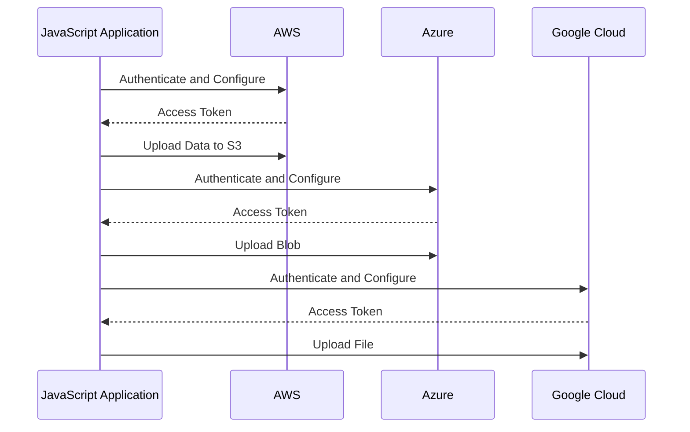

## 17.5 Integration with Cloud Services

In the modern web development landscape, integrating with cloud services has become a cornerstone for building scalable, reliable, and efficient applications. Cloud service providers like Amazon Web Services (AWS), Microsoft Azure, and Google Cloud Platform (GCP) offer a plethora of services that can be leveraged to enhance your JavaScript applications. In this section, we will explore how to integrate JavaScript applications with these cloud services, focusing on storage, messaging, and compute resources.

### Benefits of Using Cloud Services

Before diving into the specifics of integration, let's discuss the benefits of using cloud services:

- **Scalability**: Cloud services provide the ability to scale resources up or down based on demand, ensuring that your application can handle varying loads efficiently.
- **Cost Efficiency**: Pay-as-you-go pricing models allow you to only pay for the resources you use, reducing costs associated with maintaining physical infrastructure.
- **Reliability**: Cloud providers offer high availability and disaster recovery options, ensuring that your application remains operational even in the face of hardware failures.
- **Security**: Cloud services come with built-in security features and compliance certifications, helping you protect your data and meet regulatory requirements.
- **Global Reach**: Deploy your applications closer to your users with data centers located around the world, reducing latency and improving user experience.

### Integrating with AWS Services

AWS offers a comprehensive suite of services that can be integrated into your JavaScript applications using the [AWS SDK for JavaScript](https://aws.amazon.com/sdk-for-node-js/). Let's explore some common use cases and how to implement them.

#### Setting Up AWS SDK for JavaScript

To start using AWS services, you need to install the AWS SDK for JavaScript:

```bash
npm install aws-sdk
```

#### Authentication and Configuration

AWS uses access keys to authenticate requests. It's crucial to manage these credentials securely. You can configure the SDK using environment variables or a configuration file.

```javascript
// Load the AWS SDK
const AWS = require('aws-sdk');

// Configure the SDK with your credentials
AWS.config.update({
  accessKeyId: process.env.AWS_ACCESS_KEY_ID,
  secretAccessKey: process.env.AWS_SECRET_ACCESS_KEY,
  region: 'us-west-2'
});
```

#### Example: Using Amazon S3 for Storage

Amazon S3 is a popular service for storing and retrieving data. Here's how you can upload a file to an S3 bucket:

```javascript
const s3 = new AWS.S3();

const uploadParams = {
  Bucket: 'my-bucket',
  Key: 'my-file.txt',
  Body: 'Hello, world!'
};

s3.upload(uploadParams, (err, data) => {
  if (err) {
    console.error("Error uploading file:", err);
  } else {
    console.log("File uploaded successfully:", data.Location);
  }
});
```

#### Example: Using Amazon SNS for Messaging

Amazon Simple Notification Service (SNS) allows you to send messages to subscribers. Here's how to publish a message:

```javascript
const sns = new AWS.SNS();

const params = {
  Message: 'Hello from SNS!',
  TopicArn: 'arn:aws:sns:us-west-2:123456789012:MyTopic'
};

sns.publish(params, (err, data) => {
  if (err) {
    console.error("Error publishing message:", err);
  } else {
    console.log("Message published:", data.MessageId);
  }
});
```

### Integrating with Azure Services

Microsoft Azure provides a wide range of services that can be accessed using the [Azure SDK for JavaScript](https://azure.github.io/azure-sdk-for-js/). Let's look at some examples.

#### Setting Up Azure SDK for JavaScript

First, install the Azure SDK packages you need:

```bash
npm install @azure/storage-blob
```

#### Authentication and Configuration

Azure uses service principals for authentication. You can authenticate using environment variables or a configuration file.

```javascript
const { DefaultAzureCredential } = require('@azure/identity');
const { BlobServiceClient } = require('@azure/storage-blob');

const credential = new DefaultAzureCredential();
const blobServiceClient = new BlobServiceClient(`https://${accountName}.blob.core.windows.net`, credential);
```

#### Example: Using Azure Blob Storage

Azure Blob Storage is used for storing large amounts of unstructured data. Here's how to upload a blob:

```javascript
async function uploadBlob() {
  const containerClient = blobServiceClient.getContainerClient('my-container');
  const blockBlobClient = containerClient.getBlockBlobClient('my-blob.txt');

  const data = 'Hello, Azure!';
  const uploadBlobResponse = await blockBlobClient.upload(data, data.length);
  console.log(`Blob was uploaded successfully. requestId: ${uploadBlobResponse.requestId}`);
}

uploadBlob().catch(console.error);
```

### Integrating with Google Cloud Services

Google Cloud Platform offers various services that can be integrated using the [Google Cloud Client Libraries](https://cloud.google.com/apis/docs/cloud-client-libraries-nodejs).

#### Setting Up Google Cloud Client Libraries

Install the necessary client libraries:

```bash
npm install @google-cloud/storage
```

#### Authentication and Configuration

Google Cloud uses service accounts for authentication. You can authenticate using a key file.

```javascript
const { Storage } = require('@google-cloud/storage');

const storage = new Storage({
  projectId: 'my-project-id',
  keyFilename: '/path/to/keyfile.json'
});
```

#### Example: Using Google Cloud Storage

Google Cloud Storage is used for storing and accessing data. Here's how to upload a file:

```javascript
async function uploadFile() {
  await storage.bucket('my-bucket').upload('local-file.txt', {
    destination: 'remote-file.txt',
  });

  console.log('File uploaded successfully.');
}

uploadFile().catch(console.error);
```

### Handling Authentication and Configuration

Authentication is a critical aspect of integrating with cloud services. Here are some best practices:

- **Use Environment Variables**: Store credentials in environment variables instead of hardcoding them in your application.
- **Use IAM Roles**: When running on cloud infrastructure, use IAM roles to manage permissions without embedding credentials.
- **Rotate Credentials Regularly**: Regularly update your credentials to minimize the risk of unauthorized access.
- **Use Secrets Management Services**: Utilize services like AWS Secrets Manager, Azure Key Vault, or Google Secret Manager to securely store and access credentials.

### Best Practices for Managing Credentials and Security

- **Principle of Least Privilege**: Grant only the permissions necessary for your application to function.
- **Encrypt Sensitive Data**: Use encryption to protect sensitive data both at rest and in transit.
- **Monitor and Audit**: Regularly monitor access logs and audit your cloud resources for unusual activity.
- **Use Multi-Factor Authentication (MFA)**: Enable MFA for accessing cloud management consoles to add an extra layer of security.

### Visualizing Cloud Integration

Below is a sequence diagram illustrating the interaction between a JavaScript application and cloud services:



### Try It Yourself

Experiment with the code examples provided by:

- Modifying the bucket or container names to match your own resources.
- Changing the data being uploaded to test different file types or sizes.
- Implementing error handling to manage potential issues during uploads.

### Knowledge Check

To reinforce your understanding, consider the following questions:

- What are the benefits of using cloud services in web development?
- How do you securely manage credentials for cloud services?
- What are some common use cases for integrating JavaScript applications with AWS, Azure, and Google Cloud?

### Summary

Integrating JavaScript applications with cloud services allows you to leverage powerful tools and resources to enhance your applications. By following best practices for authentication and security, you can ensure that your integrations are both effective and secure. Remember, this is just the beginning. As you progress, you'll build more complex and interactive applications. Keep experimenting, stay curious, and enjoy the journey!

## Cloud Services Integration Quiz



### What is a primary benefit of using cloud services in web development?

- [x] Scalability
- [ ] Increased latency
- [ ] Higher costs
- [ ] Limited global reach

> **Explanation:** Cloud services offer scalability, allowing applications to handle varying loads efficiently.

### Which AWS service is used for storing and retrieving data?

- [x] Amazon S3
- [ ] Amazon SNS
- [ ] Amazon EC2
- [ ] Amazon RDS

> **Explanation:** Amazon S3 is a service used for storing and retrieving data.

### How can you securely manage AWS credentials in a JavaScript application?

- [x] Use environment variables
- [ ] Hardcode them in the application
- [ ] Share them publicly
- [ ] Store them in a text file

> **Explanation:** Using environment variables is a secure way to manage AWS credentials.

### What is the purpose of Azure Blob Storage?

- [x] Storing large amounts of unstructured data
- [ ] Sending notifications
- [ ] Running virtual machines
- [ ] Managing databases

> **Explanation:** Azure Blob Storage is used for storing large amounts of unstructured data.

### Which Google Cloud service is used for storing and accessing data?

- [x] Google Cloud Storage
- [ ] Google Cloud Pub/Sub
- [ ] Google Cloud Functions
- [ ] Google Cloud SQL

> **Explanation:** Google Cloud Storage is used for storing and accessing data.

### What is a best practice for managing cloud service credentials?

- [x] Use IAM roles
- [ ] Share credentials with team members
- [ ] Store credentials in version control
- [ ] Use the same credentials for all services

> **Explanation:** Using IAM roles is a best practice for managing cloud service credentials.

### Which service can be used to securely store and access credentials?

- [x] AWS Secrets Manager
- [ ] AWS S3
- [ ] AWS Lambda
- [ ] AWS EC2

> **Explanation:** AWS Secrets Manager is used to securely store and access credentials.

### What is the principle of least privilege?

- [x] Granting only necessary permissions
- [ ] Granting all permissions
- [ ] Denying all permissions
- [ ] Granting permissions based on user preference

> **Explanation:** The principle of least privilege involves granting only the permissions necessary for an application to function.

### How can you enhance security when accessing cloud management consoles?

- [x] Enable Multi-Factor Authentication (MFA)
- [ ] Disable password protection
- [ ] Use a single-factor authentication
- [ ] Share login credentials

> **Explanation:** Enabling Multi-Factor Authentication (MFA) enhances security when accessing cloud management consoles.

### True or False: Using cloud services can reduce costs associated with maintaining physical infrastructure.

- [x] True
- [ ] False

> **Explanation:** Cloud services offer pay-as-you-go pricing models, reducing costs associated with maintaining physical infrastructure.


