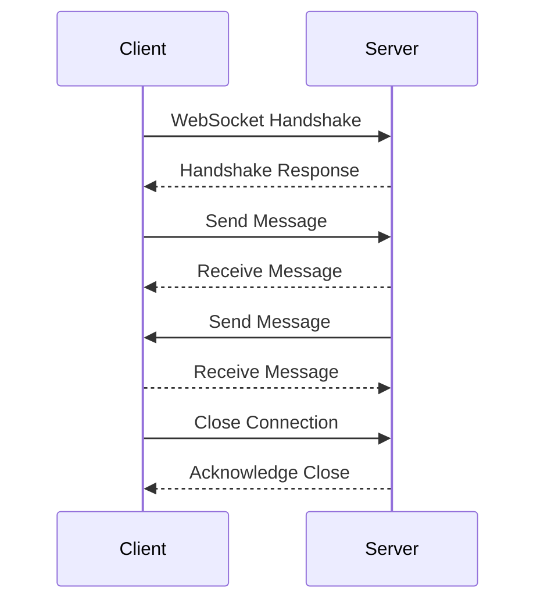

## 17.6 WebSockets and Real-Time Communication

In the rapidly evolving landscape of web development, real-time communication has become a cornerstone for creating dynamic and interactive user experiences. WebSockets, a protocol designed for full-duplex communication channels over a single TCP connection, have emerged as a powerful tool for achieving this. In this section, we will delve into the world of WebSockets, exploring their functionality, use cases, and how they differ from traditional HTTP communication. We will also provide practical examples of setting up WebSocket connections using the native WebSocket API, Socket.io, and the ws library for Node.js. Finally, we will discuss considerations for scalability and fallbacks to ensure robust and reliable real-time applications.

### What Are WebSockets?

WebSockets are a protocol that enables two-way communication between a client and a server. Unlike HTTP, which is a request-response protocol where the client initiates every interaction, WebSockets allow for persistent connections where both the client and server can send messages to each other independently. This makes WebSockets ideal for applications that require real-time updates, such as chat applications, live notifications, and collaborative tools.

#### Key Features of WebSockets

- **Full-Duplex Communication**: WebSockets provide a two-way communication channel, allowing both the client and server to send and receive messages simultaneously.
- **Persistent Connection**: Once a WebSocket connection is established, it remains open, eliminating the need for repeated handshakes and reducing latency.
- **Low Overhead**: WebSockets use a lightweight frame format, resulting in lower overhead compared to HTTP requests.

### How WebSockets Differ from HTTP

While HTTP is a stateless protocol designed for request-response communication, WebSockets offer a stateful, continuous connection. Here's a comparison to highlight the differences:

| Feature        | HTTP                          | WebSockets                    |
|----------------|-------------------------------|-------------------------------|
| Communication  | Request-Response              | Full-Duplex                   |
| Connection     | Stateless, short-lived        | Stateful, persistent          |
| Overhead       | High (headers with each request) | Low (lightweight frames)     |
| Use Cases      | Static content, REST APIs     | Real-time updates, chat apps  |

### Setting Up WebSocket Connections

Let's explore how to set up WebSocket connections using different tools and libraries.

#### Native WebSocket API

The native WebSocket API is a built-in feature of modern web browsers, allowing you to create WebSocket connections without additional libraries.

**Client-Side Example:**

```javascript
// Create a new WebSocket connection
const socket = new WebSocket('ws://example.com/socket');

// Event listener for connection open
socket.addEventListener('open', (event) => {
  console.log('WebSocket connection opened');
  socket.send('Hello Server!');
});

// Event listener for receiving messages
socket.addEventListener('message', (event) => {
  console.log('Message from server:', event.data);
});

// Event listener for connection close
socket.addEventListener('close', (event) => {
  console.log('WebSocket connection closed');
});

// Event listener for errors
socket.addEventListener('error', (error) => {
  console.error('WebSocket error:', error);
});
```

**Server-Side Example (Node.js using ws library):**

```javascript
const WebSocket = require('ws');

// Create a WebSocket server
const wss = new WebSocket.Server({ port: 8080 });

wss.on('connection', (ws) => {
  console.log('Client connected');

  // Send a message to the client
  ws.send('Welcome to the WebSocket server!');

  // Listen for messages from the client
  ws.on('message', (message) => {
    console.log('Received:', message);
    ws.send(`Echo: ${message}`);
  });

  // Handle connection close
  ws.on('close', () => {
    console.log('Client disconnected');
  });

  // Handle errors
  ws.on('error', (error) => {
    console.error('WebSocket error:', error);
  });
});
```

#### Using Socket.io

Socket.io is a popular library that simplifies WebSocket communication and provides additional features like automatic reconnection and fallback to HTTP long-polling.

**Client-Side Example:**

```html
<script src="/socket.io/socket.io.js"></script>
<script>
  // Connect to the server
  const socket = io('http://localhost:3000');

  // Listen for connection
  socket.on('connect', () => {
    console.log('Connected to server');
    socket.emit('message', 'Hello Server!');
  });

  // Listen for messages from the server
  socket.on('message', (data) => {
    console.log('Message from server:', data);
  });

  // Handle disconnection
  socket.on('disconnect', () => {
    console.log('Disconnected from server');
  });
</script>
```

**Server-Side Example (Node.js):**

```javascript
const express = require('express');
const http = require('http');
const socketIo = require('socket.io');

const app = express();
const server = http.createServer(app);
const io = socketIo(server);

io.on('connection', (socket) => {
  console.log('Client connected');

  // Send a message to the client
  socket.emit('message', 'Welcome to the Socket.io server!');

  // Listen for messages from the client
  socket.on('message', (message) => {
    console.log('Received:', message);
    socket.emit('message', `Echo: ${message}`);
  });

  // Handle disconnection
  socket.on('disconnect', () => {
    console.log('Client disconnected');
  });
});

server.listen(3000, () => {
  console.log('Server listening on port 3000');
});
```

#### Using the ws Library for Node.js

The ws library is a simple and efficient WebSocket library for Node.js, providing a straightforward API for creating WebSocket servers and clients.

**Server-Side Example:**

```javascript
const WebSocket = require('ws');

// Create a WebSocket server
const wss = new WebSocket.Server({ port: 8080 });

wss.on('connection', (ws) => {
  console.log('Client connected');

  // Send a message to the client
  ws.send('Welcome to the WebSocket server!');

  // Listen for messages from the client
  ws.on('message', (message) => {
    console.log('Received:', message);
    ws.send(`Echo: ${message}`);
  });

  // Handle connection close
  ws.on('close', () => {
    console.log('Client disconnected');
  });

  // Handle errors
  ws.on('error', (error) => {
    console.error('WebSocket error:', error);
  });
});
```

### Use Cases for WebSockets

WebSockets are ideal for applications that require real-time communication and low-latency updates. Here are some common use cases:

- **Live Updates**: WebSockets are perfect for applications that need to push real-time updates to users, such as live sports scores, stock market data, or news feeds.
- **Notifications**: Use WebSockets to deliver instant notifications to users, such as chat messages, alerts, or system updates.
- **Collaborative Applications**: WebSockets enable real-time collaboration in applications like document editing, whiteboards, or multiplayer games.

### Considerations for Scalability and Fallbacks

When implementing WebSockets in a production environment, it's important to consider scalability and fallback strategies to ensure reliability and performance.

#### Scalability

- **Load Balancing**: Use load balancers to distribute WebSocket connections across multiple servers. Ensure that the load balancer supports sticky sessions to maintain persistent connections.
- **Horizontal Scaling**: Scale your WebSocket servers horizontally by adding more instances to handle increased traffic.
- **Message Broadcasting**: Use message brokers like Redis or RabbitMQ to efficiently broadcast messages to multiple WebSocket servers.

#### Fallbacks

- **HTTP Long-Polling**: Implement HTTP long-polling as a fallback for clients that do not support WebSockets. Libraries like Socket.io handle this automatically.
- **Graceful Degradation**: Design your application to gracefully degrade to less real-time communication methods if WebSockets are unavailable.

### Visualizing WebSocket Communication

To better understand the flow of WebSocket communication, let's visualize the process using a sequence diagram.



**Diagram Description**: This sequence diagram illustrates the typical flow of a WebSocket communication session. The client initiates a handshake with the server, establishing a persistent connection. Both the client and server can then send and receive messages independently. The session ends when the client closes the connection, and the server acknowledges the closure.

### Knowledge Check

- **What are the key differences between WebSockets and HTTP?**
- **How can you set up a WebSocket connection using the native WebSocket API?**
- **What are some common use cases for WebSockets?**
- **How can you ensure scalability when using WebSockets in a production environment?**

### Try It Yourself

Experiment with the provided code examples by modifying the message content or adding additional event listeners. Try setting up a simple chat application using WebSockets to see real-time communication in action.

### Summary

WebSockets provide a powerful mechanism for real-time communication in web applications, enabling low-latency updates and interactive user experiences. By understanding how to set up WebSocket connections using various tools and libraries, you can create dynamic applications that keep users engaged and informed. Remember to consider scalability and fallback strategies to ensure your applications remain robust and reliable.

### Embrace the Journey

As you explore the world of WebSockets, remember that this is just the beginning. The possibilities for real-time communication are vast, and with practice, you'll be able to build more complex and interactive applications. Keep experimenting, stay curious, and enjoy the journey!

## WebSockets and Real-Time Communication Quiz



### What is a key feature of WebSockets?

- [x] Full-duplex communication
- [ ] Stateless communication
- [ ] High overhead
- [ ] Request-response model

> **Explanation:** WebSockets provide full-duplex communication, allowing both client and server to send and receive messages independently.

### How do WebSockets differ from HTTP?

- [x] WebSockets provide a persistent connection
- [ ] WebSockets use a request-response model
- [ ] WebSockets have high overhead
- [ ] WebSockets are stateless

> **Explanation:** Unlike HTTP, WebSockets maintain a persistent connection, allowing continuous communication without repeated handshakes.

### Which library simplifies WebSocket communication and provides additional features?

- [x] Socket.io
- [ ] Express.js
- [ ] React.js
- [ ] Angular.js

> **Explanation:** Socket.io is a popular library that simplifies WebSocket communication and provides features like automatic reconnection and fallback to HTTP long-polling.

### What is a common use case for WebSockets?

- [x] Live updates
- [ ] Static content delivery
- [ ] Batch processing
- [ ] File uploads

> **Explanation:** WebSockets are ideal for applications that require real-time updates, such as live sports scores or chat applications.

### How can you ensure scalability when using WebSockets?

- [x] Use load balancers
- [ ] Use a single server
- [ ] Avoid sticky sessions
- [ ] Disable message broadcasting

> **Explanation:** Load balancers help distribute WebSocket connections across multiple servers, ensuring scalability.

### What is a fallback strategy for clients that do not support WebSockets?

- [x] HTTP long-polling
- [ ] FTP
- [ ] SMTP
- [ ] POP3

> **Explanation:** HTTP long-polling is a common fallback strategy for clients that do not support WebSockets.

### Which library provides a straightforward API for creating WebSocket servers in Node.js?

- [x] ws
- [ ] axios
- [ ] lodash
- [ ] mongoose

> **Explanation:** The ws library is a simple and efficient WebSocket library for Node.js.

### What is the purpose of sticky sessions in load balancing WebSockets?

- [x] Maintain persistent connections
- [ ] Increase latency
- [ ] Reduce server load
- [ ] Disable message broadcasting

> **Explanation:** Sticky sessions ensure that WebSocket connections remain persistent by routing requests from the same client to the same server.

### Which diagram type is used to visualize WebSocket communication flow?

- [x] Sequence diagram
- [ ] Class diagram
- [ ] Entity-relationship diagram
- [ ] State diagram

> **Explanation:** A sequence diagram is used to visualize the flow of WebSocket communication between client and server.

### True or False: WebSockets are ideal for batch processing applications.

- [ ] True
- [x] False

> **Explanation:** WebSockets are not ideal for batch processing applications; they are better suited for real-time communication and updates.


