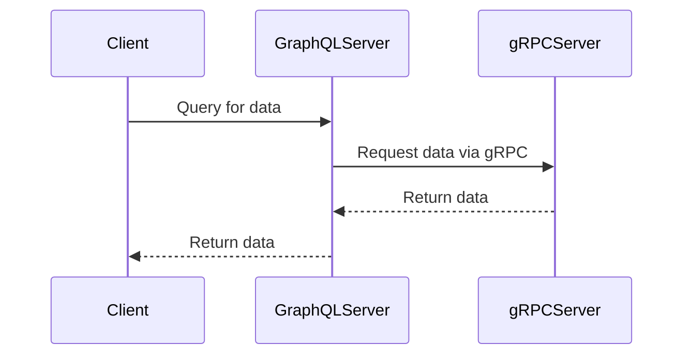

## 17.7 GraphQL and gRPC Integration

In the ever-evolving landscape of web development, efficient data querying and high-performance communication are paramount. Two technologies that have gained significant traction in this domain are GraphQL and gRPC. This section explores how these technologies can be integrated into JavaScript applications to enhance data handling and communication efficiency.

### Understanding GraphQL

GraphQL is a query language for APIs and a runtime for executing those queries by using a type system you define for your data. It was developed by Facebook in 2012 and released as an open-source project in 2015. Unlike REST, which exposes multiple endpoints for different resources, GraphQL exposes a single endpoint that allows clients to request exactly the data they need.

#### Advantages of GraphQL

- **Flexible Queries**: Clients can request specific data, reducing over-fetching and under-fetching.
- **Single Endpoint**: Simplifies API architecture by consolidating multiple endpoints into one.
- **Strongly Typed Schema**: Ensures data consistency and provides clear API documentation.
- **Real-Time Data**: Supports subscriptions for real-time data updates.

### Consuming GraphQL APIs in JavaScript

JavaScript clients can consume GraphQL APIs using libraries like Apollo Client and Relay. These libraries provide tools to manage data fetching, caching, and state management.

#### Using Apollo Client

Apollo Client is a comprehensive state management library for JavaScript that enables you to manage both local and remote data with GraphQL. It integrates seamlessly with React, Angular, Vue, and other JavaScript frameworks.

```javascript
import { ApolloClient, InMemoryCache, gql } from '@apollo/client';

// Initialize Apollo Client
const client = new ApolloClient({
  uri: 'https://example.com/graphql',
  cache: new InMemoryCache()
});

// Querying data
client.query({
  query: gql`
    query GetBooks {
      books {
        title
        author
      }
    }
  `
}).then(response => console.log(response.data));
```

In this example, we initialize an Apollo Client with a GraphQL endpoint and an in-memory cache. We then perform a query to fetch a list of books, demonstrating the simplicity and power of GraphQL queries.

#### Using Relay

Relay is another powerful library for building data-driven React applications with GraphQL. It emphasizes performance and scalability.

```javascript
import React from 'react';
import { QueryRenderer, graphql } from 'react-relay';
import environment from './environment';

const BookList = () => (
  <QueryRenderer
    environment={environment}
    query={graphql`
      query BookListQuery {
        books {
          title
          author
        }
      }
    `}
    render={({ error, props }) => {
      if (error) {
        return <div>Error: {error.message}</div>;
      }
      if (!props) {
        return <div>Loading...</div>;
      }
      return (
        <ul>
          {props.books.map(book => (
            <li key={book.title}>{book.title} by {book.author}</li>
          ))}
        </ul>
      );
    }}
  />
);

export default BookList;
```

Relay's QueryRenderer component is used to fetch data from a GraphQL server and render it in a React component. This approach ensures that data fetching is efficient and components are re-rendered only when necessary.

### Introduction to gRPC

gRPC is a high-performance, open-source universal RPC (Remote Procedure Call) framework initially developed by Google. It uses HTTP/2 for transport, Protocol Buffers as the interface description language, and provides features such as authentication, load balancing, and more.

#### Key Features of gRPC

- **Efficient Serialization**: Uses Protocol Buffers, a language-neutral, platform-neutral extensible mechanism for serializing structured data.
- **Bi-directional Streaming**: Supports streaming requests and responses.
- **Strongly Typed Contracts**: Ensures data consistency and integrity.
- **Cross-Language Support**: Allows services to be written in different languages.

### Integrating gRPC in Node.js Applications

To integrate gRPC in Node.js applications, we use the `grpc-node` library. This library provides the necessary tools to define services and handle requests.

#### Setting Up gRPC with Protocol Buffers

First, define your service and messages in a `.proto` file:

```protobuf
syntax = "proto3";

service BookService {
  rpc GetBooks (BookRequest) returns (BookResponse);
}

message BookRequest {
  string author = 1;
}

message BookResponse {
  repeated Book books = 1;
}

message Book {
  string title = 1;
  string author = 2;
}
```

Next, generate the gRPC code using the Protocol Buffers compiler (`protoc`):

```bash
protoc --js_out=import_style=commonjs,binary:. --grpc_out=. --plugin=protoc-gen-grpc=`which grpc_tools_node_protoc_plugin` book.proto
```

#### Implementing a gRPC Server in Node.js

```javascript
const grpc = require('@grpc/grpc-js');
const protoLoader = require('@grpc/proto-loader');
const packageDefinition = protoLoader.loadSync('book.proto', {});
const bookProto = grpc.loadPackageDefinition(packageDefinition).BookService;

const books = [
  { title: 'The Great Gatsby', author: 'F. Scott Fitzgerald' },
  { title: '1984', author: 'George Orwell' }
];

function getBooks(call, callback) {
  const author = call.request.author;
  const filteredBooks = books.filter(book => book.author === author);
  callback(null, { books: filteredBooks });
}

const server = new grpc.Server();
server.addService(bookProto.service, { getBooks: getBooks });
server.bindAsync('127.0.0.1:50051', grpc.ServerCredentials.createInsecure(), () => {
  server.start();
});
```

This code sets up a gRPC server that listens for requests on port 50051. The `getBooks` function filters books by author and returns the result.

#### Implementing a gRPC Client in Node.js

```javascript
const grpc = require('@grpc/grpc-js');
const protoLoader = require('@grpc/proto-loader');
const packageDefinition = protoLoader.loadSync('book.proto', {});
const bookProto = grpc.loadPackageDefinition(packageDefinition).BookService;

const client = new bookProto('localhost:50051', grpc.credentials.createInsecure());

client.getBooks({ author: 'George Orwell' }, (error, response) => {
  if (!error) {
    console.log('Books:', response.books);
  } else {
    console.error(error);
  }
});
```

The client connects to the gRPC server and requests books by a specific author, demonstrating the simplicity and efficiency of gRPC communication.

### Use Cases and Benefits of gRPC

gRPC is particularly beneficial in scenarios requiring high-performance communication and strongly-typed contracts. Some use cases include:

- **Microservices Communication**: gRPC's efficient serialization and streaming capabilities make it ideal for microservices architectures.
- **Real-Time Applications**: Supports bi-directional streaming, making it suitable for real-time data exchange.
- **Cross-Language Services**: Enables seamless communication between services written in different languages.

### Considerations for Schema Definitions and Contract Management

When integrating GraphQL and gRPC, careful consideration must be given to schema definitions and contract management:

- **Versioning**: Both GraphQL and gRPC support schema evolution, but it's crucial to manage versions to ensure backward compatibility.
- **Documentation**: Maintain clear and up-to-date documentation for both GraphQL schemas and gRPC `.proto` files.
- **Testing**: Implement comprehensive testing strategies to validate schema changes and ensure consistent behavior across services.

### Visualizing GraphQL and gRPC Integration

To better understand the integration of GraphQL and gRPC, let's visualize the architecture using a sequence diagram.



This diagram illustrates how a client queries a GraphQL server, which in turn communicates with a gRPC server to fetch the required data.

### Try It Yourself

To deepen your understanding, try modifying the code examples:

- **Experiment with Different Queries**: Modify the GraphQL queries to fetch different data fields.
- **Add New RPC Methods**: Extend the gRPC service with additional methods and test them.
- **Integrate with a Front-End Framework**: Use Apollo Client or Relay to build a simple front-end application that consumes the GraphQL API.

### Knowledge Check

To reinforce your understanding, consider these questions:

- How does GraphQL differ from REST in terms of data fetching?
- What are the advantages of using gRPC over traditional REST APIs?
- How can you manage schema versions in GraphQL and gRPC?

### Summary

Integrating GraphQL and gRPC in JavaScript applications offers a powerful combination of flexible data querying and high-performance communication. By leveraging these technologies, developers can build scalable, efficient, and robust applications.

Remember, this is just the beginning. As you progress, you'll build more complex and interactive applications. Keep experimenting, stay curious, and enjoy the journey!

## Quiz: Mastering GraphQL and gRPC Integration



### What is a key advantage of GraphQL over REST?

- [x] Flexible queries allow clients to request specific data.
- [ ] It uses HTTP/1.1 for transport.
- [ ] It requires multiple endpoints for different resources.
- [ ] It does not support real-time data.

> **Explanation:** GraphQL allows clients to request exactly the data they need, reducing over-fetching and under-fetching.

### Which library is commonly used to consume GraphQL APIs in JavaScript?

- [x] Apollo Client
- [ ] Express
- [ ] Axios
- [ ] Lodash

> **Explanation:** Apollo Client is a popular library for consuming GraphQL APIs in JavaScript applications.

### What serialization format does gRPC use?

- [x] Protocol Buffers
- [ ] JSON
- [ ] XML
- [ ] YAML

> **Explanation:** gRPC uses Protocol Buffers for efficient serialization of structured data.

### What is a benefit of using gRPC over REST APIs?

- [x] Supports bi-directional streaming.
- [ ] Requires more bandwidth.
- [ ] Uses HTTP/1.1 for transport.
- [ ] Does not support cross-language communication.

> **Explanation:** gRPC supports bi-directional streaming, making it suitable for real-time applications.

### How can you manage schema versions in GraphQL and gRPC?

- [x] Implement versioning strategies and maintain documentation.
- [ ] Avoid making any changes to the schema.
- [ ] Use only one version of the schema.
- [ ] Ignore backward compatibility.

> **Explanation:** Managing schema versions and maintaining documentation ensures backward compatibility and consistent behavior.

### Which of the following is a feature of Relay?

- [x] Emphasizes performance and scalability.
- [ ] Uses REST for data fetching.
- [ ] Does not support React.
- [ ] Requires multiple endpoints.

> **Explanation:** Relay is designed for performance and scalability in data-driven React applications.

### What is the role of the `QueryRenderer` component in Relay?

- [x] Fetches data from a GraphQL server and renders it in a React component.
- [ ] Handles routing in a React application.
- [ ] Manages state in a Redux store.
- [ ] Provides styling for React components.

> **Explanation:** The `QueryRenderer` component in Relay is responsible for fetching data from a GraphQL server and rendering it in a React component.

### What transport protocol does gRPC use?

- [x] HTTP/2
- [ ] HTTP/1.1
- [ ] FTP
- [ ] WebSocket

> **Explanation:** gRPC uses HTTP/2 for transport, providing features like multiplexing and flow control.

### Which of the following is a use case for gRPC?

- [x] Microservices communication
- [ ] Static website hosting
- [ ] Client-side rendering
- [ ] CSS styling

> **Explanation:** gRPC is well-suited for microservices communication due to its efficient serialization and streaming capabilities.

### True or False: GraphQL supports subscriptions for real-time data updates.

- [x] True
- [ ] False

> **Explanation:** GraphQL supports subscriptions, allowing clients to receive real-time data updates.


