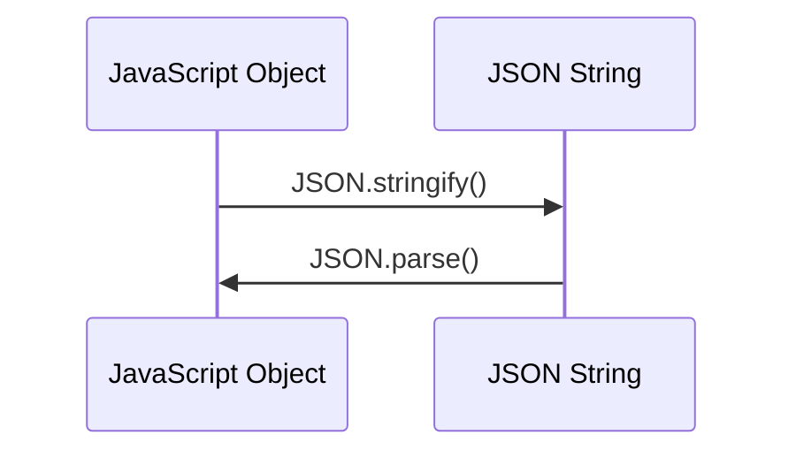

## 17.8 JSON, XML, and Data Serialization

In the world of web development, data serialization is a crucial process that allows us to convert complex data structures into a format that can be easily stored, transmitted, and reconstructed. This section will delve into the most common data serialization formats used in JavaScript: JSON and XML. We will also touch upon other formats like YAML and CSV, and discuss best practices for data exchange between different systems.

### Understanding Data Serialization

Data serialization is the process of converting data structures or object states into a format that can be stored or transmitted and later reconstructed. This is essential for data exchange between different systems, especially in web applications where data needs to be sent over the network.

#### Importance of Data Serialization Formats

- **Interoperability**: Serialization formats like JSON and XML are widely supported across different programming languages and platforms, making them ideal for data exchange.
- **Efficiency**: Serialized data can be easily compressed and transmitted over networks, reducing bandwidth usage.
- **Persistence**: Serialized data can be stored in files or databases for later retrieval and use.

### JSON: JavaScript Object Notation

JSON (JavaScript Object Notation) is a lightweight data interchange format that is easy for humans to read and write, and easy for machines to parse and generate. It is based on a subset of JavaScript and is widely used for data exchange in web applications.

#### Parsing and Stringifying JSON

JavaScript provides built-in methods for working with JSON: `JSON.parse()` and `JSON.stringify()`.

- **`JSON.parse()`**: Converts a JSON string into a JavaScript object.
- **`JSON.stringify()`**: Converts a JavaScript object into a JSON string.

```javascript
// Example of JSON parsing and stringifying
const jsonString = '{"name": "Alice", "age": 30}';
const jsonObject = JSON.parse(jsonString); // Parsing JSON string to object
console.log(jsonObject.name); // Output: Alice

const newJsonString = JSON.stringify(jsonObject); // Stringifying object to JSON string
console.log(newJsonString); // Output: {"name":"Alice","age":30}
```

#### Handling JSON Data

JSON is ideal for representing structured data, such as objects and arrays. It supports basic data types like strings, numbers, booleans, arrays, and objects. However, it does not support functions, dates, or undefined values directly.

- **Data Validation**: Ensure that the JSON data conforms to the expected structure and types. Libraries like [Ajv](https://github.com/ajv-validator/ajv) can be used for JSON schema validation.
- **Data Transformation**: Transform JSON data to fit the application's requirements. This can involve renaming keys, changing data types, or filtering out unnecessary data.

### XML: Extensible Markup Language

XML (Extensible Markup Language) is a markup language that defines a set of rules for encoding documents in a format that is both human-readable and machine-readable. XML is more verbose than JSON but offers greater flexibility in defining complex data structures.

#### Working with XML in JavaScript

JavaScript does not have built-in support for XML parsing and serialization, but libraries like [xml2js](https://github.com/Leonidas-from-XIV/node-xml2js) can be used to handle XML data.

```javascript
// Example of parsing XML using xml2js
const xml2js = require('xml2js');
const xml = '<person><name>Alice</name><age>30</age></person>';

xml2js.parseString(xml, (err, result) => {
  if (err) {
    console.error('Error parsing XML:', err);
  } else {
    console.log('Parsed XML:', result);
    // Output: { person: { name: [ 'Alice' ], age: [ '30' ] } }
  }
});
```

#### XML Data Handling

- **Data Validation**: XML data can be validated against a schema (XSD) to ensure it meets the required structure and constraints.
- **Data Transformation**: Use XSLT (Extensible Stylesheet Language Transformations) to transform XML data into different formats or structures.

### Other Serialization Formats

#### YAML: YAML Ain't Markup Language

YAML is a human-readable data serialization format that is often used for configuration files. It is more readable than JSON and XML but less commonly used for data exchange in web applications.

#### CSV: Comma-Separated Values

CSV is a simple format for representing tabular data. It is widely used for data import/export in spreadsheets and databases. JavaScript libraries like [PapaParse](https://www.papaparse.com/) can be used to parse and generate CSV data.

### Considerations for Data Exchange

When exchanging data between different systems, consider the following:

- **Compatibility**: Ensure that both systems support the chosen serialization format.
- **Data Integrity**: Validate and sanitize data to prevent injection attacks or data corruption.
- **Performance**: Consider the size and complexity of the data when choosing a serialization format. JSON is typically faster and more efficient than XML for most web applications.
- **Security**: Protect sensitive data during serialization and transmission. Use encryption and secure communication protocols like HTTPS.

### Visualizing Data Serialization

To better understand how data serialization works, let's visualize the process of converting a JavaScript object to JSON and back.



**Figure 1**: This sequence diagram illustrates the conversion of a JavaScript object to a JSON string using `JSON.stringify()`, and the conversion back to a JavaScript object using `JSON.parse()`.

### Try It Yourself

Experiment with the following code examples to deepen your understanding of JSON and XML serialization:

1. Modify the JSON object to include nested objects and arrays. Observe how `JSON.stringify()` and `JSON.parse()` handle these structures.
2. Use the `xml2js` library to parse a more complex XML document with nested elements and attributes. Try transforming the parsed object into a different structure.

### Knowledge Check

- What are the main differences between JSON and XML?
- How can you validate JSON data in JavaScript?
- What are some considerations when choosing a data serialization format for a web application?

### Summary

In this section, we've explored the importance of data serialization formats like JSON and XML in JavaScript. We've learned how to parse and serialize data using built-in methods and libraries, and discussed best practices for data exchange between systems. Remember, choosing the right serialization format depends on the specific requirements of your application, including compatibility, performance, and security.

## Quiz: Mastering JSON, XML, and Data Serialization in JavaScript



### What is the primary purpose of data serialization?

- [x] To convert data structures into a format that can be easily stored and transmitted
- [ ] To compress data for storage
- [ ] To encrypt data for security
- [ ] To format data for display

> **Explanation:** Data serialization is primarily used to convert data structures into a format that can be easily stored and transmitted.

### Which method is used to convert a JavaScript object into a JSON string?

- [ ] JSON.parse()
- [x] JSON.stringify()
- [ ] JSON.convert()
- [ ] JSON.encode()

> **Explanation:** `JSON.stringify()` is used to convert a JavaScript object into a JSON string.

### What library can be used to parse XML in JavaScript?

- [ ] JSON.parse()
- [ ] YAML.js
- [x] xml2js
- [ ] CSV.js

> **Explanation:** The `xml2js` library can be used to parse XML in JavaScript.

### Which of the following is NOT a data serialization format?

- [ ] JSON
- [ ] XML
- [ ] YAML
- [x] HTML

> **Explanation:** HTML is a markup language, not a data serialization format.

### What is a common use case for CSV files?

- [ ] Data encryption
- [ ] Web page styling
- [x] Representing tabular data
- [ ] Image processing

> **Explanation:** CSV files are commonly used to represent tabular data.

### How can JSON data be validated in JavaScript?

- [ ] Using JSON.stringify()
- [ ] Using JSON.parse()
- [x] Using a library like Ajv
- [ ] Using XML schema

> **Explanation:** JSON data can be validated using a library like Ajv.

### What is a key advantage of JSON over XML?

- [x] JSON is less verbose and easier to read
- [ ] JSON supports more data types
- [ ] JSON is more secure
- [ ] JSON is faster to parse

> **Explanation:** JSON is less verbose and easier to read compared to XML.

### Which format is typically used for configuration files due to its readability?

- [ ] JSON
- [ ] XML
- [x] YAML
- [ ] CSV

> **Explanation:** YAML is often used for configuration files due to its readability.

### What should be considered when exchanging data between systems?

- [x] Compatibility, data integrity, performance, and security
- [ ] Only performance
- [ ] Only security
- [ ] Only compatibility

> **Explanation:** When exchanging data between systems, consider compatibility, data integrity, performance, and security.

### JSON is a subset of which programming language?

- [x] JavaScript
- [ ] Python
- [ ] XML
- [ ] HTML

> **Explanation:** JSON is a subset of JavaScript.



Remember, this is just the beginning. As you progress, you'll build more complex and interactive web applications. Keep experimenting, stay curious, and enjoy the journey!
