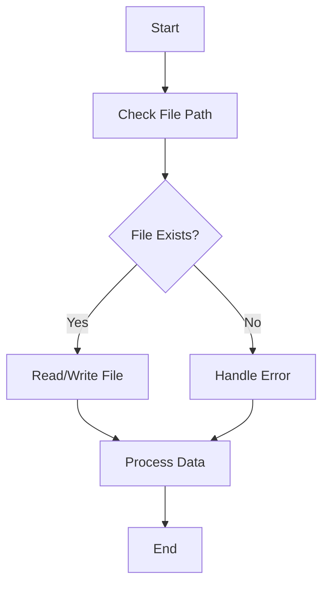

## 17.9 Working with File Systems

In modern web development, especially when working with server-side JavaScript using Node.js, interacting with the file system is a common task. Whether you're reading configuration files, writing logs, or managing user-uploaded files, understanding how to efficiently and securely work with the file system is crucial. In this section, we'll explore the `fs` module in Node.js, which provides a rich API for file system operations. We'll cover reading and writing files both synchronously and asynchronously, handling binary data and streams, and best practices for error handling and security. Additionally, we'll discuss working with paths using the `path` module.

### Introduction to the `fs` Module

The `fs` module in Node.js is a built-in module that provides an API for interacting with the file system. It allows you to perform operations such as reading, writing, updating, and deleting files and directories. The module supports both synchronous and asynchronous methods, giving you the flexibility to choose the approach that best fits your application's needs.

To use the `fs` module, you need to require it in your Node.js application:

```javascript
const fs = require('fs');
```

### Reading Files

#### Asynchronous File Reading

Asynchronous file reading is preferred in most cases because it doesn't block the event loop, allowing other operations to continue while the file is being read. The `fs.readFile()` method is used for this purpose.

```javascript
fs.readFile('example.txt', 'utf8', (err, data) => {
  if (err) {
    console.error('Error reading file:', err);
    return;
  }
  console.log('File content:', data);
});
```

- **Parameters**:
  - `path`: The path to the file.
  - `encoding`: The character encoding to use (optional).
  - `callback`: A function that is called when the operation completes. It receives two arguments: an error object and the file data.

#### Synchronous File Reading

Synchronous file reading is simpler but blocks the event loop, which can degrade performance in a high-concurrency environment. Use `fs.readFileSync()` for synchronous operations.

```javascript
try {
  const data = fs.readFileSync('example.txt', 'utf8');
  console.log('File content:', data);
} catch (err) {
  console.error('Error reading file:', err);
}
```

### Writing Files

#### Asynchronous File Writing

The `fs.writeFile()` method allows you to write data to a file asynchronously.

```javascript
const content = 'Hello, World!';

fs.writeFile('example.txt', content, 'utf8', (err) => {
  if (err) {
    console.error('Error writing file:', err);
    return;
  }
  console.log('File written successfully');
});
```

- **Parameters**:
  - `path`: The path to the file.
  - `data`: The data to write.
  - `encoding`: The character encoding to use (optional).
  - `callback`: A function that is called when the operation completes.

#### Synchronous File Writing

For synchronous file writing, use `fs.writeFileSync()`.

```javascript
const content = 'Hello, World!';

try {
  fs.writeFileSync('example.txt', content, 'utf8');
  console.log('File written successfully');
} catch (err) {
  console.error('Error writing file:', err);
}
```

### Handling Binary Data and Streams

Node.js provides powerful capabilities for handling binary data and streams, which are essential for working with large files or real-time data.

#### Reading and Writing Streams

Streams are a more efficient way to handle I/O operations, especially for large files. They allow you to process data piece by piece, without keeping it all in memory.

**Reading a File Stream**:

```javascript
const readStream = fs.createReadStream('largefile.txt', 'utf8');

readStream.on('data', (chunk) => {
  console.log('Received chunk:', chunk);
});

readStream.on('end', () => {
  console.log('Finished reading file');
});

readStream.on('error', (err) => {
  console.error('Error reading file:', err);
});
```

**Writing to a File Stream**:

```javascript
const writeStream = fs.createWriteStream('output.txt');

writeStream.write('Hello, ');
writeStream.write('World!');
writeStream.end();

writeStream.on('finish', () => {
  console.log('Finished writing to file');
});

writeStream.on('error', (err) => {
  console.error('Error writing to file:', err);
});
```

### Best Practices for Error Handling and Security

When working with the file system, it's important to handle errors gracefully and ensure that your application is secure.

#### Error Handling

- Always check for errors in callbacks and handle them appropriately.
- Use try-catch blocks for synchronous operations to catch exceptions.
- Validate file paths and user inputs to prevent directory traversal attacks.

#### Security Considerations

- Avoid using user input directly in file paths.
- Use the `path` module to safely construct file paths.
- Set appropriate file permissions to restrict access.

### Working with Paths Using the `path` Module

The `path` module provides utilities for working with file and directory paths. It helps you construct paths in a cross-platform way, avoiding issues with different path separators.

```javascript
const path = require('path');

const directory = '/home/user';
const fileName = 'example.txt';

// Join directory and file name to create a full path
const fullPath = path.join(directory, fileName);
console.log('Full path:', fullPath);

// Get the directory name from a path
const dirName = path.dirname(fullPath);
console.log('Directory name:', dirName);

// Get the base name (file name) from a path
const baseName = path.basename(fullPath);
console.log('Base name:', baseName);

// Get the file extension
const extName = path.extname(fullPath);
console.log('Extension name:', extName);
```

### Try It Yourself

Experiment with the code examples provided above. Try modifying the file paths, changing the content being written, or handling different types of errors. This hands-on approach will help solidify your understanding of file system operations in Node.js.

### Visualizing File System Operations

To better understand how file system operations work in Node.js, let's visualize the process of reading and writing files using a flowchart.



**Figure 1**: Flowchart of File System Operations in Node.js

### References and Links

- [Node.js `fs` Module Documentation](https://nodejs.org/api/fs.html)
- [Node.js `path` Module Documentation](https://nodejs.org/api/path.html)
- [MDN Web Docs: File System](https://developer.mozilla.org/en-US/docs/Web/API/File_System_Access_API)

### Knowledge Check

- What are the differences between synchronous and asynchronous file operations in Node.js?
- How can you handle errors when reading or writing files?
- Why is it important to validate file paths and user inputs?
- How do streams improve performance when working with large files?

### Summary

In this section, we've explored how to work with file systems in Node.js using the `fs` module. We've covered reading and writing files both synchronously and asynchronously, handling binary data and streams, and best practices for error handling and security. Additionally, we've discussed working with paths using the `path` module. Remember, mastering these concepts is crucial for building robust and efficient Node.js applications. Keep experimenting, stay curious, and enjoy the journey!

## Quiz: Mastering File System Operations in Node.js



### What is the primary advantage of using asynchronous file operations in Node.js?

- [x] They do not block the event loop, allowing other operations to continue.
- [ ] They are easier to implement than synchronous operations.
- [ ] They provide better error handling capabilities.
- [ ] They automatically handle file permissions.

> **Explanation:** Asynchronous file operations do not block the event loop, which allows other operations to continue executing, improving the performance of Node.js applications.

### Which method is used to read a file synchronously in Node.js?

- [ ] fs.readFile()
- [x] fs.readFileSync()
- [ ] fs.read()
- [ ] fs.openSync()

> **Explanation:** The `fs.readFileSync()` method is used for synchronous file reading in Node.js.

### How can you handle errors when writing to a file asynchronously?

- [ ] Ignore the error and continue execution.
- [x] Use a callback function to check for errors.
- [ ] Use a try-catch block.
- [ ] Errors cannot be handled in asynchronous operations.

> **Explanation:** In asynchronous operations, errors are handled using a callback function that receives an error object as its first argument.

### What is the purpose of the `path` module in Node.js?

- [ ] To read and write files.
- [ ] To manage file permissions.
- [x] To work with file and directory paths.
- [ ] To handle binary data.

> **Explanation:** The `path` module provides utilities for working with file and directory paths in a cross-platform way.

### Which of the following is a best practice for file system security?

- [x] Validate file paths and user inputs.
- [ ] Use user input directly in file paths.
- [ ] Set file permissions to 777.
- [ ] Store sensitive data in plain text files.

> **Explanation:** Validating file paths and user inputs helps prevent directory traversal attacks and other security vulnerabilities.

### What is a stream in Node.js?

- [ ] A method for reading files synchronously.
- [x] A way to process data piece by piece without keeping it all in memory.
- [ ] A method for writing files synchronously.
- [ ] A type of error handling mechanism.

> **Explanation:** Streams allow you to process data piece by piece, which is efficient for handling large files or real-time data.

### How do you create a full file path using the `path` module?

- [ ] Use the `fs.join()` method.
- [x] Use the `path.join()` method.
- [ ] Use the `path.concat()` method.
- [ ] Use the `fs.concat()` method.

> **Explanation:** The `path.join()` method is used to create a full file path by joining directory and file name components.

### What is the result of calling `path.basename('/home/user/example.txt')`?

- [ ] '/home/user'
- [x] 'example.txt'
- [ ] '.txt'
- [ ] '/home'

> **Explanation:** The `path.basename()` method returns the last portion of a path, which is the file name in this case.

### True or False: Synchronous file operations block the event loop in Node.js.

- [x] True
- [ ] False

> **Explanation:** Synchronous file operations block the event loop, which can degrade performance in a high-concurrency environment.

### Which method is used to write data to a file asynchronously in Node.js?

- [ ] fs.writeFileSync()
- [x] fs.writeFile()
- [ ] fs.appendFileSync()
- [ ] fs.createWriteStream()

> **Explanation:** The `fs.writeFile()` method is used to write data to a file asynchronously in Node.js.


