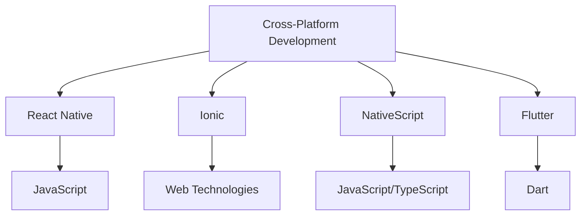

## 18.1 Overview of Mobile Frameworks (React Native, Ionic)

In the rapidly evolving world of mobile development, creating applications that run seamlessly on both iOS and Android platforms is a significant challenge. Cross-platform mobile development frameworks have emerged as a solution, allowing developers to write code once and deploy it across multiple platforms. This section explores two of the most popular frameworks: React Native and Ionic. We will delve into their features, benefits, and how they compare to native development approaches.

### The Need for Cross-Platform Mobile Development

Cross-platform mobile development addresses the need to build applications that can operate on multiple operating systems with a single codebase. This approach offers several advantages:

- **Cost Efficiency**: By reusing code across platforms, development costs are significantly reduced.
- **Faster Time to Market**: With a single codebase, updates and new features can be rolled out simultaneously across platforms.
- **Consistent User Experience**: Ensures a uniform look and feel across different devices.

### Introduction to React Native

[React Native](https://reactnative.dev/) is a popular open-source framework developed by Facebook. It allows developers to build mobile applications using JavaScript and React, a JavaScript library for building user interfaces.

#### Key Features of React Native

- **Native Components**: React Native uses native components, providing a more authentic look and feel compared to web-based solutions.
- **Hot Reloading**: This feature allows developers to see changes in real-time without recompiling the entire application.
- **Strong Community Support**: With a large community, developers have access to numerous libraries and tools.

#### Sample Code: React Native Component

```javascript
import React from 'react';
import { Text, View } from 'react-native';

const HelloWorldApp = () => {
  return (
    <View style={{ flex: 1, justifyContent: 'center', alignItems: 'center' }}>
      <Text>Hello, World!</Text>
    </View>
  );
};

export default HelloWorldApp;
```

> **Explanation**: This simple React Native component displays "Hello, World!" centered on the screen. The `View` and `Text` components are part of React Native's core library, providing a native look and feel.

### Introduction to Ionic

[Ionic](https://ionicframework.com/) is another powerful framework for building cross-platform mobile applications. It uses web technologies such as HTML, CSS, and JavaScript, and is built on top of Angular, a popular web application framework.

#### Key Features of Ionic

- **Web Technologies**: Leverages familiar web technologies, making it accessible to web developers.
- **Rich UI Components**: Offers a wide range of pre-designed UI components that are customizable and adaptive.
- **Integration with Capacitor**: Allows access to native device features through plugins.

#### Sample Code: Ionic Component

```typescript
import { Component } from '@angular/core';

@Component({
  selector: 'app-home',
  template: `<ion-header>
               <ion-toolbar>
                 <ion-title>
                   Home
                 </ion-title>
               </ion-toolbar>
             </ion-header>
             <ion-content>
               <ion-button expand="full">Hello, World!</ion-button>
             </ion-content>`
})
export class HomePage {}
```

> **Explanation**: This Ionic component uses Angular to create a simple page with a button. The `ion-header`, `ion-toolbar`, and `ion-button` are part of Ionic's UI library.

### Comparing Native Development with Cross-Platform Approaches

#### Native Development

- **Performance**: Native applications are optimized for specific platforms, offering superior performance.
- **Access to Native APIs**: Full access to all device features and APIs.
- **Platform-Specific UI**: Allows for a more tailored user experience.

#### Cross-Platform Development

- **Code Reusability**: Write once, run anywhere.
- **Development Speed**: Faster development cycles due to shared codebase.
- **Cost-Effective**: Reduced development and maintenance costs.

### Benefits of Using React Native and Ionic

#### React Native

- **Performance**: Offers near-native performance by using native components.
- **Large Ecosystem**: Extensive libraries and third-party plugins.
- **Strong Community**: Active community support and regular updates.

#### Ionic

- **Familiarity**: Uses web technologies that many developers are already familiar with.
- **Flexibility**: Can be used with different front-end frameworks like Angular, React, or Vue.
- **Rich UI Components**: Provides a comprehensive set of UI components.

### Other Frameworks to Consider

While React Native and Ionic are popular choices, other frameworks like [NativeScript](https://nativescript.org/) and [Flutter](https://flutter.dev/) also offer robust solutions for cross-platform development.

- **NativeScript**: Allows building native apps using JavaScript or TypeScript, with direct access to native APIs.
- **Flutter**: Developed by Google, uses the Dart programming language and offers a rich set of pre-designed widgets.

### Visualizing Cross-Platform Development



> **Diagram Explanation**: This diagram illustrates the relationship between cross-platform development and various frameworks, highlighting the technologies each framework uses.

### Knowledge Check

- **What are the main benefits of cross-platform mobile development?**
- **How does React Native achieve near-native performance?**
- **What are the key differences between React Native and Ionic?**

### Exercises

1. **Create a simple React Native app** that displays a list of items using the `FlatList` component.
2. **Build an Ionic app** that uses a form to collect user input and displays it on the screen.

### Summary

Cross-platform mobile development frameworks like React Native and Ionic offer powerful tools for building applications that run on both iOS and Android platforms. By leveraging JavaScript and web technologies, these frameworks provide a cost-effective and efficient way to develop mobile applications. As you explore these frameworks, remember to experiment with different features and components to fully understand their capabilities.

### Embrace the Journey

Remember, this is just the beginning. As you progress, you'll build more complex and interactive mobile applications. Keep experimenting, stay curious, and enjoy the journey!

## Mastering Mobile Frameworks: React Native and Ionic



### What is a primary benefit of cross-platform mobile development?

- [x] Cost Efficiency
- [ ] Platform-Specific UI
- [ ] Limited Device Access
- [ ] Slower Development Cycles

> **Explanation:** Cross-platform development allows code reuse across platforms, reducing development costs.

### Which framework uses native components for a more authentic look and feel?

- [x] React Native
- [ ] Ionic
- [ ] NativeScript
- [ ] Flutter

> **Explanation:** React Native uses native components, providing a near-native experience.

### What technology does Ionic primarily leverage?

- [ ] Dart
- [ ] Java
- [x] Web Technologies
- [ ] Swift

> **Explanation:** Ionic uses web technologies like HTML, CSS, and JavaScript.

### Which feature of React Native allows developers to see changes in real-time?

- [ ] Code Splitting
- [x] Hot Reloading
- [ ] Lazy Loading
- [ ] Cold Reloading

> **Explanation:** Hot Reloading allows developers to see changes without recompiling the entire app.

### Which framework is developed by Google and uses the Dart language?

- [ ] React Native
- [ ] Ionic
- [ ] NativeScript
- [x] Flutter

> **Explanation:** Flutter is developed by Google and uses Dart for building applications.

### What is a key advantage of using Ionic for web developers?

- [ ] Requires learning a new language
- [x] Uses familiar web technologies
- [ ] Limited UI components
- [ ] No community support

> **Explanation:** Ionic leverages familiar web technologies, making it accessible to web developers.

### Which framework provides a comprehensive set of pre-designed widgets?

- [ ] React Native
- [ ] Ionic
- [ ] NativeScript
- [x] Flutter

> **Explanation:** Flutter offers a rich set of pre-designed widgets for building applications.

### What is a common feature of both React Native and Ionic?

- [ ] Use of Dart language
- [x] Cross-platform development
- [ ] Native-only development
- [ ] Lack of community support

> **Explanation:** Both frameworks support cross-platform development, allowing code reuse across platforms.

### Which framework allows direct access to native APIs using JavaScript or TypeScript?

- [ ] React Native
- [ ] Ionic
- [x] NativeScript
- [ ] Flutter

> **Explanation:** NativeScript allows direct access to native APIs using JavaScript or TypeScript.

### True or False: React Native and Ionic are the only frameworks for cross-platform mobile development.

- [ ] True
- [x] False

> **Explanation:** Other frameworks like NativeScript and Flutter also offer cross-platform solutions.


