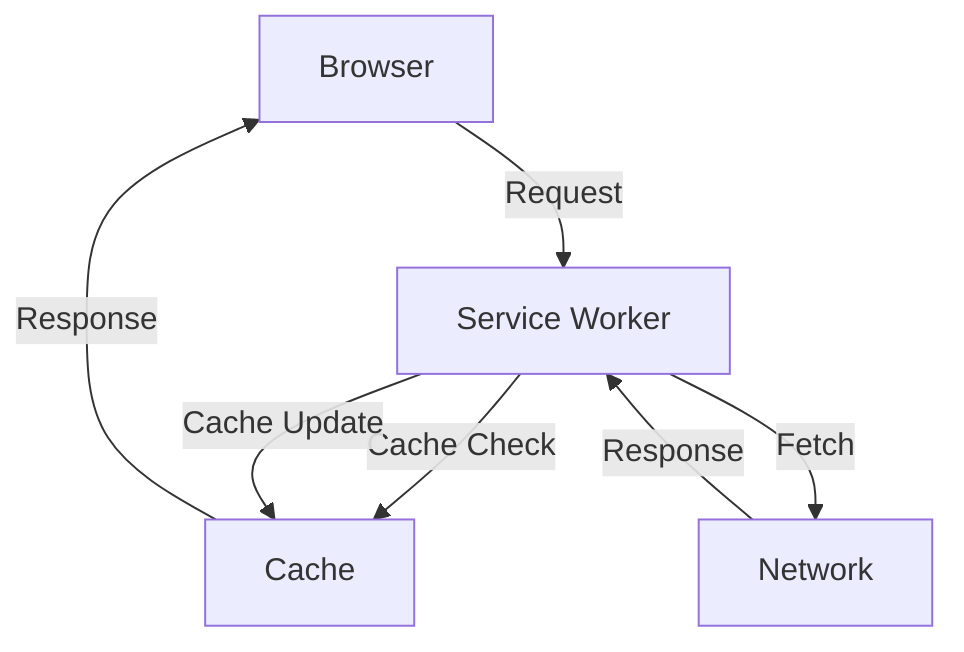

## 18.10 Progressive Web Apps (PWAs) on Mobile

Progressive Web Apps (PWAs) represent a paradigm shift in how we approach mobile application development. By leveraging modern web capabilities, PWAs offer a user experience that rivals native applications, while maintaining the reach and accessibility of the web. In this section, we will explore what PWAs are, their benefits on mobile devices, how to make them installable, and best practices for offline support and performance optimization.

### What Are Progressive Web Apps (PWAs)?

Progressive Web Apps are web applications that use modern web technologies to deliver an app-like experience to users. They are built using standard web technologies such as HTML, CSS, and JavaScript, but they offer enhanced capabilities that were traditionally only available to native apps. Key features of PWAs include:

- **Responsive Design**: PWAs are designed to work on any device, regardless of screen size or orientation.
- **Offline Functionality**: Using service workers, PWAs can cache resources and function offline or in low-network conditions.
- **App-Like Experience**: PWAs can be installed on a user's device and launched from the home screen, providing a full-screen experience without the browser UI.
- **Push Notifications**: PWAs can send push notifications to engage users even when the app is not open.
- **Secure**: PWAs are served over HTTPS to ensure security and privacy.

### Benefits of PWAs on Mobile

PWAs offer several advantages over traditional mobile applications:

1. **Cross-Platform Compatibility**: PWAs work on any platform with a modern browser, eliminating the need to develop separate apps for iOS and Android.
2. **Reduced Development Costs**: By using a single codebase, developers can save time and resources compared to maintaining separate native apps.
3. **Improved User Engagement**: Features like push notifications and offline access help keep users engaged.
4. **Faster Load Times**: With caching and service workers, PWAs can load quickly, even on slow networks.
5. **No App Store Approval**: PWAs can be updated instantly without going through app store approval processes.

### Making PWAs Installable on Mobile Devices

To make a PWA installable, you need to meet certain criteria and implement specific features:

1. **HTTPS**: Ensure your site is served over HTTPS to provide a secure connection.
2. **Web App Manifest**: Create a `manifest.json` file that includes metadata about your app, such as its name, icons, and start URL.
3. **Service Worker**: Implement a service worker to manage caching and offline functionality.

#### Example: Adding PWA Capabilities

Let's walk through the process of adding PWA capabilities to a simple web application.

1. **Create a Web App Manifest**

```json
{
  "name": "My PWA App",
  "short_name": "PWA",
  "start_url": "/index.html",
  "display": "standalone",
  "background_color": "#ffffff",
  "theme_color": "#000000",
  "icons": [
    {
      "src": "/images/icon-192x192.png",
      "sizes": "192x192",
      "type": "image/png"
    },
    {
      "src": "/images/icon-512x512.png",
      "sizes": "512x512",
      "type": "image/png"
    }
  ]
}
```

2. **Register a Service Worker**

Create a `service-worker.js` file and register it in your main JavaScript file.

```javascript
if ('serviceWorker' in navigator) {
  window.addEventListener('load', () => {
    navigator.serviceWorker.register('/service-worker.js')
      .then(registration => {
        console.log('Service Worker registered with scope:', registration.scope);
      })
      .catch(error => {
        console.error('Service Worker registration failed:', error);
      });
  });
}
```

3. **Implement Caching in the Service Worker**

In `service-worker.js`, add caching logic to handle offline functionality.

```javascript
const CACHE_NAME = 'my-pwa-cache-v1';
const urlsToCache = [
  '/',
  '/index.html',
  '/styles.css',
  '/script.js',
  '/images/icon-192x192.png',
  '/images/icon-512x512.png'
];

self.addEventListener('install', event => {
  event.waitUntil(
    caches.open(CACHE_NAME)
      .then(cache => {
        return cache.addAll(urlsToCache);
      })
  );
});

self.addEventListener('fetch', event => {
  event.respondWith(
    caches.match(event.request)
      .then(response => {
        return response || fetch(event.request);
      })
  );
});
```

### Limitations Compared to Native Apps

While PWAs offer many benefits, they also have some limitations compared to native applications:

- **Limited Access to Device Features**: PWAs cannot access all device features, such as Bluetooth or NFC, which are available to native apps.
- **Performance**: Although PWAs are fast, native apps can be more performant for resource-intensive tasks.
- **App Store Presence**: PWAs are not listed in app stores, which can affect discoverability.

### Best Practices for Offline Support and Performance Optimization

1. **Efficient Caching**: Use service workers to cache essential resources and implement cache strategies to manage updates.
2. **Optimize Images and Assets**: Compress images and use responsive images to reduce load times.
3. **Minimize JavaScript and CSS**: Use minification and tree shaking to reduce the size of JavaScript and CSS files.
4. **Lazy Loading**: Load resources only when needed to improve initial load times.
5. **Test Offline Functionality**: Regularly test your PWA in offline mode to ensure it works as expected.

### Visualizing PWA Architecture

Below is a diagram illustrating the architecture of a typical PWA, highlighting the interaction between the browser, service worker, and cache.



**Figure 1**: PWA Architecture showing the interaction between the browser, service worker, cache, and network.

### References and Further Reading

- [MDN Web Docs: Progressive Web Apps](https://developer.mozilla.org/en-US/docs/Web/Progressive_web_apps)
- [Google Developers: Progressive Web Apps](https://developers.google.com/web/progressive-web-apps)
- [W3Schools: Service Workers](https://www.w3schools.com/js/js_service_worker.asp)

### Knowledge Check

- What are the key features of a Progressive Web App?
- How does a service worker enhance offline capabilities?
- What are the limitations of PWAs compared to native apps?
- How can you optimize a PWA for performance?

### Embrace the Journey

Remember, building a PWA is just the beginning of creating a seamless mobile experience. As you continue to explore and implement PWAs, you'll discover new ways to engage users and enhance your applications. Keep experimenting, stay curious, and enjoy the journey!

## Quiz: Understanding Progressive Web Apps (PWAs) on Mobile



### What is a key feature of Progressive Web Apps?

- [x] Offline functionality
- [ ] Access to all device features
- [ ] Requires app store approval
- [ ] Only works on Android devices

> **Explanation:** PWAs are known for their offline functionality, allowing them to work without a network connection.

### How can you make a PWA installable on a mobile device?

- [x] Use a web app manifest
- [ ] Use only HTML and CSS
- [ ] Avoid using service workers
- [ ] Serve over HTTP

> **Explanation:** A web app manifest is essential for making a PWA installable, as it provides metadata about the app.

### What is a limitation of PWAs compared to native apps?

- [x] Limited access to device features
- [ ] Cannot be updated
- [ ] Slower load times
- [ ] Requires multiple codebases

> **Explanation:** PWAs have limited access to certain device features compared to native apps.

### Which technology is used to manage caching in PWAs?

- [x] Service Workers
- [ ] WebSockets
- [ ] Local Storage
- [ ] Cookies

> **Explanation:** Service workers are used to manage caching and offline functionality in PWAs.

### What is a best practice for optimizing PWA performance?

- [x] Minimize JavaScript and CSS
- [ ] Use large images
- [ ] Avoid caching
- [ ] Load all resources at once

> **Explanation:** Minimizing JavaScript and CSS helps reduce load times and improve performance.

### Which of the following is NOT a benefit of PWAs?

- [ ] Cross-platform compatibility
- [x] Access to all device features
- [ ] Reduced development costs
- [ ] Improved user engagement

> **Explanation:** PWAs do not have access to all device features, which is a limitation compared to native apps.

### What file format is used for the web app manifest?

- [x] JSON
- [ ] XML
- [ ] HTML
- [ ] YAML

> **Explanation:** The web app manifest is a JSON file that provides metadata about the PWA.

### What is the role of a service worker in a PWA?

- [x] Manage caching and offline functionality
- [ ] Display the user interface
- [ ] Handle user input
- [ ] Access device hardware

> **Explanation:** Service workers manage caching and offline functionality, enabling PWAs to work without a network connection.

### How can you test the offline functionality of a PWA?

- [x] Use the browser's developer tools to simulate offline mode
- [ ] Disconnect the server
- [ ] Use a different browser
- [ ] Install the app on a different device

> **Explanation:** Browser developer tools can simulate offline mode to test a PWA's offline functionality.

### True or False: PWAs can be listed in app stores.

- [ ] True
- [x] False

> **Explanation:** PWAs are not listed in app stores, which can affect their discoverability.


