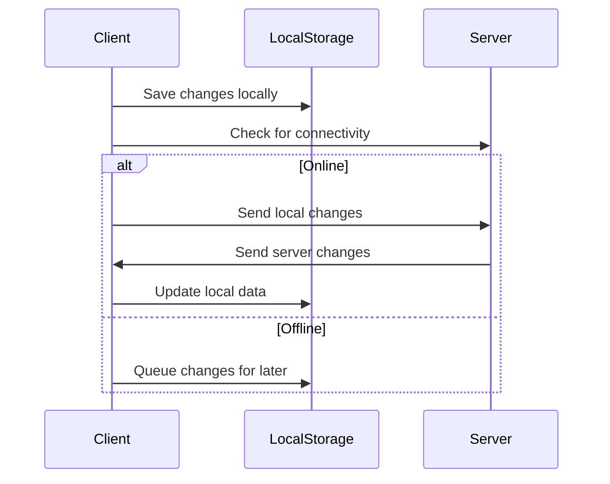

## 18.11 Offline Storage and Data Sync

In the realm of mobile development, ensuring that applications function seamlessly offline is crucial for enhancing user experience and reliability. This section delves into the intricacies of offline storage and data synchronization, focusing on JavaScript-based mobile development frameworks like React Native. We will explore various storage options, synchronization patterns, and best practices to manage data effectively.

### Understanding Offline Storage

Offline storage refers to the capability of a mobile application to store data locally on a device, allowing it to function without an internet connection. This is particularly important for applications that need to provide uninterrupted service regardless of network availability.

#### Key Offline Storage Options

1. **AsyncStorage in React Native**: A simple, unencrypted, asynchronous, persistent, key-value storage system that is global to the app. It is suitable for small amounts of data that need to be persisted across app launches.

2. **SQLite Databases**: A lightweight, disk-based database that doesn’t require a separate server process. SQLite is a popular choice for mobile applications due to its simplicity and efficiency in handling structured data.

3. **Realm**: A mobile database that is designed for simplicity and speed. Realm offers an object-oriented data model, making it easier to work with complex data structures.

### AsyncStorage in React Native

AsyncStorage is a built-in feature of React Native that provides a simple way to store key-value pairs. It is ideal for storing small amounts of data, such as user preferences or settings.

```javascript
import AsyncStorage from '@react-native-async-storage/async-storage';

// Function to save data
const storeData = async (key, value) => {
  try {
    await AsyncStorage.setItem(key, value);
  } catch (error) {
    console.error('Error saving data', error);
  }
};

// Function to retrieve data
const getData = async (key) => {
  try {
    const value = await AsyncStorage.getItem(key);
    if (value !== null) {
      return value;
    }
  } catch (error) {
    console.error('Error retrieving data', error);
  }
};
```

**Try It Yourself**: Modify the above code to store and retrieve a JSON object instead of a simple string.

### SQLite Databases

SQLite is a powerful tool for managing structured data in mobile applications. It provides a robust SQL interface and is well-suited for applications that require complex queries and transactions.

```javascript
import SQLite from 'react-native-sqlite-storage';

// Open a database
const db = SQLite.openDatabase({ name: 'my.db', location: 'default' });

// Create a table
db.transaction(tx => {
  tx.executeSql(
    'CREATE TABLE IF NOT EXISTS Users (id INTEGER PRIMARY KEY AUTOINCREMENT, name TEXT, age INTEGER);'
  );
});

// Insert data
db.transaction(tx => {
  tx.executeSql('INSERT INTO Users (name, age) VALUES (?, ?)', ['Alice', 30]);
});

// Query data
db.transaction(tx => {
  tx.executeSql('SELECT * FROM Users', [], (tx, results) => {
    for (let i = 0; i < results.rows.length; i++) {
      console.log(results.rows.item(i));
    }
  });
});
```

**Try It Yourself**: Extend the SQLite example to include additional tables and relationships, such as a `Posts` table linked to `Users`.

### Realm

Realm offers a modern approach to mobile databases with an object-oriented data model. It is designed to be fast and easy to use, making it a great choice for applications with complex data requirements.

```javascript
import Realm from 'realm';

// Define a schema
const UserSchema = {
  name: 'User',
  properties: {
    name: 'string',
    age: 'int',
  },
};

// Open a Realm
const realm = new Realm({ schema: [UserSchema] });

// Add data
realm.write(() => {
  realm.create('User', { name: 'Bob', age: 25 });
});

// Query data
const users = realm.objects('User');
console.log(users);
```

**Try It Yourself**: Experiment with Realm by adding more complex schemas and performing queries with filters and sorting.

### Data Synchronization Patterns

Data synchronization ensures that data stored locally on a device is consistent with data stored on a remote server. This is crucial for applications that need to operate offline and then sync changes when connectivity is restored.

#### Common Synchronization Patterns

1. **Two-Way Sync**: Changes made on the client are sent to the server, and changes on the server are sent to the client. This pattern requires conflict resolution strategies to handle concurrent updates.

2. **Push-Based Sync**: The client sends changes to the server, but does not receive updates from the server unless explicitly requested.

3. **Pull-Based Sync**: The client periodically requests updates from the server, but does not send changes unless explicitly triggered.

#### Conflict Resolution

Conflict resolution is a critical aspect of data synchronization. It involves determining how to handle conflicting changes made to the same data on different devices or by different users.

- **Last Write Wins**: The most recent change is accepted, potentially overwriting other changes.
- **Merge Changes**: Combine changes from different sources, often requiring custom logic to resolve conflicts.
- **User Intervention**: Prompt the user to resolve conflicts manually.

### Implementing Offline-First Applications

An offline-first application is designed to function primarily offline, with synchronization occurring in the background. This approach enhances user experience by ensuring that the application is always responsive and available.

#### Example: Offline-First To-Do List

Let's build a simple offline-first to-do list application using React Native and Realm.

```javascript
import React, { useState, useEffect } from 'react';
import { View, TextInput, Button, FlatList, Text } from 'react-native';
import Realm from 'realm';

// Define a schema
const TaskSchema = {
  name: 'Task',
  properties: {
    id: 'int',
    description: 'string',
    completed: 'bool',
  },
  primaryKey: 'id',
};

// Open a Realm
const realm = new Realm({ schema: [TaskSchema] });

const App = () => {
  const [tasks, setTasks] = useState([]);
  const [description, setDescription] = useState('');

  useEffect(() => {
    const taskList = realm.objects('Task');
    setTasks([...taskList]);
  }, []);

  const addTask = () => {
    realm.write(() => {
      realm.create('Task', {
        id: Date.now(),
        description,
        completed: false,
      });
    });
    setDescription('');
    setTasks([...realm.objects('Task')]);
  };

  return (
    <View>
      <TextInput
        value={description}
        onChangeText={setDescription}
        placeholder="Enter task description"
      />
      <Button title="Add Task" onPress={addTask} />
      <FlatList
        data={tasks}
        keyExtractor={(item) => item.id.toString()}
        renderItem={({ item }) => (
          <Text>{item.description}</Text>
        )}
      />
    </View>
  );
};

export default App;
```

**Try It Yourself**: Enhance the to-do list app by adding features such as task completion, deletion, and synchronization with a remote server.

### Best Practices for Offline Storage and Data Sync

1. **Handle Storage Limits**: Be mindful of the storage limits imposed by different devices and platforms. Use efficient data structures and compression techniques to minimize storage usage.

2. **Ensure Data Security**: Protect sensitive data by encrypting it before storing it locally. Use secure storage solutions and follow best practices for data protection.

3. **Optimize Synchronization**: Minimize data transfer by only syncing changes rather than the entire dataset. Use background synchronization to avoid interrupting the user experience.

4. **Implement Robust Error Handling**: Anticipate and handle errors that may occur during data storage and synchronization, such as network failures or data corruption.

5. **Test Thoroughly**: Test your application under various network conditions to ensure that it handles offline scenarios gracefully and synchronizes data correctly when connectivity is restored.

### Visualizing Data Synchronization

Below is a sequence diagram illustrating a typical data synchronization process in a mobile application.



**Diagram Explanation**: This diagram shows how a client application interacts with local storage and a server to synchronize data. When online, changes are sent to the server and updates are received. When offline, changes are queued for later synchronization.

### References and Further Reading

- [React Native AsyncStorage](https://react-native-async-storage.github.io/async-storage/)
- [SQLite Documentation](https://www.sqlite.org/docs.html)
- [Realm Documentation](https://realm.io/docs/javascript/latest/)
- [MDN Web Docs on IndexedDB](https://developer.mozilla.org/en-US/docs/Web/API/IndexedDB_API)

### Knowledge Check

## Mastering Offline Storage and Data Sync Quiz



### Which storage option is best for small amounts of key-value data in React Native?

- [x] AsyncStorage
- [ ] SQLite
- [ ] Realm
- [ ] LocalStorage

> **Explanation:** AsyncStorage is designed for small amounts of key-value data in React Native.

### What is a common conflict resolution strategy in data synchronization?

- [x] Last Write Wins
- [ ] First Write Wins
- [ ] Random Selection
- [ ] User Ignored

> **Explanation:** Last Write Wins is a common strategy where the most recent change is accepted.

### Which database is known for its object-oriented data model?

- [ ] SQLite
- [x] Realm
- [ ] MongoDB
- [ ] IndexedDB

> **Explanation:** Realm is known for its object-oriented data model, making it easy to work with complex data structures.

### What is the primary key in the Realm Task schema example?

- [x] id
- [ ] description
- [ ] completed
- [ ] name

> **Explanation:** The primary key in the Realm Task schema example is `id`.

### What should you do to minimize data transfer during synchronization?

- [x] Only sync changes
- [ ] Sync the entire dataset
- [ ] Use larger data packets
- [ ] Ignore synchronization

> **Explanation:** Minimizing data transfer by only syncing changes is more efficient.

### Which of the following is a best practice for handling storage limits?

- [x] Use efficient data structures
- [ ] Store everything in memory
- [ ] Ignore storage limits
- [ ] Use uncompressed data

> **Explanation:** Using efficient data structures helps manage storage limits effectively.

### What is a key benefit of offline-first applications?

- [x] Enhanced user experience
- [ ] Increased data usage
- [ ] Slower performance
- [ ] More frequent errors

> **Explanation:** Offline-first applications enhance user experience by ensuring availability and responsiveness.

### Which pattern involves the client periodically requesting updates from the server?

- [ ] Push-Based Sync
- [x] Pull-Based Sync
- [ ] Two-Way Sync
- [ ] Manual Sync

> **Explanation:** Pull-Based Sync involves the client periodically requesting updates from the server.

### What is a critical aspect of data synchronization?

- [x] Conflict resolution
- [ ] Ignoring conflicts
- [ ] Data duplication
- [ ] Random updates

> **Explanation:** Conflict resolution is critical to ensure data consistency during synchronization.

### True or False: Realm is a server-based database.

- [ ] True
- [x] False

> **Explanation:** Realm is a mobile database designed for local storage on devices, not server-based.



Remember, mastering offline storage and data synchronization is a journey. As you continue to explore and implement these concepts, you'll enhance your ability to build robust, user-friendly mobile applications. Keep experimenting, stay curious, and enjoy the journey!
