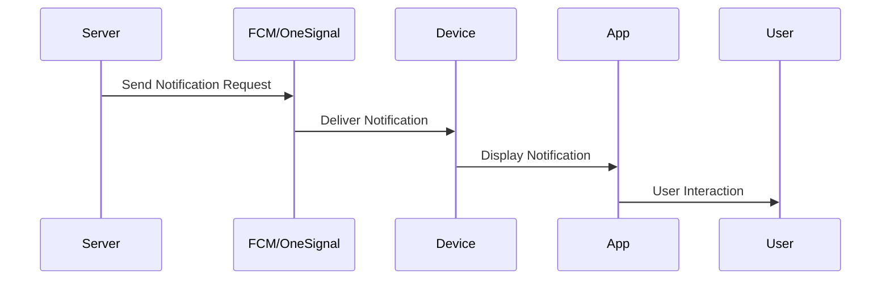

## 18.12 Push Notifications

Push notifications are a powerful tool for engaging users and providing timely updates in mobile applications. They allow apps to communicate with users even when the app is not actively in use, making them an essential feature for modern mobile development. In this section, we will explore how push notifications work on iOS and Android, provide examples of setting up notifications using Firebase Cloud Messaging (FCM) and OneSignal, discuss configuring notification payloads and handling them in the app, and highlight considerations for user permissions and compliance. We will also cover best practices for delivering targeted and non-intrusive notifications.

### Understanding Push Notifications

Push notifications are messages sent from a server to a user's device, appearing as alerts or banners on the device's screen. They can include text, images, and action buttons, and are used to inform users about new content, updates, or reminders. Push notifications are delivered through a combination of platform-specific services and third-party providers.

#### How Push Notifications Work on iOS and Android

- **iOS**: Apple Push Notification Service (APNs) is the gateway for sending notifications to iOS devices. Developers must register their app with APNs and obtain a device token to send notifications. Notifications are delivered to the device, where they are displayed based on user settings.

- **Android**: Firebase Cloud Messaging (FCM) is commonly used to send notifications to Android devices. Developers register their app with FCM and obtain a registration token for each device. Notifications are delivered to the device and displayed according to user preferences.

### Setting Up Push Notifications with Firebase Cloud Messaging (FCM)

Firebase Cloud Messaging (FCM) is a cross-platform messaging solution that allows you to send notifications to iOS, Android, and web applications. It is part of the Firebase suite of tools and provides a reliable way to engage users with timely updates.

#### Step 1: Set Up Firebase Project

1. **Create a Firebase Project**: Go to the [Firebase Console](https://console.firebase.google.com/) and create a new project.
2. **Add Your App**: Add your iOS and Android apps to the project. For iOS, you'll need to upload your APNs authentication key or certificate.

#### Step 2: Integrate FCM into Your App

- **iOS Integration**:
  - Add the Firebase SDK to your project using CocoaPods.
  - Configure your app to receive remote notifications by registering for push notifications and obtaining a device token.

- **Android Integration**:
  - Add the Firebase SDK to your project using Gradle.
  - Configure your app to receive notifications by obtaining a registration token and handling incoming messages.

#### Step 3: Sending Notifications

- Use the Firebase Console or FCM API to send notifications to your users. You can target specific devices, topics, or user segments.

```javascript
// Example of sending a notification using FCM API
const admin = require('firebase-admin');
admin.initializeApp();

const message = {
  notification: {
    title: 'New Update Available!',
    body: 'Check out the latest features in our app.',
  },
  token: '<DEVICE_REGISTRATION_TOKEN>',
};

admin.messaging().send(message)
  .then((response) => {
    console.log('Successfully sent message:', response);
  })
  .catch((error) => {
    console.log('Error sending message:', error);
  });
```

### Setting Up Push Notifications with OneSignal

OneSignal is a popular push notification service that simplifies the process of sending notifications to multiple platforms. It offers features like segmentation, automation, and A/B testing.

#### Step 1: Create a OneSignal Account

1. **Sign Up**: Go to [OneSignal](https://onesignal.com/) and create an account.
2. **Create a New App**: Add your iOS and Android apps to OneSignal.

#### Step 2: Integrate OneSignal into Your App

- **iOS Integration**:
  - Add the OneSignal SDK to your project using CocoaPods.
  - Configure your app to receive notifications by registering for push notifications and obtaining a device token.

- **Android Integration**:
  - Add the OneSignal SDK to your project using Gradle.
  - Configure your app to receive notifications by obtaining a registration token and handling incoming messages.

#### Step 3: Sending Notifications

- Use the OneSignal dashboard or API to send notifications to your users. You can target specific devices, segments, or use automation features.

```javascript
// Example of sending a notification using OneSignal API
const axios = require('axios');

const notification = {
  app_id: '<YOUR_APP_ID>',
  headings: { en: 'New Update Available!' },
  contents: { en: 'Check out the latest features in our app.' },
  include_player_ids: ['<DEVICE_PLAYER_ID>'],
};

axios.post('https://onesignal.com/api/v1/notifications', notification, {
  headers: {
    'Content-Type': 'application/json',
    'Authorization': 'Basic <YOUR_REST_API_KEY>',
  },
})
  .then((response) => {
    console.log('Successfully sent notification:', response.data);
  })
  .catch((error) => {
    console.log('Error sending notification:', error);
  });
```

### Configuring Notification Payloads

Notification payloads contain the data sent to the device, including the message content, title, and any additional data needed by the app. Properly configuring payloads is crucial for delivering effective notifications.

- **Title and Body**: The main content of the notification, displayed to the user.
- **Data Payload**: Additional data sent with the notification, used by the app to perform specific actions.
- **Sound and Badge**: Customize the notification sound and badge count on the app icon.

### Handling Notifications in the App

Handling notifications involves processing the incoming message and taking appropriate actions within the app. This may include displaying an alert, updating the UI, or performing background tasks.

- **Foreground Notifications**: Handle notifications when the app is open and active.
- **Background Notifications**: Handle notifications when the app is in the background or closed.
- **User Interaction**: Respond to user actions, such as tapping on the notification.

### User Permissions and Compliance

Obtaining user permissions and ensuring compliance with regulations is essential when implementing push notifications.

- **Requesting Permissions**: Ask users for permission to send notifications, explaining the benefits and purpose.
- **Compliance**: Adhere to privacy regulations, such as GDPR and CCPA, by providing clear opt-in and opt-out options.

### Best Practices for Push Notifications

- **Targeted Notifications**: Send notifications to specific user segments based on behavior or preferences.
- **Non-Intrusive Alerts**: Avoid sending too many notifications, which can lead to user fatigue and app uninstalls.
- **Personalization**: Customize notifications with user-specific content to increase engagement.
- **Timing**: Send notifications at optimal times to maximize visibility and interaction.

### Try It Yourself

Experiment with the code examples provided by modifying the notification content, targeting different user segments, or integrating additional features like action buttons. Test the notifications on both iOS and Android devices to ensure they are delivered and displayed correctly.

### Visualizing Push Notification Workflow

Below is a diagram illustrating the workflow of push notifications from the server to the user's device.



### References and Further Reading

- [Firebase Cloud Messaging Documentation](https://firebase.google.com/docs/cloud-messaging)
- [OneSignal Documentation](https://documentation.onesignal.com/docs)
- [Apple Push Notification Service](https://developer.apple.com/documentation/usernotifications)
- [Android Notification Guide](https://developer.android.com/guide/topics/ui/notifiers/notifications)

### Knowledge Check

- What are the key differences between push notifications on iOS and Android?
- How can you personalize notifications for better user engagement?
- What are some best practices for sending non-intrusive notifications?

### Embrace the Journey

Remember, implementing push notifications is just the beginning of engaging users with timely updates. As you progress, you'll discover more ways to enhance user interaction and improve app retention. Keep experimenting, stay curious, and enjoy the journey!

## Mastering Push Notifications in Mobile Apps



### What is the primary service used for sending push notifications to iOS devices?

- [x] Apple Push Notification Service (APNs)
- [ ] Firebase Cloud Messaging (FCM)
- [ ] OneSignal
- [ ] Google Cloud Messaging (GCM)

> **Explanation:** APNs is the service used for sending push notifications to iOS devices.

### Which service is commonly used for sending push notifications to Android devices?

- [ ] Apple Push Notification Service (APNs)
- [x] Firebase Cloud Messaging (FCM)
- [ ] OneSignal
- [ ] Google Cloud Messaging (GCM)

> **Explanation:** FCM is commonly used for sending push notifications to Android devices.

### What is the purpose of a notification payload?

- [x] To contain the data sent to the device, including message content and additional data
- [ ] To store user preferences for notifications
- [ ] To manage app permissions for notifications
- [ ] To log notification delivery status

> **Explanation:** A notification payload contains the data sent to the device, including message content and additional data.

### What should you consider when requesting user permissions for notifications?

- [x] Explain the benefits and purpose of notifications
- [ ] Only request permissions after sending the first notification
- [ ] Assume all users want notifications
- [ ] Request permissions without explanation

> **Explanation:** It's important to explain the benefits and purpose of notifications when requesting user permissions.

### Which of the following is a best practice for sending notifications?

- [x] Target specific user segments
- [ ] Send notifications to all users at once
- [x] Personalize notifications with user-specific content
- [ ] Send notifications at random times

> **Explanation:** Targeting specific user segments and personalizing notifications are best practices for sending notifications.

### What is a key benefit of using OneSignal for push notifications?

- [x] Simplifies the process of sending notifications to multiple platforms
- [ ] Only supports iOS devices
- [ ] Requires manual integration for each platform
- [ ] Does not support automation features

> **Explanation:** OneSignal simplifies the process of sending notifications to multiple platforms and supports automation features.

### How can you handle notifications when the app is in the foreground?

- [x] Display an alert or update the UI
- [ ] Ignore the notification
- [x] Perform background tasks
- [ ] Only handle notifications when the app is closed

> **Explanation:** When the app is in the foreground, you can display an alert, update the UI, or perform background tasks.

### What is a common method for sending notifications using FCM?

- [x] Using the Firebase Console or FCM API
- [ ] Sending emails to users
- [ ] Using SMS services
- [ ] Directly modifying the app's code

> **Explanation:** Notifications can be sent using the Firebase Console or FCM API.

### What is the role of the device token in push notifications?

- [x] Identifies the specific device to receive the notification
- [ ] Stores the notification content
- [ ] Manages user permissions
- [ ] Logs notification delivery status

> **Explanation:** The device token identifies the specific device to receive the notification.

### True or False: Push notifications can only be sent when the app is open.

- [ ] True
- [x] False

> **Explanation:** Push notifications can be sent even when the app is closed or in the background.


