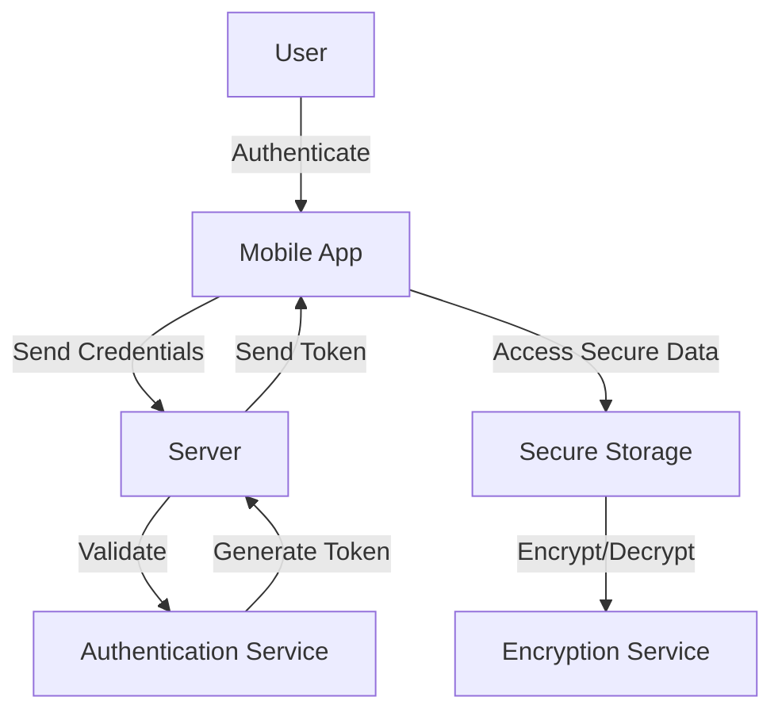

## 18.13 Security Considerations in Mobile Apps

In today's digital age, mobile applications have become an integral part of our daily lives. As developers, ensuring the security of these applications is paramount. This section delves into the critical aspects of mobile app security, focusing on best practices for secure data storage, authentication, and protection against common vulnerabilities. Let's explore how we can build secure mobile applications using JavaScript.

### The Importance of Securing Mobile Applications

Mobile applications often handle sensitive data, from personal information to financial transactions. A security breach can lead to severe consequences, including data theft, financial loss, and damage to a company's reputation. Therefore, securing mobile applications is not just a technical requirement but a business imperative.

### Secure Storage of Sensitive Data

One of the primary concerns in mobile app security is the secure storage of sensitive data. This includes user credentials, personal information, and payment details. Here are some best practices for secure data storage:

#### Avoid Hardcoded Secrets

Hardcoding sensitive information such as API keys, passwords, or cryptographic keys in your application's source code is a significant security risk. Attackers can easily extract these secrets, leading to unauthorized access. Instead, use secure storage solutions provided by the operating system, such as the Keychain on iOS or the Keystore on Android.

#### Use Encrypted Storage

Encrypt sensitive data before storing it on the device. This ensures that even if the data is accessed by unauthorized parties, it remains unreadable. Use strong encryption algorithms like AES (Advanced Encryption Standard) to protect your data.

#### Secure Local Databases

If your application uses local databases like SQLite, ensure that the data is encrypted. Use libraries such as SQLCipher to encrypt database files, adding an extra layer of security.

### Implementing Secure Authentication

Authentication is a critical component of mobile app security. It verifies the identity of users and ensures that only authorized individuals can access the application. Here are some guidelines for implementing secure authentication:

#### OAuth2 Flows

OAuth2 is a widely used protocol for secure authentication. It allows users to grant third-party applications access to their resources without sharing their credentials. Implement OAuth2 flows to enhance security and provide a seamless user experience.

```javascript
// Example of OAuth2 flow using JavaScript
const clientId = 'YOUR_CLIENT_ID';
const redirectUri = 'YOUR_REDIRECT_URI';
const authUrl = `https://authorization-server.com/auth?response_type=token&client_id=${clientId}&redirect_uri=${redirectUri}`;

function authenticate() {
  window.location.href = authUrl;
}

// Handle the redirect and extract the access token
function handleRedirect() {
  const hash = window.location.hash;
  const token = new URLSearchParams(hash.substring(1)).get('access_token');
  if (token) {
    console.log('Access Token:', token);
    // Use the token to access protected resources
  }
}
```

#### Biometrics (Fingerprint, Face ID)

Biometric authentication methods, such as fingerprint and Face ID, provide a convenient and secure way to authenticate users. They leverage the device's hardware to ensure that only the authorized user can access the application.

```javascript
// Example of biometric authentication using JavaScript
if (window.PublicKeyCredential) {
  navigator.credentials.get({
    publicKey: {
      challenge: new Uint8Array([/* server-generated challenge */]),
      allowCredentials: [{
        type: 'public-key',
        id: new Uint8Array([/* user's credential ID */])
      }]
    }
  }).then(credential => {
    console.log('Biometric authentication successful:', credential);
  }).catch(error => {
    console.error('Biometric authentication failed:', error);
  });
}
```

### Protecting Against Common Vulnerabilities

Mobile applications are susceptible to various vulnerabilities. Here are some common ones and how to protect against them:

#### Insecure Data Transmission

Data transmitted over the network can be intercepted by attackers. To prevent this, always use HTTPS to encrypt data in transit. Implement SSL/TLS certificates to secure communication between the client and server.

#### Cross-Site Scripting (XSS)

XSS attacks occur when malicious scripts are injected into web pages viewed by other users. To prevent XSS, sanitize user input and use Content Security Policy (CSP) headers to restrict the sources from which scripts can be loaded.

#### Insecure Deserialization

Insecure deserialization can lead to remote code execution or data tampering. Validate and sanitize all serialized data before deserializing it. Use libraries that provide secure deserialization mechanisms.

### Tools and Libraries for Mobile App Security

Several tools and libraries can assist in securing mobile applications:

- **OWASP Mobile Security Testing Guide**: A comprehensive resource for testing the security of mobile applications.
- **ZAP (Zed Attack Proxy)**: An open-source tool for finding vulnerabilities in web applications.
- **SQLCipher**: A library for encrypting SQLite databases.
- **CryptoJS**: A JavaScript library for performing cryptographic operations.

### Visualizing Secure Data Flow in Mobile Apps

To better understand how data flows securely within a mobile application, let's visualize the process using a flowchart.



**Figure 1**: Secure data flow in a mobile application, illustrating the authentication process and secure data storage.

### Knowledge Check

- Why is it important to avoid hardcoding secrets in mobile applications?
- How does OAuth2 enhance the security of mobile applications?
- What are some common vulnerabilities in mobile applications, and how can they be mitigated?

### Summary

Securing mobile applications is a multifaceted challenge that requires a comprehensive approach. By following best practices for secure data storage, implementing robust authentication mechanisms, and protecting against common vulnerabilities, we can build secure and reliable mobile applications. Remember, security is an ongoing process, and staying informed about the latest threats and mitigation strategies is crucial.

### Embrace the Journey

As you continue to develop mobile applications, keep security at the forefront of your mind. Experiment with different authentication methods, explore new tools and libraries, and stay curious about emerging security trends. Remember, this is just the beginning. With each project, you'll gain more insights and expertise in building secure mobile applications. Keep learning, stay vigilant, and enjoy the journey!

## Quiz: Security Considerations in Mobile Apps



### Why is it important to avoid hardcoding secrets in mobile applications?

- [x] To prevent unauthorized access to sensitive information
- [ ] To improve application performance
- [ ] To reduce application size
- [ ] To enhance user experience

> **Explanation:** Hardcoding secrets can lead to unauthorized access if attackers extract them from the app's source code.

### What is the primary benefit of using OAuth2 in mobile applications?

- [x] It allows secure access to resources without sharing user credentials
- [ ] It improves application performance
- [ ] It reduces application size
- [ ] It enhances user interface design

> **Explanation:** OAuth2 provides a secure way to access resources without exposing user credentials.

### Which of the following is a common vulnerability in mobile applications?

- [x] Insecure data transmission
- [ ] Fast loading times
- [ ] High memory usage
- [ ] Complex user interfaces

> **Explanation:** Insecure data transmission can lead to data interception by attackers.

### How can you protect data in transit in a mobile application?

- [x] Use HTTPS to encrypt data
- [ ] Use HTTP for faster transmission
- [ ] Store data locally
- [ ] Use plain text for simplicity

> **Explanation:** HTTPS encrypts data in transit, preventing interception by attackers.

### What is a benefit of using biometric authentication in mobile apps?

- [x] It provides a convenient and secure way to authenticate users
- [ ] It reduces application size
- [x] It enhances user experience
- [ ] It simplifies code complexity

> **Explanation:** Biometric authentication is both secure and user-friendly, improving the overall experience.

### Which tool can be used to find vulnerabilities in web applications?

- [x] ZAP (Zed Attack Proxy)
- [ ] SQLCipher
- [ ] CryptoJS
- [ ] Node.js

> **Explanation:** ZAP is an open-source tool designed to find vulnerabilities in web applications.

### What is the purpose of encrypting local databases in mobile apps?

- [x] To protect sensitive data from unauthorized access
- [ ] To improve database performance
- [ ] To reduce database size
- [ ] To enhance user interface design

> **Explanation:** Encrypting local databases ensures that sensitive data remains secure even if accessed by unauthorized parties.

### How does Content Security Policy (CSP) help in securing mobile apps?

- [x] It restricts the sources from which scripts can be loaded
- [ ] It improves application performance
- [ ] It reduces application size
- [ ] It enhances user interface design

> **Explanation:** CSP helps prevent XSS attacks by controlling the sources of executable scripts.

### What is a common practice to secure sensitive data in mobile apps?

- [x] Encrypt data before storing it
- [ ] Store data in plain text
- [ ] Use HTTP for data transmission
- [ ] Hardcode secrets in the source code

> **Explanation:** Encrypting data ensures it remains unreadable to unauthorized users.

### True or False: Security is a one-time process in mobile app development.

- [ ] True
- [x] False

> **Explanation:** Security is an ongoing process that requires continuous monitoring and updates to address new threats.




