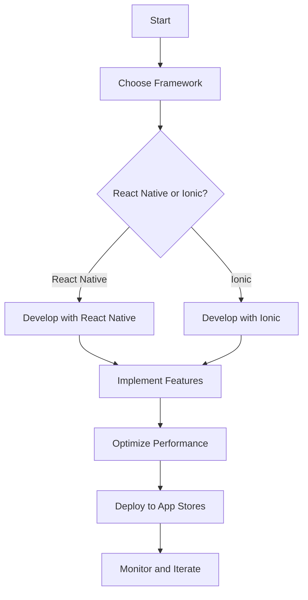

## 18.14 Case Studies of JavaScript Mobile Apps

In the rapidly evolving world of mobile development, JavaScript frameworks like React Native and Ionic have emerged as powerful tools for building cross-platform applications. This section delves into real-world case studies of successful mobile apps developed using these frameworks, providing insights into the challenges faced, solutions implemented, and best practices adopted. By examining these examples, developers can glean valuable lessons and strategies to apply in their own projects.

### Case Study 1: Facebook's React Native

#### Background

React Native, developed by Facebook, is a popular framework for building mobile applications using JavaScript and React. It allows developers to create apps for both iOS and Android platforms with a single codebase, leveraging native components for a seamless user experience.

#### Challenges and Solutions

- **Challenge**: Ensuring performance parity with native apps.
  - **Solution**: React Native uses a bridge to communicate between JavaScript and native modules, allowing for high-performance rendering and smooth animations. Facebook's engineering team optimized this bridge to minimize latency and improve responsiveness.

- **Challenge**: Managing complex state across different components.
  - **Solution**: Facebook implemented Redux, a state management library, to maintain a predictable state container. This helped in managing the app's state efficiently and made debugging easier.

#### Unique Features and Optimizations

- **Hot Reloading**: React Native's hot reloading feature allows developers to see changes in real-time without recompiling the entire app, significantly speeding up the development process.
- **Modular Architecture**: By breaking down the app into reusable components, Facebook ensured that the codebase remained maintainable and scalable.

#### Development Process and Team Structure

Facebook's development team for React Native consisted of experienced engineers familiar with both JavaScript and native development. The team adopted agile methodologies, enabling rapid iteration and continuous improvement.

#### Key Takeaways

- Leveraging a single codebase for multiple platforms can drastically reduce development time and costs.
- Implementing a robust state management solution is crucial for maintaining app stability and performance.

### Case Study 2: Airbnb's Experience with React Native

#### Background

Airbnb, a global online marketplace for lodging and travel experiences, initially adopted React Native to streamline their mobile development process. The goal was to unify their iOS and Android codebases and accelerate feature delivery.

#### Challenges and Solutions

- **Challenge**: Integrating React Native with existing native code.
  - **Solution**: Airbnb developed a hybrid approach, using React Native for new features while maintaining existing native code for core functionalities. This allowed them to gradually transition to a more unified codebase.

- **Challenge**: Ensuring consistent design across platforms.
  - **Solution**: Airbnb's design team created a comprehensive design system that standardized UI components and styles, ensuring a consistent look and feel across both platforms.

#### Unique Features and Optimizations

- **Shared Component Library**: Airbnb developed a shared component library, enabling developers to reuse components across different parts of the app, reducing redundancy and improving consistency.
- **Automated Testing**: The team implemented automated testing frameworks to ensure code quality and catch bugs early in the development cycle.

#### Development Process and Team Structure

Airbnb's team consisted of cross-functional members, including developers, designers, and product managers. They adopted a collaborative approach, with regular meetings and feedback sessions to align on project goals and progress.

#### Key Takeaways

- A hybrid approach can be effective when transitioning from native to React Native, allowing for gradual integration and minimizing disruption.
- Establishing a shared component library can enhance code reuse and maintain consistency across the app.

### Case Study 3: Sworkit with Ionic

#### Background

Sworkit is a popular fitness app that provides customizable workout plans. The development team chose Ionic, a hybrid mobile app development framework, to build their app, aiming for a consistent user experience across platforms.

#### Challenges and Solutions

- **Challenge**: Achieving native-like performance in a hybrid app.
  - **Solution**: The team leveraged Ionic's Capacitor, a native runtime that provides access to native device features, to enhance performance and ensure smooth animations.

- **Challenge**: Handling offline functionality.
  - **Solution**: Sworkit implemented local storage solutions to cache data and ensure the app remained functional even without an internet connection.

#### Unique Features and Optimizations

- **Customizable Workouts**: Sworkit allows users to create personalized workout plans, a feature made possible by Ionic's flexible component system.
- **Cross-Platform Consistency**: By using Ionic's UI components, the team ensured a consistent look and feel across iOS and Android devices.

#### Development Process and Team Structure

Sworkit's development team was relatively small, consisting of full-stack developers familiar with both web and mobile technologies. They utilized a lean development process, focusing on rapid prototyping and user feedback to iterate on features.

#### Key Takeaways

- Ionic's hybrid approach can be a cost-effective solution for startups looking to build cross-platform apps quickly.
- Leveraging native runtimes like Capacitor can significantly enhance the performance of hybrid apps.

### Case Study 4: Uber Eats with React Native

#### Background

Uber Eats, a food delivery service, explored React Native to improve their mobile app's performance and user experience. The goal was to deliver a seamless experience across different devices and platforms.

#### Challenges and Solutions

- **Challenge**: Managing real-time data updates.
  - **Solution**: Uber Eats implemented WebSockets to handle real-time data updates, ensuring users received timely information about their orders.

- **Challenge**: Ensuring app stability during high traffic.
  - **Solution**: The team optimized the app's architecture to handle high traffic volumes, using load balancing and efficient data caching strategies.

#### Unique Features and Optimizations

- **Real-Time Order Tracking**: Users can track their orders in real-time, a feature enabled by React Native's efficient rendering capabilities.
- **Seamless Payment Integration**: The app supports multiple payment methods, providing a smooth checkout experience for users.

#### Development Process and Team Structure

Uber Eats' development team was composed of specialists in mobile development, data engineering, and user experience design. They followed a data-driven approach, using analytics to inform feature development and optimization.

#### Key Takeaways

- Real-time features can significantly enhance user engagement and satisfaction.
- A data-driven approach can help prioritize features and optimizations that deliver the most value to users.

### Case Study 5: MarketWatch with Ionic

#### Background

MarketWatch, a financial news and information website, chose Ionic to develop their mobile app, aiming to provide users with up-to-date financial news and data.

#### Challenges and Solutions

- **Challenge**: Delivering real-time financial data.
  - **Solution**: The team integrated APIs that provided real-time data feeds, ensuring users received the latest information.

- **Challenge**: Ensuring app performance with large data sets.
  - **Solution**: MarketWatch optimized data handling and implemented efficient data caching strategies to maintain app performance.

#### Unique Features and Optimizations

- **Customizable News Feeds**: Users can personalize their news feeds, selecting topics and stocks of interest.
- **Interactive Charts**: The app features interactive charts, allowing users to explore financial data visually.

#### Development Process and Team Structure

MarketWatch's team included developers, data analysts, and financial experts. They adopted a collaborative approach, with regular feedback loops to ensure the app met user needs and expectations.

#### Key Takeaways

- Integrating real-time data feeds can significantly enhance the value of a financial app.
- Interactive features can improve user engagement and satisfaction.

### Conclusion

These case studies highlight the versatility and power of JavaScript frameworks like React Native and Ionic in mobile app development. By examining the challenges faced and solutions implemented, developers can gain valuable insights into best practices and strategies for building successful mobile applications. Whether it's leveraging a single codebase for cross-platform development or optimizing app performance, these examples provide a roadmap for navigating the complexities of mobile development.

### Try It Yourself

To apply the lessons learned from these case studies, consider experimenting with the following:

- **Build a Simple Cross-Platform App**: Use React Native or Ionic to create a basic app that runs on both iOS and Android. Focus on implementing a shared component library and state management solution.
- **Optimize Performance**: Experiment with optimizing app performance by implementing caching strategies and leveraging native device features.
- **Integrate Real-Time Features**: Add real-time data updates to your app using WebSockets or similar technologies.

### Visualizing JavaScript Mobile App Development

This flowchart illustrates the typical process of developing a mobile app using JavaScript frameworks, from choosing the framework to deploying and iterating on the app.

### Knowledge Check

## JavaScript Mobile Apps Case Studies: Quiz



### Which framework did Facebook develop for building mobile applications?

- [x] React Native
- [ ] Ionic
- [ ] Angular
- [ ] Vue.js

> **Explanation:** Facebook developed React Native to enable building mobile applications using JavaScript and React.

### What is a key feature of React Native that speeds up the development process?

- [x] Hot Reloading
- [ ] Cold Booting
- [ ] Lazy Loading
- [ ] Code Splitting

> **Explanation:** Hot Reloading allows developers to see changes in real-time without recompiling the entire app, significantly speeding up the development process.

### What approach did Airbnb use to integrate React Native with existing native code?

- [x] Hybrid Approach
- [ ] Full Migration
- [ ] Separate Codebases
- [ ] Monolithic Approach

> **Explanation:** Airbnb used a hybrid approach, integrating React Native for new features while maintaining existing native code for core functionalities.

### Which runtime does Ionic use to enhance performance and access native device features?

- [x] Capacitor
- [ ] Cordova
- [ ] Electron
- [ ] Node.js

> **Explanation:** Ionic uses Capacitor, a native runtime, to enhance performance and provide access to native device features.

### What technology did Uber Eats implement to handle real-time data updates?

- [x] WebSockets
- [ ] REST APIs
- [ ] GraphQL
- [ ] SOAP

> **Explanation:** Uber Eats implemented WebSockets to handle real-time data updates, ensuring users received timely information about their orders.

### What is a benefit of using a shared component library in mobile app development?

- [x] Code Reuse
- [ ] Increased Complexity
- [ ] Slower Development
- [ ] Inconsistent Design

> **Explanation:** A shared component library enables code reuse and helps maintain consistency across different parts of the app.

### How did MarketWatch ensure app performance with large data sets?

- [x] Data Caching
- [ ] Frequent API Calls
- [ ] Redundant Data Storage
- [ ] Manual Data Entry

> **Explanation:** MarketWatch optimized data handling and implemented efficient data caching strategies to maintain app performance.

### What is a key takeaway from the Sworkit case study?

- [x] Hybrid frameworks can be cost-effective for startups.
- [ ] Native development is always superior.
- [ ] Avoid using JavaScript for mobile apps.
- [ ] Ionic cannot handle offline functionality.

> **Explanation:** Sworkit's case study demonstrates that hybrid frameworks like Ionic can be a cost-effective solution for startups looking to build cross-platform apps quickly.

### Which feature of React Native allows for a seamless user experience across platforms?

- [x] Native Components
- [ ] Virtual DOM
- [ ] Server-Side Rendering
- [ ] Static Typing

> **Explanation:** React Native uses native components to provide a seamless user experience across iOS and Android platforms.

### True or False: Airbnb fully migrated their app to React Native without maintaining any native code.

- [ ] True
- [x] False

> **Explanation:** Airbnb used a hybrid approach, integrating React Native for new features while maintaining existing native code for core functionalities.



Remember, these case studies are just the beginning. As you explore mobile development with JavaScript, continue to experiment, learn from others, and innovate. The possibilities are endless, and the journey is yours to shape. Happy coding!
