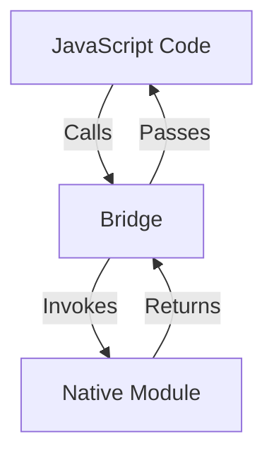
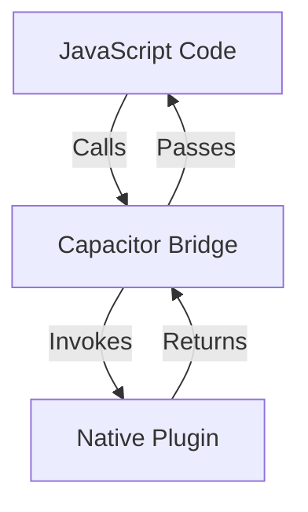

## 18.15 The Bridge Pattern in Mobile Integration

### Introduction

In the realm of mobile development, the Bridge Pattern plays a crucial role in enabling seamless communication between JavaScript code and native platform APIs. This pattern is particularly relevant in frameworks like React Native and Ionic, which allow developers to build cross-platform mobile applications using JavaScript. By understanding and implementing the Bridge Pattern, developers can extend the functionality of their applications, optimize performance, and maintain cross-platform compatibility.

### Understanding the Bridge Pattern

The Bridge Pattern is a structural design pattern that separates an abstraction from its implementation, allowing them to vary independently. In the context of mobile development, it facilitates communication between JavaScript and native code by providing a "bridge" that connects the two. This pattern is essential for accessing native device features and APIs that are not directly available through JavaScript.

#### Key Participants

- **Abstraction**: Represents the high-level interface for the client. In mobile development, this is typically the JavaScript code that interacts with the user interface and application logic.
- **Implementor**: Defines the interface for implementation classes. In this context, it is the native code that provides access to platform-specific features.
- **Concrete Implementor**: Implements the `Implementor` interface. These are the native modules that perform the actual operations.
- **Bridge**: Acts as an intermediary, facilitating communication between the `Abstraction` and `Implementor`.

### The Bridge Pattern in React Native

React Native is a popular framework for building mobile applications using JavaScript and React. It leverages the Bridge Pattern to enable communication between JavaScript and native code, allowing developers to access native device features such as the camera, GPS, and more.

#### How the Bridge Works in React Native

In React Native, the bridge is a two-way communication channel that allows JavaScript code to call native functions and vice versa. Here's a simplified diagram of how the bridge operates:



- **JavaScript Code**: The high-level application logic written in JavaScript.
- **Bridge**: Facilitates communication between JavaScript and native code.
- **Native Module**: The platform-specific implementation that performs the requested operations.

#### Extending Functionality with Native Modules

React Native allows developers to create custom native modules to extend the functionality of their applications. Here's an example of how to create a simple native module in React Native:

**JavaScript Code:**

```javascript
import { NativeModules } from 'react-native';
const { MyNativeModule } = NativeModules;

// Call a native function
MyNativeModule.showToast('Hello from JavaScript!');
```

**Android Native Code (Java):**

```java
package com.myapp;

import android.widget.Toast;
import com.facebook.react.bridge.ReactApplicationContext;
import com.facebook.react.bridge.ReactContextBaseJavaModule;
import com.facebook.react.bridge.ReactMethod;

public class MyNativeModule extends ReactContextBaseJavaModule {

    public MyNativeModule(ReactApplicationContext reactContext) {
        super(reactContext);
    }

    @Override
    public String getName() {
        return "MyNativeModule";
    }

    @ReactMethod
    public void showToast(String message) {
        Toast.makeText(getReactApplicationContext(), message, Toast.LENGTH_SHORT).show();
    }
}
```

In this example, the JavaScript code calls a native function `showToast`, which is implemented in Java to display a toast message on Android.

### The Bridge Pattern in Ionic

Ionic is another popular framework for building cross-platform mobile applications using web technologies like HTML, CSS, and JavaScript. It uses a similar bridge mechanism to enable communication between JavaScript and native code.

#### How the Bridge Works in Ionic

In Ionic, the bridge is facilitated by Capacitor, a native runtime that provides a consistent API for accessing native device features. Here's a simplified diagram of how the bridge operates in Ionic:



- **JavaScript Code**: The high-level application logic written in JavaScript.
- **Capacitor Bridge**: Facilitates communication between JavaScript and native code.
- **Native Plugin**: The platform-specific implementation that performs the requested operations.

#### Extending Functionality with Native Plugins

Ionic allows developers to create custom native plugins to extend the functionality of their applications. Here's an example of how to create a simple native plugin in Ionic:

**JavaScript Code:**

```javascript
import { Plugins } from '@capacitor/core';
const { MyPlugin } = Plugins;

// Call a native function
MyPlugin.echo({ value: 'Hello from JavaScript!' }).then(result => {
    console.log(result.value);
});
```

**Android Native Code (Java):**

```java
package com.myapp;

import android.util.Log;
import com.getcapacitor.Plugin;
import com.getcapacitor.annotation.CapacitorPlugin;
import com.getcapacitor.annotation.PluginMethod;
import com.getcapacitor.JSObject;

@CapacitorPlugin(name = "MyPlugin")
public class MyPlugin extends Plugin {

    @PluginMethod
    public void echo(JSObject call, PluginCall pluginCall) {
        String value = call.getString("value");
        Log.d("MyPlugin", value);
        JSObject ret = new JSObject();
        ret.put("value", value);
        pluginCall.success(ret);
    }
}
```

In this example, the JavaScript code calls a native function `echo`, which is implemented in Java to log a message and return it back to JavaScript.

### Performance Considerations

While the Bridge Pattern provides a powerful mechanism for integrating JavaScript and native code, it is important to consider performance implications. The bridge can become a bottleneck if not used judiciously, as frequent communication between JavaScript and native code can lead to performance degradation.

#### Tips for Optimizing Performance

- **Batch Calls**: Minimize the number of calls across the bridge by batching operations whenever possible.
- **Avoid Heavy Computation**: Perform heavy computations on the native side to reduce the load on the JavaScript thread.
- **Use Asynchronous Operations**: Leverage asynchronous operations to prevent blocking the main thread and ensure a smooth user experience.

### Best Practices for Cross-Platform Compatibility

To maintain cross-platform compatibility while using the Bridge Pattern, consider the following best practices:

- **Abstract Platform-Specific Code**: Encapsulate platform-specific code within native modules or plugins to keep the JavaScript codebase clean and maintainable.
- **Consistent API Design**: Design a consistent API for native modules and plugins to ensure a uniform experience across platforms.
- **Test on Multiple Devices**: Regularly test your application on multiple devices and platforms to identify and address compatibility issues early.

### Conclusion

The Bridge Pattern is an essential tool for mobile developers working with frameworks like React Native and Ionic. By understanding and implementing this pattern, developers can unlock the full potential of their applications, accessing native device features and optimizing performance. Remember to consider performance implications and follow best practices for cross-platform compatibility to ensure a seamless user experience.

### Knowledge Check

To reinforce your understanding of the Bridge Pattern in mobile integration, try answering the following questions:

## Bridge Pattern in Mobile Integration Quiz



### What is the primary role of the Bridge Pattern in mobile development?

- [x] To facilitate communication between JavaScript and native code
- [ ] To enhance the user interface design
- [ ] To optimize network requests
- [ ] To manage application state

> **Explanation:** The Bridge Pattern is used to facilitate communication between JavaScript and native code, allowing access to native device features.

### Which mobile framework uses the Bridge Pattern to enable JavaScript and native code communication?

- [x] React Native
- [ ] Angular
- [ ] Vue.js
- [ ] Ember.js

> **Explanation:** React Native uses the Bridge Pattern to enable communication between JavaScript and native code.

### In React Native, what is the role of the bridge?

- [x] It acts as a communication channel between JavaScript and native code
- [ ] It manages the application's state
- [ ] It handles user authentication
- [ ] It optimizes network requests

> **Explanation:** The bridge in React Native acts as a communication channel between JavaScript and native code.

### What is a native module in React Native?

- [x] A platform-specific implementation that provides access to native features
- [ ] A JavaScript library for state management
- [ ] A tool for optimizing performance
- [ ] A UI component library

> **Explanation:** A native module in React Native is a platform-specific implementation that provides access to native features.

### How can you optimize performance when using the Bridge Pattern?

- [x] Batch calls across the bridge
- [x] Perform heavy computations on the native side
- [ ] Use synchronous operations
- [ ] Increase the number of bridge calls

> **Explanation:** Batching calls and performing heavy computations on the native side can help optimize performance when using the Bridge Pattern.

### What is the role of Capacitor in Ionic?

- [x] It provides a consistent API for accessing native device features
- [ ] It manages application state
- [ ] It optimizes network requests
- [ ] It enhances the user interface design

> **Explanation:** Capacitor provides a consistent API for accessing native device features in Ionic.

### What is a native plugin in Ionic?

- [x] A platform-specific implementation that provides access to native features
- [ ] A JavaScript library for state management
- [ ] A tool for optimizing performance
- [ ] A UI component library

> **Explanation:** A native plugin in Ionic is a platform-specific implementation that provides access to native features.

### Why is it important to test your application on multiple devices?

- [x] To identify and address compatibility issues
- [ ] To optimize network requests
- [ ] To enhance the user interface design
- [ ] To manage application state

> **Explanation:** Testing on multiple devices helps identify and address compatibility issues early.

### True or False: The Bridge Pattern can lead to performance degradation if not used judiciously.

- [x] True
- [ ] False

> **Explanation:** The Bridge Pattern can lead to performance degradation if not used judiciously, as frequent communication between JavaScript and native code can become a bottleneck.

### True or False: The Bridge Pattern is only relevant in React Native.

- [ ] True
- [x] False

> **Explanation:** The Bridge Pattern is relevant in multiple frameworks, including React Native and Ionic, for facilitating communication between JavaScript and native code.



Remember, this is just the beginning. As you progress, you'll build more complex and interactive mobile applications. Keep experimenting, stay curious, and enjoy the journey!
