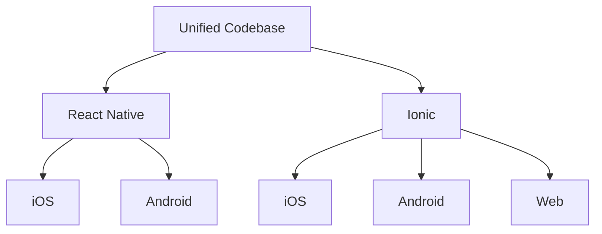

## 18.2 Building Cross-Platform Applications

In today's fast-paced digital world, developing applications that can run seamlessly across multiple platforms is crucial. Cross-platform development allows developers to write code once and deploy it across various operating systems, such as iOS, Android, and even the web. This approach not only saves time and resources but also ensures a consistent user experience across different devices. In this section, we'll explore strategies for building cross-platform applications using JavaScript, focusing on maximizing code reuse, creating adaptive UI components, handling platform-specific code, optimizing performance, and testing across multiple devices.

### Strategies for Maximizing Code Reuse

One of the primary goals of cross-platform development is to maximize code reuse. By sharing as much code as possible between platforms, developers can reduce duplication, streamline maintenance, and accelerate development cycles. Here are some strategies to achieve this:

#### 1. Use a Unified Framework

Frameworks like **React Native** and **Ionic** are designed to facilitate cross-platform development by providing a unified API for building applications. These frameworks allow you to write your application logic in JavaScript while rendering native UI components on each platform.

- **React Native**: Leverages React's component-based architecture, allowing developers to build mobile apps using JavaScript and React. It provides a bridge to native components, ensuring high performance and a native look and feel.

- **Ionic**: Built on top of Angular, React, or Vue, Ionic uses web technologies to create mobile apps. It provides a rich library of UI components that adapt to different platforms.

#### 2. Modularize Your Code

Organize your code into reusable modules that encapsulate specific functionality. This modular approach allows you to share logic across different parts of your application and even across different projects.

```javascript
// Example of a reusable module for fetching data
export const fetchData = async (url) => {
  try {
    const response = await fetch(url);
    return await response.json();
  } catch (error) {
    console.error('Error fetching data:', error);
    throw error;
  }
};
```

#### 3. Use Shared Business Logic

Separate your business logic from platform-specific code. By keeping your core logic independent of the UI layer, you can reuse it across different platforms.

```javascript
// Business logic for calculating user score
export const calculateScore = (user) => {
  return user.activities.reduce((total, activity) => total + activity.points, 0);
};
```

### Building UI Components that Adapt to Different Platforms

Creating UI components that adapt to different platforms is essential for providing a consistent user experience. Here are some techniques to achieve this:

#### 1. Platform-Specific Styling

Use platform-specific styles to ensure your application looks native on each platform. React Native provides the `Platform` module, which allows you to apply styles conditionally based on the platform.

```javascript
import { Platform, StyleSheet } from 'react-native';

const styles = StyleSheet.create({
  button: {
    padding: 10,
    backgroundColor: Platform.OS === 'ios' ? 'blue' : 'green',
  },
});
```

#### 2. Responsive Design

Implement responsive design principles to ensure your application adapts to different screen sizes and orientations. Use flexbox layouts and percentage-based dimensions to create flexible UI components.

```javascript
// Example of a responsive container
const styles = StyleSheet.create({
  container: {
    flex: 1,
    justifyContent: 'center',
    alignItems: 'center',
    padding: '5%',
  },
});
```

#### 3. Conditional Rendering

Use conditional rendering to display different components or layouts based on the platform or device characteristics.

```javascript
import { Platform } from 'react-native';

const MyComponent = () => {
  return (
    <View>
      {Platform.OS === 'ios' ? <IOSComponent /> : <AndroidComponent />}
    </View>
  );
};
```

### Handling Platform-Specific Code

While the goal is to maximize code reuse, there are times when platform-specific code is necessary. Here's how to handle it effectively:

#### 1. Use Platform-Specific Files

React Native allows you to create platform-specific files by appending `.ios.js` or `.android.js` to the filename. The bundler will automatically pick the correct file based on the platform.

```javascript
// Button.ios.js
export const Button = () => <ButtonIOS />;

// Button.android.js
export const Button = () => <ButtonAndroid />;
```

#### 2. Abstract Platform-Specific Logic

Encapsulate platform-specific logic within helper functions or classes. This approach keeps your main application code clean and focused on business logic.

```javascript
import { Platform } from 'react-native';

export const getPlatformSpecificData = () => {
  if (Platform.OS === 'ios') {
    return fetchIOSData();
  } else {
    return fetchAndroidData();
  }
};
```

### Performance Optimization Considerations

Performance is a critical factor in cross-platform development. Here are some best practices to optimize your application's performance:

#### 1. Optimize Rendering

Minimize unnecessary re-renders by using `shouldComponentUpdate` in class components or `React.memo` in functional components.

```javascript
// Example of using React.memo to prevent unnecessary re-renders
const MyComponent = React.memo(({ data }) => {
  return <View>{/* Render data */}</View>;
});
```

#### 2. Use Native Modules

For performance-critical tasks, consider using native modules. React Native allows you to write native code in Java or Swift/Objective-C and expose it to JavaScript.

#### 3. Optimize Images and Assets

Use optimized images and assets to reduce load times. Consider using vector graphics or image compression tools to minimize file sizes.

#### 4. Efficient State Management

Choose an efficient state management solution, such as Redux or MobX, to manage your application's state. Avoid unnecessary state updates and keep your state tree shallow.

### Testing on Multiple Devices and Emulators

Testing is crucial to ensure your application works correctly across different devices and platforms. Here are some best practices for testing cross-platform applications:

#### 1. Use Emulators and Simulators

Leverage emulators and simulators to test your application on different devices and screen sizes. Tools like Android Studio and Xcode provide robust emulation environments.

#### 2. Automated Testing

Implement automated testing to catch bugs early and ensure consistent behavior across platforms. Use testing frameworks like Jest and Detox for unit and end-to-end testing.

```javascript
// Example of a Jest test for a React component
import React from 'react';
import { render } from '@testing-library/react-native';
import MyComponent from './MyComponent';

test('renders correctly', () => {
  const { getByText } = render(<MyComponent />);
  expect(getByText('Hello, World!')).toBeTruthy();
});
```

#### 3. Manual Testing on Real Devices

While emulators are useful, it's essential to test your application on real devices to catch platform-specific issues. Consider using services like BrowserStack or Firebase Test Lab for remote device testing.

#### 4. Continuous Integration and Deployment

Set up a continuous integration and deployment (CI/CD) pipeline to automate testing and deployment processes. Tools like GitHub Actions, Travis CI, and CircleCI can help streamline your workflow.

### Conclusion

Building cross-platform applications with JavaScript offers numerous benefits, including reduced development time, consistent user experiences, and easier maintenance. By leveraging frameworks like React Native and Ionic, adopting best practices for code reuse, UI adaptation, performance optimization, and thorough testing, you can create high-quality applications that run seamlessly across multiple platforms. Remember, this is just the beginning. As you progress, you'll build more complex and interactive applications. Keep experimenting, stay curious, and enjoy the journey!

### Visualizing Cross-Platform Development

Let's visualize the architecture of a cross-platform application using a simple diagram:



**Diagram Description**: This diagram illustrates a unified codebase that can be used with frameworks like React Native and Ionic to target multiple platforms, including iOS, Android, and the web.

### Knowledge Check

To reinforce your understanding, let's go through some questions and exercises.

1. **What are the benefits of using a unified framework like React Native or Ionic for cross-platform development?**

2. **How can you implement platform-specific styling in a React Native application? Provide a code example.**

3. **Explain the importance of modularizing your code in cross-platform development.**

4. **What are some performance optimization techniques you can apply in a cross-platform application?**

5. **Describe the process of testing a cross-platform application on multiple devices and emulators.**

### Quiz: Mastering Cross-Platform Development with JavaScript



### What is a primary benefit of using a unified framework like React Native?

- [x] Code reuse across multiple platforms
- [ ] Increased complexity
- [ ] Higher development costs
- [ ] Limited platform support

> **Explanation:** Unified frameworks like React Native allow developers to write code once and deploy it across multiple platforms, maximizing code reuse.

### How can you apply platform-specific styles in React Native?

- [x] Using the Platform module to conditionally apply styles
- [ ] Writing separate stylesheets for each platform
- [ ] Using inline styles only
- [ ] Avoiding styles altogether

> **Explanation:** The Platform module in React Native allows developers to apply styles conditionally based on the platform.

### What is a key strategy for maximizing code reuse in cross-platform development?

- [x] Modularizing code into reusable components
- [ ] Writing platform-specific code for each feature
- [ ] Avoiding the use of frameworks
- [ ] Using inline styles

> **Explanation:** Modularizing code into reusable components allows developers to share logic across different parts of the application and across different projects.

### Which of the following is a performance optimization technique for cross-platform applications?

- [x] Using React.memo to prevent unnecessary re-renders
- [ ] Increasing the number of components
- [ ] Using large images without compression
- [ ] Avoiding the use of native modules

> **Explanation:** Using React.memo helps prevent unnecessary re-renders, optimizing performance.

### Why is it important to test cross-platform applications on real devices?

- [x] To catch platform-specific issues that emulators might miss
- [ ] To avoid using emulators
- [ ] To increase development time
- [ ] To ensure the application crashes

> **Explanation:** Testing on real devices helps catch platform-specific issues that emulators might not detect.

### What is the purpose of using automated testing in cross-platform development?

- [x] To catch bugs early and ensure consistent behavior
- [ ] To increase manual testing efforts
- [ ] To reduce code quality
- [ ] To avoid testing altogether

> **Explanation:** Automated testing helps catch bugs early and ensures consistent behavior across platforms.

### Which tool can be used for continuous integration and deployment in cross-platform development?

- [x] GitHub Actions
- [ ] Microsoft Word
- [ ] Adobe Photoshop
- [ ] Google Sheets

> **Explanation:** GitHub Actions is a tool that can be used for continuous integration and deployment, automating testing and deployment processes.

### What is a benefit of using native modules in React Native?

- [x] Improved performance for critical tasks
- [ ] Increased code complexity
- [ ] Reduced application speed
- [ ] Limited platform compatibility

> **Explanation:** Native modules in React Native can improve performance for critical tasks by allowing developers to write native code.

### How can you ensure your application adapts to different screen sizes?

- [x] Implementing responsive design principles
- [ ] Using fixed pixel dimensions
- [ ] Avoiding the use of flexbox
- [ ] Writing separate code for each screen size

> **Explanation:** Implementing responsive design principles ensures that the application adapts to different screen sizes and orientations.

### Cross-platform development allows developers to write code once and deploy it across multiple platforms.

- [x] True
- [ ] False

> **Explanation:** Cross-platform development enables developers to write code once and deploy it across multiple platforms, maximizing code reuse and ensuring a consistent user experience.



---

By following these guidelines and best practices, you'll be well-equipped to build robust, high-performance cross-platform applications using JavaScript. Keep exploring, experimenting, and refining your skills to stay ahead in the ever-evolving world of mobile development.
