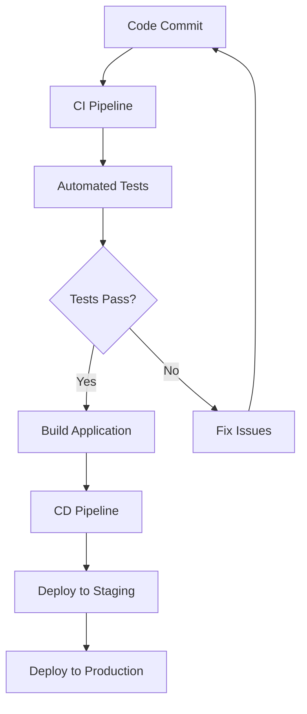

## 18.2 Continuous Integration and Continuous Deployment (CI/CD)

Continuous Integration and Continuous Deployment (CI/CD) are essential practices in modern software development that aim to automate the process of building, testing, and deploying applications. This ensures rapid and reliable releases, enhancing the efficiency and quality of software delivery.

### Understand the Concepts

**Continuous Integration (CI):**  
CI is the practice of automatically integrating code changes from multiple contributors into a shared repository several times a day. This process involves automated builds and tests to detect integration issues early.

**Continuous Deployment (CD):**  
CD extends CI by automating the deployment of code changes to different environments, such as testing, staging, and production. This ensures that the software is always in a deployable state, allowing for frequent and reliable releases.

### Implementation Steps

#### Set Up CI Pipeline

To implement a CI pipeline, you can use tools like Jenkins, GitHub Actions, or GitLab CI. These tools help automate the process of building and testing your application whenever changes are pushed to the repository.

**Example: Setting Up a CI Pipeline with GitHub Actions**

```yaml
name: CI

on:
  push:
    branches:
      - main
  pull_request:
    branches:
      - main

jobs:
  build:
    runs-on: ubuntu-latest

    steps:
    - name: Checkout code
      uses: actions/checkout@v2

    - name: Set up Node.js
      uses: actions/setup-node@v2
      with:
        node-version: '14'

    - name: Install dependencies
      run: npm install

    - name: Run tests
      run: npm test
```

This YAML configuration sets up a CI pipeline that triggers on pushes and pull requests to the `main` branch. It checks out the code, sets up Node.js, installs dependencies, and runs tests.

#### Implement CD Pipeline

For the CD pipeline, automate the deployment of your application to various environments. This can be achieved using the same CI/CD tools, with additional steps for deployment.

**Example: Adding CD to the Pipeline**

```yaml
name: CD

on:
  push:
    branches:
      - main

jobs:
  deploy:
    runs-on: ubuntu-latest

    steps:
    - name: Checkout code
      uses: actions/checkout@v2

    - name: Set up Node.js
      uses: actions/setup-node@v2
      with:
        node-version: '14'

    - name: Install dependencies
      run: npm install

    - name: Build application
      run: npm run build

    - name: Deploy to staging
      run: npm run deploy:staging
```

This configuration extends the CI pipeline to include deployment steps, such as building the application and deploying it to a staging environment.

#### Write Automated Tests

Automated tests are crucial for ensuring code quality and reliability. Implement unit, integration, and end-to-end tests to cover different aspects of your application.

**Example: Writing a Simple Unit Test in Jest**

```typescript
// sum.ts
export function sum(a: number, b: number): number {
  return a + b;
}

// sum.test.ts
import { sum } from './sum';

test('adds 1 + 2 to equal 3', () => {
  expect(sum(1, 2)).toBe(3);
});
```

This example demonstrates a simple unit test using Jest, a popular testing framework for JavaScript and TypeScript.

### Use Cases

CI/CD pipelines are used to improve development efficiency and reduce deployment errors. They enable teams to:

- Detect and fix integration issues early.
- Ensure consistent and repeatable builds.
- Automate deployments to various environments.
- Deliver features and fixes to users more frequently and reliably.

### Practice

To practice setting up a CI/CD pipeline, configure a pipeline that runs tests and deploys to a staging environment upon successful builds. Use tools like GitHub Actions or Jenkins to automate these processes.

### Considerations

When implementing CI/CD pipelines, consider the following:

- **Secure Credentials:** Protect sensitive information such as API keys and access tokens used in pipelines. Use encrypted secrets or environment variables to manage these securely.
- **Monitor Performance:** Regularly monitor the performance of your pipelines to identify bottlenecks and optimize as necessary. This ensures that your pipelines remain efficient and effective.

### Visual Aids

#### CI/CD Workflow Diagram



This diagram illustrates a typical CI/CD workflow, showing the flow from code commit to deployment.

### Advantages and Disadvantages

**Advantages:**

- **Faster Releases:** Automates the build and deployment process, enabling faster and more frequent releases.
- **Improved Quality:** Automated tests ensure that code changes do not introduce new issues.
- **Reduced Errors:** Minimizes human errors by automating repetitive tasks.

**Disadvantages:**

- **Initial Setup Time:** Setting up CI/CD pipelines can be time-consuming initially.
- **Maintenance Overhead:** Requires ongoing maintenance to ensure pipelines remain efficient and up-to-date.

### Best Practices

- **Keep Pipelines Simple:** Start with simple pipelines and gradually add complexity as needed.
- **Automate Everything:** Automate as many steps as possible to reduce manual intervention.
- **Use Version Control:** Store pipeline configurations in version control to track changes and collaborate effectively.

### Conclusion

Continuous Integration and Continuous Deployment are vital practices for modern software development, enabling teams to deliver high-quality software efficiently and reliably. By automating the build, test, and deployment processes, CI/CD pipelines help teams focus on delivering value to users.

## Quiz Time!



### What is the primary goal of Continuous Integration (CI)?

- [x] To automatically integrate code changes and detect integration issues early
- [ ] To automate the deployment of code changes to production
- [ ] To manage project documentation
- [ ] To handle user authentication

> **Explanation:** Continuous Integration focuses on automatically integrating code changes and running tests to detect integration issues early.

### Which tool is commonly used for setting up CI/CD pipelines?

- [x] GitHub Actions
- [ ] Microsoft Word
- [ ] Adobe Photoshop
- [ ] Google Sheets

> **Explanation:** GitHub Actions is a popular tool for setting up CI/CD pipelines, providing automation for building, testing, and deploying code.

### What type of tests are crucial for ensuring code quality in CI/CD pipelines?

- [x] Automated tests
- [ ] Manual tests
- [ ] Visual tests
- [ ] Performance tests

> **Explanation:** Automated tests, including unit, integration, and end-to-end tests, are crucial for ensuring code quality in CI/CD pipelines.

### What is the main advantage of Continuous Deployment (CD)?

- [x] Automating the deployment of code changes to various environments
- [ ] Reducing the need for version control
- [ ] Increasing manual testing efforts
- [ ] Simplifying user interface design

> **Explanation:** Continuous Deployment automates the deployment of code changes to various environments, ensuring frequent and reliable releases.

### Which of the following is a best practice for managing sensitive information in CI/CD pipelines?

- [x] Use encrypted secrets or environment variables
- [ ] Store credentials in plain text files
- [ ] Share credentials in public repositories
- [ ] Email credentials to team members

> **Explanation:** Using encrypted secrets or environment variables is a best practice for managing sensitive information securely in CI/CD pipelines.

### What is a common disadvantage of implementing CI/CD pipelines?

- [x] Initial setup time can be time-consuming
- [ ] It reduces code quality
- [ ] It increases manual testing efforts
- [ ] It simplifies user interface design

> **Explanation:** The initial setup time for CI/CD pipelines can be time-consuming, but the long-term benefits outweigh this disadvantage.

### How can teams ensure their CI/CD pipelines remain efficient?

- [x] Regularly monitor and optimize pipeline performance
- [ ] Avoid using automated tests
- [ ] Increase manual intervention
- [ ] Reduce the frequency of code commits

> **Explanation:** Regularly monitoring and optimizing pipeline performance helps ensure that CI/CD pipelines remain efficient and effective.

### What is the purpose of a staging environment in a CD pipeline?

- [x] To test deployments before releasing to production
- [ ] To store backup data
- [ ] To manage user authentication
- [ ] To handle project documentation

> **Explanation:** A staging environment is used to test deployments before releasing to production, ensuring that changes work as expected.

### Which of the following is NOT a benefit of CI/CD?

- [ ] Faster releases
- [ ] Improved quality
- [ ] Reduced errors
- [x] Increased manual testing

> **Explanation:** CI/CD aims to automate processes, reducing the need for manual testing and minimizing errors.

### True or False: CI/CD pipelines should be stored in version control.

- [x] True
- [ ] False

> **Explanation:** Storing CI/CD pipeline configurations in version control allows teams to track changes, collaborate effectively, and maintain a history of modifications.


