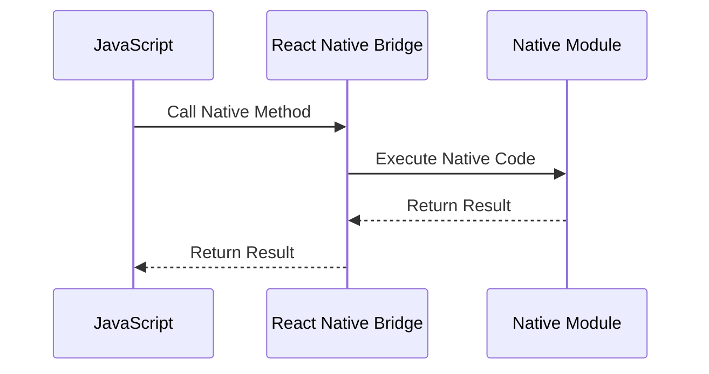

## 18.3 Native Modules and Plugins

In the realm of mobile development with JavaScript, native modules and plugins play a crucial role in bridging the gap between JavaScript code and device-specific functionalities. This section delves into the significance of native modules, their implementation in popular frameworks like React Native and Ionic, and best practices for creating and maintaining custom modules.

### Understanding Native Modules and Plugins

Native modules and plugins are essential components in mobile development that allow JavaScript applications to access and utilize native device features such as the camera, GPS, accelerometer, and more. These modules are written in native languages like Java (for Android) and Swift/Objective-C (for iOS) and are exposed to JavaScript through a bridge.

#### Why Native Modules Are Needed

JavaScript, by itself, is limited to the capabilities of the web environment. However, mobile applications often require access to device-specific features that are not available through standard web APIs. Native modules provide the necessary interface to access these features, enabling developers to create more robust and feature-rich applications.

### Using Native Modules in React Native

React Native is a popular framework for building cross-platform mobile applications using JavaScript. It provides a set of built-in native modules and allows developers to create custom ones when needed.

#### Example: Accessing Device Camera in React Native

React Native offers a package called `react-native-camera` that provides access to the device's camera. Here's a simple example of how to use it:

```javascript
import React, { useState } from 'react';
import { View, Text, Button } from 'react-native';
import { RNCamera } from 'react-native-camera';

const CameraExample = () => {
  const [isCameraActive, setCameraActive] = useState(false);

  const toggleCamera = () => {
    setCameraActive(!isCameraActive);
  };

  return (
    <View style={{ flex: 1 }}>
      {isCameraActive ? (
        <RNCamera
          style={{ flex: 1 }}
          type={RNCamera.Constants.Type.back}
          captureAudio={false}
        />
      ) : (
        <Text>Camera is off</Text>
      )}
      <Button title="Toggle Camera" onPress={toggleCamera} />
    </View>
  );
};

export default CameraExample;
```

In this example, we use the `RNCamera` component to access the device's camera. The `toggleCamera` function allows us to switch the camera on and off.

#### Creating Custom Native Modules in React Native

Sometimes, existing plugins may not meet specific requirements, necessitating the creation of custom native modules. Here's a step-by-step guide to creating a simple custom module in React Native:

1. **Create a Native Module**: Write the native code in Java (for Android) or Swift/Objective-C (for iOS).

2. **Bridge the Module**: Use React Native's bridging capabilities to expose the native code to JavaScript.

3. **Use the Module in JavaScript**: Import and use the module in your React Native application.

##### Example: Custom Toast Module for Android

**Step 1: Create the Native Module**

Create a new Java class in the Android project:

```java
package com.yourapp;

import android.widget.Toast;
import com.facebook.react.bridge.ReactApplicationContext;
import com.facebook.react.bridge.ReactContextBaseJavaModule;
import com.facebook.react.bridge.ReactMethod;

public class ToastModule extends ReactContextBaseJavaModule {

  private static ReactApplicationContext reactContext;

  ToastModule(ReactApplicationContext context) {
    super(context);
    reactContext = context;
  }

  @Override
  public String getName() {
    return "ToastModule";
  }

  @ReactMethod
  public void showToast(String message) {
    Toast.makeText(reactContext, message, Toast.LENGTH_SHORT).show();
  }
}
```

**Step 2: Bridge the Module**

Register the module in the `MainApplication.java`:

```java
import com.yourapp.ToastModule; // Import the module

@Override
protected List<ReactPackage> getPackages() {
  return Arrays.<ReactPackage>asList(
      new MainReactPackage(),
      new ReactPackage() {
        @Override
        public List<NativeModule> createNativeModules(ReactApplicationContext reactContext) {
          return Arrays.<NativeModule>asList(new ToastModule(reactContext));
        }
      }
  );
}
```

**Step 3: Use the Module in JavaScript**

Import and use the module in your React Native application:

```javascript
import { NativeModules } from 'react-native';

const { ToastModule } = NativeModules;

ToastModule.showToast('Hello from Native Module!');
```

### Using Native Modules in Ionic

Ionic is another popular framework for building cross-platform mobile applications. It uses Cordova plugins to access native device features.

#### Example: Accessing Device Camera in Ionic

Ionic provides a plugin called `@ionic-native/camera` to access the device's camera. Here's how to use it:

```typescript
import { Component } from '@angular/core';
import { Camera, CameraOptions } from '@ionic-native/camera/ngx';

@Component({
  selector: 'app-camera',
  templateUrl: './camera.component.html',
  styleUrls: ['./camera.component.scss'],
})
export class CameraComponent {

  constructor(private camera: Camera) {}

  takePicture() {
    const options: CameraOptions = {
      quality: 100,
      destinationType: this.camera.DestinationType.DATA_URL,
      encodingType: this.camera.EncodingType.JPEG,
      mediaType: this.camera.MediaType.PICTURE
    };

    this.camera.getPicture(options).then((imageData) => {
      let base64Image = 'data:image/jpeg;base64,' + imageData;
      // Use the image data
    }, (err) => {
      // Handle error
    });
  }
}
```

In this example, we use the `Camera` service to take a picture and handle the image data.

#### Creating Custom Plugins in Ionic

When existing plugins do not suffice, you can create custom plugins in Ionic. Here's a brief overview of the process:

1. **Create a Cordova Plugin**: Write the native code and define the plugin interface.

2. **Install the Plugin**: Add the plugin to your Ionic project.

3. **Use the Plugin in Your Application**: Import and use the plugin in your Ionic application.

### Best Practices for Native Modules and Plugins

When working with native modules and plugins, it's essential to follow best practices to ensure compatibility and stability:

- **Maintain Compatibility**: Regularly update plugins to support the latest versions of mobile operating systems and frameworks.

- **Ensure Stability**: Test plugins thoroughly to prevent crashes and ensure smooth operation.

- **Leverage Community Support**: Engage with the community for support and updates. Open-source plugins often have active communities that contribute to their maintenance.

- **Document Custom Modules**: Provide clear documentation for custom modules to facilitate future maintenance and updates.

- **Consider Performance**: Optimize native code for performance to prevent slowdowns in the application.

### Considerations for Community Support and Updating Plugins

Community support is vital for the longevity and reliability of plugins. Here are some considerations:

- **Active Community**: Choose plugins with active communities and regular updates.

- **Open Source Contributions**: Contribute to open-source plugins to improve functionality and fix bugs.

- **Monitor Updates**: Keep track of updates and changes in the plugins you use to ensure compatibility with your application.

- **Fallback Mechanisms**: Implement fallback mechanisms in case a plugin becomes deprecated or unsupported.

### Visualizing the Interaction Between JavaScript and Native Modules

To better understand how JavaScript interacts with native modules, let's visualize the process using a sequence diagram.



**Diagram Description**: This sequence diagram illustrates the interaction between JavaScript and a native module in a React Native application. The JavaScript code calls a native method through the React Native bridge, which executes the native code and returns the result back to JavaScript.

### Try It Yourself

Experiment with the provided code examples by modifying them to suit your needs. For instance, try changing the camera options in the Ionic example or adding additional functionality to the custom React Native module.

### Knowledge Check

To reinforce your understanding of native modules and plugins, consider the following questions:

- What are the primary reasons for using native modules in mobile development?
- How do you create a custom native module in React Native?
- What are some best practices for maintaining compatibility and stability of plugins?
- How can community support influence the choice of plugins?

### Summary

Native modules and plugins are indispensable tools in mobile development with JavaScript, enabling access to device-specific features and enhancing application capabilities. By understanding how to use and create these modules in frameworks like React Native and Ionic, developers can build more powerful and versatile applications. Remember to follow best practices for compatibility and stability, and leverage community support to ensure the longevity of your projects.

### Embrace the Journey

Remember, this is just the beginning. As you progress, you'll build more complex and interactive mobile applications. Keep experimenting, stay curious, and enjoy the journey!

## Quiz: Mastering Native Modules and Plugins in Mobile Development



### What is the primary purpose of native modules in mobile development?

- [x] To access device-specific features not available through standard web APIs
- [ ] To improve the performance of JavaScript code
- [ ] To simplify the user interface design
- [ ] To enhance the security of mobile applications

> **Explanation:** Native modules allow JavaScript applications to access device-specific features, which are not available through standard web APIs.

### Which framework uses Cordova plugins to access native device features?

- [ ] React Native
- [x] Ionic
- [ ] Angular
- [ ] Vue.js

> **Explanation:** Ionic uses Cordova plugins to access native device features.

### What is the first step in creating a custom native module in React Native?

- [x] Create the native module in Java or Swift/Objective-C
- [ ] Bridge the module using React Native's capabilities
- [ ] Use the module in JavaScript
- [ ] Test the module thoroughly

> **Explanation:** The first step is to create the native module in the appropriate native language (Java for Android, Swift/Objective-C for iOS).

### What is a best practice for maintaining compatibility of plugins?

- [x] Regularly update plugins to support the latest versions of mobile operating systems
- [ ] Avoid using open-source plugins
- [ ] Use only built-in plugins
- [ ] Ignore community feedback

> **Explanation:** Regularly updating plugins ensures they remain compatible with the latest versions of mobile operating systems.

### How can community support benefit the use of plugins?

- [x] By providing updates and improvements to the plugins
- [ ] By reducing the need for testing
- [ ] By eliminating the need for documentation
- [ ] By making plugins obsolete

> **Explanation:** Community support can provide updates, improvements, and bug fixes for plugins, enhancing their functionality and reliability.

### What should you do if a plugin becomes deprecated or unsupported?

- [x] Implement fallback mechanisms
- [ ] Continue using the plugin without changes
- [ ] Remove the plugin immediately
- [ ] Ignore the deprecation notice

> **Explanation:** Implementing fallback mechanisms ensures that your application continues to function even if a plugin becomes deprecated or unsupported.

### Which of the following is a key consideration when creating custom native modules?

- [x] Optimize native code for performance
- [ ] Use only JavaScript for all functionalities
- [ ] Avoid documentation
- [ ] Ignore testing

> **Explanation:** Optimizing native code for performance is crucial to prevent slowdowns in the application.

### What is the role of the React Native bridge in native module interaction?

- [x] It facilitates communication between JavaScript and native code
- [ ] It enhances the user interface
- [ ] It secures the application
- [ ] It simplifies the code structure

> **Explanation:** The React Native bridge facilitates communication between JavaScript and native code, allowing them to interact seamlessly.

### Which language is used to write native modules for Android in React Native?

- [x] Java
- [ ] Swift
- [ ] Objective-C
- [ ] Kotlin

> **Explanation:** Java is used to write native modules for Android in React Native.

### True or False: Native modules can only be used in React Native applications.

- [ ] True
- [x] False

> **Explanation:** Native modules can be used in various frameworks, including React Native and Ionic, to access device-specific features.


