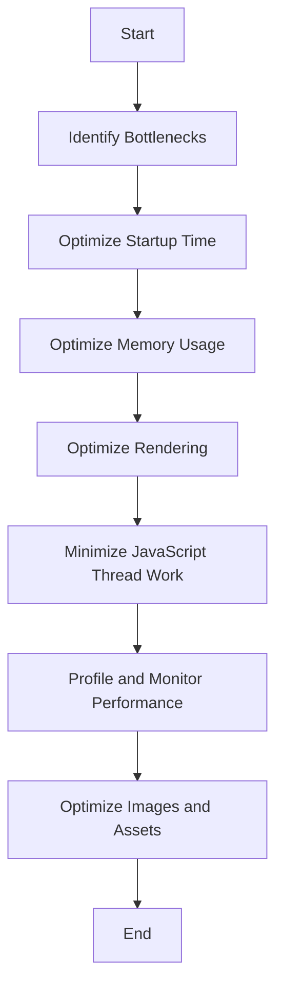

## 18.4 Performance Considerations for Mobile Apps

In the realm of mobile development, performance is paramount. Users expect applications to be fast, responsive, and efficient. In this section, we will delve into the common performance bottlenecks in mobile apps and explore strategies to optimize startup time, memory usage, and rendering. We will also discuss the importance of minimizing JavaScript thread work and highlight tools for profiling and monitoring performance. Finally, we will cover best practices for image optimization and asset management.

### Common Performance Bottlenecks in Mobile Apps

Mobile applications often face several performance challenges due to the constraints of mobile devices, such as limited processing power, memory, and battery life. Here are some common bottlenecks:

1. **Slow Startup Time**: A lengthy startup time can lead to user frustration and abandonment. This is often caused by excessive initial loading of resources or inefficient initialization processes.

2. **High Memory Usage**: Mobile devices have limited RAM, and excessive memory usage can lead to app crashes or slowdowns. Memory leaks and inefficient data handling are common culprits.

3. **Inefficient Rendering**: Rendering performance issues can result in janky animations and slow UI updates. This is often due to complex layouts, excessive re-renders, or unoptimized graphics.

4. **JavaScript Thread Overload**: In JavaScript-based mobile frameworks like React Native, the JavaScript thread can become a bottleneck if it is overloaded with heavy computations or excessive event handling.

5. **Network Latency**: Slow network requests can degrade the user experience, especially when fetching data or assets from remote servers.

### Strategies for Optimizing Startup Time

Optimizing startup time is crucial for providing a seamless user experience. Here are some strategies to achieve this:

- **Lazy Loading**: Load only the essential components and resources at startup. Defer the loading of non-critical components until they are needed.

- **Code Splitting**: Break down your application into smaller chunks that can be loaded on demand. This reduces the initial load time and improves perceived performance.

- **Optimize Initialization**: Minimize the work done during the app's initialization phase. Avoid unnecessary computations and data fetching at startup.

- **Use Splash Screens Wisely**: Implement splash screens to provide visual feedback while the app is loading. However, ensure that the splash screen duration is minimal and does not mask poor performance.

### Memory Usage Optimization

Efficient memory management is vital to prevent crashes and ensure smooth operation. Consider the following techniques:

- **Avoid Memory Leaks**: Ensure that objects are properly disposed of when no longer needed. Use tools like the Android Studio Profiler or Xcode Instruments to detect and fix memory leaks.

- **Efficient Data Handling**: Use data structures that are appropriate for your use case. Avoid storing large amounts of data in memory if it can be fetched or computed on demand.

- **Optimize Image Loading**: Use image caching libraries to manage image loading efficiently. Consider using lower-resolution images or vector graphics where appropriate.

### Rendering Optimization

Rendering performance directly impacts the user experience. Here are some tips to optimize rendering:

- **Minimize Re-renders**: Use techniques like React's `shouldComponentUpdate` or `React.memo` to prevent unnecessary re-renders. Ensure that your component hierarchy is optimized for performance.

- **Use Native Components**: Where possible, leverage native components for rendering. This can significantly improve performance compared to custom JavaScript-based components.

- **Optimize Animations**: Use hardware-accelerated animations and avoid complex animations that can tax the CPU. Libraries like Lottie can help with efficient animation rendering.

### Minimizing JavaScript Thread Work

The JavaScript thread is responsible for executing your app's logic and can become a bottleneck if overloaded. Here are some strategies to minimize its workload:

- **Offload Heavy Computations**: Use web workers or native modules to offload heavy computations from the JavaScript thread.

- **Debounce and Throttle Events**: Use debouncing and throttling techniques to limit the frequency of event handling, reducing the load on the JavaScript thread.

- **Optimize State Management**: Ensure that your state management logic is efficient and does not trigger unnecessary re-renders or computations.

### Tools for Profiling and Monitoring Performance

Profiling and monitoring tools are essential for identifying and addressing performance issues. Here are some recommended tools:

- **React Native's Performance Monitor**: This tool provides insights into the performance of your React Native app, including frame rates and memory usage.

- **Android Studio Profiler**: A comprehensive tool for profiling Android apps, offering features like CPU, memory, and network profiling.

- **Xcode Instruments**: A powerful suite of tools for profiling iOS apps, including memory leaks, CPU usage, and more.

### Best Practices for Image Optimization and Asset Management

Images and assets can significantly impact the performance of mobile apps. Follow these best practices:

- **Use Appropriate Image Formats**: Choose the right image format for your needs. For example, use JPEG for photographs and PNG for images with transparency.

- **Compress Images**: Use image compression tools to reduce the file size of images without compromising quality.

- **Implement Lazy Loading for Images**: Load images only when they are needed, such as when they come into view.

- **Manage Asset Loading**: Use asset management tools to bundle and load assets efficiently. Consider using CDNs to serve assets quickly.

### Visualizing Performance Optimization Techniques

To better understand the flow of performance optimization techniques, let's visualize the process using a flowchart:

**Figure 1**: Flowchart of Performance Optimization Techniques for Mobile Apps

### Knowledge Check

Let's reinforce what we've learned with a few questions:

1. What are some common performance bottlenecks in mobile apps?
2. How can lazy loading improve startup time?
3. Why is it important to minimize JavaScript thread work?
4. What tools can be used to profile mobile app performance?
5. What are some best practices for image optimization?

### Conclusion

Optimizing the performance of mobile apps is a multifaceted challenge that requires attention to detail and a deep understanding of the app's architecture and behavior. By addressing common bottlenecks, optimizing startup time, memory usage, and rendering, and leveraging profiling tools, we can create mobile applications that offer a smooth and responsive user experience. Remember, this is just the beginning. As you progress, you'll build more complex and interactive mobile apps. Keep experimenting, stay curious, and enjoy the journey!

## Test Your Knowledge on Mobile App Performance Optimization



### What is a common performance bottleneck in mobile apps?

- [x] Slow startup time
- [ ] Excessive battery life
- [ ] Overuse of native components
- [ ] High network speed

> **Explanation:** Slow startup time is a common performance bottleneck in mobile apps, often caused by excessive initial loading of resources or inefficient initialization processes.

### How can lazy loading improve startup time?

- [x] By loading only essential components at startup
- [ ] By loading all components at once
- [ ] By increasing the app's memory usage
- [ ] By reducing the app's network requests

> **Explanation:** Lazy loading improves startup time by loading only the essential components and resources at startup, deferring the loading of non-critical components until they are needed.

### Why is it important to minimize JavaScript thread work?

- [x] To prevent the JavaScript thread from becoming a bottleneck
- [ ] To increase the app's memory usage
- [ ] To slow down the app's rendering
- [ ] To reduce the app's startup time

> **Explanation:** Minimizing JavaScript thread work is important to prevent the JavaScript thread from becoming a bottleneck, which can degrade the app's performance.

### Which tool can be used to profile mobile app performance?

- [x] React Native's Performance Monitor
- [ ] Microsoft Word
- [ ] Adobe Photoshop
- [ ] Google Sheets

> **Explanation:** React Native's Performance Monitor is a tool that provides insights into the performance of React Native apps, including frame rates and memory usage.

### What is a best practice for image optimization?

- [x] Compress images to reduce file size
- [ ] Use high-resolution images for all assets
- [x] Implement lazy loading for images
- [ ] Load all images at startup

> **Explanation:** Compressing images to reduce file size and implementing lazy loading for images are best practices for image optimization, helping to improve app performance.

### What is the purpose of using a splash screen?

- [x] To provide visual feedback while the app is loading
- [ ] To increase the app's memory usage
- [ ] To slow down the app's startup time
- [ ] To reduce the app's network requests

> **Explanation:** A splash screen provides visual feedback while the app is loading, helping to improve the perceived performance of the app.

### How can you avoid memory leaks in mobile apps?

- [x] By ensuring objects are properly disposed of
- [ ] By increasing the app's memory usage
- [x] By using profiling tools to detect leaks
- [ ] By loading all data at startup

> **Explanation:** Avoiding memory leaks involves ensuring that objects are properly disposed of when no longer needed and using profiling tools to detect and fix leaks.

### What is a benefit of using native components for rendering?

- [x] Improved performance compared to custom JavaScript-based components
- [ ] Increased memory usage
- [ ] Slower rendering speed
- [ ] Reduced app responsiveness

> **Explanation:** Using native components for rendering can significantly improve performance compared to custom JavaScript-based components, as they are optimized for the platform.

### What is a strategy for optimizing state management?

- [x] Ensure efficient state management logic
- [ ] Increase the app's memory usage
- [ ] Slow down the app's rendering
- [ ] Load all state data at startup

> **Explanation:** Optimizing state management involves ensuring that the state management logic is efficient and does not trigger unnecessary re-renders or computations.

### True or False: Network latency is not a concern for mobile app performance.

- [ ] True
- [x] False

> **Explanation:** False. Network latency can degrade the user experience, especially when fetching data or assets from remote servers, making it a concern for mobile app performance.


