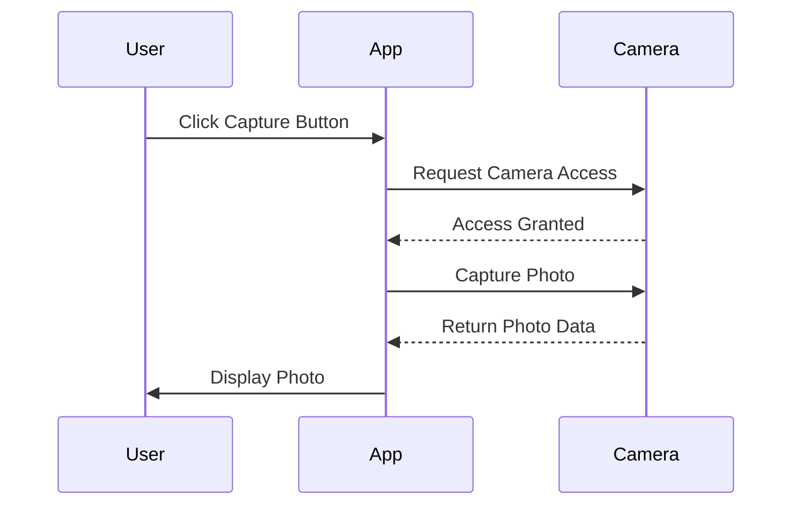

## 18.5 Handling Device Features (Camera, GPS)

In the realm of mobile development, leveraging native device features such as the camera and GPS can significantly enhance the functionality and user experience of your applications. JavaScript, through frameworks like React Native and Ionic, provides powerful tools to access these features. This section will guide you through accessing device features, managing permissions, handling asynchronous operations, and implementing best practices for error handling.

### Accessing Device Features with JavaScript

JavaScript frameworks like React Native and Ionic offer robust solutions for accessing native device features. These frameworks bridge the gap between JavaScript and native code, allowing you to interact with device hardware seamlessly.

#### React Native Camera

React Native Camera is a popular library that provides access to the camera on both iOS and Android devices. It supports features like capturing photos, recording videos, and scanning barcodes.

To get started with React Native Camera, you need to install the library and link it to your project:

```bash
npm install react-native-camera
```

After installation, link the library:

```bash
react-native link react-native-camera
```

Here's a basic example of using React Native Camera to capture a photo:

```javascript
import React, { useRef } from 'react';
import { RNCamera } from 'react-native-camera';
import { View, Button } from 'react-native';

const CameraComponent = () => {
  const cameraRef = useRef(null);

  const takePicture = async () => {
    if (cameraRef.current) {
      const options = { quality: 0.5, base64: true };
      const data = await cameraRef.current.takePictureAsync(options);
      console.log(data.uri);
    }
  };

  return (
    <View style={{ flex: 1 }}>
      <RNCamera
        ref={cameraRef}
        style={{ flex: 1 }}
        type={RNCamera.Constants.Type.back}
        flashMode={RNCamera.Constants.FlashMode.on}
      />
      <Button title="Capture" onPress={takePicture} />
    </View>
  );
};

export default CameraComponent;
```

**Explanation:**

- **RNCamera Component**: This component provides the camera view.
- **takePictureAsync Method**: Captures a photo with specified options.
- **useRef Hook**: Used to reference the camera component.

#### Ionic Native Plugins

Ionic provides a suite of native plugins that allow you to access device features. The Camera plugin in Ionic is straightforward to use and supports capturing photos and videos.

To use the Camera plugin in an Ionic application, install the plugin and its dependencies:

```bash
ionic cordova plugin add cordova-plugin-camera
npm install @ionic-native/camera
```

Import and use the Camera plugin in your component:

```typescript
import { Camera, CameraOptions } from '@ionic-native/camera/ngx';

constructor(private camera: Camera) {}

takePicture() {
  const options: CameraOptions = {
    quality: 100,
    destinationType: this.camera.DestinationType.FILE_URI,
    encodingType: this.camera.EncodingType.JPEG,
    mediaType: this.camera.MediaType.PICTURE
  };

  this.camera.getPicture(options).then((imageData) => {
    let base64Image = 'data:image/jpeg;base64,' + imageData;
  }, (err) => {
    console.log("Camera issue:" + err);
  });
}
```

**Explanation:**

- **CameraOptions**: Configures the camera settings.
- **getPicture Method**: Captures a photo and returns the image data.

### Handling Permissions and User Privacy

When accessing device features, managing permissions and respecting user privacy are paramount. Both React Native and Ionic provide mechanisms to request and handle permissions.

#### React Native Permissions

React Native uses the `react-native-permissions` library to manage permissions. Install the library:

```bash
npm install react-native-permissions
```

Request camera permission:

```javascript
import { request, PERMISSIONS } from 'react-native-permissions';

request(PERMISSIONS.ANDROID.CAMERA).then((result) => {
  console.log(result);
});
```

**Explanation:**

- **request Function**: Requests a specific permission.
- **PERMISSIONS Object**: Contains platform-specific permissions.

#### Ionic Permissions

In Ionic, permissions are handled using the `@ionic-native/core` package. Here's how to request camera permission:

```typescript
import { AndroidPermissions } from '@ionic-native/android-permissions/ngx';

constructor(private androidPermissions: AndroidPermissions) {}

checkPermission() {
  this.androidPermissions.checkPermission(this.androidPermissions.PERMISSION.CAMERA).then(
    result => console.log('Has permission?', result.hasPermission),
    err => this.androidPermissions.requestPermission(this.androidPermissions.PERMISSION.CAMERA)
  );
}
```

**Explanation:**

- **checkPermission Method**: Checks if a permission is granted.
- **requestPermission Method**: Requests a specific permission.

### Managing Asynchronous Operations and Callbacks

Accessing device features often involves asynchronous operations. Understanding how to manage these operations is crucial for building responsive applications.

#### Promises and Async/Await

JavaScript's `Promise` and `async/await` syntax simplify handling asynchronous operations. Here's an example using `async/await` with React Native Camera:

```javascript
const takePicture = async () => {
  try {
    const options = { quality: 0.5, base64: true };
    const data = await cameraRef.current.takePictureAsync(options);
    console.log(data.uri);
  } catch (error) {
    console.error("Error taking picture:", error);
  }
};
```

**Explanation:**

- **try/catch Block**: Handles errors in asynchronous code.
- **await Keyword**: Waits for a promise to resolve.

### Best Practices for Error Handling and Fallback Mechanisms

Error handling is critical when dealing with device features, as various issues can arise, such as permission denials or hardware malfunctions.

#### Implementing Error Handling

Use try/catch blocks to handle errors gracefully. Provide user feedback and fallback mechanisms when errors occur.

```javascript
const takePicture = async () => {
  try {
    const options = { quality: 0.5, base64: true };
    const data = await cameraRef.current.takePictureAsync(options);
    console.log(data.uri);
  } catch (error) {
    alert("Failed to take picture. Please try again.");
    console.error("Error taking picture:", error);
  }
};
```

**Explanation:**

- **alert Function**: Provides user feedback.
- **console.error**: Logs errors for debugging.

### Try It Yourself

Experiment with the provided code examples by modifying camera settings or handling additional permissions. For instance, try changing the camera type or flash mode in the React Native example.

### Visualizing Device Feature Access

To better understand how JavaScript interacts with device features, consider the following sequence diagram illustrating the process of capturing a photo using React Native Camera:



**Diagram Explanation:**

- **User Interaction**: Initiates the process by clicking a button.
- **App Requests Access**: Communicates with the camera to capture a photo.
- **Camera Returns Data**: Provides the captured photo data to the app.

### References and Links

- [React Native Camera Documentation](https://github.com/react-native-camera/react-native-camera)
- [Ionic Native Plugins Documentation](https://ionicframework.com/docs/native)
- [MDN Web Docs on Permissions](https://developer.mozilla.org/en-US/docs/Web/API/Permissions_API)

### Knowledge Check

- What are the key differences between React Native and Ionic when accessing device features?
- How can you handle permission denials gracefully in a mobile application?
- What are the benefits of using `async/await` over traditional callbacks?

### Summary

In this section, we've explored how to handle device features such as the camera and GPS in JavaScript mobile applications. By leveraging frameworks like React Native and Ionic, you can access native device capabilities while managing permissions and handling asynchronous operations effectively. Remember, this is just the beginning. As you progress, you'll build more complex and interactive applications. Keep experimenting, stay curious, and enjoy the journey!

## Quiz: Mastering Device Features in JavaScript Mobile Development



### What library is commonly used in React Native to access the camera?

- [x] react-native-camera
- [ ] react-native-device
- [ ] react-native-photo
- [ ] react-native-image

> **Explanation:** The `react-native-camera` library is widely used for accessing the camera in React Native applications.

### Which Ionic plugin is used to access the camera?

- [x] cordova-plugin-camera
- [ ] ionic-plugin-camera
- [ ] native-camera-plugin
- [ ] camera-access-plugin

> **Explanation:** The `cordova-plugin-camera` is the plugin used in Ionic to access the camera.

### How do you handle asynchronous operations in JavaScript?

- [x] Using Promises
- [x] Using async/await
- [ ] Using synchronous callbacks
- [ ] Using setTimeout

> **Explanation:** Asynchronous operations in JavaScript are typically handled using Promises and the async/await syntax.

### What is the purpose of the `try/catch` block in JavaScript?

- [x] To handle errors
- [ ] To execute code conditionally
- [ ] To loop through arrays
- [ ] To declare variables

> **Explanation:** The `try/catch` block is used to handle errors in JavaScript, especially in asynchronous code.

### What should you do if a user denies a permission request?

- [x] Provide a fallback mechanism
- [x] Inform the user of the consequences
- [ ] Force the permission
- [ ] Ignore the denial

> **Explanation:** It's important to provide a fallback mechanism and inform the user of the consequences if a permission is denied.

### Which method is used to capture a photo in React Native Camera?

- [x] takePictureAsync
- [ ] capturePhoto
- [ ] getPhoto
- [ ] snapPicture

> **Explanation:** The `takePictureAsync` method is used to capture a photo in React Native Camera.

### What is a key consideration when handling device features?

- [x] User privacy and permissions
- [ ] Code minification
- [ ] UI design
- [ ] Database integration

> **Explanation:** User privacy and permissions are key considerations when handling device features.

### How can you check if a permission is granted in Ionic?

- [x] Using the checkPermission method
- [ ] Using the verifyPermission method
- [ ] Using the validatePermission method
- [ ] Using the confirmPermission method

> **Explanation:** The `checkPermission` method is used in Ionic to check if a permission is granted.

### What is the benefit of using `async/await`?

- [x] Simplifies asynchronous code
- [ ] Increases code execution speed
- [ ] Reduces memory usage
- [ ] Enhances UI design

> **Explanation:** The `async/await` syntax simplifies asynchronous code, making it easier to read and maintain.

### True or False: React Native and Ionic can both access native device features.

- [x] True
- [ ] False

> **Explanation:** Both React Native and Ionic provide mechanisms to access native device features.


