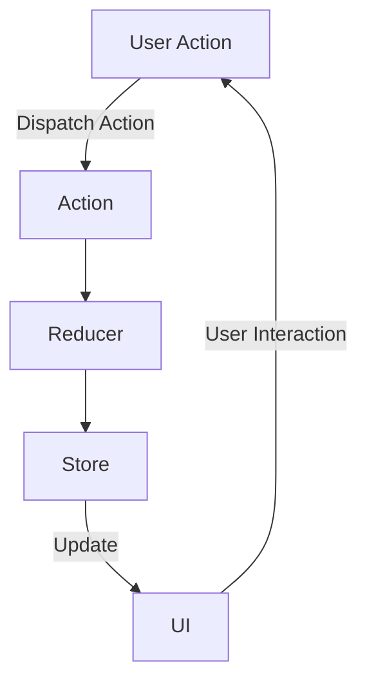

## 18.6 State Management in Mobile Apps

In the realm of mobile app development, managing application state effectively is crucial, especially as applications grow in complexity and feature multiple components and screens. State management is the backbone of any interactive application, ensuring that the user interface (UI) reflects the current state of the application and responds appropriately to user interactions.

### Challenges of State Management in Mobile Apps

Managing state in mobile applications presents unique challenges due to the dynamic nature of mobile environments. Some of the key challenges include:

- **Complexity of State**: As applications grow, the state becomes more complex, involving multiple components and screens that need to share and update state efficiently.
- **Consistency**: Ensuring that the UI consistently reflects the current state of the application, even as state changes occur asynchronously.
- **Performance**: Efficiently updating the UI without causing performance bottlenecks, especially on resource-constrained mobile devices.
- **Navigation State**: Managing navigation state across different screens and ensuring a seamless user experience.
- **Persistent Storage**: Handling persistent storage of state data to maintain user preferences and application state across sessions.

### State Management Libraries

To address these challenges, developers often turn to state management libraries that provide structured approaches to managing state. Two popular libraries in the JavaScript ecosystem for mobile development are Redux and MobX.

#### Redux for React Native

[Redux](https://redux.js.org/) is a predictable state container for JavaScript apps, widely used in React Native applications. It follows a unidirectional data flow pattern, making it easier to understand and debug state changes.

**Key Concepts of Redux**:

- **Store**: The single source of truth that holds the entire state of the application.
- **Actions**: Plain JavaScript objects that describe changes to the state.
- **Reducers**: Pure functions that take the current state and an action, and return a new state.

**Integrating Redux into a React Native App**:

1. **Install Redux and React-Redux**:

   ```bash
   npm install redux react-redux
   ```

2. **Create Actions**:

   ```javascript
   // actions.js
   export const increment = () => ({
     type: 'INCREMENT',
   });

   export const decrement = () => ({
     type: 'DECREMENT',
   });
   ```

3. **Define Reducers**:

   ```javascript
   // reducers.js
   const initialState = { count: 0 };

   const counterReducer = (state = initialState, action) => {
     switch (action.type) {
       case 'INCREMENT':
         return { count: state.count + 1 };
       case 'DECREMENT':
         return { count: state.count - 1 };
       default:
         return state;
     }
   };

   export default counterReducer;
   ```

4. **Create the Store**:

   ```javascript
   // store.js
   import { createStore } from 'redux';
   import counterReducer from './reducers';

   const store = createStore(counterReducer);

   export default store;
   ```

5. **Connect Components to the Store**:

   ```javascript
   // CounterComponent.js
   import React from 'react';
   import { useSelector, useDispatch } from 'react-redux';
   import { increment, decrement } from './actions';

   const CounterComponent = () => {
     const count = useSelector(state => state.count);
     const dispatch = useDispatch();

     return (
       <div>
         <p>Count: {count}</p>
         <button onClick={() => dispatch(increment())}>Increment</button>
         <button onClick={() => dispatch(decrement())}>Decrement</button>
       </div>
     );
   };

   export default CounterComponent;
   ```

6. **Provide the Store to the App**:

   ```javascript
   // App.js
   import React from 'react';
   import { Provider } from 'react-redux';
   import store from './store';
   import CounterComponent from './CounterComponent';

   const App = () => (
     <Provider store={store}>
       <CounterComponent />
     </Provider>
   );

   export default App;
   ```

**Advantages of Using Redux**:

- **Predictability**: With a single source of truth, the state is predictable and easy to debug.
- **Maintainability**: The unidirectional data flow makes the application logic easier to maintain.
- **Scalability**: Redux scales well with larger applications due to its structured approach.

#### MobX

[MobX](https://mobx.js.org/) is another popular state management library that emphasizes simplicity and reactivity. Unlike Redux, MobX uses observable state and reactions to automatically update the UI when the state changes.

**Key Concepts of MobX**:

- **Observable State**: State that MobX tracks for changes.
- **Actions**: Functions that modify the state.
- **Reactions**: Functions that automatically run when the state changes.

**Integrating MobX into a React Native App**:

1. **Install MobX and MobX-React**:

   ```bash
   npm install mobx mobx-react
   ```

2. **Create an Observable Store**:

   ```javascript
   // counterStore.js
   import { makeAutoObservable } from 'mobx';

   class CounterStore {
     count = 0;

     constructor() {
       makeAutoObservable(this);
     }

     increment() {
       this.count++;
     }

     decrement() {
       this.count--;
     }
   }

   export default new CounterStore();
   ```

3. **Connect Components to the Store**:

   ```javascript
   // CounterComponent.js
   import React from 'react';
   import { observer } from 'mobx-react';
   import counterStore from './counterStore';

   const CounterComponent = observer(() => (
     <div>
       <p>Count: {counterStore.count}</p>
       <button onClick={() => counterStore.increment()}>Increment</button>
       <button onClick={() => counterStore.decrement()}>Decrement</button>
     </div>
   ));

   export default CounterComponent;
   ```

4. **Use the Store in the App**:

   ```javascript
   // App.js
   import React from 'react';
   import CounterComponent from './CounterComponent';

   const App = () => <CounterComponent />;

   export default App;
   ```

**Advantages of Using MobX**:

- **Simplicity**: MobX is easy to set up and use, with less boilerplate code than Redux.
- **Reactivity**: The UI automatically updates in response to state changes, reducing the need for manual updates.
- **Flexibility**: MobX allows for more flexible state management patterns.

### Handling Navigation State and Persistent Storage

In addition to managing application state, handling navigation state and persistent storage is crucial for providing a seamless user experience.

#### Navigation State

Managing navigation state involves keeping track of the current screen and handling transitions between screens. In React Native, libraries like [React Navigation](https://reactnavigation.org/) provide tools for managing navigation state.

**Example of Using React Navigation**:

```javascript
// App.js
import * as React from 'react';
import { NavigationContainer } from '@react-navigation/native';
import { createStackNavigator } from '@react-navigation/stack';
import HomeScreen from './HomeScreen';
import DetailsScreen from './DetailsScreen';

const Stack = createStackNavigator();

function App() {
  return (
    <NavigationContainer>
      <Stack.Navigator initialRouteName="Home">
        <Stack.Screen name="Home" component={HomeScreen} />
        <Stack.Screen name="Details" component={DetailsScreen} />
      </Stack.Navigator>
    </NavigationContainer>
  );
}

export default App;
```

#### Persistent Storage

Persistent storage allows applications to save state data across sessions. Libraries like [AsyncStorage](https://react-native-async-storage.github.io/async-storage/) provide a simple key-value storage system for React Native apps.

**Example of Using AsyncStorage**:

```javascript
import AsyncStorage from '@react-native-async-storage/async-storage';

// Save data
const storeData = async (value) => {
  try {
    await AsyncStorage.setItem('@storage_Key', value);
  } catch (e) {
    // saving error
  }
};

// Retrieve data
const getData = async () => {
  try {
    const value = await AsyncStorage.getItem('@storage_Key');
    if(value !== null) {
      // value previously stored
    }
  } catch(e) {
    // error reading value
  }
};
```

### Best Practices for Organizing and Updating State

- **Keep State Minimal**: Only store the necessary state to reduce complexity and improve performance.
- **Normalize State**: Use normalized data structures to avoid duplication and make updates easier.
- **Use Immutable Data**: Prefer immutable data structures to prevent unintended side effects.
- **Separate UI State from Business Logic**: Keep UI-related state separate from business logic to improve maintainability.
- **Leverage Middleware**: Use middleware to handle side effects and asynchronous actions in a structured way.

### Visualizing State Management

To better understand the flow of state management, let's visualize the Redux architecture using a Mermaid.js diagram:



**Diagram Description**: This diagram illustrates the unidirectional data flow in Redux. User actions dispatch actions, which are processed by reducers to update the store. The UI is then updated based on the new state, and the cycle continues with further user interactions.

### Try It Yourself

Experiment with the code examples provided by:

- Modifying the initial state in Redux and MobX to see how it affects the application.
- Adding new actions and reducers in Redux to handle additional state changes.
- Creating new observable properties in MobX and observing how they react to changes.
- Implementing navigation state management using React Navigation in a sample app.
- Storing and retrieving different types of data using AsyncStorage.

### Knowledge Check

To reinforce your understanding of state management in mobile apps, consider the following questions and exercises:

- What are the main challenges of state management in mobile apps?
- How does Redux ensure a predictable state management pattern?
- What are the key differences between Redux and MobX?
- How can you manage navigation state in a React Native app?
- Why is persistent storage important in mobile applications?

### Embrace the Journey

Remember, mastering state management in mobile apps is an ongoing journey. As you continue to build more complex applications, you'll refine your skills and discover new patterns and techniques. Keep experimenting, stay curious, and enjoy the process of creating seamless and efficient mobile experiences.

## Quiz: Mastering State Management in Mobile Apps



### What is a key challenge of state management in mobile apps?

- [x] Complexity of state
- [ ] Lack of libraries
- [ ] Limited device storage
- [ ] Slow network speeds

> **Explanation:** As applications grow, the state becomes more complex, involving multiple components and screens that need to share and update state efficiently.

### Which library is known for a unidirectional data flow pattern?

- [x] Redux
- [ ] MobX
- [ ] React Navigation
- [ ] AsyncStorage

> **Explanation:** Redux follows a unidirectional data flow pattern, making it easier to understand and debug state changes.

### What is the main advantage of using MobX over Redux?

- [x] Simplicity and reactivity
- [ ] More boilerplate code
- [ ] Better performance
- [ ] Larger community

> **Explanation:** MobX is known for its simplicity and reactivity, with less boilerplate code than Redux.

### How does Redux ensure predictability in state management?

- [x] By using a single source of truth
- [ ] By using multiple stores
- [ ] By allowing direct state mutations
- [ ] By using asynchronous actions

> **Explanation:** Redux uses a single source of truth (the store) to ensure predictability in state management.

### What is the purpose of persistent storage in mobile apps?

- [x] To maintain user preferences across sessions
- [ ] To increase app performance
- [ ] To reduce app size
- [ ] To improve network connectivity

> **Explanation:** Persistent storage allows applications to save state data across sessions, maintaining user preferences and application state.

### Which library provides tools for managing navigation state in React Native?

- [x] React Navigation
- [ ] Redux
- [ ] MobX
- [ ] AsyncStorage

> **Explanation:** React Navigation provides tools for managing navigation state in React Native applications.

### What is a best practice for organizing state in mobile apps?

- [x] Keep state minimal
- [ ] Store all data in the state
- [ ] Use mutable data structures
- [ ] Combine UI state with business logic

> **Explanation:** Keeping state minimal reduces complexity and improves performance.

### How can you handle side effects in Redux?

- [x] By using middleware
- [ ] By using reducers
- [ ] By using actions
- [ ] By using components

> **Explanation:** Middleware is used in Redux to handle side effects and asynchronous actions in a structured way.

### What is the role of reducers in Redux?

- [x] To process actions and return a new state
- [ ] To dispatch actions
- [ ] To store data
- [ ] To update the UI directly

> **Explanation:** Reducers are pure functions that take the current state and an action, and return a new state.

### True or False: MobX requires more boilerplate code than Redux.

- [ ] True
- [x] False

> **Explanation:** MobX requires less boilerplate code than Redux, making it simpler to set up and use.


