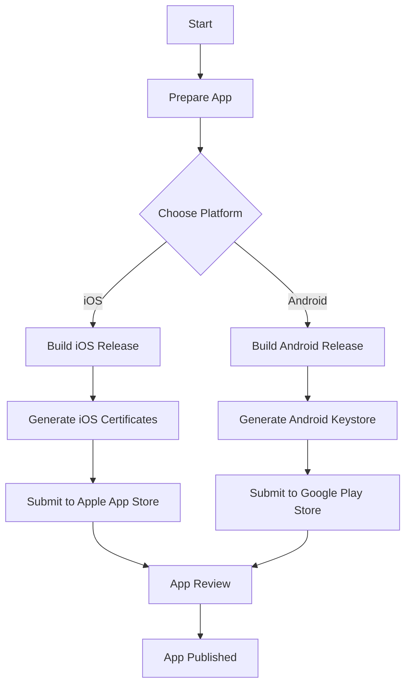

## 18.9 Deployment to App Stores

Deploying your mobile application to app stores is a crucial step in reaching your audience. This guide will walk you through the process of preparing and submitting your JavaScript-based mobile applications to the Apple App Store and Google Play Store. We will cover the requirements, step-by-step guidance on building release versions, generating signing certificates, provisioning profiles, and adhering to app store guidelines to avoid rejection. Additionally, we will explore tools like [Fastlane](https://fastlane.tools/) that simplify the deployment process.

### Understanding App Store Requirements

Before diving into the deployment process, it's essential to understand the specific requirements for each app store. Both the Apple App Store and Google Play Store have unique guidelines and prerequisites that developers must adhere to.

#### Apple App Store Requirements

1. **Apple Developer Program Membership**: To submit apps to the App Store, you must enroll in the Apple Developer Program, which requires an annual fee.
2. **App Store Guidelines**: Familiarize yourself with Apple's App Store Review Guidelines to ensure your app meets all the necessary criteria.
3. **App Information**: Prepare app metadata, including the app name, description, keywords, screenshots, and app icon.
4. **App Privacy Policy**: Provide a privacy policy URL if your app collects user data.
5. **App Signing**: Use Xcode to manage signing certificates and provisioning profiles.

#### Google Play Store Requirements

1. **Google Play Developer Account**: Register for a Google Play Developer account, which involves a one-time registration fee.
2. **Google Play Policies**: Review the Google Play Developer Policies to ensure compliance.
3. **App Details**: Prepare app details, including the app title, description, screenshots, and promotional graphics.
4. **Content Rating**: Complete the content rating questionnaire to determine the appropriate age rating for your app.
5. **App Signing**: Use Android Studio to generate a signed APK or App Bundle.

### Building Release Versions

Building a release version of your app involves optimizing the app for performance and ensuring it is ready for distribution. This process varies slightly between iOS and Android platforms.

#### Building iOS Release Versions

1. **Open Xcode**: Launch Xcode and open your project.
2. **Select a Target**: Choose the appropriate target for your app.
3. **Configure Build Settings**: Set the build configuration to "Release" and ensure all necessary settings are configured.
4. **Archive the App**: Use Xcode's "Product" menu to archive your app.
5. **Export the Archive**: Export the archive for App Store distribution, ensuring you select the correct signing certificate and provisioning profile.

#### Building Android Release Versions

1. **Open Android Studio**: Launch Android Studio and open your project.
2. **Build Variants**: Switch to the "Release" build variant.
3. **Generate Signed APK/App Bundle**: Use the "Build" menu to generate a signed APK or App Bundle.
4. **Configure Signing**: Provide the keystore file, key alias, and passwords to sign the app.
5. **Complete the Build**: Finish the build process and locate the generated APK or App Bundle.

### Generating Signing Certificates and Provisioning Profiles

Signing certificates and provisioning profiles are crucial for app security and distribution. They ensure that your app is uniquely identified and authorized to run on devices.

#### iOS Signing Certificates and Provisioning Profiles

1. **Access Apple Developer Account**: Log in to your Apple Developer account.
2. **Create Certificates**: Navigate to the "Certificates, Identifiers & Profiles" section and create a new certificate for app distribution.
3. **Generate Provisioning Profiles**: Create a provisioning profile that includes your app's bundle identifier and the distribution certificate.
4. **Download and Install**: Download the certificate and provisioning profile, then install them in Xcode.

#### Android Keystore and Signing Configurations

1. **Create a Keystore**: Use Android Studio's "Generate Signed Bundle/APK" wizard to create a new keystore.
2. **Configure Signing**: Provide the keystore path, key alias, and passwords in your app's `build.gradle` file.
3. **Secure the Keystore**: Store the keystore file securely, as it is essential for future app updates.

### App Store Guidelines and Best Practices

Adhering to app store guidelines is critical to avoid rejection and ensure a smooth review process. Here are some best practices to follow:

#### Apple App Store Best Practices

- **User Experience**: Ensure your app provides a seamless and intuitive user experience.
- **Performance**: Optimize your app for performance, minimizing load times and resource usage.
- **Privacy**: Clearly communicate how user data is collected, used, and protected.
- **Compatibility**: Test your app on various iOS devices to ensure compatibility.

#### Google Play Store Best Practices

- **Content Compliance**: Ensure your app complies with content policies, avoiding prohibited content.
- **Security**: Implement robust security measures to protect user data.
- **Localization**: Provide localized content for different regions to enhance user engagement.
- **Testing**: Thoroughly test your app on different Android devices and screen sizes.

### Tools for Simplifying Deployment

Several tools can streamline the deployment process, making it more efficient and less error-prone. One such tool is [Fastlane](https://fastlane.tools/), which automates many aspects of app deployment.

#### Fastlane Overview

Fastlane is an open-source platform that simplifies the deployment process for both iOS and Android apps. It provides a suite of tools to automate tasks such as building, signing, and releasing apps.

#### Key Features of Fastlane

- **Automated Builds**: Streamline the build process with automated scripts.
- **Code Signing**: Manage signing certificates and provisioning profiles effortlessly.
- **App Store Submission**: Automate the submission of app metadata and binaries to app stores.
- **Continuous Integration**: Integrate Fastlane with CI/CD pipelines for automated testing and deployment.

#### Setting Up Fastlane

1. **Install Fastlane**: Use RubyGems to install Fastlane on your development machine.
   ```bash
   sudo gem install fastlane -NV
   ```
2. **Initialize Fastlane**: Navigate to your project directory and run `fastlane init` to set up Fastlane.
3. **Configure Fastfile**: Edit the `Fastfile` to define lanes for different deployment tasks.
4. **Run Fastlane**: Execute Fastlane commands to automate the deployment process.

### Visualizing the Deployment Process

To better understand the deployment process, let's visualize the steps involved in deploying an app to the app stores.



**Figure 1**: Visualizing the Deployment Process

### Knowledge Check

To reinforce your understanding of the deployment process, consider the following questions:

1. What are the key differences between deploying to the Apple App Store and Google Play Store?
2. How does Fastlane simplify the deployment process?
3. What are some common reasons for app rejection on the Apple App Store?
4. Why is it important to secure your Android keystore file?

### Embrace the Journey

Deploying your app to the app stores is a significant milestone in your development journey. Remember, this is just the beginning. As you progress, you'll gain more insights into optimizing your app for better performance and user engagement. Keep experimenting, stay curious, and enjoy the journey!

### Quiz: Mastering App Store Deployment



### What is required to submit an app to the Apple App Store?

- [x] Apple Developer Program Membership
- [ ] Google Play Developer Account
- [ ] Android Studio
- [ ] Fastlane

> **Explanation:** To submit apps to the Apple App Store, you must enroll in the Apple Developer Program.

### Which tool can automate the deployment process for both iOS and Android apps?

- [x] Fastlane
- [ ] Xcode
- [ ] Android Studio
- [ ] npm

> **Explanation:** Fastlane is an open-source platform that automates the deployment process for both iOS and Android apps.

### What is a common reason for app rejection on the Apple App Store?

- [x] Poor user experience
- [ ] High performance
- [ ] Compliance with guidelines
- [ ] Fastlane usage

> **Explanation:** Apps with a poor user experience are often rejected by the Apple App Store.

### What is the purpose of a provisioning profile in iOS app deployment?

- [x] Authorize app distribution
- [ ] Generate APK
- [ ] Manage app metadata
- [ ] Automate builds

> **Explanation:** A provisioning profile authorizes the distribution of an iOS app.

### Which of the following is a best practice for Google Play Store deployment?

- [x] Content compliance
- [ ] Ignoring security
- [ ] Avoiding localization
- [ ] Skipping testing

> **Explanation:** Ensuring content compliance is a best practice for Google Play Store deployment.

### What does Fastlane's `Fastfile` contain?

- [x] Deployment task definitions
- [ ] App metadata
- [ ] APK files
- [ ] Provisioning profiles

> **Explanation:** The `Fastfile` contains definitions for deployment tasks in Fastlane.

### Why is it important to secure your Android keystore file?

- [x] Essential for future app updates
- [ ] To generate iOS certificates
- [ ] For app metadata management
- [ ] To automate builds

> **Explanation:** The Android keystore file is essential for future app updates and must be secured.

### What is the first step in deploying an app to the app stores?

- [x] Prepare the app
- [ ] Submit to app store
- [ ] Generate APK
- [ ] Use Fastlane

> **Explanation:** Preparing the app is the first step in the deployment process.

### What is a key feature of Fastlane?

- [x] Automated builds
- [ ] Manual signing
- [ ] App rejection
- [ ] Slow deployment

> **Explanation:** Fastlane provides automated builds as a key feature.

### True or False: Fastlane can only be used for iOS app deployment.

- [ ] True
- [x] False

> **Explanation:** Fastlane can be used for both iOS and Android app deployment.



By following this guide, you are well on your way to mastering the deployment of your mobile applications to the app stores. Happy deploying!
