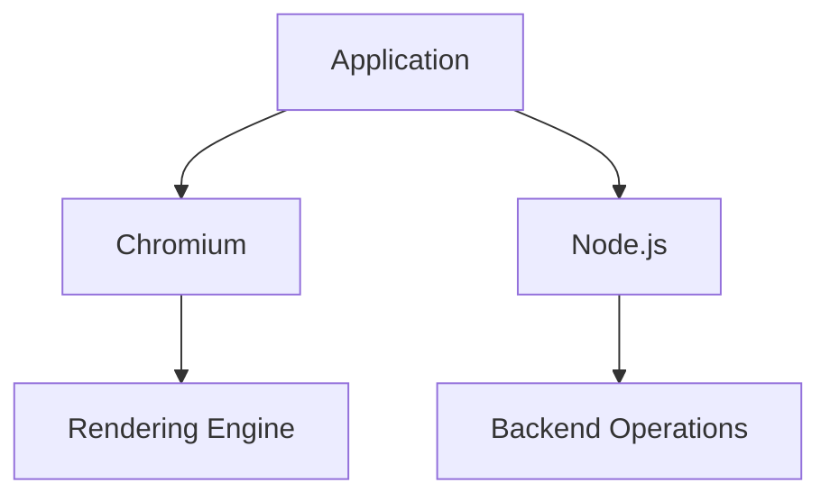

## 19.1 Introduction to Electron and NW.js

### Understanding Electron and NW.js

In the realm of desktop application development, **Electron** and **NW.js** have emerged as two pivotal frameworks that empower developers to create cross-platform applications using familiar web technologies like JavaScript, HTML, and CSS. These frameworks have revolutionized the way developers approach desktop applications, allowing them to leverage their existing web development skills to build robust, native-like applications.

#### What is Electron?

[Electron](https://www.electronjs.org/) is an open-source framework developed by GitHub. It allows developers to build desktop applications using web technologies. Electron combines the **Chromium** rendering engine and **Node.js** runtime, enabling applications to run on Windows, macOS, and Linux. This combination allows developers to create applications that are both powerful and flexible, with access to native operating system features.

#### What is NW.js?

[NW.js](https://nwjs.io/), formerly known as Node-Webkit, is another open-source framework that facilitates the creation of desktop applications using web technologies. Like Electron, NW.js integrates the Chromium engine and Node.js, providing a seamless environment for building cross-platform applications. NW.js is known for its flexibility and ease of integration with existing web applications.

### Historical Context and Evolution

The journey of desktop development with JavaScript has been transformative. Initially, JavaScript was confined to the browser, primarily used for enhancing web pages with interactivity. However, as web technologies evolved, so did the potential for JavaScript beyond the browser.

The advent of Node.js marked a significant milestone, enabling JavaScript to run on the server side. This opened new possibilities for JavaScript, including desktop application development. With the introduction of frameworks like Electron and NW.js, developers could now build full-fledged desktop applications using the same technologies they used for web development.

### Comparing Electron and NW.js

While both Electron and NW.js serve the same fundamental purpose, they have distinct characteristics that set them apart.

#### Similarities

- **Cross-Platform Support**: Both frameworks support Windows, macOS, and Linux, allowing developers to build applications that run seamlessly across different operating systems.
- **Web Technologies**: They leverage HTML, CSS, and JavaScript, enabling developers to use their existing web development skills.
- **Chromium and Node.js**: Both frameworks integrate Chromium for rendering and Node.js for backend operations, providing a powerful environment for application development.

#### Differences

- **Architecture**: Electron uses a single process model where the main process manages application lifecycle and rendering processes, while NW.js allows for more flexibility with multiple process models.
- **Community and Ecosystem**: Electron has a larger community and more extensive ecosystem, with numerous plugins and tools available for developers.
- **Performance**: NW.js is often considered to have better performance in certain scenarios due to its architecture, but Electron's performance is generally sufficient for most applications.

### Examples of Applications Built with Electron and NW.js

#### Electron Applications

- **[Visual Studio Code](https://code.visualstudio.com/)**: A popular code editor developed by Microsoft, known for its extensibility and robust feature set.
- **[Slack](https://slack.com/)**: A widely used communication platform for teams, offering a seamless desktop experience.
- **[Atom](https://atom.io/)**: A hackable text editor for the 21st century, built by GitHub.

#### NW.js Applications

- **[WebTorrent Desktop](https://webtorrent.io/desktop/)**: A streaming torrent client that allows users to play videos while downloading.
- **[Jitsi Meet](https://jitsi.org/jitsi-meet/)**: An open-source video conferencing application.

### Benefits and Drawbacks of Using Web Technologies for Desktop Applications

#### Benefits

- **Single Codebase**: Developers can maintain a single codebase for both web and desktop applications, reducing development time and effort.
- **Familiar Technologies**: Leveraging HTML, CSS, and JavaScript allows developers to use their existing skills and tools.
- **Rapid Development**: The use of web technologies enables rapid prototyping and development, with a wealth of libraries and frameworks available.

#### Drawbacks

- **Performance**: Applications built with web technologies may not match the performance of native applications, particularly for resource-intensive tasks.
- **Memory Usage**: The integration of Chromium and Node.js can lead to higher memory usage compared to native applications.
- **Security**: Developers must be vigilant about security, as web technologies can introduce vulnerabilities if not properly managed.

### The Role of Chromium and Node.js

Chromium and Node.js are integral to both Electron and NW.js, providing the foundation for their functionality.

- **Chromium**: Acts as the rendering engine, allowing applications to display web content with high fidelity. It ensures that applications have a consistent look and feel across different platforms.
- **Node.js**: Provides the backend capabilities, enabling applications to perform server-like operations, access the file system, and interact with native APIs.

### Embracing Cross-Platform Development

One of the most compelling aspects of using Electron and NW.js is the ability to reach a broad audience with a single codebase. This efficiency not only reduces development time but also ensures consistency across platforms. As developers, embracing these frameworks can significantly enhance productivity and open new avenues for application development.

### Conclusion

Electron and NW.js have transformed the landscape of desktop application development, making it accessible to web developers worldwide. By leveraging familiar technologies, developers can create powerful, cross-platform applications that meet the demands of modern users. As you explore these frameworks, consider the potential they offer for innovation and efficiency in your development projects.

### Try It Yourself

To get started with Electron or NW.js, try building a simple "Hello World" application. Experiment with adding features like file system access or integrating a third-party API. This hands-on experience will deepen your understanding and prepare you for more complex projects.

### Visualizing the Architecture

**Figure 1**: The architecture of Electron and NW.js, illustrating the integration of Chromium and Node.js.

### Knowledge Check

Reflect on the following questions to reinforce your understanding:

- What are the primary differences between Electron and NW.js?
- How do Chromium and Node.js contribute to the functionality of these frameworks?
- What are the potential benefits of using web technologies for desktop applications?

### Quiz

## Mastering Desktop Development with Electron and NW.js



### Which of the following is a key feature of both Electron and NW.js?

- [x] Cross-platform support
- [ ] Native-only development
- [ ] Exclusive to Windows
- [ ] Requires Java

> **Explanation:** Both Electron and NW.js support cross-platform development using web technologies.

### What rendering engine do Electron and NW.js use?

- [x] Chromium
- [ ] Gecko
- [ ] WebKit
- [ ] Blink

> **Explanation:** Both frameworks use Chromium as their rendering engine.

### Which application is built using Electron?

- [x] Visual Studio Code
- [ ] WebTorrent Desktop
- [ ] Jitsi Meet
- [ ] Notepad++

> **Explanation:** Visual Studio Code is a well-known application built with Electron.

### What is a potential drawback of using web technologies for desktop applications?

- [x] Higher memory usage
- [ ] Limited platform support
- [ ] Lack of community support
- [ ] Inability to use JavaScript

> **Explanation:** Web technologies can lead to higher memory usage compared to native applications.

### Which framework was formerly known as Node-Webkit?

- [x] NW.js
- [ ] Electron
- [ ] React Native
- [ ] Angular

> **Explanation:** NW.js was previously known as Node-Webkit.

### What is a benefit of using a single codebase for web and desktop applications?

- [x] Reduced development time
- [ ] Increased complexity
- [ ] Platform-specific code
- [ ] Limited functionality

> **Explanation:** A single codebase reduces development time and effort.

### Which of the following is a well-known NW.js application?

- [x] WebTorrent Desktop
- [ ] Slack
- [ ] Atom
- [ ] Visual Studio Code

> **Explanation:** WebTorrent Desktop is built using NW.js.

### What does Node.js provide in Electron and NW.js?

- [x] Backend capabilities
- [ ] Rendering engine
- [ ] User interface
- [ ] Database management

> **Explanation:** Node.js provides backend capabilities in both frameworks.

### Which of the following is a benefit of using web technologies for desktop applications?

- [x] Familiar technologies
- [ ] Limited library support
- [ ] Platform-specific development
- [ ] Complex setup

> **Explanation:** Using familiar web technologies allows developers to leverage their existing skills.

### True or False: Electron and NW.js can only be used for web applications.

- [ ] True
- [x] False

> **Explanation:** Electron and NW.js are used for building desktop applications using web technologies.



Remember, this is just the beginning. As you progress, you'll build more complex and interactive desktop applications. Keep experimenting, stay curious, and enjoy the journey!
