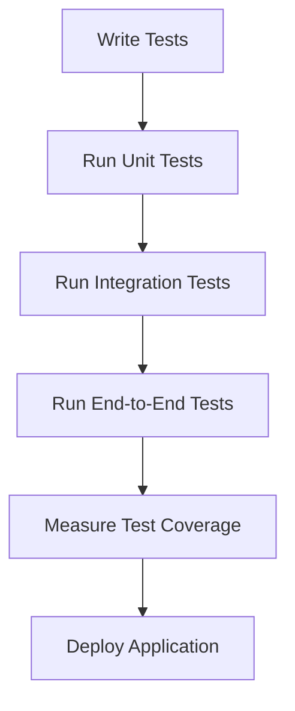

## 19.10 Testing Desktop Applications

In the world of software development, testing is a critical component that ensures the quality and reliability of applications. This is especially true for desktop applications, where user expectations for performance and stability are high. In this section, we will explore various testing methodologies and tools that can be used to test desktop applications built with JavaScript. We will cover unit testing, integration testing, and end-to-end testing, and provide examples using popular frameworks like Jest, Mocha, Spectron, and nw-autotest. Additionally, we will discuss best practices for maintaining test coverage and reliability, as well as continuous integration strategies for desktop applications.

### Importance of Testing in Desktop Applications

Testing is essential in software development for several reasons:

1. **Ensures Quality**: Testing helps identify bugs and issues before they reach the end user, ensuring a higher quality product.
2. **Enhances Reliability**: Regular testing ensures that the application behaves as expected under various conditions, increasing its reliability.
3. **Facilitates Maintenance**: Well-tested code is easier to maintain and refactor, as tests provide a safety net that ensures changes do not introduce new bugs.
4. **Improves User Experience**: By catching issues early, testing helps ensure a smooth and seamless user experience.

### Unit Testing with Jest and Mocha

Unit testing involves testing individual components or functions in isolation to ensure they work as expected. Jest and Mocha are two popular testing frameworks for JavaScript that can be used for unit testing desktop applications.

#### Jest

Jest is a testing framework developed by Facebook, known for its ease of use and powerful features like snapshot testing and coverage reporting.

```javascript
// Example of a simple unit test using Jest

// sum.js
function sum(a, b) {
  return a + b;
}
module.exports = sum;

// sum.test.js
const sum = require('./sum');

test('adds 1 + 2 to equal 3', () => {
  expect(sum(1, 2)).toBe(3);
});
```

In this example, we define a simple `sum` function and a corresponding test that checks if the function returns the correct result when adding two numbers.

#### Mocha

Mocha is another popular testing framework that is highly flexible and can be used with various assertion libraries like Chai.

```javascript
// Example of a simple unit test using Mocha and Chai

// sum.js
function sum(a, b) {
  return a + b;
}
module.exports = sum;

// sum.test.js
const assert = require('chai').assert;
const sum = require('./sum');

describe('Sum Function', function() {
  it('should return 3 when adding 1 and 2', function() {
    assert.equal(sum(1, 2), 3);
  });
});
```

In this example, we use Mocha to define a test suite for the `sum` function and Chai to perform assertions.

### End-to-End Testing with Spectron and nw-autotest

End-to-end (E2E) testing involves testing the entire application flow to ensure that all components work together as expected. Spectron and nw-autotest are tools specifically designed for E2E testing of Electron and NW.js applications, respectively.

#### Spectron

Spectron is an E2E testing framework for Electron applications that uses WebDriver to automate interactions with the application.

```javascript
// Example of an end-to-end test using Spectron

const Application = require('spectron').Application;
const assert = require('assert');

describe('Application Launch', function() {
  this.timeout(10000);

  beforeEach(function() {
    this.app = new Application({
      path: '/path/to/electron',
      args: ['/path/to/app']
    });
    return this.app.start();
  });

  afterEach(function() {
    if (this.app && this.app.isRunning()) {
      return this.app.stop();
    }
  });

  it('shows an initial window', function() {
    return this.app.client.getWindowCount().then(function(count) {
      assert.equal(count, 1);
    });
  });
});
```

In this example, we use Spectron to launch an Electron application and verify that it opens a window.

#### nw-autotest

nw-autotest is a testing tool for NW.js applications that allows for automated testing of application functionality.

```javascript
// Example of an end-to-end test using nw-autotest

const nwAutoTest = require('nw-autotest');

nwAutoTest({
  appPath: '/path/to/nwjs/app',
  tests: [
    {
      description: 'Check if main window is loaded',
      test: function(client, done) {
        client.getWindowCount().then(function(count) {
          if (count === 1) {
            done();
          } else {
            done(new Error('Expected 1 window, got ' + count));
          }
        });
      }
    }
  ]
});
```

In this example, we use nw-autotest to verify that the NW.js application opens a window.

### Mocking Modules and Isolating Components

Mocking is a technique used to isolate components during testing by replacing real dependencies with mock objects. This allows you to test components in isolation without relying on external systems.

#### Mocking with Jest

Jest provides built-in support for mocking modules, making it easy to replace real implementations with mock versions.

```javascript
// Example of mocking a module with Jest

// api.js
function fetchData() {
  return fetch('https://api.example.com/data')
    .then(response => response.json());
}
module.exports = fetchData;

// api.test.js
jest.mock('./api');

const fetchData = require('./api');

test('fetchData returns mock data', () => {
  fetchData.mockResolvedValue({ data: 'mock data' });

  return fetchData().then(data => {
    expect(data).toEqual({ data: 'mock data' });
  });
});
```

In this example, we mock the `fetchData` function to return mock data instead of making a real network request.

### Best Practices for Maintaining Test Coverage and Reliability

1. **Write Tests for Critical Paths**: Focus on testing the most critical parts of your application that are likely to impact users.
2. **Use Test Doubles**: Use mocks, stubs, and spies to isolate components and test them in isolation.
3. **Automate Tests**: Automate your tests to run them regularly and catch issues early.
4. **Measure Test Coverage**: Use tools like Istanbul to measure test coverage and identify untested parts of your code.
5. **Keep Tests Up-to-Date**: Regularly update your tests to reflect changes in your application.

### Continuous Integration Strategies for Desktop Applications

Continuous integration (CI) is a practice where code changes are automatically tested and integrated into the main codebase. This helps catch issues early and ensures that the application remains stable.

1. **Use CI Tools**: Use CI tools like Jenkins, Travis CI, or GitHub Actions to automate your testing process.
2. **Run Tests on Multiple Platforms**: Test your application on different operating systems to ensure compatibility.
3. **Integrate with Code Quality Tools**: Use tools like ESLint and Prettier to enforce code quality standards.
4. **Deploy Automatically**: Automate the deployment process to ensure that new versions of your application are released quickly and reliably.

### Try It Yourself

To get hands-on experience with testing desktop applications, try modifying the code examples provided in this section. Experiment with adding new tests, mocking different modules, and running tests on different platforms. This will help reinforce the concepts covered and give you practical experience with testing tools and techniques.

### Visualizing the Testing Process

To better understand the testing process for desktop applications, let's visualize the flow of a typical testing pipeline using a Mermaid.js diagram.



**Diagram Description**: This diagram represents the flow of a typical testing pipeline for desktop applications. It starts with writing tests, followed by running unit tests, integration tests, and end-to-end tests. Test coverage is measured, and the application is deployed if all tests pass.

### Knowledge Check

To reinforce your understanding of testing desktop applications, consider the following questions:

1. What are the benefits of testing desktop applications?
2. How can Jest be used for unit testing in JavaScript?
3. What is the purpose of end-to-end testing?
4. How does Spectron facilitate end-to-end testing for Electron applications?
5. What are some best practices for maintaining test coverage and reliability?

### Summary

In this section, we explored the importance of testing desktop applications and covered various testing methodologies and tools. We discussed unit testing with Jest and Mocha, end-to-end testing with Spectron and nw-autotest, and the importance of mocking modules and isolating components. We also highlighted best practices for maintaining test coverage and reliability, as well as continuous integration strategies for desktop applications. By following these guidelines, you can ensure that your desktop applications are of high quality and provide a seamless user experience.

Remember, testing is an ongoing process that requires regular attention and updates. As you continue to develop and maintain your desktop applications, keep testing at the forefront of your development process to ensure the best possible outcomes.

## Testing Desktop Applications with JavaScript



### What is the primary purpose of testing desktop applications?

- [x] To ensure quality and reliability
- [ ] To increase application size
- [ ] To reduce development time
- [ ] To eliminate the need for documentation

> **Explanation:** Testing ensures that applications are of high quality and reliable, providing a better user experience.

### Which testing framework is developed by Facebook and known for its ease of use?

- [x] Jest
- [ ] Mocha
- [ ] Chai
- [ ] Jasmine

> **Explanation:** Jest is developed by Facebook and is known for its ease of use and powerful features.

### What is the main advantage of using Spectron for testing Electron applications?

- [x] It automates interactions with the application
- [ ] It reduces application size
- [ ] It increases application speed
- [ ] It eliminates the need for unit tests

> **Explanation:** Spectron uses WebDriver to automate interactions with Electron applications, facilitating end-to-end testing.

### What technique is used to isolate components during testing?

- [x] Mocking
- [ ] Debugging
- [ ] Refactoring
- [ ] Compiling

> **Explanation:** Mocking replaces real dependencies with mock objects, allowing components to be tested in isolation.

### Which of the following is a best practice for maintaining test coverage?

- [x] Automate tests
- [ ] Write tests only for new features
- [ ] Avoid using test doubles
- [ ] Run tests manually

> **Explanation:** Automating tests ensures they are run regularly, helping maintain test coverage and catch issues early.

### What is the role of continuous integration in testing desktop applications?

- [x] To automate testing and integration of code changes
- [ ] To increase application size
- [ ] To reduce code quality
- [ ] To eliminate the need for testing

> **Explanation:** Continuous integration automates testing and integration of code changes, ensuring application stability.

### Which tool can be used for measuring test coverage in JavaScript applications?

- [x] Istanbul
- [ ] Spectron
- [ ] Mocha
- [ ] nw-autotest

> **Explanation:** Istanbul is a tool used for measuring test coverage in JavaScript applications.

### What is a key benefit of using mocks, stubs, and spies in testing?

- [x] They isolate components for testing
- [ ] They increase application size
- [ ] They reduce test coverage
- [ ] They eliminate the need for integration tests

> **Explanation:** Mocks, stubs, and spies isolate components, allowing them to be tested in isolation without relying on external systems.

### What is the purpose of end-to-end testing?

- [x] To test the entire application flow
- [ ] To test individual functions
- [ ] To increase application speed
- [ ] To reduce application size

> **Explanation:** End-to-end testing ensures that all components work together as expected by testing the entire application flow.

### True or False: Continuous integration tools can automate the deployment process.

- [x] True
- [ ] False

> **Explanation:** Continuous integration tools can automate the deployment process, ensuring that new versions of the application are released quickly and reliably.



Remember, this is just the beginning. As you progress, you'll build more complex and interactive desktop applications. Keep experimenting, stay curious, and enjoy the journey!
