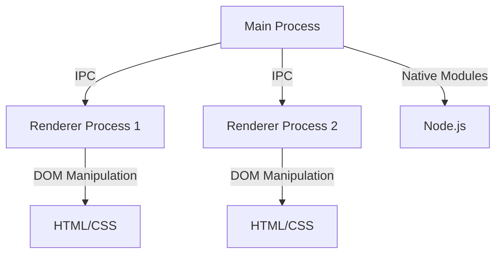

## 19.11 Case Studies of Desktop Apps Built with JavaScript

JavaScript has evolved beyond its initial role as a web scripting language to become a powerful tool for building desktop applications. Frameworks like Electron and NW.js have enabled developers to leverage their web development skills to create cross-platform desktop applications. In this section, we will explore case studies of notable desktop applications built with JavaScript, examining their development journeys, challenges faced, and solutions implemented. By understanding these real-world examples, you can gain insights into best practices and innovative solutions that can be applied to your own projects.

### Visual Studio Code

#### Overview

Visual Studio Code (VS Code) is a widely-used code editor developed by Microsoft. It is built using Electron, a framework that allows developers to create native applications with web technologies like JavaScript, HTML, and CSS. VS Code has gained immense popularity due to its speed, flexibility, and extensive ecosystem of extensions.

#### Development Journey

The development of VS Code began with the goal of creating a lightweight, fast, and extensible code editor. Microsoft chose Electron for its ability to provide a consistent experience across different operating systems while allowing the use of web technologies. The team focused on creating a modular architecture that would support a wide range of programming languages and tools.

#### Challenges and Solutions

One of the main challenges faced during the development of VS Code was ensuring performance and responsiveness. Electron applications can be resource-intensive, so the team implemented several optimization techniques:

- **Efficient Rendering**: The use of virtual DOM and efficient rendering techniques helped minimize unnecessary updates and improve performance.
- **Lazy Loading**: Features and extensions are loaded only when needed, reducing the initial load time and memory usage.
- **Native Modules**: For performance-critical tasks, native modules were used to offload processing from the main thread.

#### Key Features and Innovations

- **Extension Ecosystem**: VS Code's extension marketplace allows developers to customize and enhance their editor with a wide range of tools and integrations.
- **Integrated Terminal**: The built-in terminal provides a seamless development experience by allowing developers to run commands directly within the editor.
- **IntelliSense**: Advanced code completion and navigation features help developers write code more efficiently.

#### Performance Optimization and Scaling

To ensure scalability, the VS Code team focused on optimizing the core architecture and providing APIs that allow extensions to run efficiently. Regular performance testing and user feedback were crucial in identifying bottlenecks and areas for improvement.

### Slack

#### Overview

Slack is a collaboration platform that facilitates communication and teamwork. It is built using Electron, allowing it to run on multiple platforms with a consistent user experience. Slack's desktop application provides features like messaging, file sharing, and integrations with other tools.

#### Development Journey

Slack's development team aimed to create a seamless communication platform that would work across different devices. Electron was chosen for its ability to provide a unified codebase for desktop applications, reducing the complexity of maintaining separate native applications.

#### Challenges and Solutions

One of the challenges faced by Slack was managing resource usage, especially in environments with limited system resources. The team implemented several strategies to address this:

- **Resource Management**: Techniques like throttling and debouncing were used to manage resource-intensive operations and reduce CPU usage.
- **Optimized Rendering**: By optimizing the rendering pipeline, Slack was able to improve the responsiveness of the application, even with large amounts of data.

#### Key Features and Innovations

- **Integrations**: Slack's ability to integrate with a wide range of third-party services enhances its functionality and makes it a central hub for team collaboration.
- **Customizable Workspaces**: Users can customize their workspaces with themes, shortcuts, and integrations to suit their workflow.
- **Real-Time Messaging**: Slack provides real-time messaging capabilities, ensuring that teams can communicate effectively and efficiently.

#### Performance Optimization and Scaling

Slack's team focused on optimizing the application's performance by reducing memory usage and improving the efficiency of background processes. Regular updates and user feedback helped identify areas for improvement and ensure a smooth user experience.

### GitHub Desktop

#### Overview

GitHub Desktop is a desktop application that simplifies the process of managing Git repositories. It is built using Electron, providing a consistent experience across different operating systems. GitHub Desktop aims to make Git more accessible to developers by providing a user-friendly interface.

#### Development Journey

The development of GitHub Desktop focused on creating an intuitive interface that would make Git more approachable for developers of all skill levels. Electron was chosen for its ability to provide a cross-platform solution with a single codebase.

#### Challenges and Solutions

One of the challenges faced by the GitHub Desktop team was ensuring that the application remained responsive, even when handling large repositories. The team implemented several strategies to address this:

- **Efficient Data Handling**: Techniques like virtual scrolling and data virtualization were used to manage large datasets efficiently.
- **Background Processing**: Tasks like fetching repository data and performing Git operations were offloaded to background threads to keep the UI responsive.

#### Key Features and Innovations

- **User-Friendly Interface**: GitHub Desktop provides an intuitive interface that simplifies common Git operations, making it easier for developers to manage their repositories.
- **Seamless Integration**: The application integrates seamlessly with GitHub, providing features like pull requests, issues, and notifications directly within the app.
- **Cross-Platform Support**: GitHub Desktop provides a consistent experience across different operating systems, making it easy for developers to switch between devices.

#### Performance Optimization and Scaling

The GitHub Desktop team focused on optimizing the application's performance by reducing the impact of background processes and improving the efficiency of data handling. Regular performance testing and user feedback were crucial in identifying areas for improvement.

### Key Takeaways

- **Cross-Platform Consistency**: Electron and NW.js provide a unified codebase for desktop applications, reducing the complexity of maintaining separate native applications.
- **Performance Optimization**: Techniques like lazy loading, efficient rendering, and background processing are crucial for ensuring performance and responsiveness in desktop applications.
- **User Feedback**: Regular user feedback and performance testing help identify areas for improvement and ensure a smooth user experience.
- **Extension Ecosystems**: Providing an extension ecosystem allows developers to customize and enhance their applications, increasing their functionality and appeal.

### Try It Yourself

To gain hands-on experience with building desktop applications using JavaScript, try creating a simple Electron application. Experiment with different features and optimizations to see how they impact performance and user experience.

### Visualizing the Architecture

Below is a diagram illustrating the architecture of an Electron application, highlighting the interaction between the main process and renderer processes.

**Diagram Description**: This diagram shows the architecture of an Electron application, where the main process communicates with multiple renderer processes using Inter-Process Communication (IPC). Each renderer process handles its own DOM manipulation, while the main process can interact with native modules through Node.js.

### References and Links

- [Electron Documentation](https://www.electronjs.org/docs)
- [NW.js Documentation](https://nwjs.io/)
- [Visual Studio Code](https://code.visualstudio.com/)
- [Slack](https://slack.com/)
- [GitHub Desktop](https://desktop.github.com/)

### Knowledge Check

To reinforce your understanding of the concepts covered in this section, try answering the following questions.

## "Mastering JavaScript Desktop Apps: Case Studies and Best Practices Quiz"



### What framework is used to build Visual Studio Code?

- [x] Electron
- [ ] NW.js
- [ ] React Native
- [ ] Angular

> **Explanation:** Visual Studio Code is built using Electron, which allows it to run on multiple platforms using web technologies.

### What is a key feature of Slack's desktop application?

- [x] Real-time messaging
- [ ] Built-in compiler
- [ ] Code editor
- [ ] Database management

> **Explanation:** Slack's desktop application provides real-time messaging capabilities, facilitating effective team communication.

### Which technique is used in GitHub Desktop to manage large datasets efficiently?

- [x] Virtual scrolling
- [ ] Lazy loading
- [ ] Code splitting
- [ ] Debouncing

> **Explanation:** GitHub Desktop uses virtual scrolling to efficiently manage large datasets, ensuring a responsive user interface.

### What is a common challenge faced by Electron applications?

- [x] Resource usage
- [ ] Lack of features
- [ ] Poor security
- [ ] Limited platform support

> **Explanation:** Electron applications can be resource-intensive, requiring careful management of CPU and memory usage.

### What is a benefit of using Electron for desktop applications?

- [x] Cross-platform consistency
- [ ] Faster execution than native apps
- [ ] Lower memory usage
- [ ] Built-in database support

> **Explanation:** Electron provides a unified codebase for desktop applications, ensuring a consistent experience across different platforms.

### What is a key takeaway from the case studies?

- [x] Performance optimization is crucial
- [ ] Use of multiple codebases
- [ ] Avoid user feedback
- [ ] Focus on single platform

> **Explanation:** Performance optimization is crucial for ensuring a responsive and efficient user experience in desktop applications.

### What is a feature of VS Code's extension ecosystem?

- [x] Customization and enhancement
- [ ] Built-in database management
- [ ] Real-time messaging
- [ ] Native mobile support

> **Explanation:** VS Code's extension ecosystem allows developers to customize and enhance their editor with a wide range of tools and integrations.

### What is a technique used by Slack to manage resource-intensive operations?

- [x] Throttling
- [ ] Virtual scrolling
- [ ] Code splitting
- [ ] Lazy loading

> **Explanation:** Slack uses throttling to manage resource-intensive operations and reduce CPU usage.

### What is a challenge faced by GitHub Desktop?

- [x] Handling large repositories
- [ ] Lack of features
- [ ] Poor security
- [ ] Limited platform support

> **Explanation:** GitHub Desktop faces the challenge of handling large repositories while maintaining a responsive user interface.

### True or False: Electron allows developers to create native applications using web technologies.

- [x] True
- [ ] False

> **Explanation:** True. Electron allows developers to create native applications using web technologies like JavaScript, HTML, and CSS.



Remember, this is just the beginning. As you progress, you'll build more complex and interactive desktop applications. Keep experimenting, stay curious, and enjoy the journey!
