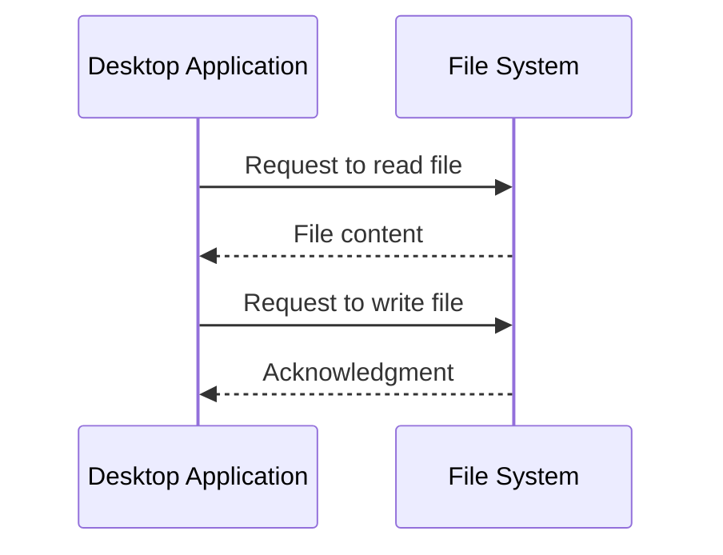

## 19.4 Interacting with the File System

In the realm of desktop development with JavaScript, interacting with the file system is a fundamental capability that enables applications to read, write, and manipulate files. This section delves into the use of Node.js APIs for file system operations within Electron and NW.js applications, providing a comprehensive guide on how to handle files securely and efficiently.

### Understanding Node.js File System Module

Node.js provides a built-in module called `fs` that allows you to interact with the file system. This module is essential for performing operations such as reading from and writing to files, creating directories, and managing file permissions.

#### Key Features of the `fs` Module

- **Synchronous and Asynchronous Methods**: The `fs` module offers both synchronous and asynchronous methods for file operations. Asynchronous methods are preferred for non-blocking operations.
- **File and Directory Operations**: You can create, read, update, and delete files and directories.
- **Stream Support**: The module supports file streaming, which is useful for handling large files efficiently.

### Setting Up Your Environment

Before diving into file system operations, ensure you have Node.js installed. You can verify your installation by running:

```bash
node -v
npm -v
```

For desktop applications, you will typically use frameworks like Electron or NW.js, which integrate Node.js capabilities.

### Reading from Files

Reading from files is a common requirement in desktop applications. The `fs` module provides several methods to accomplish this.

#### Asynchronous File Reading

The asynchronous method `fs.readFile()` is used to read files without blocking the execution of your program.

```javascript
const fs = require('fs');

// Asynchronously read a file
fs.readFile('example.txt', 'utf8', (err, data) => {
  if (err) {
    console.error('Error reading file:', err);
    return;
  }
  console.log('File content:', data);
});
```

#### Synchronous File Reading

For scenarios where blocking is acceptable, use `fs.readFileSync()`.

```javascript
const fs = require('fs');

// Synchronously read a file
try {
  const data = fs.readFileSync('example.txt', 'utf8');
  console.log('File content:', data);
} catch (err) {
  console.error('Error reading file:', err);
}
```

### Writing to Files

Writing to files is equally straightforward with the `fs` module.

#### Asynchronous File Writing

Use `fs.writeFile()` to write data to a file asynchronously.

```javascript
const fs = require('fs');

const content = 'Hello, World!';

// Asynchronously write to a file
fs.writeFile('example.txt', content, 'utf8', (err) => {
  if (err) {
    console.error('Error writing to file:', err);
    return;
  }
  console.log('File written successfully');
});
```

#### Synchronous File Writing

For synchronous operations, use `fs.writeFileSync()`.

```javascript
const fs = require('fs');

const content = 'Hello, World!';

// Synchronously write to a file
try {
  fs.writeFileSync('example.txt', content, 'utf8');
  console.log('File written successfully');
} catch (err) {
  console.error('Error writing to file:', err);
}
```

### Handling Permissions and User Prompts

When accessing the file system, especially on macOS Catalina and later, handling permissions and user prompts is crucial.

#### macOS Permissions

macOS requires explicit user permission for applications to access certain directories. Ensure your application requests the necessary permissions and handles user prompts gracefully.

#### Electron and NW.js Dialogs

Both Electron and NW.js provide dialog modules to facilitate file operations with user interaction.

```javascript
const { dialog } = require('electron').remote;

// Open a file dialog
dialog.showOpenDialog({
  properties: ['openFile']
}).then(result => {
  if (!result.canceled) {
    console.log('Selected file:', result.filePaths[0]);
  }
}).catch(err => {
  console.error('Error opening file dialog:', err);
});
```

### Security Considerations

Accessing the file system poses security risks. Follow these best practices to ensure your application is secure:

- **Validate User Input**: Always validate and sanitize user input to prevent path traversal attacks.
- **Limit File Access**: Restrict file access to necessary directories and files.
- **Use Secure Defaults**: Ensure your application uses secure defaults for file permissions and access controls.

### Error Handling and User Feedback

Proper error handling and user feedback are essential for a robust application.

#### Error Handling

Use try-catch blocks and error callbacks to handle errors gracefully.

```javascript
try {
  // File operation
} catch (err) {
  console.error('An error occurred:', err);
}
```

#### User Feedback

Provide clear feedback to users about file operations, especially in case of errors.

```javascript
const fs = require('fs');

fs.readFile('example.txt', 'utf8', (err, data) => {
  if (err) {
    alert('Failed to read file. Please try again.');
    return;
  }
  alert('File read successfully');
});
```

### Encouraging Experimentation

To deepen your understanding, try modifying the code examples provided. Experiment with different file operations, such as appending to files or deleting files. Explore the use of streams for handling large files efficiently.

### Visualizing File System Interaction

Below is a sequence diagram illustrating the interaction between a desktop application and the file system using Node.js APIs.



### Further Reading

For more information on file system operations and Node.js, consider exploring the following resources:

- [Node.js File System Documentation](https://nodejs.org/api/fs.html)
- [Electron Documentation](https://www.electronjs.org/docs)
- [NW.js Documentation](https://nwjs.io/doc/)

### Knowledge Check

To reinforce your learning, consider the following questions:

1. What are the differences between synchronous and asynchronous file operations?
2. How can you handle file system permissions on macOS?
3. What are some security considerations when accessing the file system?
4. How can you provide user feedback for file operations?

### Summary

Interacting with the file system is a powerful feature of JavaScript desktop applications, enabling a wide range of functionalities. By leveraging Node.js APIs within Electron and NW.js, you can perform file operations efficiently while ensuring security and providing a seamless user experience. Remember to handle permissions, validate inputs, and provide clear user feedback to create robust applications.

### Quiz: Mastering File System Interaction in JavaScript Desktop Apps



### What is the primary module used for file system operations in Node.js?

- [x] fs
- [ ] path
- [ ] os
- [ ] http

> **Explanation:** The `fs` module in Node.js is specifically designed for file system operations, such as reading and writing files.

### Which method is used to read a file asynchronously in Node.js?

- [x] fs.readFile()
- [ ] fs.readFileSync()
- [ ] fs.open()
- [ ] fs.close()

> **Explanation:** `fs.readFile()` is the asynchronous method for reading files in Node.js, allowing non-blocking operations.

### How can you handle file system permissions on macOS Catalina and later?

- [x] Request explicit user permission
- [ ] Use sudo commands
- [ ] Modify system files directly
- [ ] Disable security features

> **Explanation:** macOS Catalina and later require explicit user permission for applications to access certain directories.

### What is a key security consideration when accessing the file system?

- [x] Validate and sanitize user input
- [ ] Use global variables
- [ ] Disable error handling
- [ ] Allow unrestricted file access

> **Explanation:** Validating and sanitizing user input helps prevent security vulnerabilities such as path traversal attacks.

### Which Node.js method is used for synchronous file writing?

- [x] fs.writeFileSync()
- [ ] fs.writeFile()
- [ ] fs.appendFile()
- [ ] fs.unlink()

> **Explanation:** `fs.writeFileSync()` is the synchronous method for writing files in Node.js, blocking execution until the operation completes.

### What is the purpose of using dialogs in Electron and NW.js?

- [x] Facilitate user interaction for file operations
- [ ] Increase application size
- [ ] Reduce security
- [ ] Disable user input

> **Explanation:** Dialogs in Electron and NW.js are used to facilitate user interaction, such as opening and saving files.

### How can you provide user feedback for file operations?

- [x] Use alerts or notifications
- [ ] Ignore user input
- [ ] Disable error messages
- [ ] Use global variables

> **Explanation:** Providing alerts or notifications helps inform users about the success or failure of file operations.

### What is a benefit of using asynchronous file operations?

- [x] Non-blocking execution
- [ ] Increased memory usage
- [ ] Slower performance
- [ ] More complex code

> **Explanation:** Asynchronous file operations allow non-blocking execution, improving application responsiveness.

### Which method is used to write data to a file asynchronously?

- [x] fs.writeFile()
- [ ] fs.writeFileSync()
- [ ] fs.appendFileSync()
- [ ] fs.unlinkSync()

> **Explanation:** `fs.writeFile()` is the asynchronous method for writing data to a file in Node.js.

### True or False: The `fs` module supports both file and directory operations.

- [x] True
- [ ] False

> **Explanation:** The `fs` module in Node.js supports a wide range of operations for both files and directories.



Remember, this is just the beginning. As you progress, you'll build more complex and interactive desktop applications. Keep experimenting, stay curious, and enjoy the journey!
