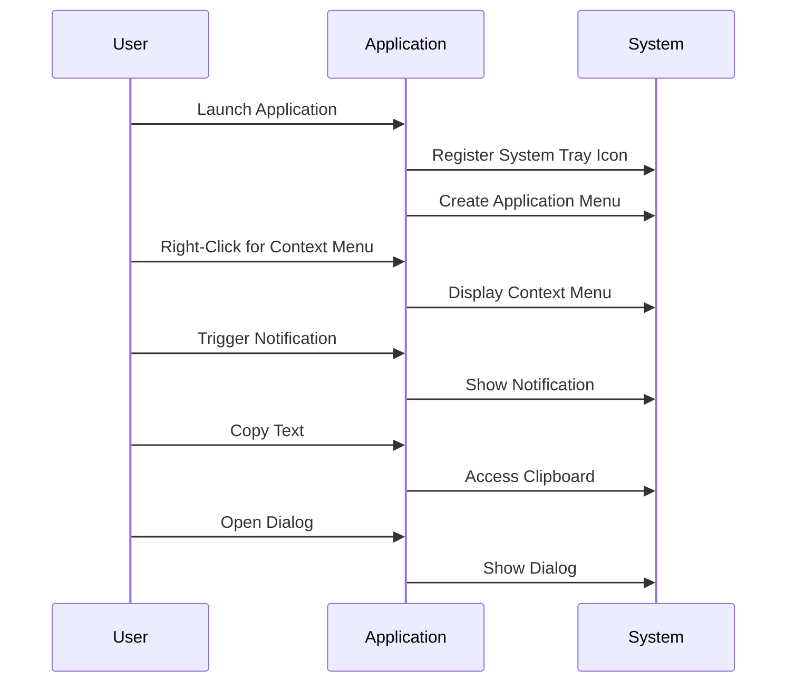

## 19.5 Native System Integration

In the realm of desktop development with JavaScript, integrating with native system features is crucial for creating applications that feel seamless and intuitive to users. This section delves into how JavaScript can be used to access and manipulate native system features such as menus, notifications, system trays, and more, using frameworks like Electron.

### Creating Native Menus and Context Menus

One of the key aspects of native system integration is the ability to create menus that blend with the operating system's look and feel. In JavaScript desktop applications, this is typically achieved using Electron, which provides APIs to create both application menus and context menus.

#### Application Menus

Application menus are the menus that appear at the top of the application window or in the system's menu bar. They are essential for providing users with access to the application's features and settings.

```javascript
const { app, Menu } = require('electron');

app.on('ready', () => {
  const template = [
    {
      label: 'File',
      submenu: [
        { role: 'quit' }
      ]
    },
    {
      label: 'Edit',
      submenu: [
        { role: 'undo' },
        { role: 'redo' },
        { type: 'separator' },
        { role: 'cut' },
        { role: 'copy' },
        { role: 'paste' }
      ]
    }
  ];

  const menu = Menu.buildFromTemplate(template);
  Menu.setApplicationMenu(menu);
});
```

In this example, we create a simple application menu with "File" and "Edit" options. The `role` property allows us to use predefined menu items that automatically integrate with the system's native functionality.

#### Context Menus

Context menus are the menus that appear when a user right-clicks on an element. They provide context-specific actions.

```javascript
const { Menu, MenuItem } = require('electron');

const contextMenu = new Menu();
contextMenu.append(new MenuItem({ label: 'Cut', role: 'cut' }));
contextMenu.append(new MenuItem({ label: 'Copy', role: 'copy' }));
contextMenu.append(new MenuItem({ label: 'Paste', role: 'paste' }));

window.addEventListener('contextmenu', (e) => {
  e.preventDefault();
  contextMenu.popup({ window: remote.getCurrentWindow() });
}, false);
```

This code snippet demonstrates how to create a context menu with "Cut", "Copy", and "Paste" options. The `popup` method is used to display the menu at the current mouse position.

### Implementing System Notifications

System notifications are a great way to inform users about important events or updates. In JavaScript desktop applications, you can use the Notification API or libraries like `node-notifier` to create system notifications.

#### Using the Notification API

The Notification API is a simple and effective way to create notifications.

```javascript
new Notification('Hello!', {
  body: 'This is a notification from your application.'
});
```

This code creates a basic notification with a title and body text. It's a straightforward way to alert users without interrupting their workflow.

#### Using Node-Notifier

For more advanced notifications, you can use `node-notifier`, which provides more customization options and supports multiple platforms.

```javascript
const notifier = require('node-notifier');

notifier.notify({
  title: 'My Application',
  message: 'You have a new message!',
  icon: path.join(__dirname, 'icon.png'), // Absolute path to an icon
  sound: true, // Only Notification Center or Windows Toasters
  wait: true // Wait with callback until user action is taken on notification
});
```

This example shows how to use `node-notifier` to create a notification with an icon and sound. The `wait` option allows the application to handle user interactions with the notification.

### Integrating with the System Tray or Dock

The system tray (or dock on macOS) is a convenient place to provide quick access to application features or status information.

#### Creating a System Tray Icon

```javascript
const { app, Tray, Menu } = require('electron');
let tray = null;

app.on('ready', () => {
  tray = new Tray('/path/to/icon.png');
  const contextMenu = Menu.buildFromTemplate([
    { label: 'Item1', type: 'radio' },
    { label: 'Item2', type: 'radio' },
    { label: 'Item3', type: 'radio', checked: true }
  ]);
  tray.setToolTip('This is my application.');
  tray.setContextMenu(contextMenu);
});
```

In this example, we create a system tray icon with a context menu. The `setToolTip` method sets the tooltip text that appears when the user hovers over the tray icon.

### Accessing Clipboard Functionality

Accessing the clipboard is essential for applications that need to interact with text or data copied by the user.

```javascript
const { clipboard } = require('electron');

// Write text to the clipboard
clipboard.writeText('Hello, Clipboard!');

// Read text from the clipboard
const text = clipboard.readText();
console.log(text); // Outputs: Hello, Clipboard!
```

This code demonstrates how to write and read text from the clipboard using Electron's `clipboard` module.

### Accessing Native Dialogs and Modals

Native dialogs and modals are used to interact with users in a more direct way, often requiring a response or action.

#### Using Dialogs

```javascript
const { dialog } = require('electron');

dialog.showMessageBox({
  type: 'info',
  title: 'Information',
  message: 'This is an informational dialog.',
  buttons: ['OK']
});
```

This example shows how to create a simple informational dialog using Electron's `dialog` module.

### Best Practices for Providing a Native-Like User Experience

To create a seamless user experience, it's important to follow best practices that align with the native operating system's design and behavior.

- **Consistency**: Ensure that your application's UI and behavior are consistent with the operating system's conventions. This includes using native controls and adhering to platform-specific guidelines.
- **Responsiveness**: Make sure your application is responsive and performs well, even on lower-end hardware. This includes optimizing resource usage and minimizing startup times.
- **Accessibility**: Implement accessibility features to make your application usable by people with disabilities. This includes providing keyboard shortcuts, screen reader support, and high-contrast themes.
- **Localization**: Support multiple languages and regional settings to make your application accessible to a global audience.

### Visualizing System Integration

To better understand how JavaScript desktop applications interact with native system features, let's visualize the process using a sequence diagram.



This diagram illustrates the interaction between the user, the application, and the system when integrating native features.

### Try It Yourself

To deepen your understanding, try modifying the code examples provided:

- **Create a custom context menu** with additional options and actions.
- **Experiment with different notification styles** using `node-notifier`.
- **Add more functionality to the system tray icon**, such as dynamic status updates or quick actions.
- **Implement a file dialog** that allows users to select and open files from their system.

### Knowledge Check

To reinforce your learning, consider the following questions:

- How can you create a native application menu using Electron?
- What are the benefits of using the Notification API for system notifications?
- How can you access and manipulate the clipboard in a JavaScript desktop application?
- What are some best practices for creating a native-like user experience?

### Conclusion

Integrating JavaScript desktop applications with native system features is essential for creating applications that feel natural and intuitive to users. By leveraging frameworks like Electron, developers can access and manipulate native system features such as menus, notifications, system trays, and more, providing a seamless user experience.

Remember, this is just the beginning. As you progress, you'll build more complex and interactive desktop applications. Keep experimenting, stay curious, and enjoy the journey!

## Quiz: Mastering Native System Integration in JavaScript Desktop Applications



### What is the primary framework used for integrating JavaScript desktop applications with native system features?

- [x] Electron
- [ ] React Native
- [ ] Angular
- [ ] Vue.js

> **Explanation:** Electron is the primary framework used for integrating JavaScript desktop applications with native system features.

### Which API is commonly used for creating system notifications in JavaScript desktop applications?

- [x] Notification API
- [ ] Fetch API
- [ ] WebSocket API
- [ ] File API

> **Explanation:** The Notification API is commonly used for creating system notifications in JavaScript desktop applications.

### How can you create a context menu in a JavaScript desktop application?

- [x] Using the Menu and MenuItem modules in Electron
- [ ] Using the Fetch API
- [ ] Using the WebSocket API
- [ ] Using the File API

> **Explanation:** You can create a context menu in a JavaScript desktop application using the Menu and MenuItem modules in Electron.

### What is the role of the `clipboard` module in Electron?

- [x] To access and manipulate the system clipboard
- [ ] To fetch data from a server
- [ ] To establish WebSocket connections
- [ ] To read and write files

> **Explanation:** The `clipboard` module in Electron is used to access and manipulate the system clipboard.

### Which method is used to display a context menu at the current mouse position?

- [x] `popup`
- [ ] `show`
- [ ] `display`
- [ ] `render`

> **Explanation:** The `popup` method is used to display a context menu at the current mouse position.

### What is a best practice for providing a native-like user experience?

- [x] Consistency with the operating system's design and behavior
- [ ] Using only custom controls
- [ ] Ignoring platform-specific guidelines
- [ ] Minimizing accessibility features

> **Explanation:** Consistency with the operating system's design and behavior is a best practice for providing a native-like user experience.

### How can you create a system tray icon in a JavaScript desktop application?

- [x] Using the Tray module in Electron
- [ ] Using the Fetch API
- [ ] Using the WebSocket API
- [ ] Using the File API

> **Explanation:** You can create a system tray icon in a JavaScript desktop application using the Tray module in Electron.

### What is the purpose of the `dialog` module in Electron?

- [x] To create native dialogs and modals
- [ ] To fetch data from a server
- [ ] To establish WebSocket connections
- [ ] To read and write files

> **Explanation:** The `dialog` module in Electron is used to create native dialogs and modals.

### Which of the following is a benefit of using `node-notifier` for notifications?

- [x] More customization options and support for multiple platforms
- [ ] Limited to only one platform
- [ ] No support for icons or sounds
- [ ] Requires a server connection

> **Explanation:** `node-notifier` provides more customization options and supports multiple platforms for notifications.

### True or False: The Notification API can be used to create notifications with icons and sounds.

- [x] True
- [ ] False

> **Explanation:** The Notification API can be used to create notifications with icons and sounds.


