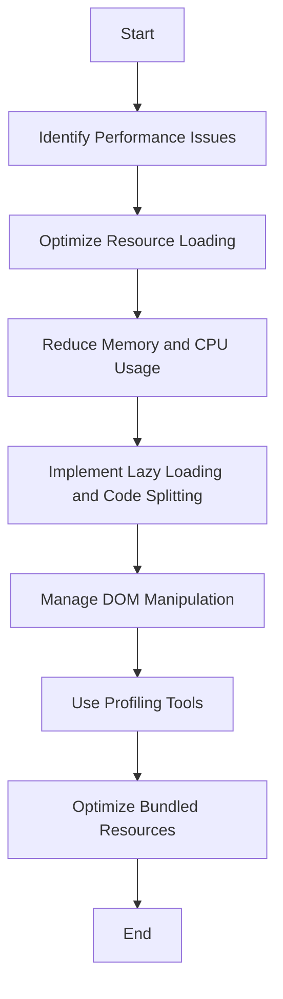

## 19.6 Performance Optimization for Desktop Apps

In the realm of desktop application development, performance optimization is paramount to ensure applications run smoothly and efficiently. This section delves into the techniques and strategies for optimizing desktop apps built with JavaScript frameworks like Electron and NW.js. We will explore common performance issues, methods to minimize application startup time, reduce memory consumption, and manage CPU usage. Additionally, we will discuss lazy loading, code splitting, and the impact of heavy DOM manipulation, along with tools for profiling and monitoring application performance.

### Common Performance Issues in Electron and NW.js Applications

Desktop applications built with frameworks like Electron and NW.js often face unique performance challenges due to their reliance on web technologies. Some common issues include:

- **High Memory Usage**: Electron and NW.js applications can consume significant memory, especially when multiple browser windows are open.
- **Slow Startup Times**: The initial loading of resources can lead to sluggish startup times.
- **Excessive CPU Usage**: Intensive operations, such as heavy DOM manipulation or complex calculations, can lead to high CPU usage.
- **Inefficient Resource Management**: Poor handling of resources, such as images and scripts, can degrade performance.

### Minimizing Application Startup Time

To enhance user experience, it's crucial to minimize the startup time of desktop applications. Here are some strategies:

1. **Optimize Resource Loading**: Use techniques like lazy loading and code splitting to load only the necessary resources initially. This reduces the amount of data loaded at startup.

2. **Bundle and Minify Assets**: Use tools like Webpack to bundle and minify JavaScript and CSS files. This reduces the number of HTTP requests and the size of files, speeding up the loading process.

3. **Preload Critical Resources**: Identify and preload critical resources that are essential for the initial rendering of the application.

4. **Use Asynchronous Loading**: Load non-essential scripts and resources asynchronously to prevent blocking the main thread.

5. **Profile Startup Performance**: Use profiling tools to identify bottlenecks during startup and address them accordingly.

### Reducing Memory Consumption and CPU Usage

Efficient memory and CPU usage are vital for maintaining application performance. Consider the following techniques:

1. **Efficient Memory Management**: 
   - Use memory profiling tools to identify memory leaks and optimize memory usage.
   - Avoid unnecessary object creation and release unused objects promptly.

2. **Optimize CPU-Intensive Tasks**:
   - Offload heavy computations to Web Workers to prevent blocking the main thread.
   - Use throttling and debouncing techniques to manage the frequency of function execution.

3. **Manage DOM Manipulation**:
   - Minimize direct DOM manipulation and use virtual DOM techniques to reduce reflows and repaints.
   - Batch DOM updates to minimize layout thrashing.

### Lazy Loading and Code Splitting

Lazy loading and code splitting are powerful techniques to improve performance by loading resources only when needed.

- **Lazy Loading**: Defer the loading of non-critical resources until they are needed. This reduces the initial load time and improves perceived performance.

- **Code Splitting**: Break down the application into smaller chunks that can be loaded on demand. This reduces the initial bundle size and speeds up the loading process.

```javascript
// Example of lazy loading a module in an Electron app
async function loadHeavyModule() {
  const { heavyFunction } = await import('./heavyModule.js');
  heavyFunction();
}

// Trigger lazy loading when needed
document.getElementById('loadButton').addEventListener('click', loadHeavyModule);
```

### Impact of Heavy DOM Manipulation

Heavy DOM manipulation can significantly impact performance, leading to slow rendering and high CPU usage. To manage this:

- **Use Virtual DOM**: Implement a virtual DOM to minimize direct DOM updates and improve rendering performance.

- **Batch DOM Updates**: Group multiple DOM updates into a single operation to reduce reflows and repaints.

- **Optimize Event Handling**: Use event delegation to minimize the number of event listeners and improve performance.

### Tools for Profiling and Monitoring Application Performance

Profiling and monitoring tools are essential for identifying performance bottlenecks and optimizing applications. Some popular tools include:

- **Chrome DevTools**: Offers comprehensive profiling features for analyzing memory usage, CPU consumption, and network performance.

- **Electron DevTools**: Provides additional insights specific to Electron applications, including memory and CPU profiling.

- **NW.js Profiler**: Offers profiling capabilities tailored for NW.js applications.

- **Heap Snapshot**: Use heap snapshots to identify memory leaks and optimize memory usage.

### Optimizing Bundled Resources and Assets

Efficient management of bundled resources and assets is crucial for performance optimization. Consider the following:

- **Use Compression**: Compress assets using tools like Gzip or Brotli to reduce file sizes and improve loading times.

- **Optimize Images**: Use image optimization techniques, such as resizing and format conversion, to reduce image sizes.

- **Leverage Caching**: Implement caching strategies to reduce the need for repeated resource loading.

- **Use Content Delivery Networks (CDNs)**: Distribute assets via CDNs to improve loading times and reduce server load.

### Visualizing Performance Optimization Techniques

To better understand the flow of performance optimization techniques, let's visualize the process using a flowchart:



**Figure 1**: Flowchart illustrating the process of performance optimization for desktop applications.

### Knowledge Check

To reinforce your understanding of performance optimization for desktop apps, consider the following questions:

1. What are some common performance issues in Electron and NW.js applications?
2. How can lazy loading improve application performance?
3. What is the impact of heavy DOM manipulation on application performance?
4. How can you reduce memory consumption in a desktop application?
5. What tools can be used for profiling and monitoring application performance?

### Conclusion

Optimizing the performance of desktop applications built with JavaScript frameworks like Electron and NW.js is crucial for delivering a smooth and efficient user experience. By addressing common performance issues, minimizing startup time, reducing memory and CPU usage, and leveraging techniques like lazy loading and code splitting, you can significantly enhance the performance of your applications. Remember to use profiling tools to identify bottlenecks and continuously monitor and optimize your applications.

### Embrace the Journey

Remember, this is just the beginning. As you progress, you'll build more complex and interactive desktop applications. Keep experimenting, stay curious, and enjoy the journey!

## Test Your Knowledge on Performance Optimization for Desktop Apps



### What is a common performance issue in Electron applications?

- [x] High memory usage
- [ ] Low memory usage
- [ ] Fast startup times
- [ ] Low CPU usage

> **Explanation:** Electron applications often face high memory usage due to their reliance on web technologies.

### How can lazy loading improve application performance?

- [x] By deferring the loading of non-critical resources
- [ ] By loading all resources at once
- [ ] By increasing the initial load time
- [ ] By blocking the main thread

> **Explanation:** Lazy loading defers the loading of non-critical resources until they are needed, reducing the initial load time.

### What is the impact of heavy DOM manipulation on application performance?

- [x] It can lead to slow rendering and high CPU usage
- [ ] It improves rendering speed
- [ ] It reduces CPU usage
- [ ] It has no impact on performance

> **Explanation:** Heavy DOM manipulation can significantly impact performance, leading to slow rendering and high CPU usage.

### How can you reduce memory consumption in a desktop application?

- [x] By using memory profiling tools to identify leaks
- [ ] By creating more objects
- [ ] By avoiding memory profiling
- [ ] By increasing memory usage

> **Explanation:** Memory profiling tools help identify memory leaks and optimize memory usage, reducing consumption.

### What tools can be used for profiling and monitoring application performance?

- [x] Chrome DevTools
- [x] Electron DevTools
- [ ] Notepad
- [ ] Paint

> **Explanation:** Chrome DevTools and Electron DevTools offer comprehensive profiling features for analyzing application performance.

### What is the benefit of using a virtual DOM?

- [x] It minimizes direct DOM updates and improves rendering performance
- [ ] It increases direct DOM updates
- [ ] It slows down rendering performance
- [ ] It has no impact on rendering

> **Explanation:** A virtual DOM minimizes direct DOM updates, improving rendering performance by reducing reflows and repaints.

### How can you optimize bundled resources and assets?

- [x] By using compression tools like Gzip
- [x] By optimizing images
- [ ] By increasing file sizes
- [ ] By avoiding compression

> **Explanation:** Compression tools and image optimization reduce file sizes, improving loading times and performance.

### What is the purpose of code splitting?

- [x] To break down the application into smaller chunks
- [ ] To load all resources at once
- [ ] To increase the initial bundle size
- [ ] To block the main thread

> **Explanation:** Code splitting breaks down the application into smaller chunks that can be loaded on demand, reducing the initial bundle size.

### How can you manage CPU-intensive tasks in a desktop application?

- [x] By offloading heavy computations to Web Workers
- [ ] By blocking the main thread
- [ ] By increasing CPU usage
- [ ] By avoiding Web Workers

> **Explanation:** Offloading heavy computations to Web Workers prevents blocking the main thread, managing CPU usage efficiently.

### True or False: Profiling tools are not necessary for performance optimization.

- [ ] True
- [x] False

> **Explanation:** Profiling tools are essential for identifying performance bottlenecks and optimizing applications.


