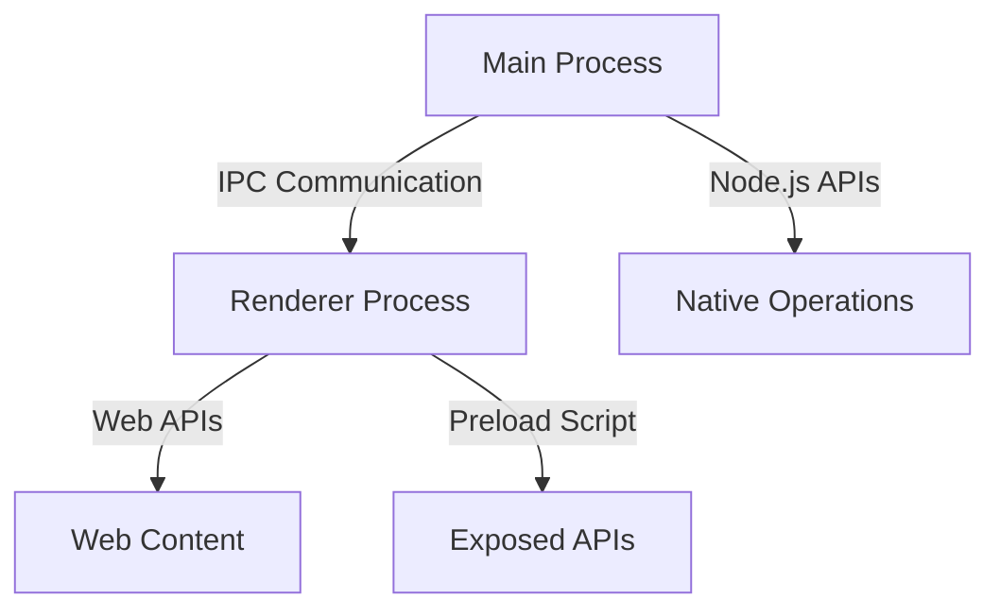

## 19.7 Security Best Practices

In the realm of desktop development with JavaScript, security is a paramount concern. As developers, we must ensure that our applications are not only functional but also secure against potential threats. This section delves into the security considerations specific to desktop applications built with web technologies, focusing on frameworks like Electron and NW.js. We'll explore how to protect against vulnerabilities and ensure user data safety.

### Understanding the Security Model of Electron and NW.js

Electron and NW.js are popular frameworks for building cross-platform desktop applications using web technologies. They leverage the power of Node.js and Chromium to create rich desktop experiences. However, this combination of web and native capabilities introduces unique security challenges.

#### Main and Renderer Processes

Both Electron and NW.js utilize a multi-process architecture, consisting of a main process and one or more renderer processes. Understanding this architecture is crucial for implementing security best practices.

- **Main Process**: This process runs the application's core logic and manages native operations. It has full access to Node.js APIs and the operating system.
- **Renderer Process**: Each renderer process is responsible for rendering a web page. By default, it also has access to Node.js APIs, which can pose security risks if not properly managed.

### Risks of Executing Untrusted Code or Including Remote Content

One of the primary security concerns in desktop applications is the execution of untrusted code or the inclusion of remote content. This can lead to various vulnerabilities, including:

- **Remote Code Execution (RCE)**: If an attacker can inject malicious code into your application, they can execute arbitrary commands on the user's machine.
- **Cross-Site Scripting (XSS)**: Including remote content without proper sanitization can lead to XSS attacks, compromising user data and application integrity.

### Best Practices for Securing Desktop Applications

To mitigate these risks, developers should adhere to the following best practices:

#### Disable or Limit Node.js Integration in Renderer Processes

By default, Electron and NW.js allow Node.js integration in renderer processes, which can be dangerous. It's crucial to disable or limit this integration to reduce the attack surface.

- **Disable Node.js Integration**: Set `nodeIntegration` to `false` in the `webPreferences` of your `BrowserWindow`:

```javascript
const { BrowserWindow } = require('electron');

let win = new BrowserWindow({
  webPreferences: {
    nodeIntegration: false,
    contextIsolation: true
  }
});
```

- **Use Preload Scripts**: If you need to expose specific Node.js APIs to the renderer, use preload scripts with the `contextBridge` API to safely expose only the necessary functionality.

#### Use Context Isolation and the `contextBridge` API

Context isolation is a security feature that ensures the renderer's JavaScript context is isolated from the Electron context. This prevents untrusted content from accessing Electron APIs directly.

- **Enable Context Isolation**: Always enable context isolation to protect your application:

```javascript
let win = new BrowserWindow({
  webPreferences: {
    contextIsolation: true
  }
});
```

- **Expose APIs Safely**: Use the `contextBridge` API to expose safe APIs to the renderer:

```javascript
const { contextBridge } = require('electron');

contextBridge.exposeInMainWorld('api', {
  doSomething: () => {
    // Safe function exposed to the renderer
  }
});
```

### Handling Updates Securely and Verifying Code Signatures

Keeping your application updated is essential for security, but it's equally important to handle updates securely.

- **Use Code Signing**: Sign your application and updates with a trusted certificate to ensure authenticity and integrity.
- **Verify Update Sources**: Always verify the source of updates to prevent man-in-the-middle attacks.

### Keeping Dependencies Updated

Regularly updating your dependencies is crucial to mitigate known vulnerabilities. Use tools like `npm audit` to identify and fix security issues in your dependencies.

### Official Security Guidelines

For more detailed security guidelines, refer to the official documentation:

- [Electron Security Considerations](https://www.electronjs.org/docs/tutorial/security)

### Visualizing the Security Architecture

To better understand the security architecture of Electron applications, let's visualize the interaction between the main and renderer processes using a Mermaid.js diagram.



**Diagram Description**: This diagram illustrates the interaction between the main process and renderer process in an Electron application. The main process communicates with the renderer process via IPC (Inter-Process Communication). The renderer process interacts with web content and can access exposed APIs through preload scripts. The main process handles native operations using Node.js APIs.

### Knowledge Check

Let's reinforce our understanding with a few questions:

1. What is the primary security risk of enabling Node.js integration in renderer processes?
2. How does context isolation enhance security in Electron applications?
3. Why is it important to verify the source of application updates?

### Exercises

1. **Exercise 1**: Modify the provided code example to include a safe API using the `contextBridge` API.
2. **Exercise 2**: Set up a simple Electron application and implement code signing for updates.

### Summary

In this section, we've explored the security best practices for desktop applications built with JavaScript, focusing on Electron and NW.js. By understanding the security model, disabling unnecessary Node.js integration, using context isolation, and handling updates securely, we can protect our applications from potential threats. Remember, security is an ongoing process, and staying informed about the latest vulnerabilities and best practices is key to maintaining a secure application.

### Embrace the Journey

Security is a critical aspect of software development, and mastering it requires continuous learning and adaptation. As you implement these best practices, remember that this is just the beginning. Keep exploring, stay vigilant, and enjoy the journey of building secure and robust desktop applications with JavaScript!

---

## Security Best Practices Quiz



### What is the primary security risk of enabling Node.js integration in renderer processes?

- [x] It allows access to Node.js APIs, which can lead to remote code execution.
- [ ] It prevents the use of web APIs.
- [ ] It increases the application's performance.
- [ ] It simplifies the application's architecture.

> **Explanation:** Enabling Node.js integration in renderer processes allows access to Node.js APIs, which can be exploited for remote code execution if untrusted content is executed.

### How does context isolation enhance security in Electron applications?

- [x] It isolates the renderer's JavaScript context from the Electron context.
- [ ] It allows direct access to Node.js APIs.
- [ ] It increases the application's memory usage.
- [ ] It simplifies the application's codebase.

> **Explanation:** Context isolation enhances security by isolating the renderer's JavaScript context from the Electron context, preventing untrusted content from accessing Electron APIs directly.

### Why is it important to verify the source of application updates?

- [x] To prevent man-in-the-middle attacks.
- [ ] To increase the application's performance.
- [ ] To simplify the update process.
- [ ] To reduce the application's size.

> **Explanation:** Verifying the source of application updates is important to prevent man-in-the-middle attacks, ensuring that updates are authentic and have not been tampered with.

### What is the role of the `contextBridge` API in Electron applications?

- [x] To safely expose APIs to the renderer process.
- [ ] To disable Node.js integration.
- [ ] To increase the application's performance.
- [ ] To simplify the application's architecture.

> **Explanation:** The `contextBridge` API is used to safely expose APIs to the renderer process, allowing controlled access to Node.js functionality.

### What is a key benefit of using code signing for application updates?

- [x] It ensures the authenticity and integrity of updates.
- [ ] It increases the application's performance.
- [ ] It simplifies the update process.
- [ ] It reduces the application's size.

> **Explanation:** Code signing ensures the authenticity and integrity of updates, verifying that they come from a trusted source and have not been tampered with.

### What tool can be used to identify and fix security issues in dependencies?

- [x] npm audit
- [ ] npm install
- [ ] npm update
- [ ] npm run

> **Explanation:** `npm audit` is a tool used to identify and fix security issues in dependencies, helping developers keep their applications secure.

### What is the purpose of disabling Node.js integration in renderer processes?

- [x] To reduce the attack surface and enhance security.
- [ ] To increase the application's performance.
- [ ] To simplify the application's architecture.
- [ ] To allow direct access to web APIs.

> **Explanation:** Disabling Node.js integration in renderer processes reduces the attack surface and enhances security by preventing untrusted content from accessing Node.js APIs.

### What is a potential risk of including remote content in a desktop application?

- [x] Cross-Site Scripting (XSS) attacks.
- [ ] Increased application performance.
- [ ] Simplified application architecture.
- [ ] Reduced application size.

> **Explanation:** Including remote content without proper sanitization can lead to Cross-Site Scripting (XSS) attacks, compromising user data and application integrity.

### What is the main function of the main process in Electron applications?

- [x] To run the application's core logic and manage native operations.
- [ ] To render web pages.
- [ ] To handle user interactions.
- [ ] To simplify the application's architecture.

> **Explanation:** The main process in Electron applications runs the application's core logic and manages native operations, having full access to Node.js APIs and the operating system.

### True or False: Keeping dependencies updated is crucial to mitigate known vulnerabilities.

- [x] True
- [ ] False

> **Explanation:** Keeping dependencies updated is crucial to mitigate known vulnerabilities, as it ensures that the application is protected against the latest security threats.



---
