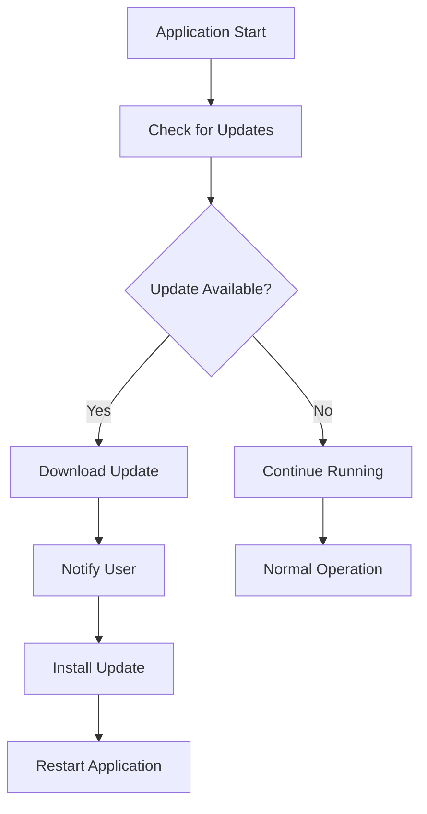

## 19.9 Automatic Updates

In the fast-paced world of software development, keeping applications up-to-date is crucial for maintaining security, performance, and user satisfaction. Automatic updates play a vital role in ensuring that users receive the latest features and security patches without manual intervention. In this section, we'll explore how to implement automatic updates in JavaScript desktop applications using popular frameworks like Electron and NW.js.

### Benefits of Automatic Updates

Automatic updates offer several advantages:

- **Enhanced Security**: By automatically applying security patches, you reduce the risk of vulnerabilities being exploited.
- **Improved User Experience**: Users receive new features and improvements seamlessly, without needing to manually download and install updates.
- **Reduced Support Costs**: Fewer outdated versions in the wild mean fewer support requests related to known issues.
- **Consistency**: Ensures all users are on the same version, simplifying troubleshooting and support.

### Implementing Automatic Updates with Electron

Electron is a popular framework for building cross-platform desktop applications using web technologies. It provides robust support for automatic updates through the [Electron Updater](https://www.electron.build/auto-update) module.

#### Setting Up Electron Updater

To implement automatic updates in an Electron application, follow these steps:

1. **Install Electron Updater**: Add the `electron-updater` package to your project.

   ```bash
   npm install electron-updater
   ```

2. **Configure Your Application**: In your main process file (usually `main.js` or `index.js`), import and configure the updater.

   ```javascript
   const { app, autoUpdater } = require('electron');
   const log = require('electron-log');

   autoUpdater.logger = log;
   autoUpdater.logger.transports.file.level = 'info';

   autoUpdater.on('update-available', () => {
     log.info('Update available.');
   });

   autoUpdater.on('update-downloaded', () => {
     log.info('Update downloaded; will install now');
     autoUpdater.quitAndInstall();
   });

   app.on('ready', () => {
     autoUpdater.checkForUpdatesAndNotify();
   });
   ```

3. **Set Up an Update Server**: You can use services like [electron-release-server](https://github.com/ArekSredzki/electron-release-server) or host your own server to manage updates. Ensure your server serves the latest version of your application and update metadata.

4. **Versioning and Update Channels**: Use semantic versioning (e.g., 1.0.0) to manage your releases. Consider implementing update channels (stable, beta) to allow users to opt into different levels of stability.

5. **Code Signing**: For Windows and macOS, code signing is essential to ensure the integrity and authenticity of your application. Obtain a code signing certificate and configure your build process to sign your application.

#### Example of Electron Updater Configuration

Here's a more detailed example of how to configure Electron Updater:

```javascript
const { app, BrowserWindow, autoUpdater } = require('electron');
const path = require('path');
const log = require('electron-log');

let mainWindow;

function createWindow() {
  mainWindow = new BrowserWindow({
    width: 800,
    height: 600,
    webPreferences: {
      preload: path.join(__dirname, 'preload.js'),
    },
  });

  mainWindow.loadFile('index.html');
}

app.on('ready', () => {
  createWindow();
  autoUpdater.checkForUpdatesAndNotify();
});

autoUpdater.on('checking-for-update', () => {
  log.info('Checking for update...');
});

autoUpdater.on('update-available', (info) => {
  log.info('Update available.');
});

autoUpdater.on('update-not-available', (info) => {
  log.info('Update not available.');
});

autoUpdater.on('error', (err) => {
  log.error('Error in auto-updater. ' + err);
});

autoUpdater.on('download-progress', (progressObj) => {
  let log_message = 'Download speed: ' + progressObj.bytesPerSecond;
  log_message = log_message + ' - Downloaded ' + progressObj.percent + '%';
  log_message = log_message + ' (' + progressObj.transferred + '/' + progressObj.total + ')';
  log.info(log_message);
});

autoUpdater.on('update-downloaded', (info) => {
  log.info('Update downloaded');
  autoUpdater.quitAndInstall();
});
```

### Implementing Automatic Updates with NW.js

NW.js is another framework for building desktop applications with web technologies. While it doesn't have built-in support for automatic updates like Electron, you can implement updates using external tools like [Squirrel](https://github.com/Squirrel).

#### Using Squirrel for NW.js Updates

1. **Set Up Squirrel**: Squirrel is a framework for installing and updating Windows applications. You can use it to manage updates for your NW.js application.

2. **Configure Your Application**: Modify your NW.js application to check for updates and apply them using Squirrel.

3. **Host Update Files**: Similar to Electron, you'll need a server to host your update files. Ensure your server is configured to serve the latest version and update metadata.

4. **Versioning and Update Channels**: Use semantic versioning and consider implementing update channels to manage different levels of stability.

### Best Practices for Automatic Updates

- **Notify Users**: Inform users when an update is available and provide an option to install it immediately or later.
- **Ensure Reliability**: Test your update process thoroughly to ensure it works smoothly across different platforms and network conditions.
- **Handle Rollbacks**: Implement a mechanism to roll back updates in case of critical issues.
- **Monitor Update Success**: Track update success rates and error reports to identify and address issues promptly.

### Considerations for Code Signing and Installer Updates

- **Code Signing**: Obtain a code signing certificate to sign your application and updates. This ensures users can trust the source of the software.
- **Installer Updates**: Ensure your installer can handle updates gracefully, including uninstalling previous versions if necessary.

### Visualizing the Update Process

Below is a flowchart illustrating the automatic update process in an Electron application:



### References and Further Reading

- [Electron Updater Documentation](https://www.electron.build/auto-update)
- [NW.js Documentation](https://nwjs.io/)
- [Squirrel for Windows](https://github.com/Squirrel/Squirrel.Windows)
- [electron-release-server](https://github.com/ArekSredzki/electron-release-server)

### Knowledge Check

- What are the benefits of automatic updates in desktop applications?
- How does Electron Updater facilitate automatic updates?
- What role does code signing play in the update process?
- How can you implement automatic updates in NW.js applications?

### Embrace the Journey

Implementing automatic updates is a crucial step in delivering a seamless user experience and maintaining the security and performance of your desktop applications. Remember, this is just the beginning. As you progress, you'll build more robust and reliable update mechanisms. Keep experimenting, stay curious, and enjoy the journey!

## Quiz: Mastering Automatic Updates in JavaScript Desktop Applications



### What is one of the primary benefits of automatic updates?

- [x] Enhanced security
- [ ] Increased application size
- [ ] Reduced application speed
- [ ] More frequent user notifications

> **Explanation:** Automatic updates enhance security by ensuring that users receive the latest security patches without manual intervention.

### Which module is used for automatic updates in Electron applications?

- [x] electron-updater
- [ ] electron-builder
- [ ] electron-packager
- [ ] electron-installer

> **Explanation:** The `electron-updater` module is used for implementing automatic updates in Electron applications.

### What is a common tool used for managing updates in NW.js applications?

- [x] Squirrel
- [ ] RabbitMQ
- [ ] Electron Updater
- [ ] Webpack

> **Explanation:** Squirrel is commonly used for managing updates in NW.js applications.

### Why is code signing important for automatic updates?

- [x] It ensures the authenticity and integrity of the application.
- [ ] It increases the application size.
- [ ] It speeds up the update process.
- [ ] It reduces the number of updates.

> **Explanation:** Code signing ensures that the application and updates are from a trusted source, maintaining authenticity and integrity.

### What is a best practice when notifying users about updates?

- [x] Provide an option to install immediately or later.
- [ ] Force the update without notification.
- [ ] Only notify after the update is installed.
- [ ] Never notify users about updates.

> **Explanation:** It's a best practice to inform users about updates and provide options for when to install them.

### What should you do if an update fails?

- [x] Implement a rollback mechanism.
- [ ] Ignore the failure.
- [ ] Force the update again.
- [ ] Uninstall the application.

> **Explanation:** Implementing a rollback mechanism ensures that users can revert to a stable version if an update fails.

### What is the purpose of an update server?

- [x] To host the latest version and update metadata.
- [ ] To increase application speed.
- [ ] To reduce application size.
- [ ] To manage user accounts.

> **Explanation:** An update server hosts the latest version of the application and update metadata, facilitating the update process.

### How can you track update success rates?

- [x] Monitor error reports and success metrics.
- [ ] Increase the number of updates.
- [ ] Reduce application size.
- [ ] Ignore user feedback.

> **Explanation:** Monitoring error reports and success metrics helps identify and address issues in the update process.

### What is semantic versioning?

- [x] A versioning system using major, minor, and patch numbers.
- [ ] A system for reducing application size.
- [ ] A method for increasing application speed.
- [ ] A tool for managing user accounts.

> **Explanation:** Semantic versioning uses major, minor, and patch numbers to manage software releases.

### True or False: Automatic updates can reduce support costs.

- [x] True
- [ ] False

> **Explanation:** Automatic updates can reduce support costs by ensuring users have the latest version, minimizing issues related to outdated software.


