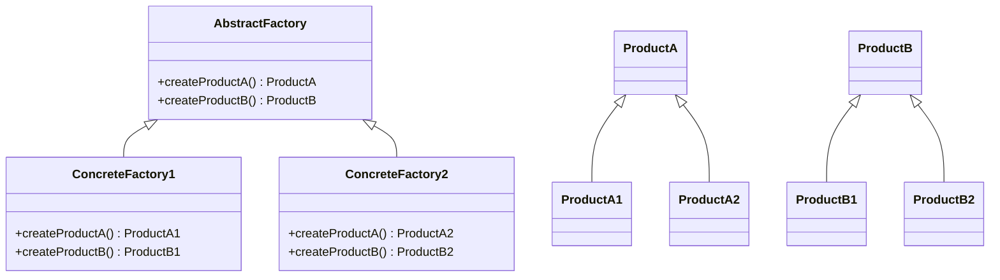

---

linkTitle: "2.1.1 Abstract Factory"
title: "Abstract Factory Design Pattern in JavaScript and TypeScript"
description: "Explore the Abstract Factory design pattern in JavaScript and TypeScript, its intent, components, implementation, and practical use cases."
categories:
- Design Patterns
- JavaScript
- TypeScript
tags:
- Abstract Factory
- Creational Patterns
- JavaScript
- TypeScript
- Software Design
date: 2024-10-25
type: docs
nav_weight: 211000
canonical: "https://softwarepatternslexicon.com/patterns-js/2/1/1"
license: "© 2024 Tokenizer Inc. CC BY-NC-SA 4.0"
---

## 2.1.1 Abstract Factory

### Introduction

The Abstract Factory design pattern is a creational pattern that provides an interface for creating families of related or dependent objects without specifying their concrete classes. This pattern is particularly useful when a system needs to be independent of how its products are created and represented, or when it needs to support multiple themes or platforms.

### Understand the Intent

The primary intent of the Abstract Factory pattern is to encapsulate a group of individual factories that have a common theme. It provides a way to create objects that are related or dependent on each other without knowing their specific classes.

### Key Components

1. **Abstract Factory Interface:** Declares methods for creating abstract products.
2. **Concrete Factories:** Implement the abstract factory interface to create concrete products.
3. **Abstract Products:** Declare interfaces for a set of products.
4. **Concrete Products:** Implement the abstract product interfaces.

### Implementation Steps

1. **Define Abstract Product Interfaces:** Create interfaces for each type of product.
2. **Create Concrete Product Classes:** Implement the abstract interfaces with concrete classes.
3. **Define an Abstract Factory Interface:** Declare methods for creating each abstract product.
4. **Implement Concrete Factory Classes:** Create concrete products through these factories.

### Visual Representation

Here's a conceptual diagram illustrating the Abstract Factory pattern:



### Code Examples

#### JavaScript Example

Let's consider an example where we create UI elements like `Button` and `Checkbox` for different operating systems.

```javascript
// Abstract Product Interfaces
class Button {
    paint() {}
}

class Checkbox {
    paint() {}
}

// Concrete Products for Windows
class WindowsButton extends Button {
    paint() {
        console.log("Rendering a button in Windows style.");
    }
}

class WindowsCheckbox extends Checkbox {
    paint() {
        console.log("Rendering a checkbox in Windows style.");
    }
}

// Concrete Products for MacOS
class MacOSButton extends Button {
    paint() {
        console.log("Rendering a button in MacOS style.");
    }
}

class MacOSCheckbox extends Checkbox {
    paint() {
        console.log("Rendering a checkbox in MacOS style.");
    }
}

// Abstract Factory Interface
class GUIFactory {
    createButton() {}
    createCheckbox() {}
}

// Concrete Factory for Windows
class WindowsFactory extends GUIFactory {
    createButton() {
        return new WindowsButton();
    }
    createCheckbox() {
        return new WindowsCheckbox();
    }
}

// Concrete Factory for MacOS
class MacOSFactory extends GUIFactory {
    createButton() {
        return new MacOSButton();
    }
    createCheckbox() {
        return new MacOSCheckbox();
    }
}

// Client Code
function createUI(factory) {
    const button = factory.createButton();
    const checkbox = factory.createCheckbox();
    button.paint();
    checkbox.paint();
}

const windowsFactory = new WindowsFactory();
createUI(windowsFactory);

const macFactory = new MacOSFactory();
createUI(macFactory);
```

#### TypeScript Example

The TypeScript version leverages interfaces for type safety.

```typescript
// Abstract Product Interfaces
interface Button {
    paint(): void;
}

interface Checkbox {
    paint(): void;
}

// Concrete Products for Windows
class WindowsButton implements Button {
    paint(): void {
        console.log("Rendering a button in Windows style.");
    }
}

class WindowsCheckbox implements Checkbox {
    paint(): void {
        console.log("Rendering a checkbox in Windows style.");
    }
}

// Concrete Products for MacOS
class MacOSButton implements Button {
    paint(): void {
        console.log("Rendering a button in MacOS style.");
    }
}

class MacOSCheckbox implements Checkbox {
    paint(): void {
        console.log("Rendering a checkbox in MacOS style.");
    }
}

// Abstract Factory Interface
interface GUIFactory {
    createButton(): Button;
    createCheckbox(): Checkbox;
}

// Concrete Factory for Windows
class WindowsFactory implements GUIFactory {
    createButton(): Button {
        return new WindowsButton();
    }
    createCheckbox(): Checkbox {
        return new WindowsCheckbox();
    }
}

// Concrete Factory for MacOS
class MacOSFactory implements GUIFactory {
    createButton(): Button {
        return new MacOSButton();
    }
    createCheckbox(): Checkbox {
        return new MacOSCheckbox();
    }
}

// Client Code
function createUI(factory: GUIFactory): void {
    const button = factory.createButton();
    const checkbox = factory.createCheckbox();
    button.paint();
    checkbox.paint();
}

const windowsFactory = new WindowsFactory();
createUI(windowsFactory);

const macFactory = new MacOSFactory();
createUI(macFactory);
```

### Use Cases

- **System Independence:** When a system should be independent of how its products are created and represented.
- **Multiple Themes or Platforms:** Ideal for applications that need to support multiple themes or platforms, such as different operating systems or UI themes.

### Practice

Try implementing an abstract factory for a GUI toolkit that creates window elements for different OS themes. This will help solidify your understanding of the pattern.

### Considerations

- **Ease of Adding New Product Families:** Adding new product families is easier than adding new product types.
- **Complexity:** Be mindful of increased complexity with multiple factories.

### Advantages and Disadvantages

#### Advantages

- **Encapsulation of Object Creation:** The pattern encapsulates the creation of related objects, promoting a clean separation of concerns.
- **Flexibility:** It allows for easy swapping of concrete factories, enabling different configurations or environments.

#### Disadvantages

- **Complexity:** The pattern can introduce additional complexity with multiple factory classes.
- **Difficulty in Adding New Products:** Adding new product types requires changes to the abstract factory interface and all its concrete implementations.

### Best Practices

- **Adhere to SOLID Principles:** Ensure your implementation follows SOLID principles, particularly the Open/Closed Principle, to allow easy extension of product families.
- **Use TypeScript Interfaces:** Leverage TypeScript interfaces for better type safety and maintainability.

### Conclusion

The Abstract Factory pattern is a powerful tool for creating families of related objects without specifying their concrete classes. By understanding its components and implementation, you can effectively apply this pattern to create flexible and scalable applications.

## Quiz Time!



### What is the primary intent of the Abstract Factory pattern?

- [x] To provide an interface for creating families of related or dependent objects without specifying their concrete classes.
- [ ] To create a single object without specifying its concrete class.
- [ ] To define a one-to-many dependency between objects.
- [ ] To allow an object to alter its behavior when its internal state changes.

> **Explanation:** The Abstract Factory pattern provides an interface for creating families of related or dependent objects without specifying their concrete classes.

### Which component of the Abstract Factory pattern declares methods for creating abstract products?

- [x] Abstract Factory Interface
- [ ] Concrete Factory
- [ ] Abstract Product
- [ ] Concrete Product

> **Explanation:** The Abstract Factory Interface declares methods for creating abstract products.

### In the Abstract Factory pattern, what do Concrete Factories do?

- [x] Implement the abstract factory interface to create concrete products.
- [ ] Declare interfaces for a set of products.
- [ ] Implement the abstract product interfaces.
- [ ] Define methods for creating abstract products.

> **Explanation:** Concrete Factories implement the abstract factory interface to create concrete products.

### What is a key advantage of using the Abstract Factory pattern?

- [x] It encapsulates the creation of related objects, promoting a clean separation of concerns.
- [ ] It simplifies the creation of a single object.
- [ ] It reduces the number of classes needed in a system.
- [ ] It eliminates the need for interfaces.

> **Explanation:** The Abstract Factory pattern encapsulates the creation of related objects, promoting a clean separation of concerns.

### When is the Abstract Factory pattern particularly useful?

- [x] When a system should be independent of how its products are created and represented.
- [ ] When a system needs to create a single object.
- [ ] When a system has no dependencies between objects.
- [ ] When a system needs to define a one-to-many dependency between objects.

> **Explanation:** The Abstract Factory pattern is useful when a system should be independent of how its products are created and represented.

### What is a disadvantage of the Abstract Factory pattern?

- [x] It can introduce additional complexity with multiple factory classes.
- [ ] It simplifies the creation of objects.
- [ ] It reduces the need for interfaces.
- [ ] It eliminates the need for concrete classes.

> **Explanation:** The Abstract Factory pattern can introduce additional complexity with multiple factory classes.

### How does the Abstract Factory pattern promote flexibility?

- [x] By allowing easy swapping of concrete factories, enabling different configurations or environments.
- [ ] By reducing the number of classes needed.
- [ ] By eliminating the need for interfaces.
- [ ] By defining a one-to-many dependency between objects.

> **Explanation:** The Abstract Factory pattern promotes flexibility by allowing easy swapping of concrete factories, enabling different configurations or environments.

### What is a common use case for the Abstract Factory pattern?

- [x] Applications that need to support multiple themes or platforms.
- [ ] Applications that need to create a single object.
- [ ] Applications with no dependencies between objects.
- [ ] Applications that define a one-to-many dependency between objects.

> **Explanation:** A common use case for the Abstract Factory pattern is applications that need to support multiple themes or platforms.

### Which principle is important to follow when implementing the Abstract Factory pattern?

- [x] Open/Closed Principle
- [ ] Single Responsibility Principle
- [ ] Liskov Substitution Principle
- [ ] Interface Segregation Principle

> **Explanation:** The Open/Closed Principle is important to follow when implementing the Abstract Factory pattern to allow easy extension of product families.

### True or False: Adding new product families is easier than adding new product types in the Abstract Factory pattern.

- [x] True
- [ ] False

> **Explanation:** In the Abstract Factory pattern, adding new product families is easier than adding new product types because it requires fewer changes to the existing codebase.


