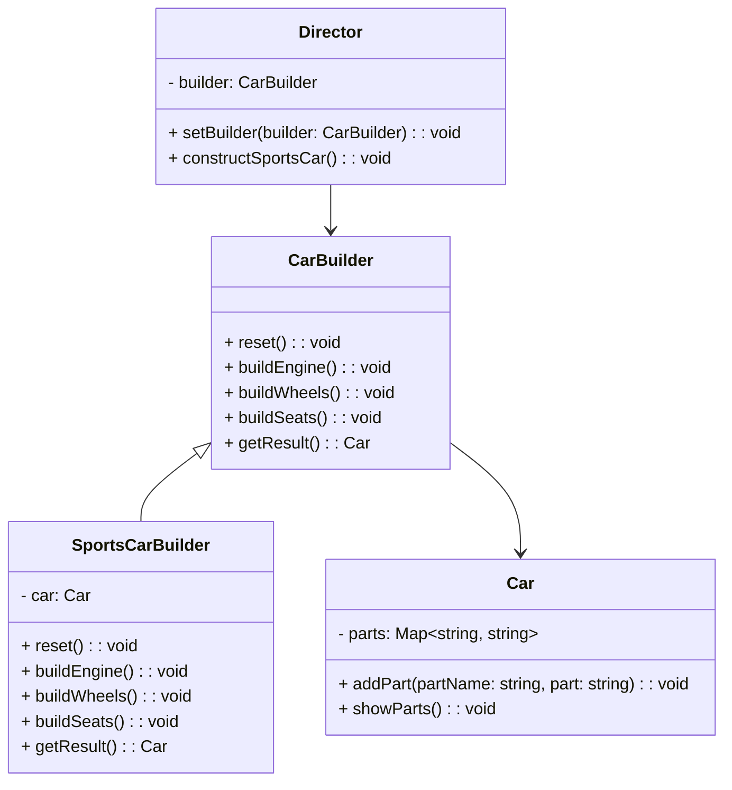

---

linkTitle: "2.1.2 Builder"
title: "Builder Design Pattern in JavaScript and TypeScript: A Comprehensive Guide"
description: "Explore the Builder Design Pattern in JavaScript and TypeScript, its implementation, use cases, and best practices for creating complex objects with ease."
categories:
- Design Patterns
- JavaScript
- TypeScript
tags:
- Builder Pattern
- Creational Patterns
- JavaScript
- TypeScript
- Software Design
date: 2024-10-25
type: docs
nav_weight: 212000
canonical: "https://softwarepatternslexicon.com/patterns-js/2/1/2"
license: "© 2024 Tokenizer Inc. CC BY-NC-SA 4.0"
---

## 2.1.2 Builder

### Introduction

The Builder design pattern is a creational pattern that provides a flexible solution to constructing complex objects. It separates the construction of an object from its representation, allowing the same construction process to create different representations. This pattern is particularly useful when dealing with objects that require numerous optional parameters or configurations.

### Understand the Intent

The primary intent of the Builder pattern is to manage the construction of complex objects. By decoupling the construction process from the final representation, it allows for more control over the creation process and supports various configurations.

### Key Components

1. **Builder Interface:** Defines the methods for creating the different parts of the product.
2. **Concrete Builders:** Implement the builder interface to construct and assemble parts of the product.
3. **Director:** Oversees the construction process using the builder interface.
4. **Product:** The complex object that is being built.

### Implementation Steps

1. **Define the Product Class:** Create a class representing the complex object with all possible components.
2. **Create a Builder Interface:** Define methods to build each component of the product.
3. **Implement Concrete Builder Classes:** Develop classes that provide specific implementations for building the product.
4. **Use a Director Class:** Construct the product using a builder to manage the construction process.

### Code Examples

#### JavaScript Implementation

Let's consider building a complex object like a car with various features:

```javascript
// Product
class Car {
    constructor() {
        this.parts = {};
    }

    addPart(partName, part) {
        this.parts[partName] = part;
    }

    showParts() {
        console.log(this.parts);
    }
}

// Builder Interface
class CarBuilder {
    reset() {}
    buildEngine() {}
    buildWheels() {}
    buildSeats() {}
    getResult() {}
}

// Concrete Builder
class SportsCarBuilder extends CarBuilder {
    constructor() {
        super();
        this.reset();
    }

    reset() {
        this.car = new Car();
    }

    buildEngine() {
        this.car.addPart('engine', 'V8 Engine');
    }

    buildWheels() {
        this.car.addPart('wheels', '18 inch Alloy Wheels');
    }

    buildSeats() {
        this.car.addPart('seats', 'Leather Seats');
    }

    getResult() {
        return this.car;
    }
}

// Director
class Director {
    setBuilder(builder) {
        this.builder = builder;
    }

    constructSportsCar() {
        this.builder.reset();
        this.builder.buildEngine();
        this.builder.buildWheels();
        this.builder.buildSeats();
    }
}

// Usage
const director = new Director();
const sportsCarBuilder = new SportsCarBuilder();

director.setBuilder(sportsCarBuilder);
director.constructSportsCar();

const sportsCar = sportsCarBuilder.getResult();
sportsCar.showParts();
```

#### TypeScript Implementation

The TypeScript implementation adds type safety and interfaces:

```typescript
// Product
class Car {
    private parts: { [key: string]: string } = {};

    public addPart(partName: string, part: string): void {
        this.parts[partName] = part;
    }

    public showParts(): void {
        console.log(this.parts);
    }
}

// Builder Interface
interface CarBuilder {
    reset(): void;
    buildEngine(): void;
    buildWheels(): void;
    buildSeats(): void;
    getResult(): Car;
}

// Concrete Builder
class SportsCarBuilder implements CarBuilder {
    private car: Car;

    constructor() {
        this.reset();
    }

    public reset(): void {
        this.car = new Car();
    }

    public buildEngine(): void {
        this.car.addPart('engine', 'V8 Engine');
    }

    public buildWheels(): void {
        this.car.addPart('wheels', '18 inch Alloy Wheels');
    }

    public buildSeats(): void {
        this.car.addPart('seats', 'Leather Seats');
    }

    public getResult(): Car {
        return this.car;
    }
}

// Director
class Director {
    private builder: CarBuilder;

    public setBuilder(builder: CarBuilder): void {
        this.builder = builder;
    }

    public constructSportsCar(): void {
        this.builder.reset();
        this.builder.buildEngine();
        this.builder.buildWheels();
        this.builder.buildSeats();
    }
}

// Usage
const director = new Director();
const sportsCarBuilder = new SportsCarBuilder();

director.setBuilder(sportsCarBuilder);
director.constructSportsCar();

const sportsCar = sportsCarBuilder.getResult();
sportsCar.showParts();
```

### Use Cases

- **Different Representations:** When the construction process must allow different representations of the product.
- **Complex Objects:** Useful for creating objects with many configuration options, such as UI components, database queries, or network requests.

### Practice

Try creating a builder for assembling computers with customizable components like CPU, RAM, storage, and graphics card. This exercise will help solidify your understanding of the Builder pattern.

### Considerations

- **Readability and Maintainability:** The Builder pattern improves the readability and maintainability of object creation code by separating the construction process.
- **Overhead:** Be aware of the overhead introduced by having multiple builder classes, which might be unnecessary for simple objects.

### Visual Aids

Below is a conceptual diagram illustrating the Builder pattern:



### Advantages and Disadvantages

**Advantages:**
- Provides control over the construction process.
- Supports multiple representations of the product.
- Improves code readability and maintainability.

**Disadvantages:**
- Can introduce unnecessary complexity for simple objects.
- Requires additional classes, which may increase codebase size.

### Best Practices

- Use the Builder pattern when dealing with complex objects that require multiple configurations.
- Ensure that the builder interface is flexible enough to accommodate future changes or extensions.
- Consider using the pattern in conjunction with other design patterns for more robust solutions.

### Comparisons

The Builder pattern is often compared with the Factory pattern. While both are creational patterns, the Builder pattern is more suited for constructing complex objects step-by-step, whereas the Factory pattern is used for creating objects in a single step.

### Conclusion

The Builder pattern is a powerful tool for managing the construction of complex objects in JavaScript and TypeScript. By separating the construction process from the representation, it provides flexibility, control, and clarity in code. Understanding and implementing this pattern can significantly enhance your ability to manage complex object creation in your applications.

## Quiz Time!



### What is the primary intent of the Builder pattern?

- [x] To separate the construction of a complex object from its representation.
- [ ] To create a single instance of a class.
- [ ] To provide a way to access the elements of an aggregate object sequentially.
- [ ] To define a family of algorithms.

> **Explanation:** The Builder pattern is designed to separate the construction of a complex object from its representation, allowing different configurations.

### Which component of the Builder pattern is responsible for overseeing the construction process?

- [ ] Product
- [x] Director
- [ ] Builder Interface
- [ ] Concrete Builder

> **Explanation:** The Director is responsible for overseeing the construction process using the builder interface.

### In the Builder pattern, what does the Concrete Builder do?

- [x] Provides implementations of the construction methods.
- [ ] Oversees the construction process.
- [ ] Specifies methods for creating the different parts of the product.
- [ ] Represents the complex object being built.

> **Explanation:** The Concrete Builder provides specific implementations for constructing and assembling parts of the product.

### What is a key advantage of using the Builder pattern?

- [x] It improves code readability and maintainability.
- [ ] It reduces the number of classes needed.
- [ ] It simplifies the creation of simple objects.
- [ ] It eliminates the need for constructors.

> **Explanation:** The Builder pattern improves code readability and maintainability by separating the construction process from the representation.

### When is the Builder pattern particularly useful?

- [x] When creating objects with many configuration options.
- [ ] When creating a single instance of a class.
- [ ] When accessing elements of an aggregate object sequentially.
- [ ] When defining a family of algorithms.

> **Explanation:** The Builder pattern is useful for creating objects with many configuration options, allowing for flexible construction.

### What is a potential disadvantage of the Builder pattern?

- [x] It can introduce unnecessary complexity for simple objects.
- [ ] It reduces code readability.
- [ ] It eliminates flexibility in object creation.
- [ ] It requires fewer classes.

> **Explanation:** The Builder pattern can introduce unnecessary complexity for simple objects due to the additional classes required.

### How does the Builder pattern differ from the Factory pattern?

- [x] The Builder pattern constructs complex objects step-by-step, while the Factory pattern creates objects in a single step.
- [ ] The Builder pattern creates a single instance of a class, while the Factory pattern creates multiple instances.
- [ ] The Builder pattern is used for accessing elements of an aggregate object, while the Factory pattern is not.
- [ ] The Builder pattern defines a family of algorithms, while the Factory pattern does not.

> **Explanation:** The Builder pattern constructs complex objects step-by-step, whereas the Factory pattern is used for creating objects in a single step.

### Which of the following is NOT a component of the Builder pattern?

- [ ] Builder Interface
- [ ] Concrete Builder
- [x] Singleton
- [ ] Director

> **Explanation:** Singleton is not a component of the Builder pattern. The Builder pattern includes the Builder Interface, Concrete Builder, Director, and Product.

### What role does the Product play in the Builder pattern?

- [x] It is the complex object that is being built.
- [ ] It oversees the construction process.
- [ ] It provides implementations of the construction methods.
- [ ] It specifies methods for creating the different parts of the product.

> **Explanation:** The Product is the complex object that is being built using the Builder pattern.

### True or False: The Builder pattern is best suited for simple objects with few configurations.

- [ ] True
- [x] False

> **Explanation:** False. The Builder pattern is best suited for complex objects with many configurations, not simple objects.


