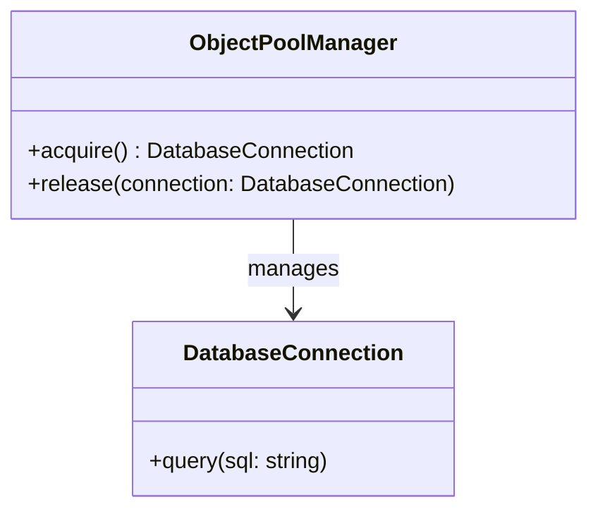

## 2.1.6 Object Pool

The Object Pool design pattern is a creational pattern that focuses on the reuse of objects that are expensive to create. By managing a pool of reusable objects, this pattern helps improve application performance and resource management. Let's delve into the details of the Object Pool pattern, its implementation, and its practical applications in JavaScript and TypeScript.

### Understand the Intent

The primary intent of the Object Pool pattern is to:

- **Manage the Reuse of Objects:** Efficiently handle objects that are costly to create, such as database connections or large data structures.
- **Improve Performance:** Control the number of instances in use, reducing the overhead of frequent object creation and destruction.

### Key Components

The Object Pool pattern consists of the following key components:

- **Object Pool Manager:** This component controls access to the pooled objects, ensuring that objects are efficiently reused and managed.
- **Reusable Objects:** These are the instances being managed and reused within the pool.

### Implementation Steps

To implement the Object Pool pattern, follow these steps:

1. **Create a Pool Manager:** Develop a manager class responsible for handling the acquisition and release of objects.
2. **Implement Methods:** Define methods to check out and return objects to the pool, managing their lifecycle and availability.

### Code Examples

Let's explore a practical implementation of the Object Pool pattern by developing a pool for managing database connections.

```typescript
class DatabaseConnection {
    private static instanceCount = 0;
    private id: number;

    constructor() {
        this.id = DatabaseConnection.instanceCount++;
        console.log(`Creating connection ${this.id}`);
    }

    query(sql: string) {
        console.log(`Executing query on connection ${this.id}: ${sql}`);
    }
}

class ConnectionPool {
    private availableConnections: DatabaseConnection[] = [];
    private inUseConnections: Set<DatabaseConnection> = new Set();
    private maxConnections: number;

    constructor(maxConnections: number) {
        this.maxConnections = maxConnections;
    }

    acquire(): DatabaseConnection | null {
        if (this.availableConnections.length > 0) {
            const connection = this.availableConnections.pop()!;
            this.inUseConnections.add(connection);
            return connection;
        } else if (this.inUseConnections.size < this.maxConnections) {
            const connection = new DatabaseConnection();
            this.inUseConnections.add(connection);
            return connection;
        } else {
            console.log('No available connections');
            return null;
        }
    }

    release(connection: DatabaseConnection) {
        if (this.inUseConnections.has(connection)) {
            this.inUseConnections.delete(connection);
            this.availableConnections.push(connection);
        }
    }
}

// Usage
const pool = new ConnectionPool(2);
const conn1 = pool.acquire();
conn1?.query("SELECT * FROM users");

const conn2 = pool.acquire();
conn2?.query("SELECT * FROM orders");

pool.release(conn1!);
const conn3 = pool.acquire();
conn3?.query("SELECT * FROM products");
```

### Use Cases

The Object Pool pattern is particularly useful in scenarios where:

- **Costly Object Creation:** Objects are expensive to create, such as database connections, thread pools, or large data structures.
- **Controlled Instances:** There is a need to limit the number of instances in use to manage resources efficiently.

### Practice

To practice the Object Pool pattern, consider building a pool for a thread pool in a server application. This can help manage the execution of concurrent tasks efficiently.

### Considerations

When implementing the Object Pool pattern, keep the following considerations in mind:

- **Synchronization:** Handle synchronization in concurrent environments to avoid race conditions and ensure thread safety.
- **Resource Management:** Keep track of resources to avoid leaks and ensure that objects are properly released back to the pool.

### Visual Aids

Below is a conceptual diagram illustrating the Object Pool pattern:



### Advantages and Disadvantages

**Advantages:**

- **Performance Improvement:** Reduces the overhead of creating and destroying objects frequently.
- **Resource Management:** Efficiently manages limited resources by reusing objects.

**Disadvantages:**

- **Complexity:** Introduces additional complexity in managing the pool and ensuring thread safety.
- **Resource Leaks:** Potential for resource leaks if objects are not properly released back to the pool.

### Best Practices

- **Limit Pool Size:** Define a maximum pool size to prevent resource exhaustion.
- **Monitor Usage:** Implement monitoring to track pool usage and identify potential bottlenecks.
- **Ensure Thread Safety:** Use synchronization mechanisms to ensure thread safety in concurrent environments.

### Comparisons

The Object Pool pattern can be compared with other creational patterns like Singleton and Factory. While Singleton ensures a single instance, Object Pool manages multiple reusable instances. Factory focuses on object creation, whereas Object Pool emphasizes reuse.

### Conclusion

The Object Pool design pattern is a powerful tool for managing reusable objects efficiently, especially when dealing with costly object creation. By implementing this pattern, developers can enhance application performance and resource management. Consider exploring further resources to deepen your understanding of this pattern.

## Quiz Time!



### What is the primary intent of the Object Pool design pattern?

- [x] Manage the reuse of objects that are expensive to create.
- [ ] Create a single instance of an object.
- [ ] Provide a way to create objects without specifying the exact class.
- [ ] Allow objects to be created based on a prototype instance.

> **Explanation:** The Object Pool pattern focuses on managing the reuse of objects that are costly to create, improving performance by controlling the number of instances in use.

### Which component controls access to the pooled objects in the Object Pool pattern?

- [x] Object Pool Manager
- [ ] Reusable Objects
- [ ] Singleton
- [ ] Factory

> **Explanation:** The Object Pool Manager is responsible for controlling access to the pooled objects, managing their acquisition and release.

### What is a common use case for the Object Pool pattern?

- [x] Managing database connections
- [ ] Creating a single instance of a class
- [ ] Implementing a factory method
- [ ] Defining a family of algorithms

> **Explanation:** The Object Pool pattern is commonly used to manage database connections, which are expensive to create and require efficient reuse.

### What should be considered when implementing the Object Pool pattern in concurrent environments?

- [x] Synchronization
- [ ] Serialization
- [ ] Inheritance
- [ ] Polymorphism

> **Explanation:** Synchronization is crucial in concurrent environments to ensure thread safety and avoid race conditions when managing the object pool.

### What is a potential disadvantage of the Object Pool pattern?

- [x] Complexity in managing the pool
- [ ] Inability to create multiple instances
- [ ] Lack of flexibility in object creation
- [ ] Increased memory usage

> **Explanation:** The Object Pool pattern introduces additional complexity in managing the pool and ensuring thread safety, which can be a disadvantage.

### How does the Object Pool pattern improve performance?

- [x] By reducing the overhead of frequent object creation and destruction
- [ ] By creating a single instance of an object
- [ ] By allowing objects to be created based on a prototype instance
- [ ] By defining a family of algorithms

> **Explanation:** The Object Pool pattern improves performance by reducing the overhead associated with frequent object creation and destruction, allowing for efficient reuse.

### What is a best practice when implementing the Object Pool pattern?

- [x] Limit pool size
- [ ] Use inheritance extensively
- [ ] Avoid synchronization
- [ ] Create a new object for each request

> **Explanation:** Limiting the pool size is a best practice to prevent resource exhaustion and ensure efficient management of resources.

### What is the role of the Reusable Objects in the Object Pool pattern?

- [x] They are the instances being managed and reused within the pool.
- [ ] They control access to the pooled objects.
- [ ] They define a family of algorithms.
- [ ] They create objects without specifying the exact class.

> **Explanation:** Reusable Objects are the instances being managed and reused within the pool, allowing for efficient resource management.

### How does the Object Pool pattern differ from the Singleton pattern?

- [x] Object Pool manages multiple reusable instances, while Singleton ensures a single instance.
- [ ] Object Pool creates a single instance, while Singleton manages multiple instances.
- [ ] Object Pool defines a family of algorithms, while Singleton focuses on object creation.
- [ ] Object Pool allows objects to be created based on a prototype instance, while Singleton does not.

> **Explanation:** The Object Pool pattern manages multiple reusable instances, whereas the Singleton pattern ensures a single instance of a class.

### True or False: The Object Pool pattern is only applicable to database connections.

- [ ] True
- [x] False

> **Explanation:** False. While the Object Pool pattern is commonly used for database connections, it is applicable to any scenario where objects are costly to create and require efficient reuse.


