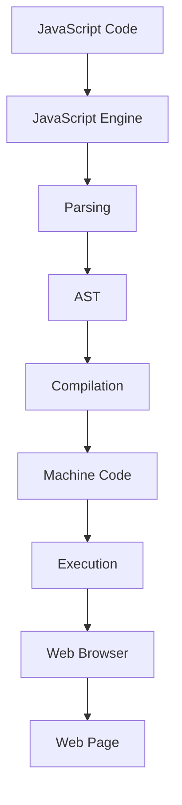

## 2.1 Understanding the JavaScript Engine

JavaScript engines are the backbone of modern web development, powering the execution of JavaScript code in browsers and server environments. Understanding how these engines work can significantly enhance your ability to write efficient and optimized code. In this section, we'll explore the intricacies of popular JavaScript engines like V8, SpiderMonkey, and JavaScriptCore, and delve into the processes of parsing, compiling, and executing JavaScript code.

### What is a JavaScript Engine?

A JavaScript engine is a program or an interpreter that executes JavaScript code. It is responsible for converting your JavaScript code into machine code that a computer's processor can understand. The engine performs several tasks, including parsing the code, optimizing it, and executing it efficiently.

### Popular JavaScript Engines

#### V8

[V8](https://v8.dev/) is an open-source JavaScript engine developed by Google. It is used in the Chrome browser and Node.js. V8 is known for its high performance and efficiency, achieved through techniques like Just-In-Time (JIT) compilation and advanced optimization strategies.

#### SpiderMonkey

[SpiderMonkey](https://developer.mozilla.org/en-US/docs/Mozilla/Projects/SpiderMonkey) is Mozilla's JavaScript engine, used in the Firefox browser. It was the first JavaScript engine ever created and continues to evolve with features like JIT compilation and garbage collection improvements.

#### JavaScriptCore

[JavaScriptCore](https://trac.webkit.org/wiki/JavaScriptCore) is the engine used by Apple's Safari browser. It is part of the WebKit project and is known for its lightweight and efficient execution of JavaScript code.

### How JavaScript Engines Work

#### Parsing

The first step in executing JavaScript code is parsing. The engine reads the source code and converts it into an Abstract Syntax Tree (AST). This tree represents the structure of the code and is used for further processing.

```javascript
// Example JavaScript code
function add(a, b) {
    return a + b;
}
```

The above code is parsed into an AST, which is a tree-like structure representing the function and its operations.

#### Compilation

JavaScript engines use Just-In-Time (JIT) compilation to convert JavaScript code into machine code. JIT compilation occurs at runtime, allowing the engine to optimize the code based on actual usage patterns.

- **Baseline Compilation**: The engine initially compiles the code into machine code without extensive optimizations. This allows for quick execution.
- **Optimization**: As the code runs, the engine collects information about its execution. It uses this data to apply optimizations, such as inlining functions and eliminating redundant calculations.

#### Execution

Once the code is compiled, the engine executes it. The execution process involves managing memory, handling garbage collection, and interacting with the host environment (e.g., the browser or Node.js).

### Just-In-Time (JIT) Compilation

JIT compilation is a key feature of modern JavaScript engines. It allows for dynamic optimization of code, improving performance by adapting to the specific execution context.

- **Hot Code Paths**: The engine identifies frequently executed code paths and applies aggressive optimizations to them.
- **Deoptimization**: If assumptions made during optimization are invalidated, the engine can revert to less optimized code.

### Impact on Performance and Optimization

Understanding how JavaScript engines work can help you write more efficient code. Here are some strategies to consider:

- **Avoiding Deoptimization**: Write code that allows the engine to make accurate assumptions, reducing the need for deoptimization.
- **Inlining Functions**: Use small, frequently called functions that can be inlined by the engine for faster execution.
- **Minimizing Memory Usage**: Efficient memory management can reduce garbage collection overhead and improve performance.

### Visualizing JavaScript's Interaction with Web Browsers and Web Pages



**Diagram Description**: This flowchart illustrates the process of JavaScript code execution, from parsing to execution, and its interaction with web browsers and web pages.

### Try It Yourself

Experiment with the following code to see how different engines handle execution:

```javascript
// Test function for optimization
function testOptimization() {
    for (let i = 0; i < 1000000; i++) {
        // Simple arithmetic operation
        let result = i * 2;
    }
}

console.time('Execution Time');
testOptimization();
console.timeEnd('Execution Time');
```

**Try modifying** the loop or the operation inside it to see how it affects execution time. This can give you insights into how engines optimize code.

### Further Reading

- [V8 JavaScript Engine](https://v8.dev/)
- [SpiderMonkey Documentation](https://developer.mozilla.org/en-US/docs/Mozilla/Projects/SpiderMonkey)
- [JavaScriptCore Overview](https://trac.webkit.org/wiki/JavaScriptCore)

### Knowledge Check

- What is the role of a JavaScript engine?
- How does JIT compilation improve performance?
- What are some strategies to optimize JavaScript code for engine performance?

### Summary

Understanding the inner workings of JavaScript engines like V8, SpiderMonkey, and JavaScriptCore can significantly enhance your ability to write efficient and optimized code. By leveraging concepts like JIT compilation and optimization strategies, you can improve the performance of your JavaScript applications.

Remember, this is just the beginning. As you progress, you'll build more complex and interactive web pages. Keep experimenting, stay curious, and enjoy the journey!

## Quiz: Mastering JavaScript Engine Concepts



### What is the primary role of a JavaScript engine?

- [x] To execute JavaScript code by converting it into machine code.
- [ ] To design web pages.
- [ ] To manage network requests.
- [ ] To handle user input.

> **Explanation:** A JavaScript engine executes JavaScript code by converting it into machine code that a computer's processor can understand.

### Which JavaScript engine is used in Google Chrome?

- [x] V8
- [ ] SpiderMonkey
- [ ] JavaScriptCore
- [ ] Chakra

> **Explanation:** V8 is the JavaScript engine used in Google Chrome and Node.js.

### What is Just-In-Time (JIT) compilation?

- [x] A method of compiling code at runtime for optimization.
- [ ] A technique for parsing JavaScript code.
- [ ] A process for managing memory.
- [ ] A way to handle asynchronous operations.

> **Explanation:** JIT compilation is a method of compiling code at runtime, allowing for dynamic optimization based on actual usage patterns.

### How does JIT compilation improve performance?

- [x] By optimizing frequently executed code paths.
- [ ] By increasing memory usage.
- [ ] By slowing down execution.
- [ ] By disabling garbage collection.

> **Explanation:** JIT compilation improves performance by optimizing frequently executed code paths, making execution more efficient.

### What is an Abstract Syntax Tree (AST)?

- [x] A tree-like structure representing the structure of code.
- [ ] A method for executing JavaScript code.
- [ ] A tool for debugging code.
- [ ] A type of JavaScript engine.

> **Explanation:** An Abstract Syntax Tree (AST) is a tree-like structure that represents the structure of code, used for further processing by the engine.

### Which engine is used by Mozilla Firefox?

- [x] SpiderMonkey
- [ ] V8
- [ ] JavaScriptCore
- [ ] Chakra

> **Explanation:** SpiderMonkey is the JavaScript engine used by Mozilla Firefox.

### What is the purpose of deoptimization in JIT compilation?

- [x] To revert to less optimized code when assumptions are invalidated.
- [ ] To increase execution speed.
- [ ] To reduce memory usage.
- [ ] To handle network requests.

> **Explanation:** Deoptimization in JIT compilation reverts to less optimized code when assumptions made during optimization are invalidated.

### Which engine is part of the WebKit project?

- [x] JavaScriptCore
- [ ] V8
- [ ] SpiderMonkey
- [ ] Chakra

> **Explanation:** JavaScriptCore is part of the WebKit project and is used by Apple's Safari browser.

### What is the first step in executing JavaScript code?

- [x] Parsing
- [ ] Compilation
- [ ] Execution
- [ ] Optimization

> **Explanation:** The first step in executing JavaScript code is parsing, where the code is converted into an Abstract Syntax Tree (AST).

### True or False: JIT compilation occurs before runtime.

- [ ] True
- [x] False

> **Explanation:** JIT compilation occurs at runtime, allowing the engine to optimize code based on actual execution patterns.


