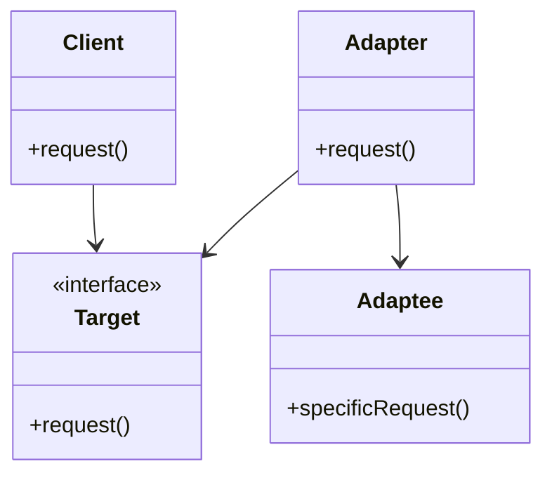

## 2.2.1 Adapter

### Introduction

In software development, it's common to encounter situations where you need to integrate classes or systems with incompatible interfaces. The Adapter design pattern, one of the classic Gang of Four (GoF) structural patterns, provides a solution by allowing these incompatible interfaces to work together seamlessly. This article delves into the Adapter pattern, its components, implementation in JavaScript and TypeScript, and real-world use cases.

### Understand the Intent

The primary intent of the Adapter pattern is to bridge the gap between incompatible interfaces, enabling them to work together without modifying their existing code. This is particularly useful when integrating third-party libraries or legacy systems into modern applications.

### Key Components

- **Target Interface:** The interface expected by the client.
- **Client:** The class or system that requires functionality from an incompatible interface.
- **Adaptee:** The existing class or system with an incompatible interface.
- **Adapter:** A class that implements the target interface and translates requests from the client to the adaptee.

### Implementation Steps

1. **Identify Incompatible Interfaces:** Determine the differences between the client's expected interface and the adaptee's interface.
2. **Create an Adapter Class:** Develop an adapter class that implements the target interface.
3. **Translate Calls:** Within the adapter, translate calls from the client to the adaptee, ensuring compatibility.

### Visual Representation

Here's a diagram illustrating the Adapter pattern structure:



### Code Examples

#### JavaScript Example

Let's consider a scenario where we have a legacy logging system with a method `logMessage` and a new system that expects a method `log`. We'll create an adapter to bridge these interfaces.

```javascript
// Adaptee: Legacy Logger
class LegacyLogger {
    logMessage(message) {
        console.log(`Legacy log: ${message}`);
    }
}

// Target Interface
class Logger {
    log(message) {
        throw new Error("This method should be overridden!");
    }
}

// Adapter
class LoggerAdapter extends Logger {
    constructor(legacyLogger) {
        super();
        this.legacyLogger = legacyLogger;
    }

    log(message) {
        this.legacyLogger.logMessage(message);
    }
}

// Client
const legacyLogger = new LegacyLogger();
const loggerAdapter = new LoggerAdapter(legacyLogger);
loggerAdapter.log("Hello, Adapter Pattern!");
```

#### TypeScript Example

In TypeScript, we can leverage interfaces for stronger type checking.

```typescript
// Adaptee: Legacy Logger
class LegacyLogger {
    logMessage(message: string): void {
        console.log(`Legacy log: ${message}`);
    }
}

// Target Interface
interface Logger {
    log(message: string): void;
}

// Adapter
class LoggerAdapter implements Logger {
    private legacyLogger: LegacyLogger;

    constructor(legacyLogger: LegacyLogger) {
        this.legacyLogger = legacyLogger;
    }

    log(message: string): void {
        this.legacyLogger.logMessage(message);
    }
}

// Client
const legacyLogger = new LegacyLogger();
const loggerAdapter: Logger = new LoggerAdapter(legacyLogger);
loggerAdapter.log("Hello, Adapter Pattern!");
```

### Use Cases

- **Reusing Existing Classes:** When you want to reuse existing classes with incompatible interfaces.
- **Integrating Third-Party Libraries:** Facilitating the integration of third-party libraries into your application without modifying their code.

### Practice Exercise

Try implementing an adapter that allows a modern payment interface to work with a legacy payment system. This exercise will help solidify your understanding of the Adapter pattern.

### Considerations

- **Class vs. Object Adapters:** Class adapters use inheritance, while object adapters use composition. Choose based on your specific needs and constraints.
- **Complexity:** Be mindful of added complexity. Keep adapters simple and focused on translating interfaces.

### Advantages and Disadvantages

**Advantages:**

- Facilitates integration of incompatible interfaces.
- Promotes code reusability and flexibility.

**Disadvantages:**

- Can introduce additional complexity.
- May lead to performance overhead if not implemented carefully.

### Best Practices

- Ensure adapters are lightweight and focused on interface translation.
- Use object adapters over class adapters when possible to favor composition over inheritance.

### Conclusion

The Adapter pattern is a powerful tool for integrating incompatible interfaces in JavaScript and TypeScript applications. By understanding its components and implementation, you can effectively bridge gaps between disparate systems, enhancing your application's flexibility and maintainability.

## Quiz Time!



### What is the primary intent of the Adapter pattern?

- [x] To allow incompatible interfaces to work together
- [ ] To create new interfaces for existing classes
- [ ] To simplify complex interfaces
- [ ] To enhance performance

> **Explanation:** The Adapter pattern is designed to enable incompatible interfaces to work together without altering their existing code.

### Which component of the Adapter pattern acts as the bridge between the client and the adaptee?

- [ ] Client
- [ ] Target Interface
- [x] Adapter
- [ ] Adaptee

> **Explanation:** The Adapter acts as the bridge, implementing the target interface and translating requests from the client to the adaptee.

### In the Adapter pattern, what is the role of the Adaptee?

- [ ] To provide the expected interface
- [x] To represent the existing class with an incompatible interface
- [ ] To act as the client
- [ ] To implement the target interface

> **Explanation:** The Adaptee is the existing class or system with an incompatible interface that needs to be adapted.

### When should you consider using the Adapter pattern?

- [x] When you want to reuse existing classes with incompatible interfaces
- [ ] When you need to enhance the performance of an application
- [ ] When you want to create a new interface for a class
- [ ] When you need to simplify a complex interface

> **Explanation:** The Adapter pattern is useful when you want to reuse existing classes with incompatible interfaces, allowing them to work together.

### What is the difference between class adapters and object adapters?

- [x] Class adapters use inheritance, while object adapters use composition
- [ ] Class adapters use composition, while object adapters use inheritance
- [ ] Class adapters are more flexible than object adapters
- [ ] Object adapters are less efficient than class adapters

> **Explanation:** Class adapters use inheritance to adapt interfaces, while object adapters use composition, which is generally preferred for flexibility.

### Which of the following is a disadvantage of the Adapter pattern?

- [ ] It enhances code reusability
- [x] It can introduce additional complexity
- [ ] It simplifies interface translation
- [ ] It promotes flexibility

> **Explanation:** While the Adapter pattern enhances flexibility, it can also introduce additional complexity, which should be managed carefully.

### What is a common use case for the Adapter pattern?

- [x] Integrating third-party libraries into your application
- [ ] Enhancing the performance of existing systems
- [ ] Simplifying complex interfaces
- [ ] Creating new interfaces for legacy systems

> **Explanation:** The Adapter pattern is commonly used to integrate third-party libraries into applications without modifying their code.

### In the provided TypeScript example, what does the LoggerAdapter class implement?

- [x] The Logger interface
- [ ] The LegacyLogger class
- [ ] The Client class
- [ ] The Target Interface

> **Explanation:** The LoggerAdapter class implements the Logger interface, adapting the LegacyLogger to work with it.

### What should you ensure when implementing adapters?

- [ ] They are complex and feature-rich
- [x] They are lightweight and focused on interface translation
- [ ] They use inheritance over composition
- [ ] They introduce new interfaces

> **Explanation:** Adapters should be lightweight and focused on translating interfaces to avoid unnecessary complexity.

### True or False: The Adapter pattern can help facilitate the integration of legacy systems into modern applications.

- [x] True
- [ ] False

> **Explanation:** True. The Adapter pattern is particularly useful for integrating legacy systems with modern applications by bridging incompatible interfaces.


