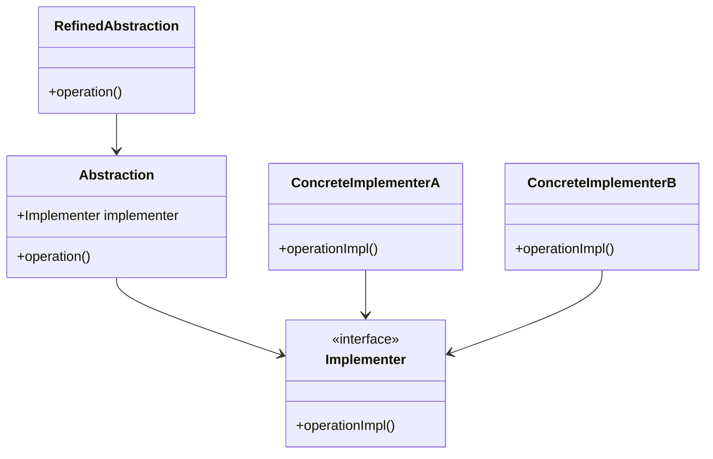

## 2.2.2 Bridge

### Introduction

The Bridge design pattern is a structural pattern that aims to decouple an abstraction from its implementation, allowing both to evolve independently. This pattern is particularly useful when you have multiple orthogonal dimensions that can vary, such as different device types and operating systems. By using the Bridge pattern, you can create flexible and scalable software architectures.

### Detailed Explanation

#### Intent

The primary intent of the Bridge pattern is to separate the abstraction from its implementation so that both can vary independently. This separation allows for more flexibility and scalability in your codebase.

#### Key Components

- **Abstraction:** Defines the abstract interface and maintains a reference to the implementer.
- **Refined Abstraction:** Extends the abstraction interface and adds additional functionalities.
- **Implementer Interface:** Defines the interface for implementation classes.
- **Concrete Implementers:** Provide concrete implementations of the implementer interface.

#### Implementation Steps

1. **Identify Orthogonal Dimensions:** Determine the dimensions that vary independently, such as device types and operating systems.
2. **Create Abstraction and Implementer Interfaces:** Define interfaces for both the abstraction and the implementer.
3. **Implement Concrete Classes:** Develop concrete classes for both abstractions and implementers.

### Visual Aids

Here's a conceptual diagram illustrating the Bridge pattern:



### Code Examples

Let's explore how the Bridge pattern can be implemented in JavaScript and TypeScript using a real-world scenario: rendering shapes in different formats.

#### JavaScript Example

```javascript
// Implementer Interface
class Renderer {
    renderCircle(radius) {
        throw new Error("This method should be overridden!");
    }
}

// Concrete Implementers
class SVGRenderer extends Renderer {
    renderCircle(radius) {
        console.log(`Rendering a circle with radius ${radius} using SVG.`);
    }
}

class CanvasRenderer extends Renderer {
    renderCircle(radius) {
        console.log(`Rendering a circle with radius ${radius} using Canvas.`);
    }
}

// Abstraction
class Shape {
    constructor(renderer) {
        this.renderer = renderer;
    }
}

// Refined Abstraction
class Circle extends Shape {
    constructor(renderer, radius) {
        super(renderer);
        this.radius = radius;
    }

    draw() {
        this.renderer.renderCircle(this.radius);
    }
}

// Usage
const svgRenderer = new SVGRenderer();
const canvasRenderer = new CanvasRenderer();

const circle1 = new Circle(svgRenderer, 5);
circle1.draw();

const circle2 = new Circle(canvasRenderer, 10);
circle2.draw();
```

#### TypeScript Example

```typescript
// Implementer Interface
interface Renderer {
    renderCircle(radius: number): void;
}

// Concrete Implementers
class SVGRenderer implements Renderer {
    renderCircle(radius: number): void {
        console.log(`Rendering a circle with radius ${radius} using SVG.`);
    }
}

class CanvasRenderer implements Renderer {
    renderCircle(radius: number): void {
        console.log(`Rendering a circle with radius ${radius} using Canvas.`);
    }
}

// Abstraction
abstract class Shape {
    protected renderer: Renderer;

    constructor(renderer: Renderer) {
        this.renderer = renderer;
    }

    abstract draw(): void;
}

// Refined Abstraction
class Circle extends Shape {
    private radius: number;

    constructor(renderer: Renderer, radius: number) {
        super(renderer);
        this.radius = radius;
    }

    draw(): void {
        this.renderer.renderCircle(this.radius);
    }
}

// Usage
const svgRenderer: Renderer = new SVGRenderer();
const canvasRenderer: Renderer = new CanvasRenderer();

const circle1: Shape = new Circle(svgRenderer, 5);
circle1.draw();

const circle2: Shape = new Circle(canvasRenderer, 10);
circle2.draw();
```

### Use Cases

- **Avoid Permanent Binding:** When you want to avoid a permanent binding between an abstraction and its implementation.
- **Dynamic Combination:** To combine different abstractions and implementations dynamically.

### Practice

To practice the Bridge pattern, consider building a remote control (abstraction) that can operate various devices (implementers) such as TVs, radios, and air conditioners.

### Considerations

- **Simplifies Code Maintenance:** By separating concerns, the Bridge pattern simplifies code maintenance.
- **Increased Number of Classes:** Be aware that this pattern can lead to an increased number of classes, which might complicate the class hierarchy.

### Advantages and Disadvantages

#### Advantages

- **Flexibility:** Allows for flexible code that can adapt to changes in both abstraction and implementation.
- **Scalability:** Facilitates scalable software design by decoupling components.

#### Disadvantages

- **Complexity:** Can introduce complexity due to the increased number of classes and interfaces.

### Best Practices

- **Adhere to SOLID Principles:** Ensure that your design adheres to SOLID principles, particularly the Single Responsibility Principle and the Open/Closed Principle.
- **Use Modern JavaScript/TypeScript Features:** Leverage modern features such as interfaces and classes to implement the Bridge pattern effectively.

### Conclusion

The Bridge design pattern is a powerful tool for decoupling abstraction from implementation, allowing for flexible and scalable software design. By understanding and applying this pattern, you can create systems that are easier to maintain and extend.

## Quiz Time!



### What is the primary intent of the Bridge design pattern?

- [x] To decouple an abstraction from its implementation so that both can vary independently.
- [ ] To provide a way to create objects without specifying their concrete classes.
- [ ] To define a family of algorithms and make them interchangeable.
- [ ] To allow an object to alter its behavior when its internal state changes.

> **Explanation:** The Bridge pattern's primary intent is to decouple an abstraction from its implementation, allowing both to vary independently.

### Which component in the Bridge pattern defines the interface for implementation classes?

- [ ] Abstraction
- [ ] Refined Abstraction
- [x] Implementer Interface
- [ ] Concrete Implementers

> **Explanation:** The Implementer Interface defines the interface for implementation classes in the Bridge pattern.

### What is a key advantage of using the Bridge pattern?

- [x] It allows for flexible code that can adapt to changes in both abstraction and implementation.
- [ ] It reduces the number of classes in the system.
- [ ] It simplifies the creation of complex objects.
- [ ] It ensures a single instance of a class.

> **Explanation:** The Bridge pattern allows for flexible code that can adapt to changes in both abstraction and implementation.

### In the Bridge pattern, what role does the Refined Abstraction play?

- [x] It extends the abstraction interface and adds additional functionalities.
- [ ] It defines the interface for implementation classes.
- [ ] It provides concrete implementations of the implementer interface.
- [ ] It maintains a reference to the implementer.

> **Explanation:** The Refined Abstraction extends the abstraction interface and adds additional functionalities.

### When should you consider using the Bridge pattern?

- [x] When you want to avoid a permanent binding between an abstraction and its implementation.
- [ ] When you need to create a complex object step by step.
- [ ] When you want to provide a unified interface to a set of interfaces.
- [ ] When you need to ensure a class has only one instance.

> **Explanation:** The Bridge pattern is useful when you want to avoid a permanent binding between an abstraction and its implementation.

### What is a potential disadvantage of the Bridge pattern?

- [x] It can introduce complexity due to the increased number of classes and interfaces.
- [ ] It limits the flexibility of the code.
- [ ] It makes it difficult to add new functionalities.
- [ ] It tightly couples the abstraction and implementation.

> **Explanation:** The Bridge pattern can introduce complexity due to the increased number of classes and interfaces.

### How does the Bridge pattern simplify code maintenance?

- [x] By separating concerns, allowing for independent changes to abstraction and implementation.
- [ ] By reducing the number of classes in the system.
- [ ] By enforcing a single instance of a class.
- [ ] By providing a way to create objects without specifying their concrete classes.

> **Explanation:** The Bridge pattern simplifies code maintenance by separating concerns, allowing for independent changes to abstraction and implementation.

### What modern JavaScript/TypeScript features are useful for implementing the Bridge pattern?

- [x] Interfaces and classes
- [ ] Promises and async/await
- [ ] Decorators and metadata
- [ ] Modules and namespaces

> **Explanation:** Interfaces and classes are useful modern JavaScript/TypeScript features for implementing the Bridge pattern.

### Which of the following is NOT a component of the Bridge pattern?

- [ ] Abstraction
- [ ] Refined Abstraction
- [ ] Implementer Interface
- [x] Singleton

> **Explanation:** Singleton is not a component of the Bridge pattern. The components include Abstraction, Refined Abstraction, Implementer Interface, and Concrete Implementers.

### True or False: The Bridge pattern is a creational pattern.

- [ ] True
- [x] False

> **Explanation:** False. The Bridge pattern is a structural pattern, not a creational pattern.


