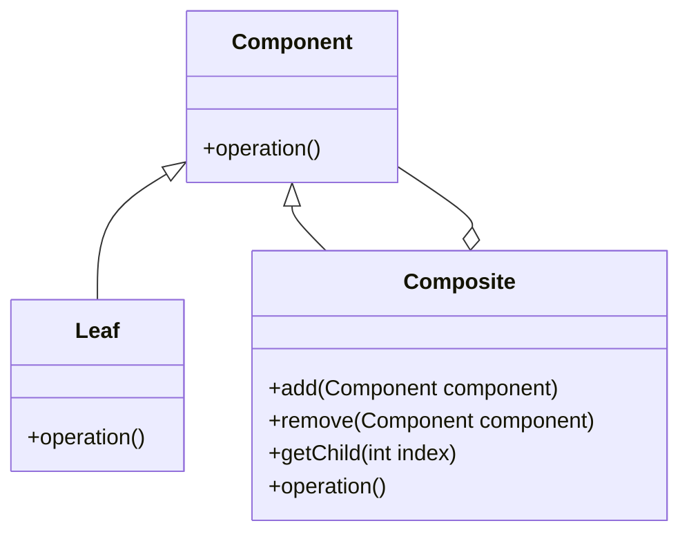

## 2.2.3 Composite

The Composite Design Pattern is a structural pattern that allows you to compose objects into tree structures to represent part-whole hierarchies. This pattern enables clients to treat individual objects and compositions of objects uniformly, simplifying the client code and making it easier to work with complex structures.

### Understand the Intent

- **Compose Objects into Tree Structures:** The Composite pattern is particularly useful for representing hierarchies of objects. It allows you to build complex structures by combining simple objects (leaves) and composite objects (nodes) into tree-like structures.
- **Uniform Treatment:** Clients can treat individual objects and compositions uniformly, which simplifies the client code. This means that you can perform operations on both individual objects and compositions without needing to know whether you are dealing with a single object or a group of objects.

### Key Components

- **Component:** This is an interface or abstract class that declares the common operations for both simple and composite objects.
- **Leaf:** Represents the end objects in the composition. A leaf has no children and implements the component interface.
- **Composite:** Represents objects that have children. It implements the component interface and defines child-related operations.

### Implementation Steps

1. **Define the Component Interface:** Create an interface or abstract class that declares the common operations for both leaf and composite objects.

2. **Implement Leaf Classes:** These classes represent the end objects in the composition. They implement the component interface and define the behavior for leaf objects.

3. **Implement Composite Classes:** These classes represent objects that have children. They implement the component interface and manage child components, defining operations for adding, removing, and accessing children.

### Visual Representation

Here's a simple diagram to illustrate the Composite pattern structure:



### Code Examples

Let's explore a practical example using JavaScript/TypeScript to implement a file system where folders and files are treated uniformly.

#### TypeScript Example

```typescript
// Component Interface
interface FileSystemComponent {
    getName(): string;
    getSize(): number;
}

// Leaf Class
class File implements FileSystemComponent {
    constructor(private name: string, private size: number) {}

    getName(): string {
        return this.name;
    }

    getSize(): number {
        return this.size;
    }
}

// Composite Class
class Directory implements FileSystemComponent {
    private components: FileSystemComponent[] = [];

    constructor(private name: string) {}

    getName(): string {
        return this.name;
    }

    getSize(): number {
        return this.components.reduce((size, component) => size + component.getSize(), 0);
    }

    add(component: FileSystemComponent): void {
        this.components.push(component);
    }

    remove(component: FileSystemComponent): void {
        const index = this.components.indexOf(component);
        if (index !== -1) {
            this.components.splice(index, 1);
        }
    }

    getChild(index: number): FileSystemComponent {
        return this.components[index];
    }
}

// Usage
const file1 = new File("File1.txt", 100);
const file2 = new File("File2.txt", 200);
const directory = new Directory("MyDocuments");
directory.add(file1);
directory.add(file2);

console.log(`Directory ${directory.getName()} has size ${directory.getSize()} bytes.`);
```

### Use Cases

- **Hierarchical Data Structures:** The Composite pattern is ideal for representing hierarchical data structures such as file systems, organizational structures, or UI components.
- **Simplifying Client Code:** By allowing clients to treat individual and composite objects uniformly, the Composite pattern simplifies client code and reduces complexity.

### Practice

To practice the Composite pattern, consider creating a UI component system where panels can contain buttons, text fields, or other panels. This exercise will help you understand how to manage hierarchical structures and treat components uniformly.

### Considerations

- **Facilitate Operations:** The Composite pattern facilitates operations over complex structures by allowing you to treat individual and composite objects uniformly.
- **Operations Suitability:** Be cautious with operations that may not make sense for all components. Ensure that operations are appropriate for both leaf and composite objects.

### Advantages and Disadvantages

#### Advantages

- **Simplifies Client Code:** By treating individual and composite objects uniformly, the Composite pattern simplifies client code and reduces complexity.
- **Flexibility:** The pattern provides flexibility in managing hierarchical structures, allowing you to add, remove, and access components easily.

#### Disadvantages

- **Complexity:** The pattern can introduce complexity, especially when dealing with large hierarchies or when operations are not suitable for all components.
- **Overhead:** Managing child components can introduce overhead, particularly in large structures.

### Best Practices

- **Use Interfaces:** Define clear interfaces for components to ensure consistent behavior across leaf and composite objects.
- **Appropriate Operations:** Ensure that operations are appropriate for both leaf and composite objects to avoid unnecessary complexity.

### Comparisons

The Composite pattern is often compared to other structural patterns like the Decorator pattern. While both patterns involve composition, the Composite pattern focuses on part-whole hierarchies, whereas the Decorator pattern focuses on adding behavior to individual objects.

### Conclusion

The Composite Design Pattern is a powerful tool for managing hierarchical structures in JavaScript and TypeScript applications. By allowing clients to treat individual and composite objects uniformly, the pattern simplifies client code and provides flexibility in managing complex structures. Understanding the intent, key components, and implementation steps of the Composite pattern will enable you to effectively apply it in your projects.

## Quiz Time!



### What is the primary intent of the Composite Design Pattern?

- [x] To compose objects into tree structures to represent hierarchies.
- [ ] To add behavior to individual objects dynamically.
- [ ] To separate the construction of a complex object from its representation.
- [ ] To define a family of algorithms and make them interchangeable.

> **Explanation:** The Composite Design Pattern is intended to compose objects into tree structures to represent part-whole hierarchies and allow clients to treat individual objects and compositions uniformly.

### Which component in the Composite pattern represents the end objects in the composition?

- [ ] Component
- [x] Leaf
- [ ] Composite
- [ ] Node

> **Explanation:** The Leaf component represents the end objects in the composition and implements the component interface without having any children.

### What is the role of the Composite class in the Composite pattern?

- [ ] To declare the interface for objects in the composition.
- [ ] To represent leaf objects without children.
- [x] To represent objects that have children and implement child-related operations.
- [ ] To provide a default implementation of the component interface.

> **Explanation:** The Composite class represents objects that have children and implements child-related operations, allowing it to manage child components.

### In the Composite pattern, how are individual and composite objects treated?

- [x] Uniformly
- [ ] Differently
- [ ] Separately
- [ ] Independently

> **Explanation:** In the Composite pattern, individual and composite objects are treated uniformly, simplifying client code by allowing operations to be performed without distinguishing between single and composite objects.

### When is the Composite pattern particularly useful?

- [x] When you have hierarchical data structures.
- [ ] When you need to add behavior to individual objects.
- [ ] When you want to encapsulate a request as an object.
- [ ] When you need to define a family of algorithms.

> **Explanation:** The Composite pattern is particularly useful when you have hierarchical data structures, as it allows you to represent part-whole hierarchies and manage them effectively.

### What is a potential disadvantage of using the Composite pattern?

- [ ] Simplifies client code
- [x] Introduces complexity
- [ ] Provides flexibility
- [ ] Reduces overhead

> **Explanation:** A potential disadvantage of using the Composite pattern is that it can introduce complexity, especially when dealing with large hierarchies or when operations are not suitable for all components.

### Which of the following is a best practice when implementing the Composite pattern?

- [x] Use interfaces to define clear component behavior.
- [ ] Avoid using interfaces for components.
- [ ] Implement all operations in the Leaf class.
- [ ] Use inheritance to manage child components.

> **Explanation:** A best practice when implementing the Composite pattern is to use interfaces to define clear component behavior, ensuring consistent behavior across leaf and composite objects.

### How does the Composite pattern facilitate operations over complex structures?

- [x] By allowing uniform treatment of individual and composite objects.
- [ ] By dynamically adding behavior to objects.
- [ ] By encapsulating requests as objects.
- [ ] By defining a family of interchangeable algorithms.

> **Explanation:** The Composite pattern facilitates operations over complex structures by allowing uniform treatment of individual and composite objects, simplifying client code and reducing complexity.

### What is the main difference between the Composite and Decorator patterns?

- [x] Composite focuses on part-whole hierarchies, while Decorator focuses on adding behavior.
- [ ] Composite focuses on adding behavior, while Decorator focuses on part-whole hierarchies.
- [ ] Composite and Decorator patterns have the same focus.
- [ ] Composite focuses on encapsulating requests, while Decorator focuses on defining algorithms.

> **Explanation:** The main difference is that the Composite pattern focuses on part-whole hierarchies, allowing for uniform treatment of individual and composite objects, while the Decorator pattern focuses on adding behavior to individual objects.

### True or False: The Composite pattern can be used to simplify client code by treating individual and composite objects uniformly.

- [x] True
- [ ] False

> **Explanation:** True. The Composite pattern simplifies client code by allowing clients to treat individual and composite objects uniformly, reducing complexity and facilitating operations over complex structures.


