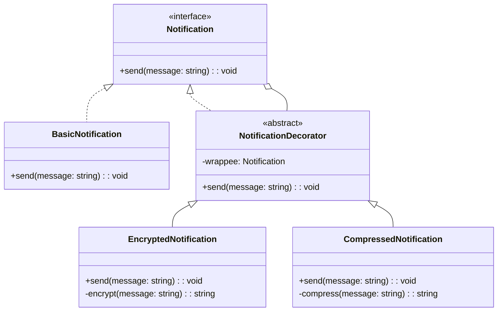

## 2.2.4 Decorator

### Introduction

The Decorator Pattern is a structural design pattern that allows behavior to be added to individual objects, either statically or dynamically, without affecting the behavior of other objects from the same class. This pattern is particularly useful when you want to add responsibilities to objects without subclassing, thereby adhering to the Open/Closed Principle.

### Understand the Intent

- **Purpose:** The primary intent of the Decorator Pattern is to add responsibilities to objects dynamically without altering their structure. This is achieved by wrapping the original object with a new object that provides the additional functionality.

### Key Components

1. **Component Interface:** Defines the interface for objects that can have responsibilities added.
2. **Concrete Component:** The original object to which new functionality is added.
3. **Decorator:** An abstract class that wraps a component and adds behavior.
4. **Concrete Decorators:** Extend the decorator to add specific responsibilities.

### Implementation Steps

1. **Create a Component Interface:** Define an interface that both the concrete component and decorators will implement.
2. **Develop a Concrete Component:** Implement the component interface with the core functionality.
3. **Create a Decorator Class:** This class should also implement the component interface and hold a reference to a component object.
4. **Implement Concrete Decorators:** Extend the decorator class to add specific functionalities.

### Code Examples

Let's explore a practical example using TypeScript, where we implement a notification system that can be decorated with additional behaviors like encryption or compression.

#### Component Interface

```typescript
interface Notification {
    send(message: string): void;
}
```

#### Concrete Component

```typescript
class BasicNotification implements Notification {
    send(message: string): void {
        console.log(`Sending message: ${message}`);
    }
}
```

#### Decorator

```typescript
abstract class NotificationDecorator implements Notification {
    protected wrappee: Notification;

    constructor(notification: Notification) {
        this.wrappee = notification;
    }

    send(message: string): void {
        this.wrappee.send(message);
    }
}
```

#### Concrete Decorators

```typescript
class EncryptedNotification extends NotificationDecorator {
    send(message: string): void {
        const encryptedMessage = this.encrypt(message);
        super.send(encryptedMessage);
    }

    private encrypt(message: string): string {
        return `encrypted(${message})`; // Simplified encryption
    }
}

class CompressedNotification extends NotificationDecorator {
    send(message: string): void {
        const compressedMessage = this.compress(message);
        super.send(compressedMessage);
    }

    private compress(message: string): string {
        return `compressed(${message})`; // Simplified compression
    }
}
```

#### Usage

```typescript
let notification: Notification = new BasicNotification();
notification = new EncryptedNotification(notification);
notification = new CompressedNotification(notification);

notification.send("Hello, World!");
```

In this example, the message "Hello, World!" is first encrypted and then compressed before being sent.

### Use Cases

- **When to Use:**
  - When you need to add responsibilities to objects without subclassing.
  - To add functionalities to specific object instances rather than all instances of a class.

### Practice

Try implementing a notification system where messages can be decorated with additional behaviors like logging or filtering. This exercise will help reinforce the concepts of the Decorator Pattern.

### Considerations

- **Flexibility:** The Decorator Pattern promotes code flexibility and adherence to the Open/Closed Principle, allowing objects to be extended with new behavior without modifying existing code.
- **Complexity:** It can lead to many small classes, which might complicate the system. It's essential to manage these carefully to maintain clarity.

### Visual Aids

Below is a conceptual diagram illustrating the Decorator Pattern structure:



### Advantages and Disadvantages

- **Advantages:**
  - Enhances flexibility by allowing the addition of new functionality without altering existing code.
  - Promotes adherence to the Single Responsibility Principle by allowing functionality to be divided among classes with specific responsibilities.

- **Disadvantages:**
  - Can result in a system with many small classes that can be difficult to manage.
  - The complexity of the system can increase as decorators are stacked.

### Best Practices

- **Use Sparingly:** While decorators offer great flexibility, overuse can lead to a complex and hard-to-manage codebase.
- **Clear Naming:** Ensure that decorator classes are named clearly to indicate their functionality.
- **Document Stacking:** If decorators are stacked, document the order and purpose of each to maintain clarity.

### Comparisons

The Decorator Pattern is often compared to the Proxy Pattern. While both involve wrapping an object, the Proxy Pattern controls access to the object, whereas the Decorator Pattern adds new behavior.

### Conclusion

The Decorator Pattern is a powerful tool in the software design arsenal, providing a flexible alternative to subclassing for extending functionality. By understanding and applying this pattern, developers can create scalable and maintainable applications.

## Quiz Time!



### What is the primary intent of the Decorator Pattern?

- [x] To add responsibilities to objects dynamically without altering their structure.
- [ ] To control access to an object.
- [ ] To create a simplified interface for a complex system.
- [ ] To ensure only one instance of a class is created.

> **Explanation:** The Decorator Pattern is intended to add responsibilities to objects dynamically without altering their structure, enhancing flexibility and adherence to the Open/Closed Principle.

### Which component defines the interface for objects that can have responsibilities added?

- [x] Component Interface
- [ ] Concrete Component
- [ ] Decorator
- [ ] Concrete Decorators

> **Explanation:** The Component Interface defines the interface for objects that can have responsibilities added, serving as the foundation for both concrete components and decorators.

### What is the role of a Concrete Decorator?

- [x] To extend the decorator to add specific responsibilities.
- [ ] To define the interface for objects.
- [ ] To implement the core functionality.
- [ ] To wrap a component and add behavior.

> **Explanation:** Concrete Decorators extend the decorator to add specific responsibilities, allowing for the dynamic addition of behavior to objects.

### How does the Decorator Pattern adhere to the Open/Closed Principle?

- [x] By allowing objects to be extended with new behavior without modifying existing code.
- [ ] By ensuring only one instance of a class is created.
- [ ] By controlling access to an object.
- [ ] By creating a simplified interface for a complex system.

> **Explanation:** The Decorator Pattern adheres to the Open/Closed Principle by allowing objects to be extended with new behavior without modifying existing code, promoting flexibility and scalability.

### What is a potential disadvantage of using the Decorator Pattern?

- [x] It can lead to many small classes, complicating the system.
- [ ] It restricts access to the object.
- [ ] It simplifies the interface of a complex system.
- [ ] It ensures only one instance of a class is created.

> **Explanation:** A potential disadvantage of the Decorator Pattern is that it can lead to many small classes, which might complicate the system if not managed carefully.

### In the provided code example, what is the purpose of the `EncryptedNotification` class?

- [x] To encrypt the message before sending it.
- [ ] To compress the message before sending it.
- [ ] To define the interface for notifications.
- [ ] To implement the core notification functionality.

> **Explanation:** The `EncryptedNotification` class encrypts the message before sending it, demonstrating how specific responsibilities can be added using decorators.

### What is the difference between the Decorator and Proxy Patterns?

- [x] Decorator adds new behavior, while Proxy controls access.
- [ ] Decorator controls access, while Proxy adds new behavior.
- [ ] Both add new behavior to objects.
- [ ] Both control access to objects.

> **Explanation:** The Decorator Pattern adds new behavior to objects, while the Proxy Pattern controls access to objects, serving different purposes in software design.

### When should the Decorator Pattern be used?

- [x] When you need to add responsibilities to objects without subclassing.
- [ ] When you need to control access to an object.
- [ ] When you need to create a simplified interface for a complex system.
- [ ] When you need to ensure only one instance of a class is created.

> **Explanation:** The Decorator Pattern should be used when you need to add responsibilities to objects without subclassing, providing a flexible alternative to modifying existing code.

### What is the role of the `NotificationDecorator` class in the provided code example?

- [x] To wrap a component and add behavior.
- [ ] To define the interface for notifications.
- [ ] To implement the core notification functionality.
- [ ] To encrypt the message before sending it.

> **Explanation:** The `NotificationDecorator` class wraps a component and adds behavior, serving as the foundation for concrete decorators that extend its functionality.

### True or False: The Decorator Pattern can be used to add functionalities to specific object instances.

- [x] True
- [ ] False

> **Explanation:** True. The Decorator Pattern can be used to add functionalities to specific object instances, allowing for dynamic and flexible behavior extension.


