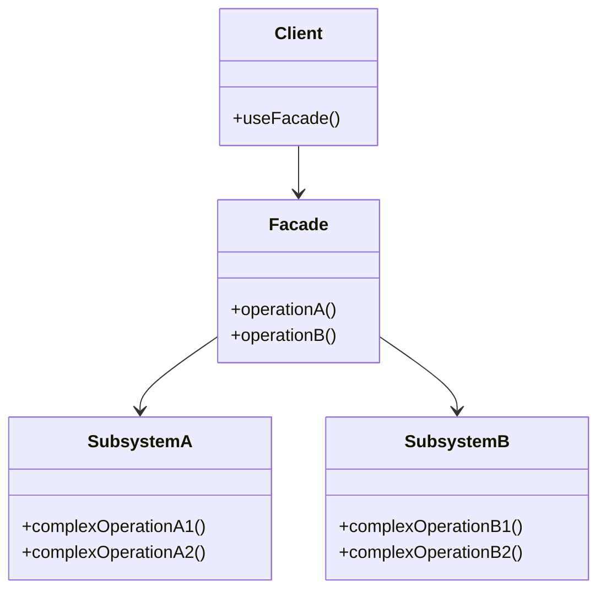

---

linkTitle: "2.2.5 Facade"
title: "Facade Design Pattern in JavaScript and TypeScript: Simplifying Complex Subsystems"
description: "Explore the Facade design pattern in JavaScript and TypeScript, learn how it simplifies complex subsystems, and discover practical implementation strategies."
categories:
- Design Patterns
- JavaScript
- TypeScript
tags:
- Facade Pattern
- Structural Patterns
- Software Design
- JavaScript
- TypeScript
date: 2024-10-25
type: docs
nav_weight: 225000
canonical: "https://softwarepatternslexicon.com/patterns-js/2/2/5"
license: "© 2024 Tokenizer Inc. CC BY-NC-SA 4.0"
---

## 2.2.5 Facade

### Introduction

The Facade design pattern is a structural pattern that provides a simplified interface to a complex subsystem. By encapsulating the complexities of the subsystem, the Facade pattern makes it easier for clients to interact with the system. This pattern is particularly useful in scenarios where a system is composed of numerous interdependent classes and interfaces, which can be daunting for clients to navigate.

### Detailed Explanation

#### Understand the Intent

- **Unified Interface:** The primary goal of the Facade pattern is to offer a unified interface to a set of interfaces within a subsystem. This unified interface simplifies the interaction with the subsystem, making it more user-friendly.
- **Simplification:** By providing a higher-level interface, the Facade pattern reduces the complexity that clients have to deal with, allowing them to focus on their specific tasks without getting bogged down by the intricacies of the subsystem.

#### Key Components

- **Facade:** This is the simplified interface that clients interact with. It abstracts the complexities of the subsystem and provides a straightforward API for clients.
- **Subsystem Classes:** These are the complex set of classes and interfaces that the Facade pattern hides from the client. They perform the actual work but are accessed indirectly through the facade.

#### Implementation Steps

1. **Identify Complex Subsystem Interfaces:** Determine which parts of the subsystem are complex or difficult for clients to use directly.
2. **Design a Facade Class:** Create a facade class that provides simpler methods for the client to use. This class will act as the intermediary between the client and the subsystem.
3. **Delegate Requests:** Implement the facade methods to delegate client requests to the appropriate subsystem objects, ensuring that the client remains unaware of the subsystem's complexity.

### Visual Aids

#### Conceptual Diagram



**Explanation:** In this diagram, the `Client` interacts with the `Facade`, which in turn communicates with `SubsystemA` and `SubsystemB`. The client is shielded from the complexities of the subsystems.

### Code Examples

#### JavaScript Example: Compiler Facade

Consider a compiler with complex subsystems for lexical analysis, parsing, and code generation. A facade can simplify the process of compiling code.

```javascript
// Subsystem classes
class Lexer {
    analyze(code) {
        console.log("Lexical analysis of code");
        // Complex logic for lexical analysis
    }
}

class Parser {
    parse(tokens) {
        console.log("Parsing tokens");
        // Complex logic for parsing
    }
}

class CodeGenerator {
    generate(ast) {
        console.log("Generating code from AST");
        // Complex logic for code generation
    }
}

// Facade class
class CompilerFacade {
    constructor() {
        this.lexer = new Lexer();
        this.parser = new Parser();
        this.codeGenerator = new CodeGenerator();
    }

    compile(code) {
        const tokens = this.lexer.analyze(code);
        const ast = this.parser.parse(tokens);
        this.codeGenerator.generate(ast);
    }
}

// Client code
const compiler = new CompilerFacade();
compiler.compile("some source code");
```

**Explanation:** The `CompilerFacade` class provides a simple `compile` method that abstracts the complexities of the `Lexer`, `Parser`, and `CodeGenerator` subsystems.

#### TypeScript Example: API Facade

In a TypeScript application, a facade can simplify API interactions.

```typescript
// Subsystem classes
class AuthService {
    login(username: string, password: string): void {
        console.log("Logging in user");
        // Complex logic for user authentication
    }
}

class DataService {
    fetchData(endpoint: string): void {
        console.log(`Fetching data from ${endpoint}`);
        // Complex logic for data retrieval
    }
}

class NotificationService {
    sendNotification(message: string): void {
        console.log(`Sending notification: ${message}`);
        // Complex logic for sending notifications
    }
}

// Facade class
class ApiFacade {
    private authService: AuthService;
    private dataService: DataService;
    private notificationService: NotificationService;

    constructor() {
        this.authService = new AuthService();
        this.dataService = new DataService();
        this.notificationService = new NotificationService();
    }

    performOperation(username: string, password: string, endpoint: string, message: string): void {
        this.authService.login(username, password);
        this.dataService.fetchData(endpoint);
        this.notificationService.sendNotification(message);
    }
}

// Client code
const apiFacade = new ApiFacade();
apiFacade.performOperation("user", "pass", "/data", "Operation completed");
```

**Explanation:** The `ApiFacade` class simplifies the process of logging in, fetching data, and sending notifications by providing a single `performOperation` method.

### Use Cases

- **Simplifying Complex Subsystems:** When you have a complex subsystem with multiple interdependent classes, a facade can provide a simple interface for clients to use.
- **Decoupling Clients from Subsystem Components:** By using a facade, clients are decoupled from the subsystem components, making the system more flexible and easier to maintain.

### Practice

**Exercise:** Create a facade for a multimedia library that handles audio and video playback. The facade should provide simple methods for playing, pausing, and stopping media, while the subsystem handles the complexities of media decoding and rendering.

### Considerations

- **Improves Code Readability and Maintainability:** By hiding the complexities of the subsystem, the Facade pattern makes the codebase easier to read and maintain.
- **Avoiding the "God Object" Anti-Pattern:** Ensure that the facade does not take on too much responsibility, as this can lead to the "god object" anti-pattern, where a single class becomes overly complex and difficult to manage.

### Advantages and Disadvantages

#### Advantages

- **Simplified Interface:** Provides a simple and easy-to-use interface for complex subsystems.
- **Decoupling:** Decouples clients from the subsystem, enhancing flexibility and maintainability.
- **Improved Readability:** Makes the codebase more readable by reducing the complexity exposed to clients.

#### Disadvantages

- **Limited Flexibility:** The facade may limit the flexibility of the subsystem by not exposing all its functionalities.
- **Potential Overhead:** Introducing a facade can add an additional layer of abstraction, which may introduce some overhead.

### Best Practices

- **Keep the Facade Simple:** Ensure that the facade provides only the necessary methods that clients need, without exposing unnecessary details of the subsystem.
- **Maintain Separation of Concerns:** The facade should delegate tasks to the appropriate subsystem classes, maintaining a clear separation of concerns.

### Comparisons

- **Facade vs. Adapter:** While both patterns provide a simplified interface, the Adapter pattern is used to make two incompatible interfaces work together, whereas the Facade pattern is used to simplify a complex subsystem.
- **Facade vs. Mediator:** The Mediator pattern centralizes communication between components, while the Facade pattern provides a simplified interface to a subsystem.

### Conclusion

The Facade design pattern is a powerful tool for managing complexity in software systems. By providing a simplified interface to complex subsystems, it enhances code readability, maintainability, and flexibility. When implemented correctly, the Facade pattern can significantly improve the usability of a system, making it easier for clients to interact with complex subsystems.

## Quiz Time!



### What is the primary goal of the Facade design pattern?

- [x] To provide a unified interface to a set of interfaces in a subsystem.
- [ ] To make two incompatible interfaces work together.
- [ ] To centralize communication between components.
- [ ] To encapsulate a family of algorithms.

> **Explanation:** The Facade pattern aims to provide a unified interface to a set of interfaces in a subsystem, simplifying its usage.

### Which component of the Facade pattern provides the simplified interface?

- [x] Facade
- [ ] Subsystem Classes
- [ ] Client
- [ ] Adapter

> **Explanation:** The Facade component provides the simplified interface that clients use to interact with the subsystem.

### In the Facade pattern, what role do subsystem classes play?

- [x] They perform the actual work but are accessed indirectly through the facade.
- [ ] They provide a simplified interface for clients.
- [ ] They centralize communication between components.
- [ ] They make two incompatible interfaces work together.

> **Explanation:** Subsystem classes perform the actual work and are accessed indirectly through the facade, which simplifies their complexity for clients.

### When should you consider using the Facade pattern?

- [x] When you want to provide a simple interface to a complex subsystem.
- [ ] When you need to make two incompatible interfaces work together.
- [ ] When you need to centralize communication between components.
- [ ] When you need to encapsulate a family of algorithms.

> **Explanation:** The Facade pattern is used to provide a simple interface to a complex subsystem, making it easier for clients to use.

### What is a potential disadvantage of using the Facade pattern?

- [x] It may limit the flexibility of the subsystem by not exposing all its functionalities.
- [ ] It may increase the complexity of the subsystem.
- [ ] It may make two incompatible interfaces work together.
- [ ] It may centralize communication between components.

> **Explanation:** A potential disadvantage of the Facade pattern is that it may limit the flexibility of the subsystem by not exposing all its functionalities.

### How does the Facade pattern improve code readability?

- [x] By hiding the complexities of the subsystem, making the codebase easier to read.
- [ ] By making two incompatible interfaces work together.
- [ ] By centralizing communication between components.
- [ ] By encapsulating a family of algorithms.

> **Explanation:** The Facade pattern improves code readability by hiding the complexities of the subsystem, making the codebase easier to read.

### What is a best practice when implementing the Facade pattern?

- [x] Ensure that the facade provides only the necessary methods that clients need.
- [ ] Ensure that the facade exposes all functionalities of the subsystem.
- [ ] Ensure that the facade centralizes communication between components.
- [ ] Ensure that the facade makes two incompatible interfaces work together.

> **Explanation:** A best practice when implementing the Facade pattern is to ensure that the facade provides only the necessary methods that clients need, without exposing unnecessary details.

### How does the Facade pattern differ from the Adapter pattern?

- [x] The Facade pattern simplifies a complex subsystem, while the Adapter pattern makes two incompatible interfaces work together.
- [ ] The Facade pattern centralizes communication between components, while the Adapter pattern simplifies a complex subsystem.
- [ ] The Facade pattern encapsulates a family of algorithms, while the Adapter pattern centralizes communication between components.
- [ ] The Facade pattern makes two incompatible interfaces work together, while the Adapter pattern simplifies a complex subsystem.

> **Explanation:** The Facade pattern simplifies a complex subsystem, while the Adapter pattern is used to make two incompatible interfaces work together.

### What is the role of the client in the Facade pattern?

- [x] To interact with the facade, which in turn communicates with the subsystem.
- [ ] To provide a simplified interface for the subsystem.
- [ ] To centralize communication between components.
- [ ] To make two incompatible interfaces work together.

> **Explanation:** In the Facade pattern, the client interacts with the facade, which in turn communicates with the subsystem, simplifying the client's interaction with the system.

### True or False: The Facade pattern can lead to the "god object" anti-pattern if not implemented correctly.

- [x] True
- [ ] False

> **Explanation:** True. If a facade takes on too much responsibility, it can become a "god object," which is an anti-pattern where a single class becomes overly complex and difficult to manage.




