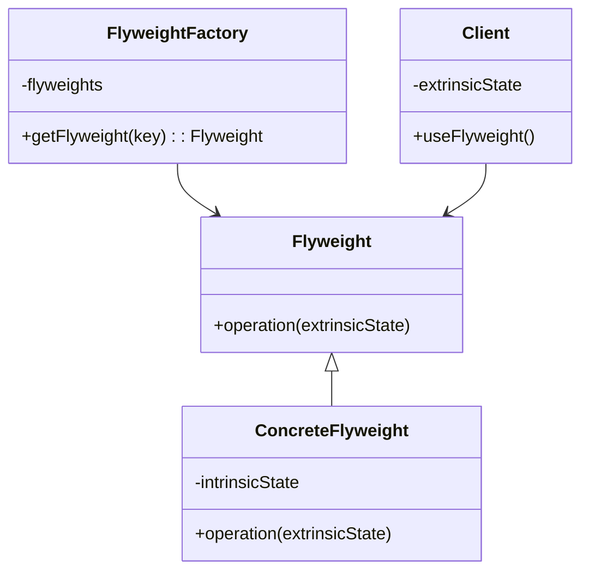

## 2.2.6 Flyweight

### Introduction

In software development, especially when dealing with large-scale applications, memory usage and performance are critical considerations. The Flyweight design pattern offers a solution by reducing the number of objects created, thereby decreasing memory usage and increasing performance. This pattern achieves efficiency by sharing objects that are similar in some way.

### Detailed Explanation

#### Understand the Intent

The primary intent of the Flyweight pattern is to minimize memory usage by sharing as much data as possible with similar objects. This is particularly useful in applications where numerous objects are created that share common data.

#### Key Components

1. **Flyweight Interface:** This interface declares methods that flyweight objects can use. It provides a way to operate on the intrinsic state.

2. **Concrete Flyweight:** Implements the flyweight interface and stores intrinsic state, which is the part of the object’s state that can be shared.

3. **Flyweight Factory:** Responsible for creating and managing flyweight objects. It ensures that flyweights are shared properly.

4. **Client:** Uses flyweight objects and maintains extrinsic state, which is the part of the object’s state that cannot be shared.

#### Implementation Steps

1. **Identify Objects to Share:** Determine which objects can be shared to reduce memory usage.

2. **Separate Intrinsic from Extrinsic State:** Intrinsic state is shared and stored in the flyweight object, while extrinsic state is unique to each object and managed by the client.

3. **Implement Flyweight Factory:** Create a factory to manage and reuse flyweight objects, ensuring that new objects are only created when necessary.

### Visual Aids

Here is a conceptual diagram illustrating the Flyweight pattern:



### Code Examples

Let's explore how to implement the Flyweight pattern in JavaScript/TypeScript with a practical example of rendering a forest with many similar trees.

#### JavaScript Example

```javascript
// Flyweight Interface
class TreeType {
    constructor(name, color, texture) {
        this.name = name;
        this.color = color;
        this.texture = texture;
    }

    draw(canvas, x, y) {
        // Draw the tree on the canvas at position (x, y)
        console.log(`Drawing a ${this.name} tree at (${x}, ${y}) with color ${this.color}`);
    }
}

// Flyweight Factory
class TreeFactory {
    constructor() {
        this.treeTypes = {};
    }

    getTreeType(name, color, texture) {
        const key = `${name}_${color}_${texture}`;
        if (!this.treeTypes[key]) {
            this.treeTypes[key] = new TreeType(name, color, texture);
        }
        return this.treeTypes[key];
    }
}

// Client
class Tree {
    constructor(x, y, type) {
        this.x = x;
        this.y = y;
        this.type = type;
    }

    draw(canvas) {
        this.type.draw(canvas, this.x, this.y);
    }
}

// Usage
const factory = new TreeFactory();
const trees = [];
const canvas = {}; // Assume this is a canvas object

trees.push(new Tree(10, 20, factory.getTreeType('Oak', 'Green', 'Rough')));
trees.push(new Tree(30, 40, factory.getTreeType('Pine', 'Dark Green', 'Smooth')));

trees.forEach(tree => tree.draw(canvas));
```

#### TypeScript Example

```typescript
// Flyweight Interface
class TreeType {
    constructor(public name: string, public color: string, public texture: string) {}

    draw(canvas: any, x: number, y: number): void {
        console.log(`Drawing a ${this.name} tree at (${x}, ${y}) with color ${this.color}`);
    }
}

// Flyweight Factory
class TreeFactory {
    private treeTypes: { [key: string]: TreeType } = {};

    getTreeType(name: string, color: string, texture: string): TreeType {
        const key = `${name}_${color}_${texture}`;
        if (!this.treeTypes[key]) {
            this.treeTypes[key] = new TreeType(name, color, texture);
        }
        return this.treeTypes[key];
    }
}

// Client
class Tree {
    constructor(private x: number, private y: number, private type: TreeType) {}

    draw(canvas: any): void {
        this.type.draw(canvas, this.x, this.y);
    }
}

// Usage
const factory = new TreeFactory();
const trees: Tree[] = [];
const canvas = {}; // Assume this is a canvas object

trees.push(new Tree(10, 20, factory.getTreeType('Oak', 'Green', 'Rough')));
trees.push(new Tree(30, 40, factory.getTreeType('Pine', 'Dark Green', 'Smooth')));

trees.forEach(tree => tree.draw(canvas));
```

### Use Cases

The Flyweight pattern is particularly useful in scenarios where applications need to handle a large number of similar objects efficiently. Common use cases include:

- **Text Editors:** Characters in a document can be shared flyweights, reducing memory usage when rendering large texts.
- **Graphics Applications:** Rendering scenes with many similar objects, such as trees in a forest or buildings in a cityscape.

### Advantages and Disadvantages

#### Advantages

- **Reduced Memory Usage:** By sharing common data, the Flyweight pattern significantly reduces memory consumption.
- **Improved Performance:** Fewer objects mean less overhead in terms of memory management and garbage collection.

#### Disadvantages

- **Complexity in Managing Shared State:** The pattern introduces complexity in managing shared and unique states.
- **Immutability Requirement:** Shared objects must remain immutable to prevent unintended side effects.

### Best Practices

- **Ensure Immutability:** Make sure that the intrinsic state of flyweight objects is immutable to avoid side effects.
- **Use Factory Pattern:** Leverage the factory pattern to manage the creation and reuse of flyweight objects efficiently.

### Conclusion

The Flyweight design pattern is a powerful tool for optimizing memory usage and performance in applications that require handling a large number of similar objects. By sharing common data among objects, developers can significantly reduce memory consumption and improve application performance. However, it is essential to manage the complexity introduced by shared states and ensure that shared objects remain immutable.

## Quiz Time!



### What is the primary intent of the Flyweight pattern?

- [x] To reduce the number of objects created to decrease memory usage and increase performance.
- [ ] To encapsulate a request as an object.
- [ ] To define a family of algorithms.
- [ ] To provide a way to access the elements of an aggregate object sequentially.

> **Explanation:** The Flyweight pattern aims to reduce memory usage and increase performance by sharing objects that are similar in some way.

### Which component of the Flyweight pattern is responsible for creating and managing flyweight objects?

- [ ] Flyweight Interface
- [ ] Concrete Flyweight
- [x] Flyweight Factory
- [ ] Client

> **Explanation:** The Flyweight Factory is responsible for creating and managing flyweight objects, ensuring that they are shared properly.

### In the Flyweight pattern, what is the intrinsic state?

- [x] The part of the object's state that can be shared.
- [ ] The part of the object's state that cannot be shared.
- [ ] The state managed by the client.
- [ ] The state that changes frequently.

> **Explanation:** The intrinsic state is the part of the object's state that can be shared among multiple objects.

### What is a common use case for the Flyweight pattern?

- [ ] Implementing a singleton object.
- [ ] Managing a single instance of a class.
- [x] Handling a large number of similar objects efficiently.
- [ ] Encapsulating a request as an object.

> **Explanation:** The Flyweight pattern is commonly used to handle a large number of similar objects efficiently by sharing common data.

### What is a disadvantage of using the Flyweight pattern?

- [ ] Increased memory usage.
- [x] Complexity in managing shared state.
- [ ] Difficulty in creating objects.
- [ ] Lack of performance improvement.

> **Explanation:** The Flyweight pattern introduces complexity in managing shared and unique states, which can be a disadvantage.

### Which of the following is a best practice when implementing the Flyweight pattern?

- [x] Ensure that shared objects remain immutable.
- [ ] Avoid using a factory for object creation.
- [ ] Share all states of the object.
- [ ] Use the pattern only for unique objects.

> **Explanation:** Ensuring that shared objects remain immutable is a best practice to prevent unintended side effects.

### How does the Flyweight pattern improve performance?

- [ ] By increasing the number of objects.
- [x] By reducing memory consumption and management overhead.
- [ ] By making objects mutable.
- [ ] By avoiding object reuse.

> **Explanation:** The Flyweight pattern improves performance by reducing memory consumption and management overhead through object reuse.

### What role does the client play in the Flyweight pattern?

- [ ] It creates flyweight objects.
- [ ] It manages the intrinsic state.
- [x] It uses flyweight objects and maintains extrinsic state.
- [ ] It implements the flyweight interface.

> **Explanation:** The client uses flyweight objects and maintains the extrinsic state, which is unique to each object.

### In the provided code example, what does the `TreeFactory` class do?

- [ ] It draws trees on the canvas.
- [x] It manages and reuses `TreeType` objects.
- [ ] It maintains the extrinsic state of trees.
- [ ] It implements the flyweight interface.

> **Explanation:** The `TreeFactory` class manages and reuses `TreeType` objects, ensuring that they are shared properly.

### True or False: The Flyweight pattern is only applicable to graphical applications.

- [ ] True
- [x] False

> **Explanation:** False. While the Flyweight pattern is commonly used in graphical applications, it can be applied to any scenario where a large number of similar objects need to be managed efficiently.


