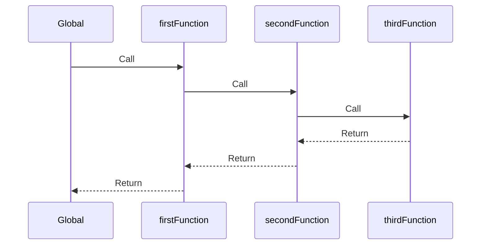
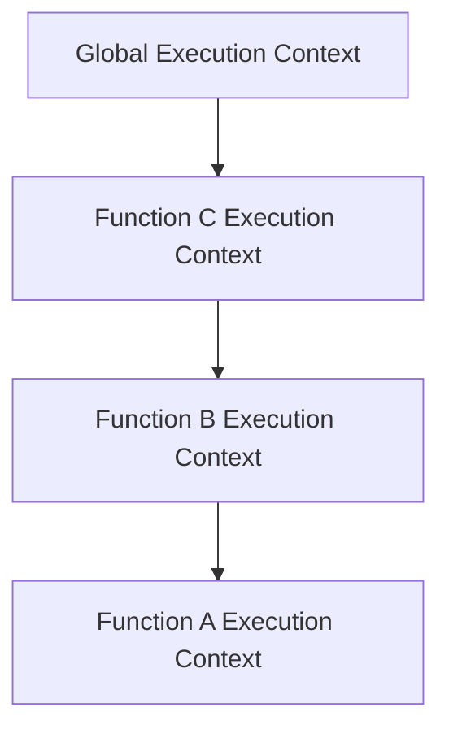

## 2.2 Execution Context and Call Stack

In the realm of JavaScript, understanding the execution context and call stack is crucial for mastering how functions are executed and how the language manages the order of operations. This knowledge is foundational for debugging, optimizing code, and implementing complex design patterns.

### Understanding Execution Context

An **execution context** is an abstract concept that holds information about the environment within which the current code is being executed. It is created whenever a function is invoked, and it consists of three main components:

1. **Variable Object (VO):** This object stores function arguments, local variables, and function declarations. In the global context, it also includes global variables and functions.

2. **Scope Chain:** This is a list of objects that the JavaScript engine uses to resolve variables. It ensures that the engine can access variables in the current context and its parent contexts.

3. **`this` Value:** This refers to the object that is currently executing the code. Its value depends on how a function is called.

#### Types of Execution Contexts

There are three types of execution contexts in JavaScript:

- **Global Execution Context:** This is the default context where the code starts execution. It creates a global object (e.g., `window` in browsers) and sets `this` to the global object.

- **Function Execution Context:** Created whenever a function is invoked. Each function call has its own execution context.

- **Eval Execution Context:** Created when code is executed inside an `eval` function. It is less commonly used due to security and performance concerns.

### The Call Stack

The **call stack** is a data structure that keeps track of function calls in a program. It follows the Last In, First Out (LIFO) principle, meaning the last function called is the first to be executed. When a function is invoked, its execution context is pushed onto the stack. Once the function completes, its context is popped off the stack.

#### Visualizing the Call Stack

Let's visualize how the call stack operates using a simple example:

```javascript
function firstFunction() {
    console.log("First function");
    secondFunction();
}

function secondFunction() {
    console.log("Second function");
    thirdFunction();
}

function thirdFunction() {
    console.log("Third function");
}

firstFunction();
```

**Call Stack Operations:**

1. **Global Execution Context** is created and pushed onto the stack.
2. `firstFunction()` is called, creating a new execution context, which is pushed onto the stack.
3. Inside `firstFunction`, `secondFunction()` is called, adding another execution context to the stack.
4. `thirdFunction()` is invoked within `secondFunction`, pushing its context onto the stack.
5. As `thirdFunction` completes, its context is popped off the stack.
6. `secondFunction` completes, and its context is removed.
7. Finally, `firstFunction` completes, and its context is popped off, leaving only the global context.



**Diagram Explanation:** This sequence diagram illustrates the order of function calls and returns, showing how the call stack manages execution flow.

### Creating and Destroying Execution Contexts

Execution contexts are created when a function is invoked and destroyed when the function completes execution. This lifecycle is crucial for understanding how JavaScript manages memory and execution flow.

#### Example: Execution Context Lifecycle

Consider the following code:

```javascript
function greet(name) {
    console.log(`Hello, ${name}!`);
}

greet("Alice");
```

1. **Global Execution Context** is created when the script starts.
2. `greet("Alice")` is called, creating a new execution context for `greet`.
3. The `greet` context is pushed onto the stack.
4. `console.log` executes within `greet`, printing the message.
5. The `greet` context is popped off the stack once the function completes.

### Stack Overflow and Recursion

A **stack overflow** occurs when the call stack exceeds its limit, typically due to excessive recursion or deeply nested function calls. This results in an error and can crash the program.

#### Example: Stack Overflow

```javascript
function recursiveFunction() {
    recursiveFunction(); // Infinite recursion
}

recursiveFunction();
```

**Explanation:** The `recursiveFunction` calls itself indefinitely, causing the call stack to grow until it exceeds its limit, resulting in a stack overflow error.

#### Recursion Considerations

When using recursion, ensure that there is a base case to terminate the recursive calls. This prevents stack overflow and ensures the program completes execution.

### Synchronous Code and the Call Stack

In synchronous JavaScript, the call stack manages the execution order of functions. Functions are executed in the order they are called, and each function must complete before the next one begins.

#### Example: Synchronous Execution

```javascript
function a() {
    console.log("Function A");
}

function b() {
    console.log("Function B");
    a();
}

function c() {
    console.log("Function C");
    b();
}

c();
```

**Execution Order:**

1. `c()` is called, pushing its context onto the stack.
2. `b()` is called within `c`, adding its context to the stack.
3. `a()` is called within `b`, pushing its context onto the stack.
4. `a` completes, followed by `b`, and finally `c`.

### Try It Yourself

Experiment with the code examples provided. Try modifying the function calls or adding new functions to see how the call stack changes. Observe how execution contexts are created and destroyed.

### Visualizing Execution Contexts

To further understand execution contexts, let's visualize how they interact with the call stack:



**Diagram Explanation:** This graph shows the hierarchical relationship between execution contexts as they are created and destroyed during function calls.

### References and Further Reading

- [MDN Web Docs: Execution Contexts](https://developer.mozilla.org/en-US/docs/Web/JavaScript/Guide/Grammar_and_types#execution_contexts)
- [MDN Web Docs: Call Stack](https://developer.mozilla.org/en-US/docs/Glossary/Call_stack)
- [JavaScript.info: Execution Context and Call Stack](https://javascript.info/execution-context)

### Knowledge Check

- What are the three main components of an execution context?
- How does the call stack manage function execution order?
- What causes a stack overflow error, and how can it be prevented?
- How does the call stack differ in synchronous and asynchronous JavaScript?

### Summary

Understanding the execution context and call stack is essential for mastering JavaScript's function execution order. By grasping these concepts, you can effectively debug, optimize, and implement complex design patterns in your code. Remember, this is just the beginning. As you progress, you'll build more complex and interactive web pages. Keep experimenting, stay curious, and enjoy the journey!

## Quiz: Mastering JavaScript Execution Context and Call Stack



### What are the three main components of an execution context?

- [x] Variable Object, Scope Chain, `this` Value
- [ ] Global Object, Local Variables, Function Declarations
- [ ] Call Stack, Execution Order, Function Context
- [ ] Function Arguments, Local Variables, Global Variables

> **Explanation:** The execution context consists of the Variable Object, Scope Chain, and `this` Value.

### How does the call stack manage function execution order?

- [x] Last In, First Out (LIFO) principle
- [ ] First In, First Out (FIFO) principle
- [ ] Random Order Execution
- [ ] Based on Function Complexity

> **Explanation:** The call stack follows the Last In, First Out (LIFO) principle, meaning the last function called is the first to be executed.

### What causes a stack overflow error?

- [x] Excessive recursion or deeply nested function calls
- [ ] Incorrect variable declarations
- [ ] Syntax errors in the code
- [ ] Using too many global variables

> **Explanation:** A stack overflow occurs when the call stack exceeds its limit, typically due to excessive recursion or deeply nested function calls.

### How can stack overflow errors be prevented?

- [x] Ensure a base case in recursive functions
- [ ] Avoid using global variables
- [ ] Use only synchronous code
- [ ] Limit the number of function calls

> **Explanation:** To prevent stack overflow, ensure that recursive functions have a base case to terminate the recursive calls.

### How does the call stack differ in synchronous and asynchronous JavaScript?

- [x] In synchronous JavaScript, functions execute in order; in asynchronous, they may not.
- [ ] In asynchronous JavaScript, functions execute in order; in synchronous, they may not.
- [ ] Both execute functions in the same order.
- [ ] Synchronous JavaScript does not use a call stack.

> **Explanation:** In synchronous JavaScript, functions execute in the order they are called. In asynchronous JavaScript, functions may not execute in the order they are called due to events or callbacks.

### What is the role of the `this` value in an execution context?

- [x] Refers to the object currently executing the code
- [ ] Stores function arguments
- [ ] Manages the call stack
- [ ] Holds local variables

> **Explanation:** The `this` value refers to the object that is currently executing the code within an execution context.

### What is the purpose of the scope chain in an execution context?

- [x] Resolves variables in the current and parent contexts
- [ ] Manages function arguments
- [ ] Controls the call stack
- [ ] Stores global variables

> **Explanation:** The scope chain is used to resolve variables in the current context and its parent contexts.

### What happens when a function completes execution?

- [x] Its execution context is popped off the call stack
- [ ] Its execution context is pushed onto the call stack
- [ ] The global context is destroyed
- [ ] The call stack is reset

> **Explanation:** When a function completes execution, its execution context is popped off the call stack.

### What is the default execution context in JavaScript?

- [x] Global Execution Context
- [ ] Function Execution Context
- [ ] Eval Execution Context
- [ ] Local Execution Context

> **Explanation:** The default execution context in JavaScript is the Global Execution Context.

### True or False: The call stack can manage both synchronous and asynchronous code execution.

- [x] True
- [ ] False

> **Explanation:** The call stack manages synchronous code execution, while asynchronous code execution is managed by the event loop and callback queue.




