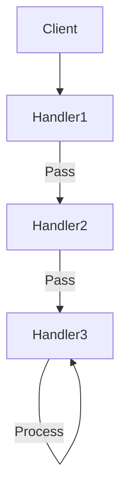

---

linkTitle: "2.3.1 Chain of Responsibility"
title: "Chain of Responsibility: Mastering the Behavioral Design Pattern in JavaScript and TypeScript"
description: "Explore the Chain of Responsibility pattern, its implementation in JavaScript and TypeScript, and its applications in modern software development."
categories:
- Design Patterns
- JavaScript
- TypeScript
tags:
- Chain of Responsibility
- Behavioral Patterns
- JavaScript Design Patterns
- TypeScript Design Patterns
- Software Architecture
date: 2024-10-25
type: docs
nav_weight: 2310

canonical: "https://softwarepatternslexicon.com/patterns-js/2/3/1"
license: "© 2024 Tokenizer Inc. CC BY-NC-SA 4.0"
---

## 2.3.1 Chain of Responsibility

The Chain of Responsibility is a behavioral design pattern that allows a request to pass through a chain of handlers. Each handler in the chain decides whether to process the request or pass it to the next handler. This pattern promotes the decoupling of senders and receivers, providing flexibility in assigning responsibilities.

### Understand the Intent

The primary intent of the Chain of Responsibility pattern is to avoid coupling the sender of a request to its receiver by giving multiple objects a chance to handle the request. This pattern is particularly useful when multiple objects might handle a request dynamically.

### Key Components

- **Handler Interface:** Defines a method for handling requests and optionally setting the next handler.
- **Concrete Handlers:** Implement the handler interface; process specific requests or delegate them to the next handler.
- **Client:** Initiates the request and sends it to the first handler in the chain.

### Implementation Steps

1. **Create a Handler Interface:** Define a method to handle the request and a reference to the next handler.
2. **Implement Concrete Handlers:** Create classes that process the request if they can, or pass it along the chain.
3. **Chain the Handlers:** Connect the handlers in the desired order to form a chain.

### Code Examples

Let's explore how the Chain of Responsibility pattern can be implemented in JavaScript and TypeScript through a practical example.

#### JavaScript Implementation

```javascript
class Handler {
    setNext(handler) {
        this.nextHandler = handler;
        return handler;
    }

    handle(request) {
        if (this.nextHandler) {
            return this.nextHandler.handle(request);
        }
        return null;
    }
}

class ConcreteHandler1 extends Handler {
    handle(request) {
        if (request === 'Request1') {
            return `ConcreteHandler1 handled ${request}`;
        }
        return super.handle(request);
    }
}

class ConcreteHandler2 extends Handler {
    handle(request) {
        if (request === 'Request2') {
            return `ConcreteHandler2 handled ${request}`;
        }
        return super.handle(request);
    }
}

// Client code
const handler1 = new ConcreteHandler1();
const handler2 = new ConcreteHandler2();

handler1.setNext(handler2);

console.log(handler1.handle('Request1')); // ConcreteHandler1 handled Request1
console.log(handler1.handle('Request2')); // ConcreteHandler2 handled Request2
console.log(handler1.handle('Request3')); // null
```

#### TypeScript Implementation

```typescript
interface Handler {
    setNext(handler: Handler): Handler;
    handle(request: string): string | null;
}

abstract class AbstractHandler implements Handler {
    private nextHandler: Handler | null = null;

    public setNext(handler: Handler): Handler {
        this.nextHandler = handler;
        return handler;
    }

    public handle(request: string): string | null {
        if (this.nextHandler) {
            return this.nextHandler.handle(request);
        }
        return null;
    }
}

class ConcreteHandler1 extends AbstractHandler {
    public handle(request: string): string | null {
        if (request === 'Request1') {
            return `ConcreteHandler1 handled ${request}`;
        }
        return super.handle(request);
    }
}

class ConcreteHandler2 extends AbstractHandler {
    public handle(request: string): string | null {
        if (request === 'Request2') {
            return `ConcreteHandler2 handled ${request}`;
        }
        return super.handle(request);
    }
}

// Client code
const handler1 = new ConcreteHandler1();
const handler2 = new ConcreteHandler2();

handler1.setNext(handler2);

console.log(handler1.handle('Request1')); // ConcreteHandler1 handled Request1
console.log(handler1.handle('Request2')); // ConcreteHandler2 handled Request2
console.log(handler1.handle('Request3')); // null
```

### Use Cases

- **Event Handling in GUI Frameworks:** The pattern is often used in GUI frameworks where events are passed through a chain of handlers.
- **Logging Systems:** Different logging levels (e.g., INFO, DEBUG, ERROR) can be handled by different handlers.
- **Customer Support Systems:** Implement a support system with handlers for different levels of support, such as a FAQ bot, human agent, and supervisor.

### Practice

To practice implementing the Chain of Responsibility pattern, try creating a customer support system where requests are handled by different levels of support. Start with a FAQ bot, then escalate to a human agent, and finally to a supervisor if necessary.

### Considerations

- **Default Case or Terminal Handler:** Ensure there's a default case or terminal handler to prevent unhandled requests.
- **Performance Impacts:** Be cautious of performance impacts due to long chains, as each handler adds overhead.

### Visual Representation

Below is a conceptual diagram illustrating the Chain of Responsibility pattern:



### Best Practices

- **SOLID Principles:** Adhere to the Single Responsibility Principle by ensuring each handler has a clear, distinct responsibility.
- **Code Maintainability:** Keep the chain flexible and easy to modify by using interfaces and abstract classes.
- **Design Considerations:** Focus on decoupling the sender and receiver, allowing for dynamic assignment of responsibilities.

### Comparative Analysis

The Chain of Responsibility pattern is often compared with other behavioral patterns like the Command and Observer patterns. While the Chain of Responsibility focuses on passing requests along a chain, the Command pattern encapsulates requests as objects, and the Observer pattern defines a one-to-many dependency between objects.

### Conclusion

The Chain of Responsibility pattern is a powerful tool for decoupling senders and receivers, providing flexibility in handling requests. By understanding its components and implementation, you can effectively apply this pattern in various scenarios, from event handling to logging systems.

## Quiz Time!



### What is the primary intent of the Chain of Responsibility pattern?

- [x] To avoid coupling the sender of a request to its receiver by giving multiple objects a chance to handle the request.
- [ ] To ensure a single object handles all requests.
- [ ] To encapsulate requests as objects.
- [ ] To define a one-to-many dependency between objects.

> **Explanation:** The Chain of Responsibility pattern allows multiple objects to handle a request, avoiding direct coupling between the sender and receiver.

### Which component defines a method for handling requests in the Chain of Responsibility pattern?

- [x] Handler Interface
- [ ] Concrete Handler
- [ ] Client
- [ ] Request

> **Explanation:** The Handler Interface defines the method for handling requests and optionally setting the next handler.

### What is a common use case for the Chain of Responsibility pattern?

- [x] Event handling in GUI frameworks
- [ ] Database transactions
- [ ] Singleton pattern implementation
- [ ] Object cloning

> **Explanation:** The Chain of Responsibility pattern is commonly used in GUI frameworks for event handling.

### In the Chain of Responsibility pattern, what is the role of the client?

- [x] To initiate the request and send it to the first handler in the chain.
- [ ] To process the request directly.
- [ ] To define the handler interface.
- [ ] To terminate the chain.

> **Explanation:** The client initiates the request and sends it to the first handler in the chain.

### What should be ensured to prevent unhandled requests in the Chain of Responsibility pattern?

- [x] A default case or terminal handler
- [ ] A single handler
- [ ] A loop in the chain
- [ ] A direct connection between sender and receiver

> **Explanation:** A default case or terminal handler should be ensured to prevent unhandled requests.

### How does the Chain of Responsibility pattern promote flexibility?

- [x] By decoupling senders and receivers, allowing dynamic assignment of responsibilities.
- [ ] By ensuring a single object handles all requests.
- [ ] By encapsulating requests as objects.
- [ ] By defining a one-to-many dependency between objects.

> **Explanation:** The pattern promotes flexibility by decoupling senders and receivers, allowing dynamic assignment of responsibilities.

### Which principle is adhered to by ensuring each handler has a clear, distinct responsibility?

- [x] Single Responsibility Principle
- [ ] Open/Closed Principle
- [ ] Liskov Substitution Principle
- [ ] Interface Segregation Principle

> **Explanation:** The Single Responsibility Principle is adhered to by ensuring each handler has a clear, distinct responsibility.

### What is a potential performance impact of using the Chain of Responsibility pattern?

- [x] Long chains can add overhead and affect performance.
- [ ] It can lead to memory leaks.
- [ ] It can cause data corruption.
- [ ] It can create circular dependencies.

> **Explanation:** Long chains can add overhead and affect performance, so it's important to be cautious of this impact.

### How can the Chain of Responsibility pattern be compared to the Command pattern?

- [x] The Chain of Responsibility passes requests along a chain, while the Command pattern encapsulates requests as objects.
- [ ] Both patterns encapsulate requests as objects.
- [ ] Both patterns define a one-to-many dependency between objects.
- [ ] The Chain of Responsibility defines a one-to-many dependency, while the Command pattern passes requests along a chain.

> **Explanation:** The Chain of Responsibility passes requests along a chain, while the Command pattern encapsulates requests as objects.

### True or False: The Chain of Responsibility pattern is only applicable in object-oriented programming.

- [ ] True
- [x] False

> **Explanation:** The Chain of Responsibility pattern can be applied in various programming paradigms, not just object-oriented programming.


