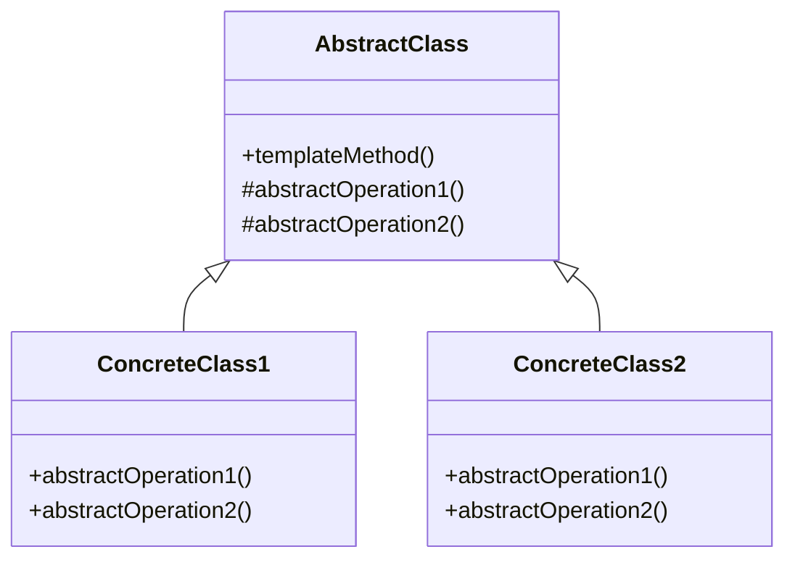

## 2.3.10 Template Method

### Introduction

The Template Method design pattern is a behavioral pattern from the classic Gang of Four (GoF) design patterns. It defines the skeleton of an algorithm in a method, allowing subclasses to redefine certain steps without changing the algorithm's structure. This pattern is particularly useful when you have multiple classes with similar algorithms but differing details.

### Detailed Explanation

#### Understand the Intent

The primary intent of the Template Method pattern is to define the overall structure of an algorithm while allowing subclasses to implement specific steps. This approach promotes code reuse and ensures consistency across different implementations of the algorithm.

#### Key Components

- **Abstract Class:** This class contains the template method, which defines the structure of the algorithm. It may also include some concrete methods that are common across all implementations.
  
- **Template Method:** A method within the abstract class that outlines the steps of the algorithm. It calls abstract methods that subclasses must implement.
  
- **Concrete Classes:** These classes extend the abstract class and provide specific implementations for the abstract methods defined in the template method.

#### Implementation Steps

1. **Define an Abstract Class:** Create an abstract class that includes the template method and any abstract operations needed for the algorithm.

2. **Implement Concrete Subclasses:** Develop concrete subclasses that override the abstract operations to provide specific behavior.

### Visual Aids

#### Conceptual Diagram



### Code Examples

Let's explore a practical example using JavaScript/TypeScript to illustrate the Template Method pattern. Consider a data processing pipeline where the steps are fixed, but the implementations vary.

```typescript
abstract class DataProcessor {
    // Template method
    public process(): void {
        this.extractData();
        this.transformData();
        this.loadData();
    }

    protected abstract extractData(): void;
    protected abstract transformData(): void;
    protected abstract loadData(): void;
}

class CSVDataProcessor extends DataProcessor {
    protected extractData(): void {
        console.log("Extracting data from CSV file.");
    }

    protected transformData(): void {
        console.log("Transforming CSV data.");
    }

    protected loadData(): void {
        console.log("Loading CSV data into database.");
    }
}

class JSONDataProcessor extends DataProcessor {
    protected extractData(): void {
        console.log("Extracting data from JSON file.");
    }

    protected transformData(): void {
        console.log("Transforming JSON data.");
    }

    protected loadData(): void {
        console.log("Loading JSON data into database.");
    }
}

// Usage
const csvProcessor = new CSVDataProcessor();
csvProcessor.process();

const jsonProcessor = new JSONDataProcessor();
jsonProcessor.process();
```

### Use Cases

The Template Method pattern is applicable in scenarios where:

- You have multiple classes with similar algorithms but differing details.
- You want to enforce a consistent algorithm structure across different implementations.
- You need to promote code reuse by factoring out common behavior.

### Practice

As a practice exercise, consider creating a game framework where the game's main loop is a template method. This loop could include steps like initializing the game, running the game loop, and shutting down the game, with specific implementations provided by different game types.

### Considerations

- **Code Reuse:** The Template Method pattern promotes code reuse by extracting common behavior into a shared abstract class.
  
- **Hollywood Principle:** Be mindful of the "Hollywood Principle" ("Don't call us; we'll call you"), which emphasizes that the control flow is managed by the template method, not by the subclasses.

### Advantages and Disadvantages

#### Advantages

- **Code Reuse:** Facilitates code reuse by defining common algorithm structures.
- **Consistency:** Ensures consistent algorithm execution across different implementations.
- **Flexibility:** Allows subclasses to customize specific steps of the algorithm.

#### Disadvantages

- **Inheritance Dependency:** Relies on inheritance, which can lead to tight coupling between the abstract class and its subclasses.
- **Limited Flexibility:** Changes to the algorithm structure require modifications to the abstract class, potentially affecting all subclasses.

### Best Practices

- **Use Abstract Classes Wisely:** Ensure that the abstract class provides a clear and concise template for the algorithm.
- **Minimize Abstract Methods:** Limit the number of abstract methods to those that truly require subclass customization.
- **Document Template Methods:** Clearly document the purpose and expected behavior of the template method to guide subclass implementations.

### Comparisons

The Template Method pattern can be compared to the Strategy pattern, which also deals with algorithmic variations. However, while the Template Method pattern uses inheritance to define algorithm steps, the Strategy pattern uses composition to encapsulate algorithms.

### Conclusion

The Template Method design pattern is a powerful tool for defining algorithm structures and promoting code reuse. By understanding its intent, key components, and implementation steps, developers can effectively apply this pattern to create flexible and consistent software solutions.

## Quiz Time!



### What is the primary intent of the Template Method pattern?

- [x] To define the skeleton of an algorithm in a method, deferring some steps to subclasses.
- [ ] To encapsulate a family of algorithms and make them interchangeable.
- [ ] To provide a way to access the elements of an aggregate object sequentially.
- [ ] To define an interface for creating an object, but let subclasses alter the type of objects that will be created.

> **Explanation:** The Template Method pattern defines the skeleton of an algorithm, allowing subclasses to implement specific steps.

### Which component of the Template Method pattern contains the template method?

- [x] Abstract Class
- [ ] Concrete Class
- [ ] Interface
- [ ] Singleton

> **Explanation:** The abstract class contains the template method, which outlines the algorithm's structure.

### What is the role of concrete classes in the Template Method pattern?

- [x] To implement the abstract methods defined in the abstract class.
- [ ] To define the template method.
- [ ] To provide a default implementation for all methods.
- [ ] To encapsulate algorithm variations.

> **Explanation:** Concrete classes implement the abstract methods to provide specific behavior for the algorithm steps.

### Which principle is associated with the Template Method pattern?

- [x] Hollywood Principle
- [ ] Open/Closed Principle
- [ ] Single Responsibility Principle
- [ ] Dependency Inversion Principle

> **Explanation:** The Hollywood Principle ("Don't call us; we'll call you") is associated with the Template Method pattern, emphasizing control flow management by the template method.

### When is the Template Method pattern particularly useful?

- [x] When you have multiple classes with similar algorithms but differing details.
- [ ] When you need to encapsulate a family of algorithms.
- [ ] When you want to provide a way to access elements of an aggregate object.
- [ ] When you need to define an interface for creating objects.

> **Explanation:** The Template Method pattern is useful when multiple classes share similar algorithms but differ in specific details.

### What is a potential disadvantage of the Template Method pattern?

- [x] Inheritance Dependency
- [ ] Lack of code reuse
- [ ] Inconsistent algorithm execution
- [ ] Limited subclass customization

> **Explanation:** The Template Method pattern relies on inheritance, which can lead to tight coupling between the abstract class and its subclasses.

### How does the Template Method pattern promote code reuse?

- [x] By defining common algorithm structures in an abstract class.
- [ ] By encapsulating algorithms in separate classes.
- [ ] By providing default implementations for all methods.
- [ ] By allowing subclasses to alter the type of objects created.

> **Explanation:** The Template Method pattern promotes code reuse by defining common algorithm structures in an abstract class.

### What is a best practice when implementing the Template Method pattern?

- [x] Minimize the number of abstract methods.
- [ ] Use interfaces instead of abstract classes.
- [ ] Avoid documenting the template method.
- [ ] Implement all methods in the abstract class.

> **Explanation:** Minimizing the number of abstract methods helps ensure that only necessary customizations are required from subclasses.

### How does the Template Method pattern ensure consistency?

- [x] By defining a consistent algorithm structure in the template method.
- [ ] By allowing subclasses to define their own algorithm structures.
- [ ] By encapsulating algorithms in separate classes.
- [ ] By providing default implementations for all methods.

> **Explanation:** The Template Method pattern ensures consistency by defining a consistent algorithm structure in the template method.

### True or False: The Template Method pattern uses composition to define algorithm steps.

- [ ] True
- [x] False

> **Explanation:** The Template Method pattern uses inheritance, not composition, to define algorithm steps.


